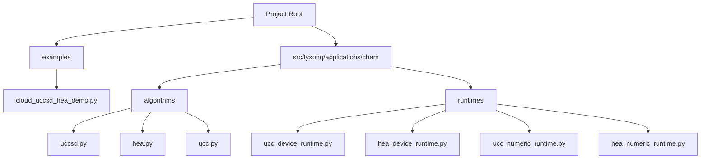
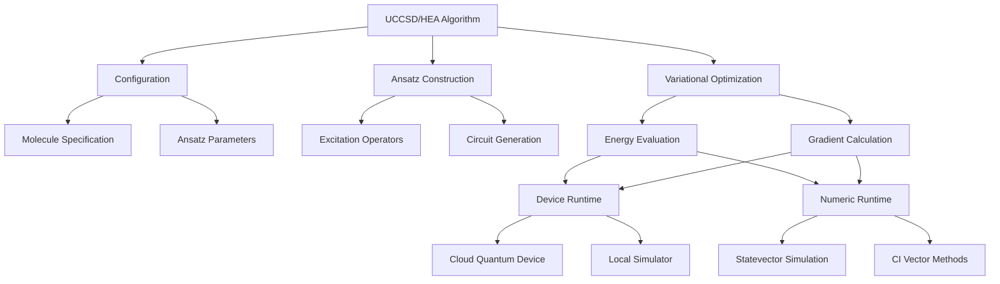
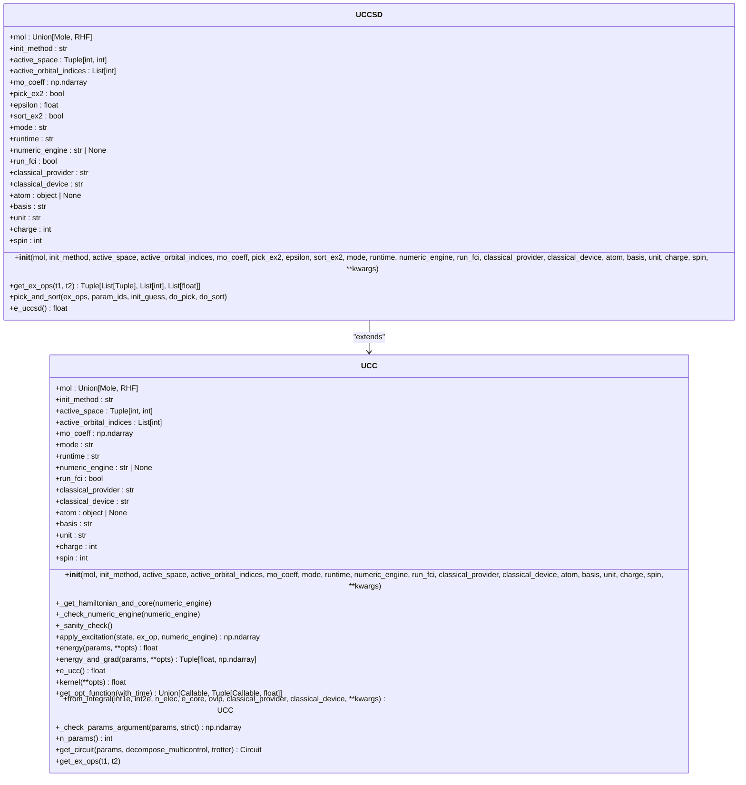
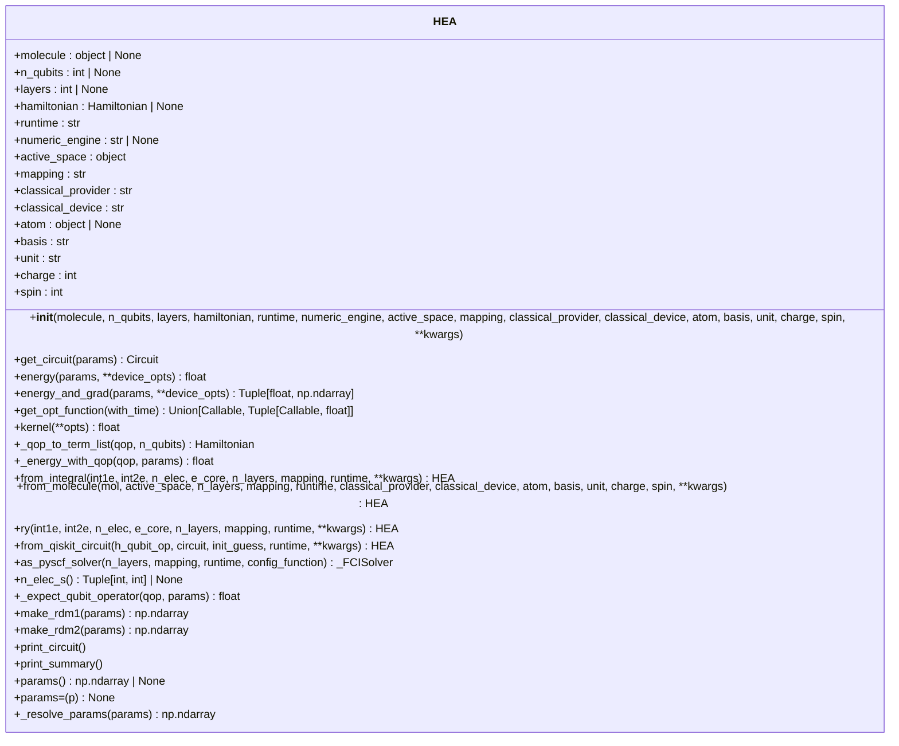
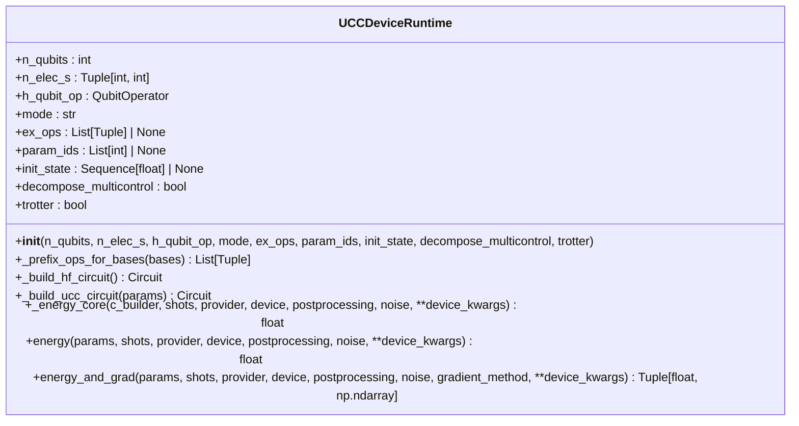
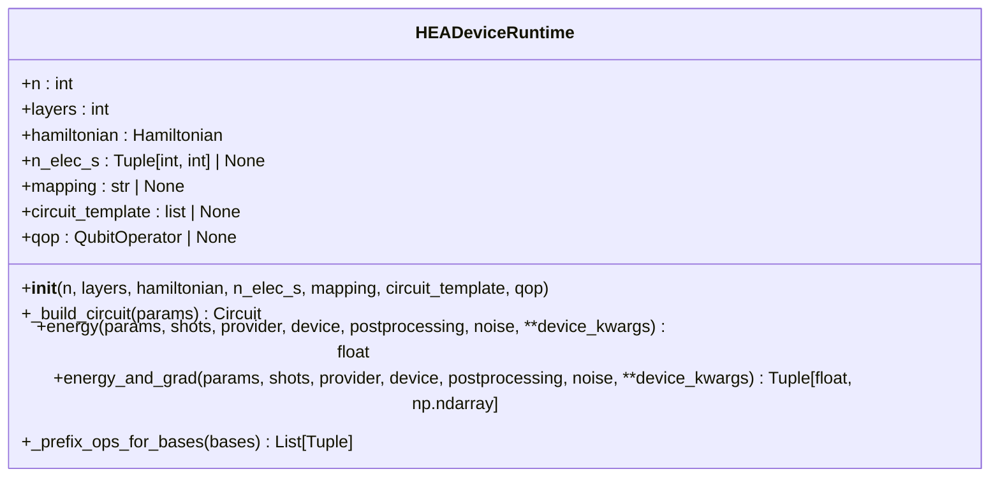
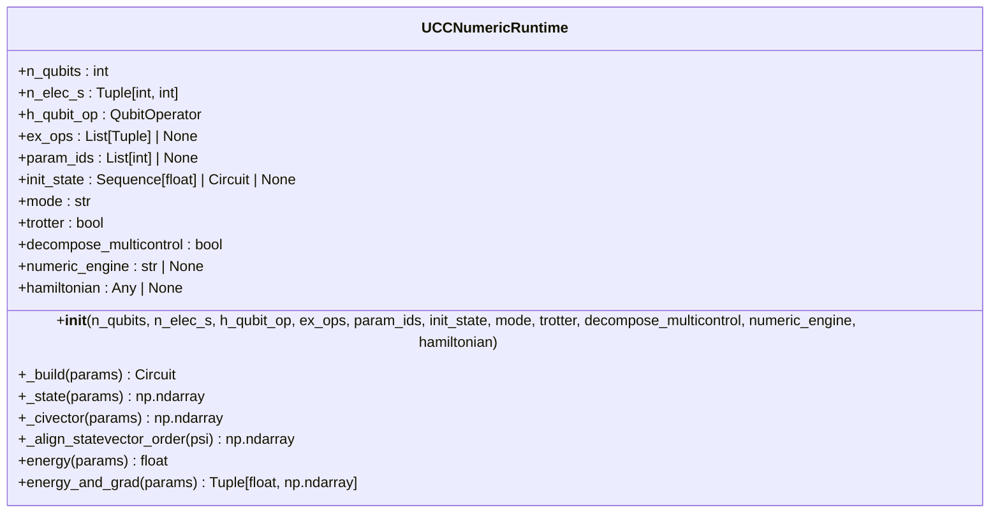
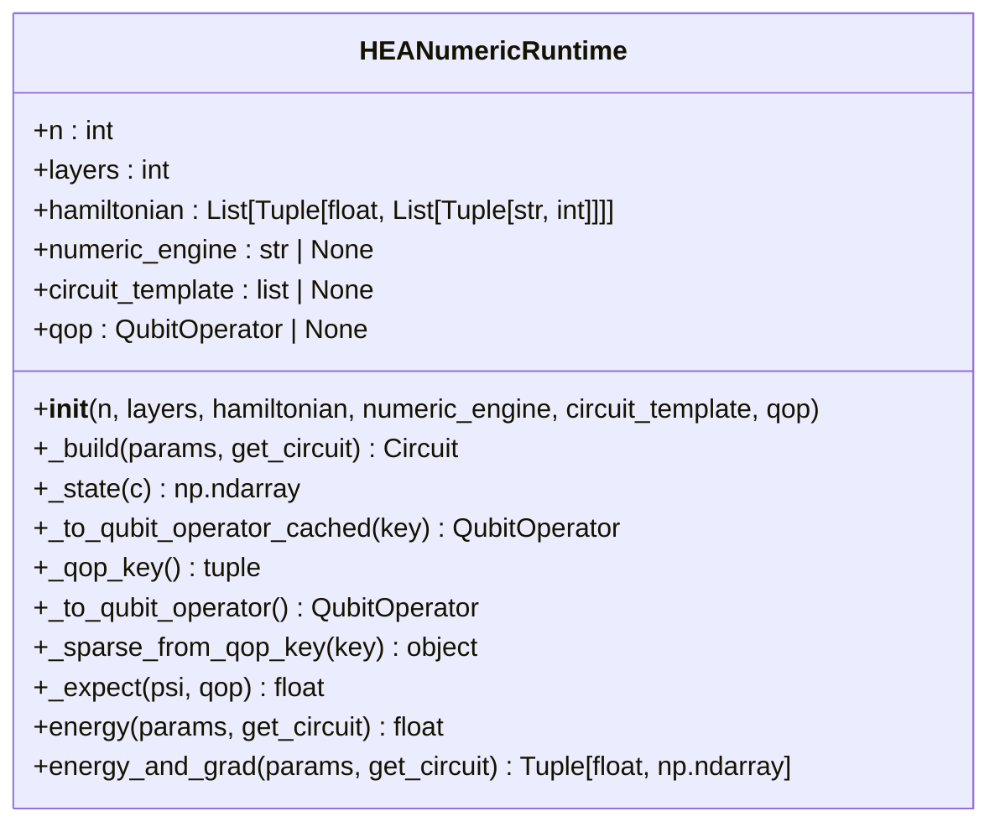
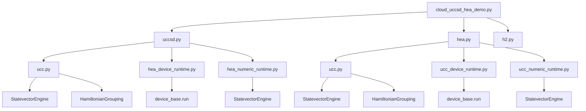

# UCCSD and HEA Algorithm Examples

<cite>
**Referenced Files in This Document**   
- [cloud_uccsd_hea_demo.py](file://examples/cloud_uccsd_hea_demo.py)
- [uccsd.py](file://src/tyxonq/applications/chem/algorithms/uccsd.py)
- [hea.py](file://src/tyxonq/applications/chem/algorithms/hea.py)
- [ucc.py](file://src/tyxonq/applications/chem/algorithms/ucc.py)
- [ucc_device_runtime.py](file://src/tyxonq/applications/chem/runtimes/ucc_device_runtime.py)
- [hea_device_runtime.py](file://src/tyxonq/applications/chem/runtimes/hea_device_runtime.py)
- [ucc_numeric_runtime.py](file://src/tyxonq/applications/chem/runtimes/ucc_numeric_runtime.py)
- [hea_numeric_runtime.py](file://src/tyxonq/applications/chem/runtimes/hea_numeric_runtime.py)
</cite>

## Table of Contents
1. [Introduction](#introduction)
2. [Project Structure](#project-structure)
3. [Core Components](#core-components)
4. [Architecture Overview](#architecture-overview)
5. [Detailed Component Analysis](#detailed-component-analysis)
6. [Dependency Analysis](#dependency-analysis)
7. [Performance Considerations](#performance-considerations)
8. [Troubleshooting Guide](#troubleshooting-guide)
9. [Conclusion](#conclusion)

## Introduction

This document provides a comprehensive analysis of the Unitary Coupled Cluster (UCCSD) and Hardware-Efficient Ansatz (HEA) algorithms implemented in the `cloud_uccsd_hea_demo.py` example. The analysis covers the configuration and execution of these quantum chemistry methods for molecular energy calculations, their integration with cloud-based quantum devices, circuit compilation workflows, and convergence behavior. The document also includes a side-by-side comparison of accuracy, circuit depth, and optimization challenges between the two ansätze, along with code examples demonstrating molecule specification, ansatz selection, and result interpretation.

The UCCSD and HEA algorithms represent two distinct approaches to variational quantum eigensolvers (VQE) for quantum chemistry simulations. UCCSD is a chemistry-inspired ansatz that systematically builds upon the Hartree-Fock state with excitations that preserve particle number, while HEA is a hardware-efficient approach that uses alternating layers of single-qubit rotations and entangling gates to create parameterized circuits that are more amenable to current quantum hardware constraints.

## Project Structure

The project structure reveals a well-organized codebase with clear separation of concerns. The core implementations of UCCSD and HEA are located in the `src/tyxonq/applications/chem/algorithms/` directory, with runtime-specific implementations in the `runtimes/` subdirectory. The example demonstrating their usage is located in the `examples/` directory.

**Diagram sources**
- [cloud_uccsd_hea_demo.py](file://examples/cloud_uccsd_hea_demo.py)
- [uccsd.py](file://src/tyxonq/applications/chem/algorithms/uccsd.py)
- [hea.py](file://src/tyxonq/applications/chem/algorithms/hea.py)
- [ucc.py](file://src/tyxonq/applications/chem/algorithms/ucc.py)
- [ucc_device_runtime.py](file://src/tyxonq/applications/chem/runtimes/ucc_device_runtime.py)
- [hea_device_runtime.py](file://src/tyxonq/applications/chem/runtimes/hea_device_runtime.py)
- [ucc_numeric_runtime.py](file://src/tyxonq/applications/chem/runtimes/ucc_numeric_runtime.py)
- [hea_numeric_runtime.py](file://src/tyxonq/applications/chem/runtimes/hea_numeric_runtime.py)

**Section sources**
- [cloud_uccsd_hea_demo.py](file://examples/cloud_uccsd_hea_demo.py)
- [project_structure](file://project_structure)

## Core Components

The core components of the UCCSD and HEA implementations are the algorithm classes that encapsulate the logic for molecular energy calculations. These classes provide a high-level interface for specifying molecules, configuring ansätze, and executing calculations on both local and cloud-based quantum devices.

The UCCSD class extends the base UCC class and implements the Unitary Coupled Cluster Singles and Doubles method, which is a chemistry-inspired ansatz that systematically builds upon the Hartree-Fock state with excitations that preserve particle number. The HEA class implements a hardware-efficient approach that uses alternating layers of single-qubit rotations and entangling gates to create parameterized circuits that are more amenable to current quantum hardware constraints.

Both classes follow a similar pattern of initialization, where molecular parameters are specified, and the ansatz is configured with appropriate parameters such as the number of layers and qubit mapping. The kernel method is used to execute the variational optimization and return the optimal energy.

**Section sources**
- [uccsd.py](file://src/tyxonq/applications/chem/algorithms/uccsd.py)
- [hea.py](file://src/tyxonq/applications/chem/algorithms/hea.py)
- [ucc.py](file://src/tyxonq/applications/chem/algorithms/ucc.py)

## Architecture Overview

The architecture of the UCCSD and HEA implementations follows a modular design with clear separation between algorithm logic, runtime execution, and device interaction. The system is designed to support both local and cloud-based execution, with the ability to offload classical chemistry calculations to cloud resources.

**Diagram sources**
- [uccsd.py](file://src/tyxonq/applications/chem/algorithms/uccsd.py)
- [hea.py](file://src/tyxonq/applications/chem/algorithms/hea.py)
- [ucc_device_runtime.py](file://src/tyxonq/applications/chem/runtimes/ucc_device_runtime.py)
- [hea_device_runtime.py](file://src/tyxonq/applications/chem/runtimes/hea_device_runtime.py)
- [ucc_numeric_runtime.py](file://src/tyxonq/applications/chem/runtimes/ucc_numeric_runtime.py)
- [hea_numeric_runtime.py](file://src/tyxonq/applications/chem/runtimes/hea_numeric_runtime.py)

## Detailed Component Analysis

### UCCSD Algorithm Analysis

The UCCSD algorithm is implemented as a class that extends the base UCC class. It provides a chemistry-inspired ansatz for molecular energy calculations based on the Unitary Coupled Cluster Singles and Doubles method.

**Diagram sources**
- [uccsd.py](file://src/tyxonq/applications/chem/algorithms/uccsd.py)
- [ucc.py](file://src/tyxonq/applications/chem/algorithms/ucc.py)

**Section sources**
- [uccsd.py](file://src/tyxonq/applications/chem/algorithms/uccsd.py)
- [ucc.py](file://src/tyxonq/applications/chem/algorithms/ucc.py)

### HEA Algorithm Analysis

The HEA algorithm is implemented as a standalone class that provides a hardware-efficient ansatz for molecular energy calculations. It uses alternating layers of single-qubit rotations and entangling gates to create parameterized circuits that are more amenable to current quantum hardware constraints.

**Diagram sources**
- [hea.py](file://src/tyxonq/applications/chem/algorithms/hea.py)

**Section sources**
- [hea.py](file://src/tyxonq/applications/chem/algorithms/hea.py)

### Runtime Components Analysis

The runtime components of the UCCSD and HEA implementations are responsible for executing the variational optimization and energy calculations on both local and cloud-based quantum devices. These components are separated into device and numeric runtimes, with the device runtime handling execution on actual quantum hardware or simulators, and the numeric runtime handling exact calculations using classical numerical methods.

#### UCC Device Runtime

**Diagram sources**
- [ucc_device_runtime.py](file://src/tyxonq/applications/chem/runtimes/ucc_device_runtime.py)

#### HEA Device Runtime

**Diagram sources**
- [hea_device_runtime.py](file://src/tyxonq/applications/chem/runtimes/hea_device_runtime.py)

#### UCC Numeric Runtime

**Diagram sources**
- [ucc_numeric_runtime.py](file://src/tyxonq/applications/chem/runtimes/ucc_numeric_runtime.py)

#### HEA Numeric Runtime

**Diagram sources**
- [hea_numeric_runtime.py](file://src/tyxonq/applications/chem/runtimes/hea_numeric_runtime.py)

**Section sources**
- [ucc_device_runtime.py](file://src/tyxonq/applications/chem/runtimes/ucc_device_runtime.py)
- [hea_device_runtime.py](file://src/tyxonq/applications/chem/runtimes/hea_device_runtime.py)
- [ucc_numeric_runtime.py](file://src/tyxonq/applications/chem/runtimes/ucc_numeric_runtime.py)
- [hea_numeric_runtime.py](file://src/tyxonq/applications/chem/runtimes/hea_numeric_runtime.py)

## Dependency Analysis

The UCCSD and HEA implementations have a complex dependency structure that connects various components of the quantum chemistry simulation pipeline. The dependencies can be analyzed at multiple levels, from high-level algorithmic dependencies to low-level implementation details.

**Diagram sources**
- [cloud_uccsd_hea_demo.py](file://examples/cloud_uccsd_hea_demo.py)
- [uccsd.py](file://src/tyxonq/applications/chem/algorithms/uccsd.py)
- [hea.py](file://src/tyxonq/applications/chem/algorithms/hea.py)
- [ucc.py](file://src/tyxonq/applications/chem/algorithms/ucc.py)
- [ucc_device_runtime.py](file://src/tyxonq/applications/chem/runtimes/ucc_device_runtime.py)
- [hea_device_runtime.py](file://src/tyxonq/applications/chem/runtimes/hea_device_runtime.py)
- [ucc_numeric_runtime.py](file://src/tyxonq/applications/chem/runtimes/ucc_numeric_runtime.py)
- [hea_numeric_runtime.py](file://src/tyxonq/applications/chem/runtimes/hea_numeric_runtime.py)

**Section sources**
- [cloud_uccsd_hea_demo.py](file://examples/cloud_uccsd_hea_demo.py)
- [uccsd.py](file://src/tyxonq/applications/chem/algorithms/uccsd.py)
- [hea.py](file://src/tyxonq/applications/chem/algorithms/hea.py)
- [ucc.py](file://src/tyxonq/applications/chem/algorithms/ucc.py)
- [ucc_device_runtime.py](file://src/tyxonq/applications/chem/runtimes/ucc_device_runtime.py)
- [hea_device_runtime.py](file://src/tyxonq/applications/chem/runtimes/hea_device_runtime.py)
- [ucc_numeric_runtime.py](file://src/tyxonq/applications/chem/runtimes/ucc_numeric_runtime.py)
- [hea_numeric_runtime.py](file://src/tyxonq/applications/chem/runtimes/hea_numeric_runtime.py)

## Performance Considerations

The performance of the UCCSD and HEA algorithms is influenced by several factors, including the choice of ansatz, the number of qubits and parameters, the optimization method, and the execution environment (local vs. cloud). The UCCSD algorithm typically requires more quantum resources due to its chemistry-inspired structure, while the HEA algorithm is designed to be more hardware-efficient but may require more optimization iterations to converge.

The runtime configuration allows for both device-based execution (using actual quantum hardware or simulators) and numeric-based execution (using classical numerical methods for exact calculations). The choice of runtime can significantly impact performance, with numeric execution being faster for small systems but limited by classical computational resources, while device execution can handle larger systems but is subject to quantum hardware constraints and noise.

The optimization process is implemented using SciPy's minimize function, with different methods available depending on whether gradients are computed. The L-BFGS-B method is used when gradients are available, while COBYLA is used for gradient-free optimization. The maximum number of iterations is set to 200 for analytic/numeric paths and 100 for device paths, reflecting the different convergence characteristics of these execution modes.

**Section sources**
- [uccsd.py](file://src/tyxonq/applications/chem/algorithms/uccsd.py)
- [hea.py](file://src/tyxonq/applications/chem/algorithms/hea.py)
- [ucc.py](file://src/tyxonq/applications/chem/algorithms/ucc.py)
- [ucc_device_runtime.py](file://src/tyxonq/applications/chem/runtimes/ucc_device_runtime.py)
- [hea_device_runtime.py](file://src/tyxonq/applications/chem/runtimes/hea_device_runtime.py)
- [ucc_numeric_runtime.py](file://src/tyxonq/applications/chem/runtimes/ucc_numeric_runtime.py)
- [hea_numeric_runtime.py](file://src/tyxonq/applications/chem/runtimes/hea_numeric_runtime.py)

## Troubleshooting Guide

When working with the UCCSD and HEA algorithms, several common issues may arise. This section provides guidance on identifying and resolving these issues.

### Common Pitfalls in Chemical Accuracy Assessment

1. **Incorrect molecule specification**: Ensure that the molecular geometry, basis set, and charge are correctly specified. Errors in these parameters can lead to significant deviations in the calculated energy.

2. **Insufficient active space**: For complex molecules, the default active space may not capture all relevant electronic correlations. Consider using a larger active space or including more orbitals in the calculation.

3. **Convergence issues**: The optimization process may fail to converge due to poor initial parameter guesses or inappropriate optimization settings. Try different initial methods (e.g., "mp2", "ccsd", "zeros") or adjust the optimization parameters.

4. **Noise and errors in device execution**: When using actual quantum hardware, noise and errors can affect the accuracy of the results. Consider using error mitigation techniques or increasing the number of shots to improve statistical accuracy.

### Strategies for Parameter Initialization

1. **Use chemistry-inspired initial guesses**: For UCCSD, the "mp2" or "ccsd" initial methods provide physically meaningful starting points based on perturbation theory or coupled cluster calculations.

2. **Random initialization with constraints**: For HEA, a deterministic non-trivial initial guess is used to avoid zero-gradient plateaus. This approach helps the optimization process escape local minima.

3. **Warm-starting from previous calculations**: If performing multiple calculations on similar molecules, consider using the optimized parameters from a previous calculation as the initial guess for the new calculation.

4. **Adaptive parameter initialization**: For complex systems, consider using adaptive methods that adjust the initial parameters based on the molecular properties or previous optimization results.

**Section sources**
- [uccsd.py](file://src/tyxonq/applications/chem/algorithms/uccsd.py)
- [hea.py](file://src/tyxonq/applications/chem/algorithms/hea.py)
- [ucc.py](file://src/tyxonq/applications/chem/algorithms/ucc.py)

## Conclusion

The UCCSD and HEA algorithms provide powerful tools for quantum chemistry simulations, each with its own strengths and trade-offs. The UCCSD algorithm offers a chemistry-inspired approach with systematic improvements over the Hartree-Fock state, while the HEA algorithm provides a hardware-efficient alternative that is more amenable to current quantum hardware constraints.

The implementation in the TyxonQ framework demonstrates a modular and extensible design, with clear separation between algorithm logic, runtime execution, and device interaction. This design allows for flexible configuration and execution on both local and cloud-based quantum devices, making it suitable for a wide range of quantum chemistry applications.

When choosing between UCCSD and HEA, consider the specific requirements of your application, including the desired accuracy, available quantum resources, and computational constraints. For high-accuracy calculations on small to medium-sized molecules, UCCSD may be the preferred choice, while for larger systems or when hardware constraints are a concern, HEA may provide a more practical solution.

The framework's support for both device-based and numeric-based execution provides flexibility in balancing accuracy and computational efficiency, while the integration with cloud-based classical chemistry calculations enables scalable and distributed quantum chemistry simulations.