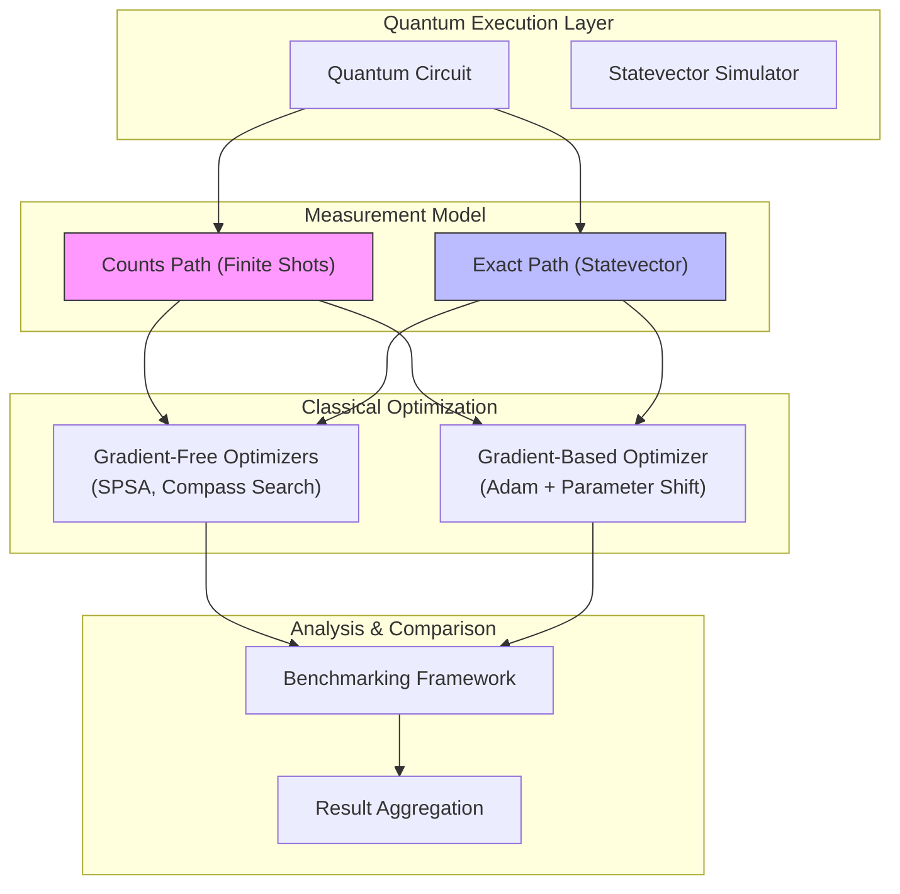
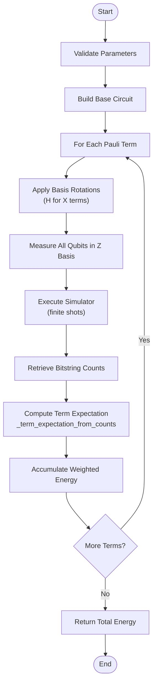
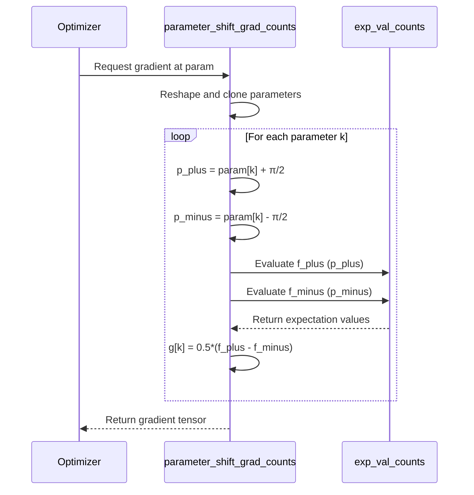
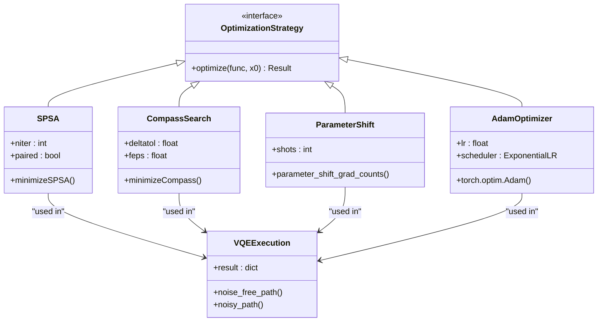
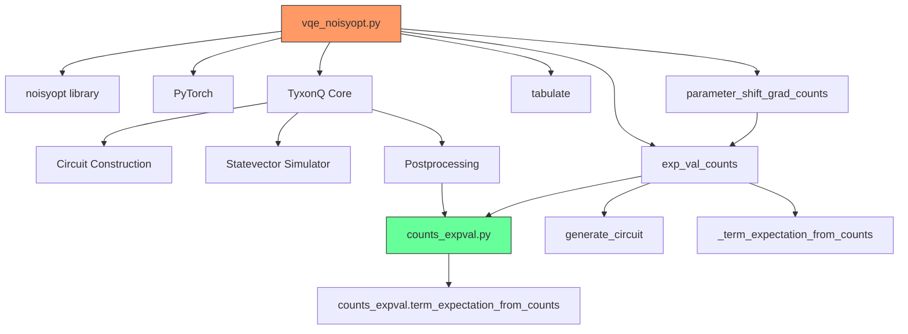

# Noise-Aware VQE Optimization

<cite>
**Referenced Files in This Document**   
- [vqe_noisyopt.py](file://examples/vqe_noisyopt.py)
- [vqe_shot_noise.py](file://examples/vqe_shot_noise.py)
- [counts_expval.py](file://src/tyxonq/postprocessing/counts_expval.py)
- [interop.py](file://src/tyxonq/libs/optimizer/interop.py)
</cite>

## Table of Contents
1. [Introduction](#introduction)
2. [Core Components](#core-components)
3. [Architecture Overview](#architecture-overview)
4. [Detailed Component Analysis](#detailed-component-analysis)
5. [Dependency Analysis](#dependency-analysis)
6. [Performance Considerations](#performance-considerations)
7. [Troubleshooting Guide](#troubleshooting-guide)
8. [Conclusion](#conclusion)

## Introduction
This document provides a comprehensive analysis of noise-aware Variational Quantum Eigensolver (VQE) implementations within the TyxonQ framework. It focuses on the impact of finite measurement shot noise on optimization processes and compares gradient-free (SPSA, Compass Search) and gradient-based (parameter-shift) strategies under noisy conditions. The analysis includes the implementation of shot-limited expectation value calculations, integration with the noisyopt library, and configuration of shot budgets and convergence criteria. Practical examples from `vqe_noisyopt.py` illustrate side-by-side comparisons between noise-free and noisy optimization trajectories, highlighting trade-offs in convergence speed and accuracy.

## Core Components

The core components of the noise-aware VQE system include:
- **exp_val_counts**: Implementation of shot-limited expectation value calculation using finite measurement shots.
- **parameter_shift_grad_counts**: Parameter-shift rule for gradient computation under finite shot conditions.
- **noisyopt integration**: Use of external optimization libraries for gradient-free methods (SPSA, Compass Search).
- **PyTorch autograd**: Gradient-based optimization using exact gradients in noise-free scenarios.

These components work together to enable comparative analysis between idealized and realistic quantum computing environments, where measurement noise significantly affects optimization outcomes.

**Section sources**
- [vqe_noisyopt.py](file://examples/vqe_noisyopt.py#L88-L107)
- [vqe_noisyopt.py](file://examples/vqe_noisyopt.py#L158-L171)

## Architecture Overview

The architecture of the noise-aware VQE system is designed to support both idealized (noise-free) and realistic (noisy) simulation paths. It separates concerns between quantum circuit execution, expectation value computation, and classical optimization.

**Diagram sources**
- [vqe_noisyopt.py](file://examples/vqe_noisyopt.py#L88-L107)
- [vqe_noisyopt.py](file://examples/vqe_noisyopt.py#L158-L171)

**Section sources**
- [vqe_noisyopt.py](file://examples/vqe_noisyopt.py#L1-L288)

## Detailed Component Analysis

### exp_val_counts Implementation
The `exp_val_counts` function implements shot-limited expectation value calculation by executing quantum circuits with finite measurement shots. It supports per-term shot allocation and handles Pauli-term measurements through basis rotations (H-gate for X-basis measurement).

For each Hamiltonian term, it:
1. Constructs a circuit with appropriate basis rotations
2. Executes on a statevector simulator with specified shot count
3. Computes term expectation from bitstring counts
4. Aggregates weighted contributions to total energy

This approach realistically models measurement noise in near-term quantum devices.

#### Flowchart of exp_val_counts Execution

**Diagram sources**
- [vqe_noisyopt.py](file://examples/vqe_noisyopt.py#L88-L107)
- [vqe_shot_noise.py](file://examples/vqe_shot_noise.py#L62-L77)

**Section sources**
- [vqe_noisyopt.py](file://examples/vqe_noisyopt.py#L88-L107)

### parameter_shift_grad_counts Implementation
The `parameter_shift_grad_counts` function implements the parameter-shift rule for gradient estimation under finite shot conditions. It follows the analytic gradient formula using forward and backward parameter shifts of π/2.

Key features:
- Uses finite-shot expectation evaluation at shifted parameter values
- Computes gradient as half the difference between forward and backward evaluations
- Returns gradients in the same shape as input parameters
- Configurable shot budget per gradient evaluation

This enables gradient-based optimization in noisy environments while maintaining the theoretical foundation of the parameter-shift rule.

#### Sequence Diagram of Gradient Computation

**Diagram sources**
- [vqe_noisyopt.py](file://examples/vqe_noisyopt.py#L158-L171)
- [vqe_shot_noise.py](file://examples/vqe_shot_noise.py#L119-L133)

**Section sources**
- [vqe_noisyopt.py](file://examples/vqe_noisyopt.py#L158-L171)

### Optimization Strategy Comparison
The system implements a comparative framework for evaluating different optimization strategies under varying noise conditions.

#### Gradient-Free vs Gradient-Based Optimization

**Diagram sources**
- [vqe_noisyopt.py](file://examples/vqe_noisyopt.py#L11)
- [vqe_noisyopt.py](file://examples/vqe_noisyopt.py#L241-L259)

**Section sources**
- [vqe_noisyopt.py](file://examples/vqe_noisyopt.py#L236-L259)

## Dependency Analysis

The noise-aware VQE implementation depends on several key components across the TyxonQ framework.

**Diagram sources**
- [vqe_noisyopt.py](file://examples/vqe_noisyopt.py#L1-L288)
- [counts_expval.py](file://src/tyxonq/postprocessing/counts_expval.py#L1-L114)

**Section sources**
- [vqe_noisyopt.py](file://examples/vqe_noisyopt.py#L1-L288)
- [counts_expval.py](file://src/tyxonq/postprocessing/counts_expval.py#L1-L114)

## Performance Considerations

The noise-aware VQE implementation makes several performance trade-offs:

- **Shot Budget vs Accuracy**: Higher shot counts improve expectation value accuracy but increase computational cost.
- **Gradient-Free vs Gradient-Based**: Gradient-free methods (SPSA, Compass) are more robust to noise but converge slower; gradient-based methods converge faster but are sensitive to gradient estimation noise.
- **Per-Term Shot Allocation**: The ability to allocate different shot counts to different Hamiltonian terms allows optimization of measurement resources.
- **Parameter Shift Overhead**: Parameter-shift gradient computation requires 2N circuit evaluations per iteration (N = number of parameters), creating significant overhead.

Optimal performance requires careful configuration of:
- Shot budgets (64-1024 shots used in examples)
- Optimizer hyperparameters (learning rates, convergence criteria)
- Maximum iteration counts
- Noise tolerance thresholds

**Section sources**
- [vqe_noisyopt.py](file://examples/vqe_noisyopt.py#L167-L168)
- [vqe_noisyopt.py](file://examples/vqe_noisyopt.py#L277)

## Troubleshooting Guide

Common issues and solutions for noise-aware VQE implementations:

**Issue**: High variance in optimization trajectories
- **Cause**: Insufficient shot counts leading to noisy expectation values
- **Solution**: Increase shot budget or use gradient-free optimizers better suited to noisy landscapes

**Issue**: Slow convergence with parameter-shift gradients
- **Cause**: Noisy gradient estimates causing unstable updates
- **Solution**: Reduce learning rate, increase shot count for gradient evaluation, or switch to gradient-free methods

**Issue**: Memory errors with large circuits
- **Cause**: Statevector simulation of large systems
- **Solution**: Use shot-based evaluation which can be more memory efficient for certain configurations

**Issue**: Inconsistent results across runs
- **Cause**: Stochastic nature of finite-shot measurements
- **Solution**: Set random seeds and increase shot counts for critical evaluations

**Section sources**
- [vqe_noisyopt.py](file://examples/vqe_noisyopt.py#L236-L259)
- [vqe_noisyopt.py](file://examples/vqe_noisyopt.py#L263)

## Conclusion

The noise-aware VQE implementation in TyxonQ provides a comprehensive framework for studying the impact of finite measurement shot noise on quantum optimization. By comparing gradient-free (SPSA, Compass Search) and gradient-based (parameter-shift) strategies, it enables researchers to evaluate trade-offs between convergence speed and noise resilience. The integration of shot-limited expectation value calculations through `exp_val_counts` and parameter-shift gradients via `parameter_shift_grad_counts` creates a realistic simulation environment for near-term quantum devices. Configuration of shot budgets, convergence criteria, and optimizer hyperparameters allows fine-tuning for specific hardware constraints and accuracy requirements. This implementation serves as a valuable tool for developing and testing noise-resilient quantum algorithms.