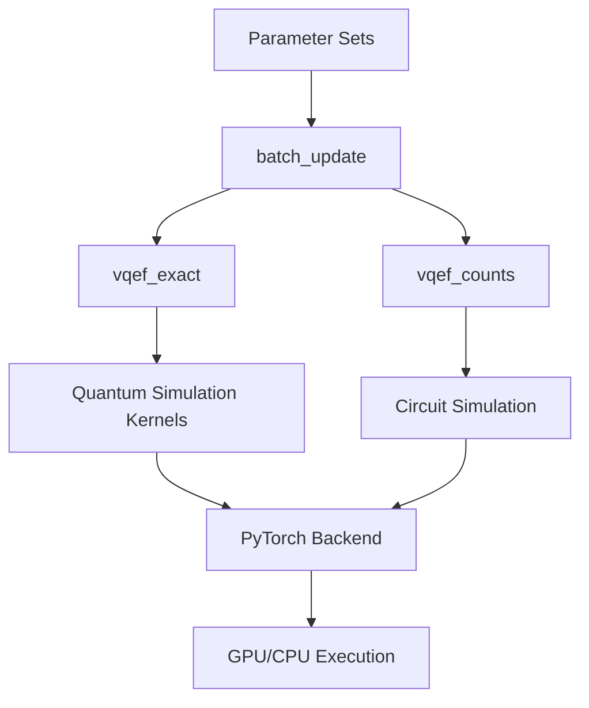
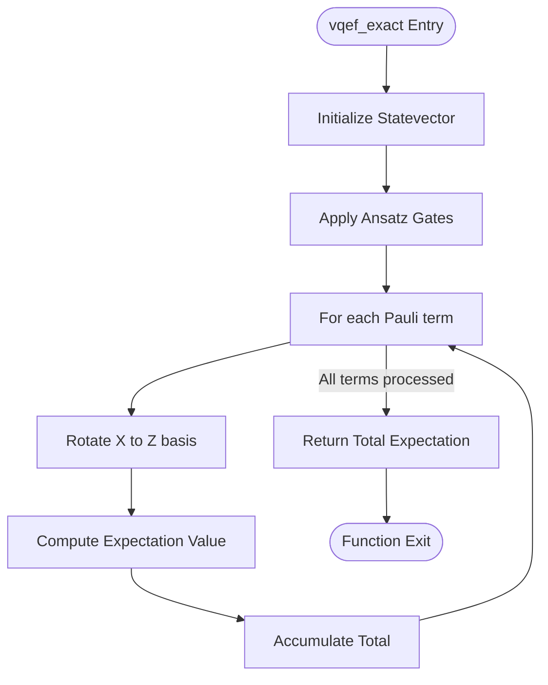
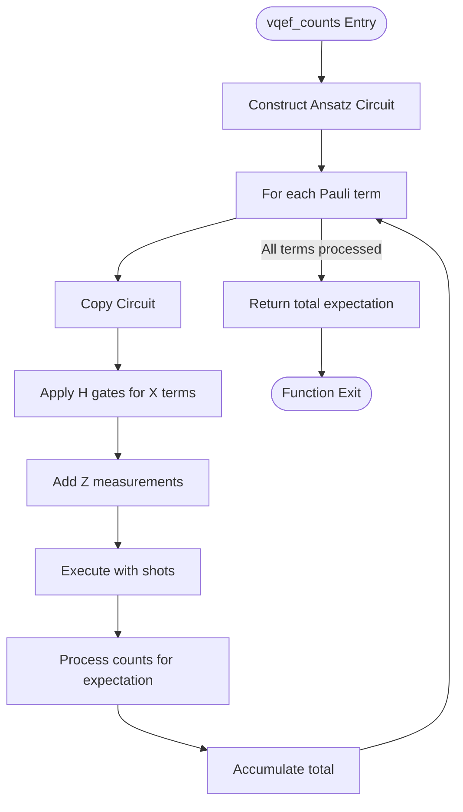
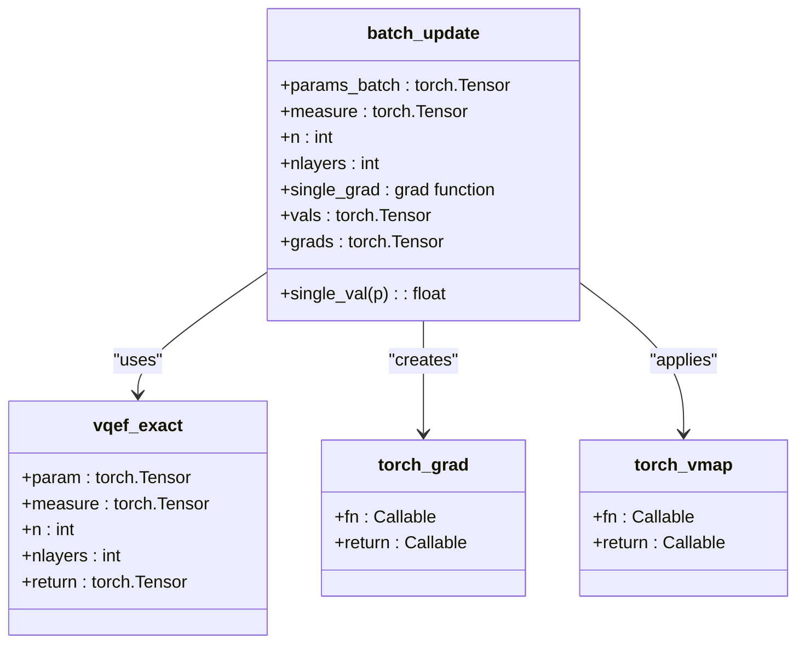
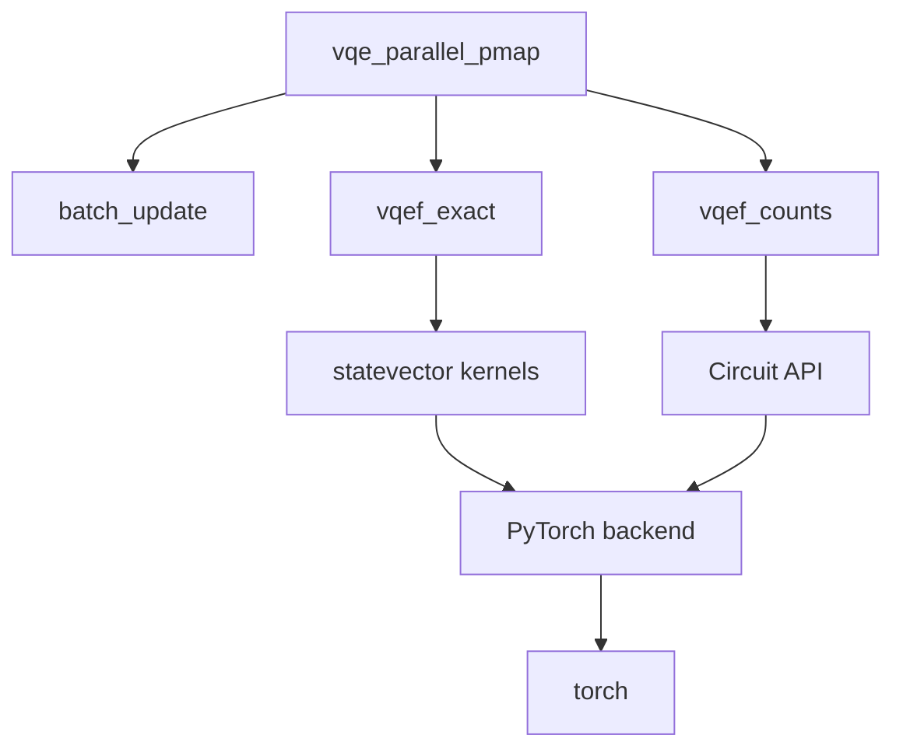

# Parallel VQE Execution

<cite>
**Referenced Files in This Document**   
- [vqe_parallel_pmap.py](file://examples/vqe_parallel_pmap.py)
- [pytorch_backend.py](file://src/tyxonq/numerics/backends/pytorch_backend.py)
- [api.py](file://src/tyxonq/numerics/api.py)
- [statevector.py](file://src/tyxonq/libs/quantum_library/kernels/statevector.py)
- [gates.py](file://src/tyxonq/libs/quantum_library/kernels/gates.py)
</cite>

## Table of Contents
1. [Introduction](#introduction)
2. [Core Components](#core-components)
3. [Architecture Overview](#architecture-overview)
4. [Detailed Component Analysis](#detailed-component-analysis)
5. [Dependency Analysis](#dependency-analysis)
6. [Performance Considerations](#performance-considerations)
7. [Troubleshooting Guide](#troubleshooting-guide)
8. [Conclusion](#conclusion)

## Introduction
This document provides a comprehensive analysis of parallel Variational Quantum Eigensolver (VQE) execution using PyTorch's `vmap` and `grad` functionality within the TyxonQ framework. It details the implementation of batched parameter evaluation in the `batch_update` function and its integration with `torch.func` primitives for efficient gradient computation. The design of `vqef_exact` and `vqef_counts` functions is explained, supporting batched inputs for exact and counts-based energy calculations respectively. The configuration of batch sizes, parameter tensor shapes, and computational efficiency gains from vectorized execution are covered. Practical examples from `vqe_parallel_pmap.py` demonstrate performance benefits of parallel evaluation across multiple parameter sets, along with memory-computation trade-offs in batched quantum simulations.

## Core Components
The core components of the parallel VQE execution system include the `vqef_exact` and `vqef_counts` functions for energy evaluation, the `batch_update` function for parallel gradient computation, and the underlying quantum simulation kernels. These components work together to enable efficient batched evaluation of quantum circuits with automatic differentiation support.

**Section sources**
- [vqe_parallel_pmap.py](file://examples/vqe_parallel_pmap.py#L38-L122)
- [pytorch_backend.py](file://src/tyxonq/numerics/backends/pytorch_backend.py#L12-L256)

## Architecture Overview
The parallel VQE execution architecture leverages PyTorch's functional programming primitives to enable vectorized evaluation of quantum circuits across multiple parameter sets. The system uses a layered approach with quantum simulation kernels at the foundation, a numerical backend abstraction layer, and high-level VQE functions that utilize `torch.func.vmap` and `torch.func.grad` for parallel execution.

**Diagram sources**
- [vqe_parallel_pmap.py](file://examples/vqe_parallel_pmap.py#L38-L122)
- [pytorch_backend.py](file://src/tyxonq/numerics/backends/pytorch_backend.py#L12-L256)

## Detailed Component Analysis

### vqef_exact Function Analysis
The `vqef_exact` function implements exact expectation value calculation via statevector simulation without shots. It takes parameters in the shape `[nlayers, 2, n]` and measurement operators in the shape `[m, n]` with Pauli codes (0/1/2/3). The function constructs a quantum state using H gates on all qubits followed by ZZ(2θ) entangling gates along a ring and RX gates on each wire. For each Pauli term, it rotates X operators to Z basis and computes the expectation value using the statevector.

**Diagram sources**
- [vqe_parallel_pmap.py](file://examples/vqe_parallel_pmap.py#L38-L85)
- [statevector.py](file://src/tyxonq/libs/quantum_library/kernels/statevector.py#L8-L53)

**Section sources**
- [vqe_parallel_pmap.py](file://examples/vqe_parallel_pmap.py#L38-L85)
- [statevector.py](file://src/tyxonq/libs/quantum_library/kernels/statevector.py#L8-L53)

### vqef_counts Function Analysis
The `vqef_counts` function implements finite-shot expectation value calculation using circuit sampling. It constructs a quantum circuit with H gates, CX-RZ-CX entangling gates, and RX gates. For each Pauli term, it creates a copy of the circuit, applies H gates to rotate X operators to Z basis, performs measurements, and computes the expectation value from the measurement counts.

**Diagram sources**
- [vqe_parallel_pmap.py](file://examples/vqe_parallel_pmap.py#L88-L122)
- [gates.py](file://src/tyxonq/libs/quantum_library/kernels/gates.py#L9-L139)

**Section sources**
- [vqe_parallel_pmap.py](file://examples/vqe_parallel_pmap.py#L88-L122)
- [gates.py](file://src/tyxonq/libs/quantum_library/kernels/gates.py#L9-L139)

### batch_update Function Analysis
The `batch_update` function implements parallel batch evaluation of values and gradients using `torch.func.vmap` and `torch.func.grad`. When available, it uses the functional API for efficient vectorized execution. As a fallback, it implements manual batching with PyTorch's autograd for gradient computation.

**Diagram sources**
- [vqe_parallel_pmap.py](file://examples/vqe_parallel_pmap.py#L125-L163)
- [pytorch_backend.py](file://src/tyxonq/numerics/backends/pytorch_backend.py#L180-L189)

**Section sources**
- [vqe_parallel_pmap.py](file://examples/vqe_parallel_pmap.py#L125-L163)
- [pytorch_backend.py](file://src/tyxonq/numerics/backends/pytorch_backend.py#L180-L189)

## Dependency Analysis
The parallel VQE execution system has a well-defined dependency structure with clear separation of concerns. The high-level VQE functions depend on quantum simulation kernels, which in turn depend on the numerical backend abstraction.

**Diagram sources**
- [vqe_parallel_pmap.py](file://examples/vqe_parallel_pmap.py#L1-L163)
- [pytorch_backend.py](file://src/tyxonq/numerics/backends/pytorch_backend.py#L12-L256)
- [api.py](file://src/tyxonq/numerics/api.py#L18-L191)

**Section sources**
- [vqe_parallel_pmap.py](file://examples/vqe_parallel_pmap.py#L1-L163)
- [pytorch_backend.py](file://src/tyxonq/numerics/backends/pytorch_backend.py#L12-L256)
- [api.py](file://src/tyxonq/numerics/api.py#L18-L191)

## Performance Considerations
The parallel VQE execution system provides significant performance benefits through vectorized execution. The use of `torch.func.vmap` enables efficient batch processing of multiple parameter sets without Python loop overhead. The exact evaluation path (`vqef_exact`) is computationally intensive but provides precise gradients, while the counts-based path (`vqef_counts`) introduces sampling noise but may be more representative of real hardware behavior. Memory usage scales with the number of qubits (exponentially for statevector simulation) and batch size (linearly). The system includes fallback mechanisms for environments where `torch.func` is not available, ensuring broad compatibility at the cost of reduced performance.

**Section sources**
- [vqe_parallel_pmap.py](file://examples/vqe_parallel_pmap.py#L125-L163)
- [pytorch_backend.py](file://src/tyxonq/numerics/backends/pytorch_backend.py#L180-L189)

## Troubleshooting Guide
When encountering issues with parallel VQE execution, consider the following common problems and solutions:

1. **torch.func not available**: If `torch.func` is not available, the system falls back to manual batching with autograd. Ensure PyTorch version is compatible with `torch.func`.

2. **Memory limitations**: Statevector simulation requires 2^n complex numbers for n qubits. Reduce batch size or use fewer qubits if memory is insufficient.

3. **Gradient computation failures**: Ensure parameters have `requires_grad=True` when using autograd. Check for operations that break the computation graph.

4. **Performance bottlenecks**: Use `torch.compile` when available to optimize execution. Consider using GPU acceleration for larger problems.

**Section sources**
- [vqe_parallel_pmap.py](file://examples/vqe_parallel_pmap.py#L125-L163)
- [pytorch_backend.py](file://src/tyxonq/numerics/backends/pytorch_backend.py#L192-L197)

## Conclusion
The parallel VQE execution system in TyxonQ demonstrates effective use of PyTorch's functional programming primitives for efficient batched quantum circuit evaluation. By leveraging `torch.func.vmap` and `torch.func.grad`, the system achieves significant performance improvements in parameter optimization workflows. The modular design with clear separation between quantum simulation kernels and high-level VQE functions enables both exact and counts-based evaluation methods. The fallback mechanisms ensure compatibility across different PyTorch versions and environments. This implementation provides a solid foundation for scalable variational quantum algorithms with support for both simulation and potential hardware execution.