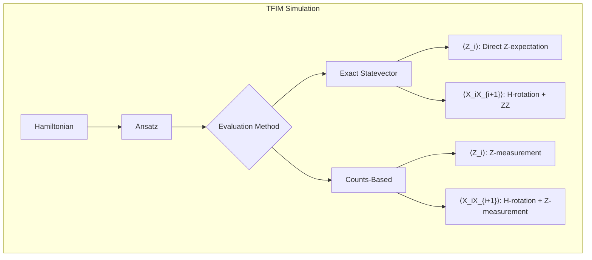
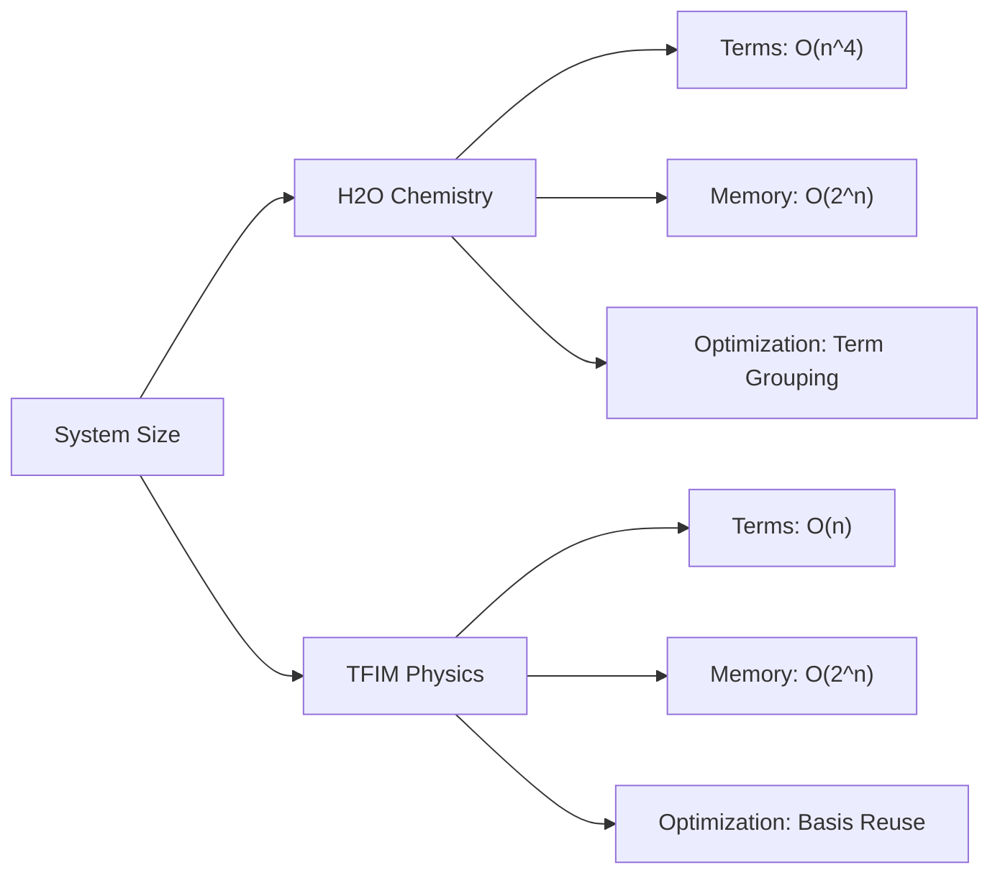

# VQE Benchmarking Case Studies

<cite>
**Referenced Files in This Document**   
- [vqeh2o_benchmark.py](file://examples/vqeh2o_benchmark.py)
- [vqetfim_benchmark.py](file://examples/vqetfim_benchmark.py)
- [statevector.py](file://src/tyxonq/libs/quantum_library/kernels/statevector.py)
- [gates.py](file://src/tyxonq/libs/quantum_library/kernels/gates.py)
- [pauli_io.py](file://src/tyxonq/libs/hamiltonian_encoding/pauli_io.py)
- [hamiltonian_grouping.py](file://src/tyxonq/libs/hamiltonian_encoding/hamiltonian_grouping.py)
- [fermion_to_qubit.py](file://src/tyxonq/libs/hamiltonian_encoding/fermion_to_qubit.py)
- [molecule.py](file://src/tyxonq/applications/chem/molecule.py)
- [hamiltonian_builders.py](file://src/tyxonq/applications/chem/chem_libs/hamiltonians_chem_library/hamiltonian_builders.py)
</cite>

## Table of Contents
1. [Introduction](#introduction)
2. [H2O Molecular Simulation](#h2o-molecular-simulation)
3. [TFIM Spin Model Simulation](#tfim-spin-model-simulation)
4. [Benchmarking Methodology](#benchmarking-methodology)
5. [Computational Complexity and Scaling](#computational-complexity-and-scaling)
6. [Implications for VQE Applications](#implications-for-vqe-applications)
7. [Conclusion](#conclusion)

## Introduction
This document presents detailed case studies on Variational Quantum Eigensolver (VQE) benchmarking for quantum chemistry and spin systems. The analysis focuses on two primary benchmarks: the H2O molecular simulation using OpenFermion integration and the Transverse Field Ising Model (TFIM) spin simulation with an RXX-RZ ansatz. The benchmarking framework evaluates both staging and runtime performance, providing insights into computational complexity, memory requirements, and scaling behavior. These benchmarks are critical for understanding the practical limitations and hardware constraints of real-world VQE applications.

## H2O Molecular Simulation

The H2O molecular simulation in `vqeh2o_benchmark.py` demonstrates a complete workflow for quantum chemistry VQE, from molecular Hamiltonian construction to energy evaluation. The process begins with OpenFermion integration to generate the molecular Hamiltonian for a water molecule in the STO-3G basis set. The molecular geometry is obtained from PubChem, and the electronic structure is computed using PySCF with full configuration interaction (FCI) to ensure high accuracy.

The fermionic Hamiltonian is transformed into a qubit representation using binary code transformation with checksum code for qubit reduction. This transformation maps the fermionic operators to Pauli operators, resulting in a qubit Hamiltonian with 127 Pauli terms for the 4-qubit H2O system. The conversion from OpenFermion's QubitOperator to the internal Pauli term representation is handled by the `qubitop_to_pauli_terms` function, which extracts the Pauli string codes and coefficients.

The VQE ansatz employs a hardware-efficient structure with two layers of entangling CZ gates followed by parameterized RX rotations. This structure balances expressibility with hardware constraints, using nearest-neighbor CZ gates for efficient implementation. The energy evaluation avoids constructing the full dense Hamiltonian matrix, instead computing the expectation value by summing contributions from individual Pauli terms.

A key optimization in the energy evaluation is Pauli term grouping, where terms requiring the same basis rotation pattern are grouped together. This allows reuse of rotated quantum states, significantly reducing computational overhead. For X and Y measurements, Hadamard and S-dagger gates are applied to rotate the basis to the Z-measurement basis. The expectation values are computed by calculating measurement probabilities and applying appropriate sign patterns based on the computational basis states.

**Section sources**
- [vqeh2o_benchmark.py](file://examples/vqeh2o_benchmark.py#L39-L59)
- [vqeh2o_benchmark.py](file://examples/vqeh2o_benchmark.py#L85-L99)
- [vqeh2o_benchmark.py](file://examples/vqeh2o_benchmark.py#L102-L145)
- [molecule.py](file://src/tyxonq/applications/chem/molecule.py#L270-L273)
- [hamiltonian_builders.py](file://src/tyxonq/applications/chem/chem_libs/hamiltonians_chem_library/hamiltonian_builders.py#L20-L25)
- [fermion_to_qubit.py](file://src/tyxonq/libs/hamiltonian_encoding/fermion_to_qubit.py#L50-L55)

## TFIM Spin Model Simulation

The TFIM spin model simulation in `vqetfim_benchmark.py` implements a one-dimensional transverse field Ising model with 10 qubits and periodic boundary conditions. The Hamiltonian consists of nearest-neighbor XX interactions with coupling strength Jx = 1.0 and transverse magnetic field terms with strength h = -1.0. This model represents a fundamental spin system in quantum magnetism and serves as a benchmark for quantum simulation algorithms.

The variational ansatz uses an RXX-RZ structure with one layer, where RXX gates implement the XX interactions along the chain and RZ gates apply the transverse field rotations. This ansatz structure directly mirrors the Hamiltonian terms, providing a natural parameterization for the ground state search. The parameterization requires 20 parameters (2 per qubit) to fully specify the quantum circuit.

Two distinct evaluation methods are implemented for comparison. The exact energy evaluation uses statevector simulation with PyTorch backend, computing expectation values directly from the quantum state. For Z-terms, the expectation is computed using the built-in `expect_z_statevector` function. For XX-terms, both qubits are rotated to the Z-basis using Hadamard gates before computing the two-qubit ZZ correlation.

The counts-based evaluation method simulates finite-shot measurements using the circuit chain API. This approach constructs a quantum circuit for each Pauli term, applies the necessary basis rotations, and performs Z-measurements on all qubits. The expectation values are estimated from the measurement counts, with 512 shots per term. This method provides a realistic simulation of actual quantum hardware execution, including statistical noise from finite sampling.

The TFIM benchmark enables direct comparison between exact statevector methods and measurement-based approaches, highlighting the trade-offs between computational efficiency and experimental realism.

**Diagram sources**
- [vqetfim_benchmark.py](file://examples/vqetfim_benchmark.py#L20-L33)
- [vqetfim_benchmark.py](file://examples/vqetfim_benchmark.py#L69-L102)
- [vqetfim_benchmark.py](file://examples/vqetfim_benchmark.py#L36-L66)
- [statevector.py](file://src/tyxonq/libs/quantum_library/kernels/statevector.py#L47-L53)
- [gates.py](file://src/tyxonq/libs/quantum_library/kernels/gates.py#L108-L117)

**Section sources**
- [vqetfim_benchmark.py](file://examples/vqetfim_benchmark.py#L20-L33)
- [vqetfim_benchmark.py](file://examples/vqetfim_benchmark.py#L69-L102)
- [vqetfim_benchmark.py](file://examples/vqetfim_benchmark.py#L36-L66)

## Benchmarking Methodology

The benchmarking framework employs a consistent methodology across both case studies, separating staging time from runtime performance. The `benchmark` function measures the total execution time, decomposing it into staging time (first execution, including compilation and setup) and runtime (average execution time over multiple runs). This separation is crucial for evaluating the performance of quantum algorithms in both development and production environments.

For the H2O simulation, the benchmark evaluates the `exact_energy_terms` function with zero tries to isolate staging time, as the focus is on the computational efficiency of the Pauli term grouping optimization. The staging time includes molecular geometry setup, Hamiltonian construction, and ansatz compilation, while the runtime measures the energy evaluation loop.

For the TFIM simulation, the benchmark runs multiple trials (typically 2-3) to obtain statistically significant runtime measurements. Two evaluation paths are compared: the exact statevector method and the counts-based method. The exact method benefits from statevector reuse and direct expectation computation, while the counts method incurs overhead from circuit reconstruction and measurement simulation.

The timing framework reveals important performance characteristics. The staging time is dominated by just-in-time compilation and circuit optimization, while the runtime reflects the algorithmic efficiency of the energy evaluation. Memory usage is also a critical factor, with statevector methods requiring O(2^n) memory and counts-based methods having lower memory footprint but higher computational overhead due to repeated circuit execution.

**Section sources**
- [vqeh2o_benchmark.py](file://examples/vqeh2o_benchmark.py#L148-L155)
- [vqetfim_benchmark.py](file://examples/vqetfim_benchmark.py#L105-L112)
- [utils.py](file://src/tyxonq/utils.py#L180-L207)

## Computational Complexity and Scaling

The computational complexity and scaling behavior differ significantly between the chemistry and physics models. For the H2O simulation, the number of Pauli terms scales polynomially with system size, typically O(n^4) for molecular Hamiltonians, where n is the number of qubits. The Pauli term grouping optimization reduces the effective number of basis rotations from O(M) to O(G), where M is the total number of terms and G is the number of distinct measurement groups. In practice, G is often much smaller than M, providing substantial efficiency gains.

Memory requirements for the H2O simulation are dominated by the statevector storage, requiring O(2^n) complex numbers. For n=4 qubits, this amounts to 256 complex numbers, which is manageable on classical hardware. However, this exponential scaling limits the applicability to larger molecular systems without approximation methods.

For the TFIM simulation, the Hamiltonian has O(n) terms, making the scaling more favorable. The exact statevector method has O(2^n) memory complexity and O(n2^n) computational complexity for expectation evaluation. The counts-based method has O(1) memory per shot but O(Sn) computational complexity, where S is the number of shots. The trade-off between memory efficiency and computational overhead is particularly evident in this model.

Both simulations demonstrate the importance of algorithmic optimizations for practical VQE applications. The Pauli term grouping in the H2O simulation and the basis rotation reuse in the TFIM simulation are essential for reducing computational overhead. These optimizations become increasingly important as system size grows, where naive implementations would quickly become intractable.

**Diagram sources**
- [vqeh2o_benchmark.py](file://examples/vqeh2o_benchmark.py#L102-L145)
- [vqetfim_benchmark.py](file://examples/vqetfim_benchmark.py#L69-L102)
- [hamiltonian_grouping.py](file://src/tyxonq/libs/hamiltonian_encoding/hamiltonian_grouping.py#L20-L66)

**Section sources**
- [vqeh2o_benchmark.py](file://examples/vqeh2o_benchmark.py#L102-L145)
- [vqetfim_benchmark.py](file://examples/vqetfim_benchmark.py#L69-L102)
- [hamiltonian_grouping.py](file://src/tyxonq/libs/hamiltonian_encoding/hamiltonian_grouping.py#L20-L66)

## Implications for VQE Applications

The benchmarking results have significant implications for real-world VQE applications and hardware constraints. The separation of staging and runtime performance highlights the importance of compilation efficiency in quantum software stacks. For near-term quantum devices with limited coherence times, minimizing staging overhead is crucial for achieving practical quantum advantage.

The memory requirements of statevector simulations impose strict limits on the size of problems that can be classically simulated. While the H2O and TFIM examples are small enough for exact simulation, larger systems require approximation methods or distributed computing. This limitation underscores the need for hybrid quantum-classical algorithms that can leverage quantum hardware for specific subroutines.

Hardware constraints such as gate fidelity, connectivity, and coherence time directly impact the effectiveness of VQE implementations. The choice between exact statevector methods and counts-based methods reflects the trade-off between computational efficiency and experimental realism. On actual quantum hardware, the counts-based approach is necessary, but its statistical noise requires careful error mitigation strategies.

The success of Pauli term grouping and basis rotation reuse demonstrates the importance of algorithmic optimizations in quantum computing. These techniques reduce the number of required measurements and circuit executions, directly addressing the limited quantum resources available on current devices. Future VQE implementations should incorporate similar optimizations to maximize efficiency.

The benchmarking framework itself provides a valuable tool for evaluating quantum software performance across different backends and hardware platforms. By standardizing the measurement of staging and runtime performance, it enables fair comparisons between different quantum computing approaches and helps identify bottlenecks in the quantum computing pipeline.

**Section sources**
- [vqeh2o_benchmark.py](file://examples/vqeh2o_benchmark.py#L148-L155)
- [vqetfim_benchmark.py](file://examples/vqetfim_benchmark.py#L105-L112)
- [postprocessing/error_mitigation.py](file://src/tyxonq/postprocessing/error_mitigation.py)

## Conclusion
The VQE benchmarking case studies on H2O molecular simulation and TFIM spin model provide comprehensive insights into the performance characteristics of variational quantum algorithms. The integration of OpenFermion for quantum chemistry, efficient Pauli term grouping, and optimized measurement strategies demonstrate the sophisticated techniques required for practical quantum computing applications. The benchmarking methodology that separates staging and runtime performance offers a valuable framework for evaluating quantum software efficiency. These results highlight the importance of algorithmic optimizations and hardware-aware implementations in overcoming the limitations of current quantum devices and advancing toward practical quantum advantage in chemistry and physics simulations.