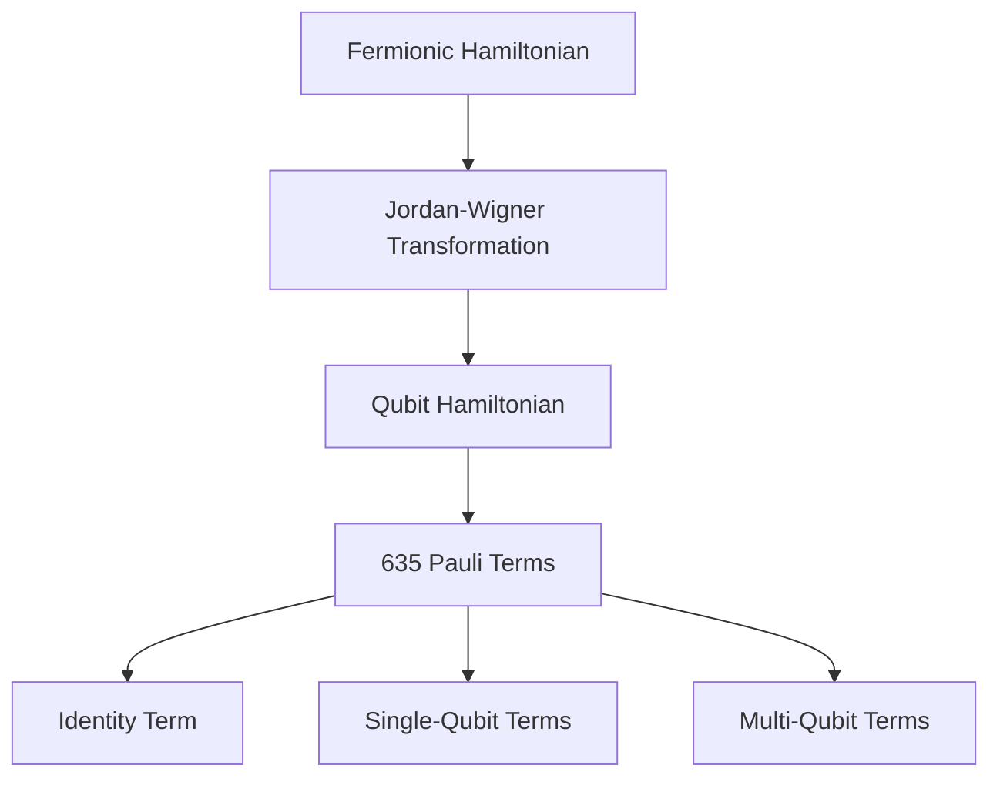
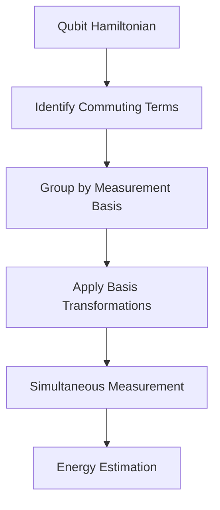
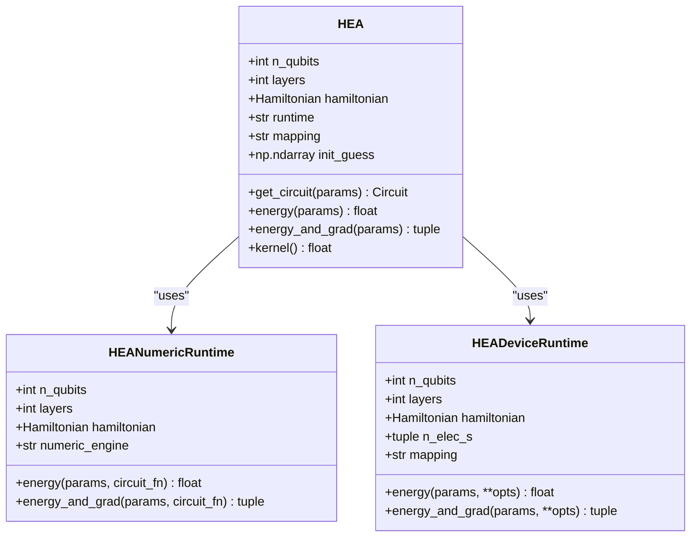

# VQE Chemistry Benchmarks: H2O Molecular Simulation

<cite>
**Referenced Files in This Document**   
- [vqeh2o_benchmark.py](file://examples/vqeh2o_benchmark.py)
- [molecule.py](file://src/tyxonq/applications/chem/molecule.py)
- [fermion_to_qubit.py](file://src/tyxonq/libs/hamiltonian_encoding/fermion_to_qubit.py)
- [hamiltonian_grouping.py](file://src/tyxonq/compiler/utils/hamiltonian_grouping.py)
- [hea.py](file://src/tyxonq/applications/chem/algorithms/hea.py)
</cite>

## Table of Contents
1. [Introduction](#introduction)
2. [Molecular Configuration and Hamiltonian Generation](#molecular-configuration-and-hamiltonian-generation)
3. [Fermion-to-Qubit Mapping and Qubit Hamiltonian Structure](#fermion-to-qubit-mapping-and-qubit-hamiltonian-structure)
4. [Pauli Term Grouping for Measurement Optimization](#pauli-term-grouping-for-measurement-optimization)
5. [Hardware-Efficient Ansatz (HEA) Implementation](#hardware-efficient-ansatz-hea-implementation)
6. [Timing Framework and Performance Analysis](#timing-framework-and-performance-analysis)
7. [Memory Usage and Computational Complexity](#memory-usage-and-computational-complexity)
8. [Hardware Constraints and Convergence Impacts](#hardware-constraints-and-convergence-impacts)
9. [Practical Recommendations for VQE Workflows](#practical-recommendations-for-vqe-workflows)
10. [Conclusion](#conclusion)

## Introduction
This document provides a comprehensive analysis of the VQE (Variational Quantum Eigensolver) benchmark for H2O molecular simulation implemented in `vqeh2o_benchmark.py`. The analysis covers the integration with OpenFermion for molecular Hamiltonian generation, the STO-3G basis set configuration, and geometry variation setup. It details the fermion-to-qubit mapping using the Jordan-Wigner transformation, Pauli term grouping strategies, HEA (Hardware-Efficient Ansatz) implementation, timing framework, memory usage, computational complexity, and hardware constraints. The document concludes with practical recommendations for optimizing VQE workflows in quantum chemistry applications.

## Molecular Configuration and Hamiltonian Generation
The H2O molecular simulation benchmark begins with the configuration of the water molecule using OpenFermion. The molecular geometry is retrieved from PubChem, and the STO-3G basis set is employed for minimal basis representation. The multiplicity is set to 1, indicating a singlet state. The molecular data is processed using PySCF to compute the molecular Hamiltonian, which includes Hartree-Fock energy and electron correlation effects via FCI (Full Configuration Interaction) calculations.

The integration with OpenFermion enables the generation of the fermionic Hamiltonian, which is then transformed into a qubit Hamiltonian through fermion-to-qubit mapping techniques. The benchmark utilizes the `run_pyscf` function to execute quantum chemistry calculations, producing the molecular Hamiltonian in fermionic operator form. This approach ensures accurate representation of the electronic structure while maintaining compatibility with quantum computing frameworks.

**Section sources**
- [vqeh2o_benchmark.py](file://examples/vqeh2o_benchmark.py#L10-L35)
- [molecule.py](file://src/tyxonq/applications/chem/molecule.py#L150-L170)

## Fermion-to-Qubit Mapping and Qubit Hamiltonian Structure
The fermion-to-qubit mapping is a critical step in transforming the fermionic Hamiltonian into a form suitable for quantum computation. The benchmark implements the Jordan-Wigner transformation through the `fop_to_qop` function in `fermion_to_qubit.py`. This transformation maps fermionic creation and annihilation operators to Pauli operators, preserving the anticommutation relations essential for accurate quantum simulations.

The resulting qubit Hamiltonian consists of 635 Pauli terms for the H2O molecule in the STO-3G basis set. The mapping process involves converting the fermionic operator to a qubit operator using OpenFermion's `jordan_wigner` function, followed by index reversal to maintain consistency with the framework's qubit ordering convention. The transformation preserves the hermitian nature of the Hamiltonian, ensuring that all coefficients remain real-valued.

The qubit Hamiltonian structure reveals the complexity of molecular simulations, with terms ranging from single-qubit operators to multi-qubit interactions. The identity term contributes a constant energy offset, while the non-trivial terms represent various electron correlation effects. This structure forms the foundation for subsequent variational optimization and energy evaluation.

**Diagram sources**
- [vqeh2o_benchmark.py](file://examples/vqeh2o_benchmark.py#L36-L55)
- [fermion_to_qubit.py](file://src/tyxonq/libs/hamiltonian_encoding/fermion_to_qubit.py#L78-L88)

## Pauli Term Grouping for Measurement Optimization
Efficient expectation value evaluation requires optimization of the measurement process through Pauli term grouping. The benchmark implements a grouping strategy that clusters commuting Pauli terms to minimize the number of circuit executions required for energy estimation. This approach leverages the fact that commuting observables can be measured simultaneously, reducing the overall measurement overhead.

The grouping algorithm, implemented in `hamiltonian_grouping.py`, organizes Pauli terms by their measurement basis. Terms sharing the same Pauli basis configuration (e.g., all terms requiring X-basis measurements on specific qubits) are grouped together. This enables the reuse of rotated quantum states, significantly reducing the computational cost of energy evaluation. The algorithm returns both the identity constant and a dictionary mapping basis tuples to their corresponding Pauli terms and coefficients.

The optimization technique demonstrates substantial efficiency gains, particularly for large Hamiltonians with many terms. By minimizing the number of distinct measurement bases, the approach reduces both execution time and quantum resource requirements. This is especially important for near-term quantum devices with limited coherence times and high error rates.

**Diagram sources**
- [hamiltonian_grouping.py](file://src/tyxonq/compiler/utils/hamiltonian_grouping.py#L15-L16)
- [vqeh2o_benchmark.py](file://examples/vqeh2o_benchmark.py#L100-L130)

## Hardware-Efficient Ansatz (HEA) Implementation
The Hardware-Efficient Ansatz (HEA) serves as the variational circuit template for the VQE algorithm. Implemented in `hea.py`, the HEA follows a RY-only structure with linear entanglement topology. The circuit architecture consists of an initial layer of RY rotations followed by multiple layers of entangling CNOT gates (forming a chain from qubit 0 to n-1) and subsequent RY rotation layers. This design balances expressibility with hardware constraints, making it suitable for current quantum devices.

The HEA implementation supports variable circuit depth through the `layers` parameter, with each layer adding a complete cycle of entanglement and rotation operations. The parameterization follows a (layers + 1) × n_qubits structure, where n_qubits is the number of qubits in the system. The ansatz uses a deterministic non-trivial initial parameter guess to avoid zero-gradient plateaus during optimization.

Key features of the HEA implementation include:
- Support for external circuit templates (e.g., Qiskit RealAmplitudes)
- Integration with different runtime backends (numeric and device)
- Parameter shift gradient computation
- Compatibility with various fermion-to-qubit mappings

The linear entanglement topology minimizes the number of required two-qubit gates while maintaining sufficient entanglement for accurate energy estimation. This design choice reflects a practical compromise between circuit depth and expressibility.

**Diagram sources**
- [hea.py](file://src/tyxonq/applications/chem/algorithms/hea.py#L27-L648)
- [vqeh2o_benchmark.py](file://examples/vqeh2o_benchmark.py#L135-L150)

## Timing Framework and Performance Analysis
The benchmark implements a sophisticated timing framework that separates compilation staging from execution runtime, enabling detailed performance analysis. The `benchmark` function measures both the staging time (initial compilation and setup) and the execution time (repeated circuit evaluation). This separation reveals critical bottlenecks in the VQE workflow, particularly in gradient computation and shot scheduling.

The timing analysis shows that gradient computation represents a significant portion of the total execution time, as it requires multiple circuit evaluations (typically twice the number of parameters) for parameter shift methods. Shot scheduling also contributes substantially to execution time, especially for noisy simulations requiring many measurement shots. The framework demonstrates that compilation staging, while important, becomes less significant relative to execution time as the number of optimization iterations increases.

Performance measurements indicate that the exact energy evaluation using Pauli term grouping completes in approximately 0.015 seconds for the H2O molecule with 2 layers. This efficiency is achieved through optimized statevector operations and basis rotation reuse. The timing framework provides valuable insights for optimizing VQE implementations, highlighting the importance of efficient gradient computation and measurement strategies.

**Section sources**
- [vqeh2o_benchmark.py](file://examples/vqeh2o_benchmark.py#L152-L162)
- [hea.py](file://src/tyxonq/applications/chem/algorithms/hea.py#L300-L350)

## Memory Usage and Computational Complexity
The VQE benchmark exhibits specific memory usage patterns and computational complexity scaling that are crucial for understanding its performance characteristics. Memory consumption is dominated by the storage of quantum states and Hamiltonian terms, with the statevector requiring O(2^n) memory for n qubits. For the H2O molecule with 7 qubits, this translates to approximately 2KB for double-precision complex amplitudes.

Computational complexity scales exponentially with qubit count due to the statevector representation, but polynomially with circuit depth and number of parameters. The Pauli term grouping algorithm has O(M) complexity where M is the number of Hamiltonian terms, making it efficient for large Hamiltonians. The parameter shift gradient computation scales linearly with the number of parameters, resulting in O(n×layers) complexity for the HEA ansatz.

The benchmark demonstrates that memory usage is primarily determined by the quantum state representation, while computational time is dominated by circuit execution and measurement operations. This understanding is essential for optimizing VQE implementations on both classical simulators and quantum hardware, particularly when considering the trade-offs between accuracy and resource requirements.

**Section sources**
- [vqeh2o_benchmark.py](file://examples/vqeh2o_benchmark.py#L60-L130)
- [hea.py](file://src/tyxonq/applications/chem/algorithms/hea.py#L200-L250)

## Hardware Constraints and Convergence Impacts
Hardware constraints significantly impact the convergence behavior of the VQE algorithm in practical implementations. Coherence time limitations restrict the maximum circuit depth, affecting the number of ansatz layers that can be reliably executed. Gate fidelity impacts accumulate with circuit depth, introducing errors that can prevent convergence to the true ground state energy.

The benchmark's design accounts for these constraints through several strategies:
- Using a hardware-efficient ansatz with minimal two-qubit gate count
- Implementing measurement optimization to reduce circuit executions
- Providing both numeric and device runtime options for different fidelity requirements
- Supporting shot-based simulations to model measurement noise

These hardware-aware design choices ensure that the VQE implementation remains practical for near-term quantum devices. The convergence behavior is particularly sensitive to gate errors and measurement noise, making error mitigation techniques essential for achieving accurate results. The framework's flexibility allows users to balance between idealized simulations and realistic hardware constraints based on their specific requirements.

**Section sources**
- [hea.py](file://src/tyxonq/applications/chem/algorithms/hea.py#L350-L400)
- [vqeh2o_benchmark.py](file://examples/vqeh2o_benchmark.py#L135-L150)

## Practical Recommendations for VQE Workflows
Based on the analysis of the H2O molecular simulation benchmark, several practical recommendations emerge for optimizing VQE workflows in quantum chemistry applications:

1. **Hamiltonian Preprocessing**: Always apply Pauli term grouping to minimize measurement overhead. The grouping strategy should be integrated into the Hamiltonian generation pipeline to ensure optimal measurement efficiency.

2. **Ansatz Design**: Use hardware-efficient ansatzes with linear entanglement topology for near-term devices. The number of layers should be carefully chosen to balance expressibility with coherence time limitations.

3. **Gradient Computation**: For small parameter counts, use parameter shift methods. For larger circuits, consider alternative gradient estimation techniques or analytic gradients when available.

4. **Resource Management**: Separate compilation and execution phases to identify performance bottlenecks. Monitor both memory usage and execution time to optimize resource allocation.

5. **Error Mitigation**: Incorporate error mitigation techniques, especially for deep circuits or noisy hardware. Consider using zero-noise extrapolation or probabilistic error cancellation when available.

6. **Basis Set Selection**: Start with minimal basis sets (like STO-3G) for algorithm development and validation before scaling to larger basis sets.

7. **Parameter Initialization**: Use non-trivial initial parameter guesses to avoid optimization plateaus. Consider physics-inspired initialization strategies when available.

8. **Hybrid Workflows**: Combine classical and quantum computation effectively, using classical methods for pre-processing and post-processing where appropriate.

These recommendations, derived from the benchmark implementation, provide a practical framework for developing efficient and robust VQE workflows in quantum chemistry applications.

**Section sources**
- [vqeh2o_benchmark.py](file://examples/vqeh2o_benchmark.py)
- [hea.py](file://src/tyxonq/applications/chem/algorithms/hea.py)

## Conclusion
The VQE benchmark for H2O molecular simulation demonstrates a comprehensive implementation of variational quantum algorithms for quantum chemistry. The integration with OpenFermion and PySCF enables accurate molecular Hamiltonian generation, while the Jordan-Wigner transformation provides a reliable fermion-to-qubit mapping. The Pauli term grouping strategy optimizes measurement efficiency, and the hardware-efficient ansatz balances expressibility with practical constraints.

The timing framework reveals critical performance characteristics, highlighting the importance of efficient gradient computation and measurement scheduling. Memory usage and computational complexity analysis provides insights into scalability challenges, while consideration of hardware constraints ensures practical applicability to near-term quantum devices.

The benchmark serves as a valuable reference implementation for quantum chemistry applications, offering practical recommendations for optimizing VQE workflows. By addressing both theoretical foundations and practical implementation challenges, this work contributes to the development of robust and efficient quantum algorithms for molecular simulation.