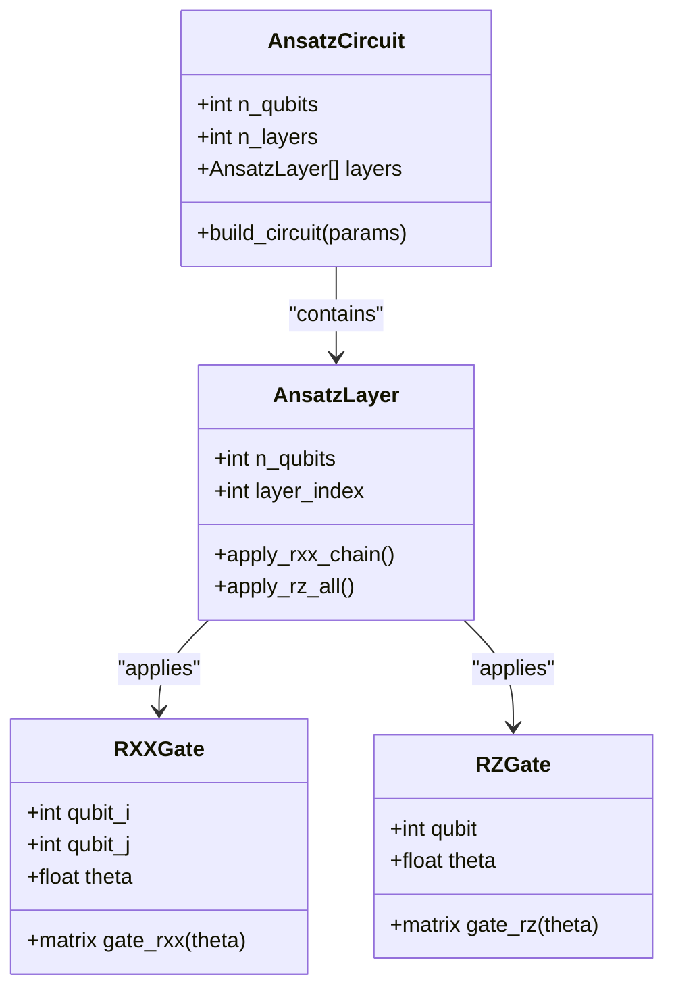
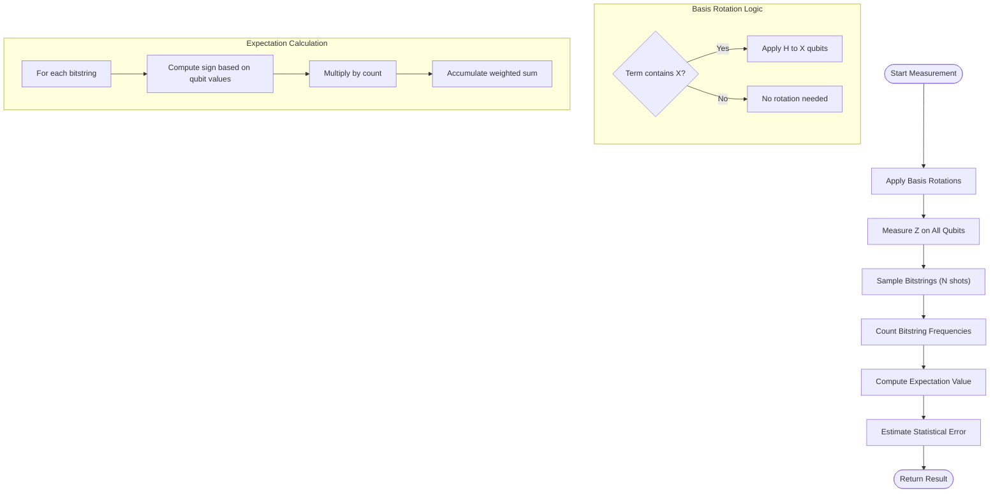
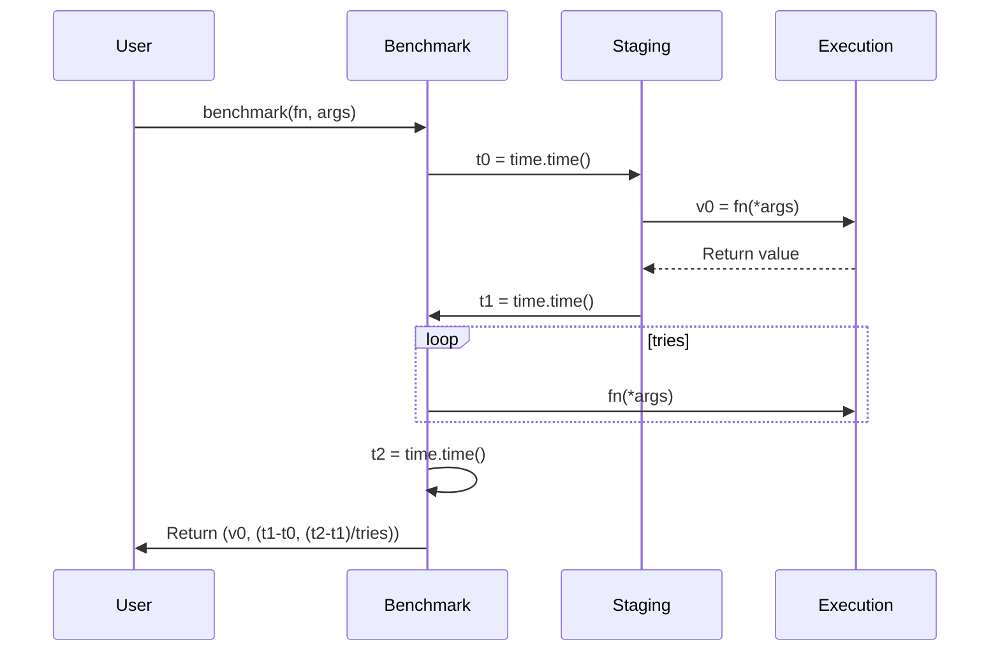
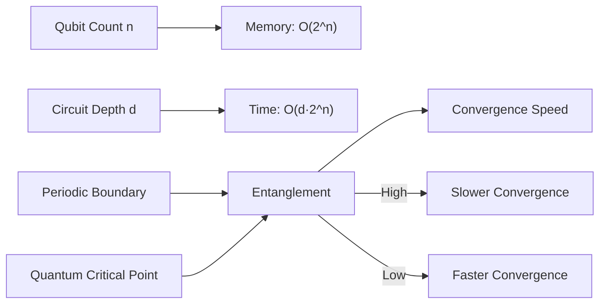
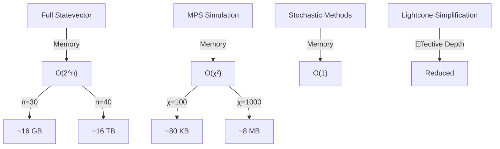

# VQE Physics Benchmarks: TFIM Spin System Simulation

<cite>
**Referenced Files in This Document**   
- [vqetfim_benchmark.py](file://examples/vqetfim_benchmark.py)
- [hamiltonians.py](file://src/tyxonq/libs/circuits_library/hamiltonians.py)
- [statevector.py](file://src/tyxonq/libs/quantum_library/kernels/statevector.py)
- [gates.py](file://src/tyxonq/libs/quantum_library/kernels/gates.py)
- [engine.py](file://src/tyxonq/devices/simulators/statevector/engine.py)
</cite>

## Table of Contents
1. [Introduction](#introduction)
2. [Hamiltonian Construction](#hamiltonian-construction)
3. [Ansatz Design and Implementation](#ansatz-design-and-implementation)
4. [Measurement Strategy and Expectation Evaluation](#measurement-strategy-and-expectation-evaluation)
5. [Benchmarking Methodology](#benchmarking-methodology)
6. [Computational Complexity Analysis](#computational-complexity-analysis)
7. [Memory Requirements and Simulation Methods](#memory-requirements-and-simulation-methods)
8. [Adaptation for Near-Term Hardware](#adaptation-for-near-term-hardware)
9. [Conclusion](#conclusion)

## Introduction
The VQE benchmark for the Transverse Field Ising Model (TFIM) spin system provides a comprehensive framework for evaluating quantum simulation performance across different execution paradigms. This benchmark focuses on a 1D spin chain with periodic boundary conditions, enabling the study of quantum phase transitions and critical phenomena. The implementation in `vqetfim_benchmark.py` compares two distinct evaluation approaches: a direct numeric path using statevector simulation with automatic differentiation, and a counts-based path that simulates finite-shot measurements. This document analyzes the core components of this benchmark, including Hamiltonian construction, ansatz design, measurement strategies, and performance evaluation methodologies.

**Section sources**
- [vqetfim_benchmark.py](file://examples/vqetfim_benchmark.py#L1-L20)

## Hamiltonian Construction
The TFIM Hamiltonian is constructed to represent a 1D spin chain with nearest-neighbor interactions and a transverse magnetic field. The Hamiltonian takes the form H = Jx * Σ X_i X_{i+1} + h * Σ Z_i, where Jx represents the coupling strength between adjacent spins and h represents the transverse field strength. The implementation supports variable system size and periodic boundary conditions through the `build_tfim_terms` function.

Periodic boundary conditions are implemented by adding an additional coupling term between the first and last qubits when the `pbc` parameter is set to true. This creates a closed loop topology that preserves translational symmetry and enables the study of topological effects in the spin system. The Hamiltonian construction is modular and can be easily adapted to different parameter regimes by modifying the Jx and h values.

```mermaid
graph TD
H[TFIM Hamiltonian] --> ZZ[ZZ Coupling Terms]
H --> X[X Field Terms]
ZZ --> PBC[Periodic Boundary Condition]
ZZ --> Chain[Chain Couplings]
X --> Local[Local X Fields]
PBC --> |Conditional| Edge[Add Z_{n-1}Z_0 Term]
Chain --> |For i=0 to n-2| ZZ_i["Z_i Z_{i+1}"]
Local --> |For i=0 to n-1| X_i["X_i"]
```

**Diagram sources**
- [hamiltonians.py](file://src/tyxonq/libs/circuits_library/hamiltonians.py#L16-L25)

**Section sources**
- [hamiltonians.py](file://src/tyxonq/libs/circuits_library/hamiltonians.py#L16-L25)
- [vqetfim_benchmark.py](file://examples/vqetfim_benchmark.py#L5-L6)

## Ansatz Design and Implementation
The RXX-RZ ansatz is specifically designed to capture the physics of the TFIM system and its quantum phase transitions. This variational circuit consists of alternating layers of two-qubit XX interactions and single-qubit Z rotations, implemented through the `ansatz_ops_xx_rz` function.

The ansatz structure follows a layered architecture where each layer contains:
1. RXX gates applied along the chain between adjacent qubits (i, i+1)
2. RZ gates applied to each individual qubit

This design choice is physically motivated by the structure of the TFIM Hamiltonian, where the RXX gates directly correspond to the XX interaction terms, and the RZ gates correspond to the local field terms. The entanglement structure generated by the RXX gates is particularly well-suited for capturing the long-range correlations that emerge near quantum critical points.



**Diagram sources**
- [vqetfim_benchmark.py](file://examples/vqetfim_benchmark.py#L22-L35)
- [gates.py](file://src/tyxonq/libs/quantum_library/kernels/gates.py#L148-L158)

**Section sources**
- [vqetfim_benchmark.py](file://examples/vqetfim_benchmark.py#L22-L35)
- [gates.py](file://src/tyxonq/libs/quantum_library/kernels/gates.py#L148-L158)

## Measurement Strategy and Expectation Evaluation
The benchmark implements two distinct strategies for evaluating Pauli string expectations: a statevector-based exact method and a shot-based sampling approach. The measurement strategy is critical for accurately estimating the energy expectation value while accounting for statistical uncertainties inherent in real quantum hardware.

The shot-based sampling approach in the `counts_energy` function simulates finite measurement shots by:
1. Constructing a measurement circuit for each Pauli term
2. Applying basis rotations (H gate for X measurements)
3. Performing Z-basis measurements on all qubits
4. Computing expectation values from the resulting bitstring counts

Statistical error estimation is implicitly handled through the finite number of shots, with the standard error scaling as 1/√N where N is the number of shots. This approach provides a realistic simulation of the noise and uncertainty present in actual quantum devices.



**Diagram sources**
- [vqetfim_benchmark.py](file://examples/vqetfim_benchmark.py#L37-L74)
- [engine.py](file://src/tyxonq/devices/simulators/statevector/engine.py#L200-L264)

**Section sources**
- [vqetfim_benchmark.py](file://examples/vqetfim_benchmark.py#L37-L74)
- [engine.py](file://src/tyxonq/devices/simulators/statevector/engine.py#L200-L264)

## Benchmarking Methodology
The benchmarking methodology is designed to isolate and measure different components of computational overhead, providing insights into the performance characteristics of various execution paths. The `benchmark` function implements a precise timing framework that separates staging overhead from execution time.

The timing methodology distinguishes between:
1. **Staging overhead**: Time required for circuit compilation, lightcone simplification, and other preprocessing steps
2. **Execution time**: Time required for simulator runtime and gradient evaluation

This separation is achieved by measuring the initial call (which includes both staging and execution) and subsequent calls (which primarily measure execution time after compilation artifacts are cached). The benchmark compares two evaluation approaches:
- **Direct numeric path**: Uses statevector simulation with PyTorch autograd for exact gradient computation
- **Counts path**: Uses finite-shot measurements with statistical estimation



**Diagram sources**
- [vqetfim_benchmark.py](file://examples/vqetfim_benchmark.py#L76-L92)

**Section sources**
- [vqetfim_benchmark.py](file://examples/vqetfim_benchmark.py#L76-L92)

## Computational Complexity Analysis
The computational complexity of the TFIM VQE benchmark scales with system size in both circuit depth and simulation requirements. The circuit depth scales linearly with the number of layers and qubits, while the simulation complexity depends on the chosen method.

For the statevector simulation approach, the memory requirement scales as O(2^n) where n is the number of qubits, due to the exponential growth of the Hilbert space. The time complexity for applying two-qubit gates is O(2^n) per gate, leading to an overall complexity of O(d·2^n) where d is the circuit depth.

The entanglement structure generated by the RXX gates significantly impacts convergence speed. Near quantum critical points, the entanglement entropy follows an area law with logarithmic corrections, requiring deeper circuits and more optimization steps to achieve convergence. The periodic boundary conditions enhance long-range correlations, further affecting convergence behavior.



**Diagram sources**
- [vqetfim_benchmark.py](file://examples/vqetfim_benchmark.py#L22-L35)
- [statevector.py](file://src/tyxonq/libs/quantum_library/kernels/statevector.py#L20-L50)

**Section sources**
- [vqetfim_benchmark.py](file://examples/vqetfim_benchmark.py#L22-L35)
- [statevector.py](file://src/tyxonq/libs/quantum_library/kernels/statevector.py#L20-L50)

## Memory Requirements and Simulation Methods
The memory requirements for statevector simulation grow exponentially with system size, limiting the maximum problem size that can be simulated on classical hardware. For n qubits, the statevector requires 2^n complex numbers, each typically 16 bytes, resulting in 16·2^n bytes of memory.

To mitigate these memory constraints, alternative simulation methods can be employed:
- **Matrix Product State (MPS)**: Represents the quantum state as a tensor network with bounded entanglement, reducing memory requirements to O(d·χ²) where χ is the bond dimension
- **Stochastic methods**: Use Monte Carlo sampling to estimate expectation values without storing the full statevector
- **Lightcone simplification**: Exploits causal structure to reduce effective circuit depth

The current implementation uses full statevector simulation, which provides exact results but is limited to small system sizes (typically n < 30 on modern workstations). For larger systems, switching to MPS or stochastic methods would be necessary to maintain feasibility.



**Diagram sources**
- [engine.py](file://src/tyxonq/devices/simulators/statevector/engine.py#L0-L50)
- [statevector.py](file://src/tyxonq/libs/quantum_library/kernels/statevector.py#L0-L10)

**Section sources**
- [engine.py](file://src/tyxonq/devices/simulators/statevector/engine.py#L0-L50)
- [statevector.py](file://src/tyxonq/libs/quantum_library/kernels/statevector.py#L0-L10)

## Adaptation for Near-Term Hardware
The benchmark can be adapted for near-term hardware constraints by modifying several key parameters and strategies. These adaptations include adjusting the ansatz structure, measurement protocols, and error mitigation techniques to account for realistic device limitations.

Key adaptation strategies include:
1. **Reduced circuit depth**: Limiting the number of ansatz layers to minimize decoherence effects
2. **Noise-aware ansatz design**: Incorporating device connectivity constraints into the gate placement
3. **Error mitigation**: Implementing readout error correction and zero-noise extrapolation
4. **Measurement optimization**: Using classical shadows or other efficient estimation techniques

For extrapolating performance to larger spin systems, the benchmark should be run across a range of system sizes to establish scaling trends. This data can then be used to predict performance on larger systems that exceed current simulation capabilities.

**Section sources**
- [vqetfim_benchmark.py](file://examples/vqetfim_benchmark.py#L1-L124)

## Conclusion
The TFIM VQE benchmark provides a comprehensive framework for evaluating quantum simulation performance across different execution paradigms. By analyzing the Hamiltonian construction, ansatz design, measurement strategies, and performance characteristics, this benchmark offers valuable insights into the capabilities and limitations of current quantum computing approaches. The ability to isolate staging overhead from execution time enables detailed performance analysis, while the modular design allows for easy adaptation to different physical systems and hardware constraints. This benchmark serves as an essential tool for assessing the readiness of quantum algorithms for practical applications in quantum many-body physics.