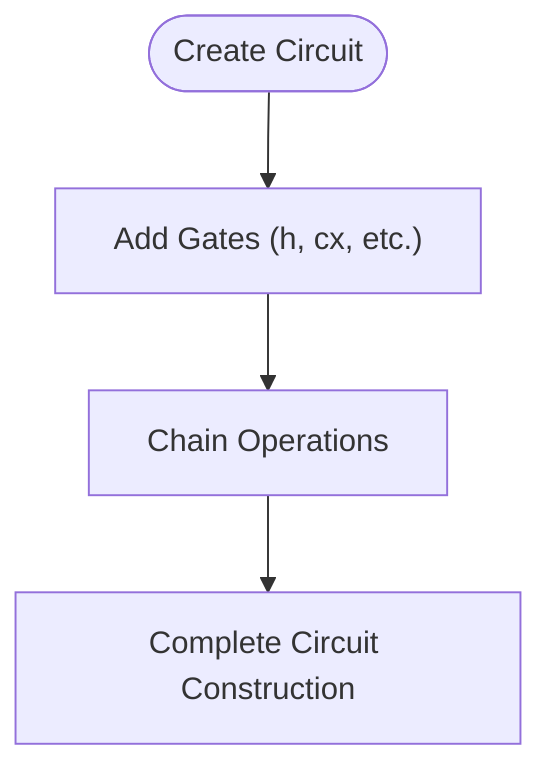
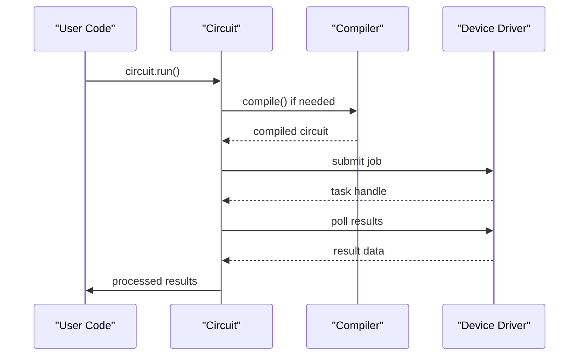
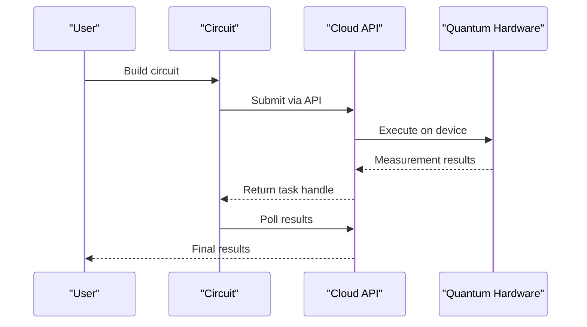

# Getting Started

<cite>
**Referenced Files in This Document**   
- [pyproject.toml](file://pyproject.toml)
- [config.py](file://src/tyxonq/config.py)
- [quickstart.rst](file://docs-ng/source/next/quickstart.rst)
- [circuit_chain_demo.py](file://examples/circuit_chain_demo.py)
- [cloud_api_task.py](file://examples/cloud_api_task.py)
- [circuit.py](file://src/tyxonq/core/ir/circuit.py)
</cite>

## Table of Contents
1. [Installation and Environment Setup](#installation-and-environment-setup)
2. [Configuration with config.py](#configuration-with-configpy)
3. [Core Workflow Overview](#core-workflow-overview)
4. [Circuit Construction](#circuit-construction)
5. [Compilation Process](#compilation-process)
6. [Execution and Device Selection](#execution-and-device-selection)
7. [Postprocessing Results](#postprocessing-results)
8. [Chain API Pattern](#chain-api-pattern)
9. [Backend Selection Guide](#backend-selection-guide)
10. [Quantum Hardware Integration](#quantum-hardware-integration)
11. [Common Pitfalls and Troubleshooting](#common-pitfalls-and-troubleshooting)

## Installation and Environment Setup

To get started with TyxonQ, install the framework using the configuration specified in pyproject.toml. The project requires Python 3.10 to 3.12 and includes dependencies for quantum computing, numerical computation, and development tools.

The installation process automatically resolves dependencies including numpy, pytorch, cupynumeric, qiskit, and other scientific computing packages essential for quantum simulation and machine learning workflows. Development dependencies include testing frameworks and build tools for contributors.

**Section sources**
- [pyproject.toml](file://pyproject.toml#L1-L74)

## Configuration with config.py

The config.py file provides global configuration utilities and normalization functions for TyxonQ. It defines supported backends (numpy, pytorch, cupynumeric) and includes functions to normalize backend names and validate vectorization policies.

Key configuration elements include default numeric data types (complex64 for complex numbers, float32 for real numbers) and backend name aliases (cpu→numpy, gpu→cupynumeric, torch/pt→pytorch). These defaults ensure consistent behavior across different components of the framework.

**Section sources**
- [config.py](file://src/tyxonq/config.py#L1-L97)

## Core Workflow Overview

TyxonQ follows a structured workflow: circuit construction → compilation → execution → postprocessing. This pipeline enables users to build quantum circuits, compile them for specific targets, execute on various backends, and process results systematically.

The framework supports both imperative and chainable API styles, allowing flexible coding patterns. Users can construct circuits step-by-step or use method chaining for concise, readable code that expresses the entire workflow in a single expression.

**Section sources**
- [quickstart.rst](file://docs-ng/source/next/quickstart.rst#L1-L13)

## Circuit Construction

Circuit construction begins with creating a Circuit object specifying the number of qubits. The framework provides builder-style methods for adding quantum gates in a chainable pattern. Basic operations include single-qubit gates like h (Hadamard) and multi-qubit gates like cx (CNOT).

The Circuit class in circuit.py implements ergonomic methods that modify the circuit in-place and return self, enabling method chaining. Supported gates include h, x, y, z, rx, ry, rz, cx, cz, and others, with both lowercase and uppercase aliases available.



**Diagram sources**
- [circuit.py](file://src/tyxonq/core/ir/circuit.py#L48-L779)
- [circuit_chain_demo.py](file://examples/circuit_chain_demo.py#L1-L305)

**Section sources**
- [circuit.py](file://src/tyxonq/core/ir/circuit.py#L576-L578)
- [circuit.py](file://src/tyxonq/core/ir/circuit.py#L597-L599)

## Compilation Process

The compilation process transforms high-level circuit representations into forms suitable for execution on specific backends. The compile() method serves dual purposes: when called without arguments, it acts as a chainable setter; when provided with parameters, it triggers actual compilation.

Compilation options include specifying the compile engine (default, qiskit), output format (ir, qasm2, qasm3), and target platform. The framework supports multiple compilation engines, with Qiskit integration enabling OpenQASM generation for hardware compatibility.

**Section sources**
- [circuit.py](file://src/tyxonq/core/ir/circuit.py#L373-L402)

## Execution and Device Selection

Execution is handled through the run() method, which orchestrates the complete workflow from compilation to result retrieval. Device selection is configured via the device() method, which accepts parameters like provider (simulator, tyxonq), device type, and shot count.

The execution system supports both local simulation and remote hardware access. For simulator execution, circuits can run directly on statevector or density matrix backends. For hardware execution, circuits are automatically compiled to appropriate formats like OpenQASM before submission.



**Diagram sources**
- [circuit.py](file://src/tyxonq/core/ir/circuit.py#L404-L515)
- [circuit_chain_demo.py](file://examples/circuit_chain_demo.py#L1-L305)

## Postprocessing Results

Postprocessing is configured through the postprocessing() method, which sets options for result interpretation and transformation. The framework applies postprocessing automatically after result retrieval, attaching processed data to the result dictionary.

Available postprocessing methods include expectation value calculation from counts, error mitigation techniques, and classical shadow analysis. Users can specify the postprocessing method and options either through the chainable API or by setting global defaults.

**Section sources**
- [circuit.py](file://src/tyxonq/core/ir/circuit.py#L182-L186)

## Chain API Pattern

The Chain API pattern enables fluent, readable code by allowing method chaining throughout the quantum workflow. This pattern is implemented through methods that return self after modifying the circuit object. Key chainable methods include compile(), device(), postprocessing(), and run().

The pattern supports partial configuration, where calling a method without arguments sets default behavior, and automatic completion of missing stages. This allows users to write concise code like Circuit(2).h(0).cx(0,1).run() while still benefiting from full pipeline functionality.

```mermaid
flowchart LR
A[Circuit Construction] --> B[compile()]
B --> C[device()]
C --> D[postprocessing()]
D --> E[run()]
style A fill:#f9f,stroke:#333
style B fill:#bbf,stroke:#333
style C fill:#bbf,stroke:#333
style D fill:#bbf,stroke:#333
style E fill:#f96,stroke:#333
```

**Diagram sources**
- [circuit_chain_demo.py](file://examples/circuit_chain_demo.py#L1-L305)
- [circuit.py](file://src/tyxonq/core/ir/circuit.py#L48-L779)

## Backend Selection Guide

TyxonQ supports multiple numerical backends: NumPy (CPU), PyTorch (CPU/GPU), and CuPyNumeric (GPU). Backend selection is handled through the set_backend() function, which configures the computational engine for circuit simulation.

The choice of backend affects performance characteristics: NumPy provides reliable CPU-based computation, PyTorch enables GPU acceleration and gradient computation, and CuPyNumeric offers high-performance GPU processing. Users should select backends based on hardware availability and computational requirements.

**Section sources**
- [config.py](file://src/tyxonq/config.py#L1-L97)
- [circuit_chain_demo.py](file://examples/circuit_chain_demo.py#L1-L305)

## Quantum Hardware Integration

Integration with quantum hardware is demonstrated in cloud_api_task.py, which shows both legacy-style and chain-style approaches to hardware submission. The framework supports authentication via API tokens and interaction with remote quantum processors.

Hardware tasks can be submitted using either direct QASM source or through the circuit compilation pipeline. The system handles task submission, polling, and result retrieval, providing a unified interface for both local simulation and remote hardware execution.



**Diagram sources**
- [cloud_api_task.py](file://examples/cloud_api_task.py#L1-L65)
- [circuit.py](file://src/tyxonq/core/ir/circuit.py#L48-L779)

## Common Pitfalls and Troubleshooting

Common issues for new users include incorrect backend configuration, missing API tokens for cloud access, and improper circuit construction. The reset operation generates warnings as it's typically not supported on real hardware, serving as an educational tool.

Troubleshooting steps include verifying installation dependencies, checking backend availability, ensuring proper authentication for cloud services, and validating circuit syntax. The framework provides descriptive error messages for qubit index out of range, invalid operations, and structural validation failures.

**Section sources**
- [circuit.py](file://src/tyxonq/core/ir/circuit.py#L30-L36)
- [circuit_chain_demo.py](file://examples/circuit_chain_demo.py#L1-L305)