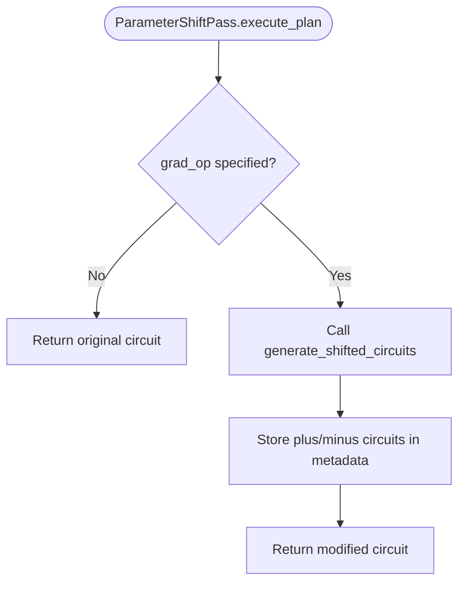
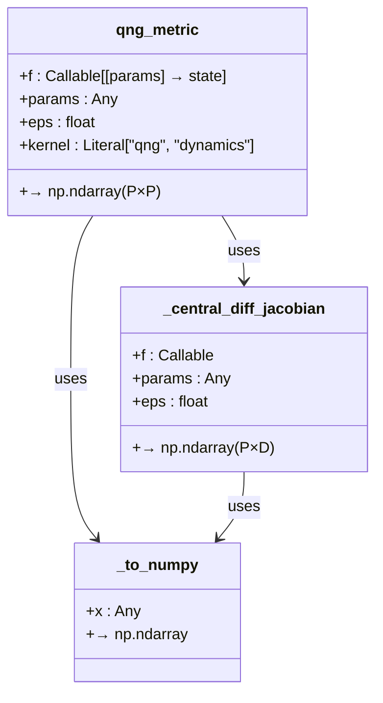
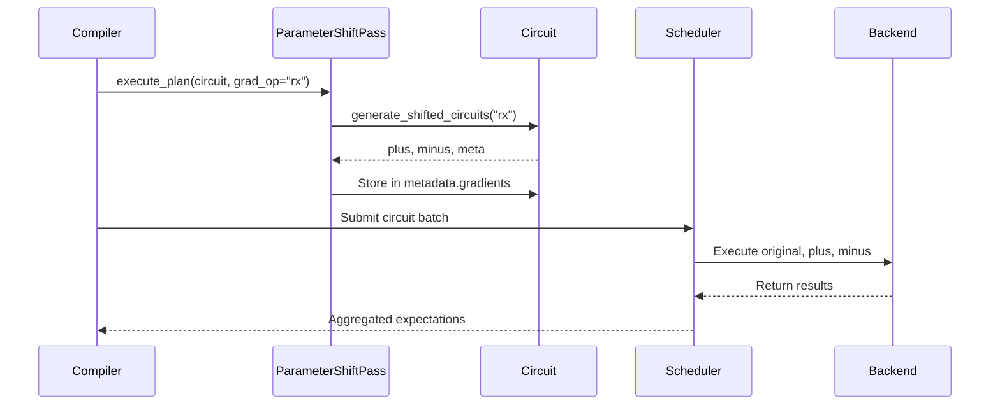

# Gradient Computation

<cite>
**Referenced Files in This Document**   
- [parameter_shift_pass.py](file://src/tyxonq/compiler/stages/gradients/parameter_shift_pass.py)
- [qng.py](file://src/tyxonq/compiler/stages/gradients/qng.py)
- [compiler.rst](file://docs-ng/source/next/user/compiler.rst)
- [parameter_shift.py](file://examples/parameter_shift.py)
- [simple_qaoa.py](file://examples/simple_qaoa.py)
- [vqe_extra.py](file://examples/vqe_extra.py)
</cite>

## Table of Contents
1. [Introduction](#introduction)
2. [Parameter Shift Rule Implementation](#parameter-shift-rule-implementation)
3. [Quantum Natural Gradient (QNG) Pass](#quantum-natural-gradient-qng-pass)
4. [Gradient Computation Workflow in VQE and QAOA](#gradient-computation-workflow-in-vqe-and-qaoa)
5. [Circuit Transformation and Execution Scheduling](#circuit-transformation-and-execution-scheduling)
6. [Integration with Numerics Backend](#integration-with-numerics-backend)
7. [Common Issues and Solutions](#common-issues-and-solutions)
8. [Conclusion](#conclusion)

## Introduction
The Gradient Computation stage in the TyxonQ compiler pipeline enables analytical gradient evaluation for variational quantum algorithms such as VQE and QAOA. This document details the implementation of the parameter shift rule via the `ParameterShiftPass`, the Quantum Natural Gradient (QNG) computation, and their integration into optimization workflows. The process involves circuit transformation, metadata generation, and backend interaction to compute gradients efficiently and accurately.

**Section sources**
- [compiler.rst](file://docs-ng/source/next/user/compiler.rst#L1-L7)

## Parameter Shift Rule Implementation

The `ParameterShiftPass` class in `parameter_shift_pass.py` implements the analytical parameter shift rule for single-parameter quantum gates such as RX, RY, and RZ. It operates by identifying parameterized gates matching a specified operation name (e.g., "rx") and generating two modified circuit instances: one with the parameter shifted forward by π/2 and another shifted backward by π/2.

The core method `execute_plan` takes a circuit and an option `grad_op` specifying the gate type to differentiate. It invokes `generate_shifted_circuits` from the gradients module to produce the ±π/2 shifted circuits and stores them in the circuit's metadata under the `"gradients"` key. The metadata also includes a coefficient of 0.5, consistent with the standard parameter shift formula:

∇f(θ) = 0.5 × [f(θ + π/2) − f(θ − π/2)]

This mechanism enables hardware-compatible gradient estimation without requiring quantum autodiff or parameteric compilation support.

**Diagram sources**
- [parameter_shift_pass.py](file://src/tyxonq/compiler/stages/gradients/parameter_shift_pass.py#L11-L28)
- [parameter_shift.py](file://src/tyxonq/compiler/gradients/parameter_shift.py#L8-L35)

**Section sources**
- [parameter_shift_pass.py](file://src/tyxonq/compiler/stages/gradients/parameter_shift_pass.py#L1-L31)
- [parameter_shift.py](file://examples/parameter_shift.py#L0-L183)

## Quantum Natural Gradient (QNG) Pass

The `qng.py` module provides a numerical implementation of the Quantum Natural Gradient (QNG) by computing the Fubini-Study metric tensor, also known as the Quantum Fisher Information Matrix (QFIM). Unlike standard gradients, QNG accounts for the geometry of the quantum state space, leading to faster convergence in variational optimization.

The `qng_metric` function computes the metric tensor using finite differences. It evaluates the Jacobian of the state vector with respect to parameters via central differences and constructs the metric as:

G_ij = ⟨∂_i ψ|∂_j ψ⟩ − ⟨∂_i ψ|ψ⟩⟨ψ|∂_j ψ⟩

This implementation is backend-agnostic and relies only on NumPy, making it compatible with any quantum simulator that can return state vectors. The optional `kernel="dynamics"` flag simplifies the metric to the unprojected form ⟨∂_i ψ|∂_j ψ⟩, useful in time evolution contexts.

The `dynamics_matrix` function serves as a convenience alias for the dynamics kernel, enabling direct access to the unprojected metric.

**Diagram sources**
- [qng.py](file://src/tyxonq/compiler/stages/gradients/qng.py#L72-L104)

**Section sources**
- [qng.py](file://src/tyxonq/compiler/stages/gradients/qng.py#L0-L114)

## Gradient Computation Workflow in VQE and QAOA

Concrete applications of the parameter shift rule are demonstrated in `simple_qaoa.py` and `vqe_extra.py`. In both examples, the objective function involves estimating the expectation value of a Hamiltonian using measurement outcomes.

For QAOA, the cost Hamiltonian consists of ZZ and X terms. The expectation is computed by:
1. Running the circuit in the computational basis to estimate ZZ terms
2. Applying Hadamard gates before measurement to estimate X terms

The gradient is then computed using the parameter shift rule on rotation gates (RX, RZZ). Each parameter is shifted ±π/2, and the objective function is re-evaluated to compute the gradient component.

Similarly, in VQE for a transverse-field Ising model (TFIM), the `grad_tfim_ps` function iterates over each parameter in the hardware-efficient ansatz, applies the shift, and computes the energy difference. This approach enables end-to-end gradient-based optimization using only shot-based or analytic expectation evaluations.

**Section sources**
- [simple_qaoa.py](file://examples/simple_qaoa.py#L0-L192)
- [vqe_extra.py](file://examples/vqe_extra.py#L0-L195)

## Circuit Transformation and Execution Scheduling

The gradient computation process involves duplicating the original circuit for each shifted parameter. The `generate_shifted_circuits` function creates two new circuit instances—`plus` and `minus`—by cloning the original operations and modifying the target parameter. Only the first occurrence of the specified gate is shifted, ensuring deterministic behavior.

These transformed circuits are stored in the metadata and later scheduled for execution. The `shot_scheduler` in the compiler pipeline ensures that all gradient-related circuits are executed efficiently, potentially batching them for performance. The results from the `plus` and `minus` circuits are combined using the parameter shift formula to compute the final gradient.

This transformation preserves the original circuit structure while enabling parallel execution of gradient components across different parameters.

**Diagram sources**
- [parameter_shift_pass.py](file://src/tyxonq/compiler/stages/gradients/parameter_shift_pass.py#L11-L28)
- [parameter_shift.py](file://src/tyxonq/compiler/gradients/parameter_shift.py#L8-L35)

**Section sources**
- [parameter_shift_pass.py](file://src/tyxonq/compiler/stages/gradients/parameter_shift_pass.py#L1-L31)

## Integration with Numerics Backend

The gradient passes interact with the numerics backend to perform final gradient computation. While the circuit transformations are handled by the compiler, the numerical combination of results (e.g., 0.5 × (f+ − f−)) is performed using the active backend—NumPy, PyTorch, or CuPy.

In `parameter_shift.py`, the numeric backend is explicitly set via `tq.set_backend("numpy")`, and gradient accumulation uses `nb.zeros_like` and `nb.to_numpy` for tensor operations. This design decouples circuit compilation from numerical computation, allowing the same gradient workflow to run across different computational backends.

For autodiff-based comparisons, the `qaoa_objective_autograd` and `energy_tfim_state_autograd` functions demonstrate how PyTorch can be used to compute gradients via backpropagation, providing a benchmark for the parameter shift method.

**Section sources**
- [parameter_shift.py](file://examples/parameter_shift.py#L0-L183)
- [vqe_extra.py](file://examples/vqe_extra.py#L0-L195)

## Common Issues and Solutions

A key limitation of the parameter shift rule is its applicability only to gates with equidistant eigenvalues, such as Pauli rotations. Gates like arbitrary single-qubit rotations or non-analytic operations are not shift-differentiable and will produce incorrect gradients.

**Issue**: Attempting parameter shift on non-supported gates (e.g., general U3 gates) results in inaccurate gradients.

**Solution**: The compiler should validate gate types during the `ParameterShiftPass`. Unsupported gates can be decomposed into shift-differentiable components (e.g., U3 → RZ-RX-RZ) before gradient computation.

Additionally, noise and finite sampling can degrade gradient accuracy. Increasing shot count or using error mitigation in postprocessing improves gradient quality.

Another consideration is performance: computing gradients for N parameters requires 2N circuit executions. For large circuits, this overhead can be mitigated by vectorizing parameter shifts or using simultaneous perturbation methods.

**Section sources**
- [parameter_shift_pass.py](file://src/tyxonq/compiler/stages/gradients/parameter_shift_pass.py#L11-L28)
- [parameter_shift.py](file://examples/parameter_shift.py#L0-L183)

## Conclusion
The Gradient Computation stage in TyxonQ provides a robust framework for analytical gradient estimation in variational quantum algorithms. By leveraging the parameter shift rule and Quantum Natural Gradient, it enables efficient optimization of VQE and QAOA workflows. The modular design separates circuit transformation from numerical computation, ensuring compatibility across backends and devices. Future enhancements could include support for second-order gradients, simultaneous parameter shifts, and integration with hardware-efficient differentiation techniques.