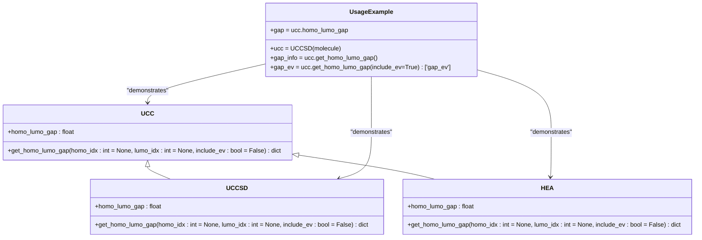

# HOMO-LUMO Gap Analysis

<cite>
**Referenced Files in This Document**   
- [demo_homo_lumo_gap.py](file://examples/demo_homo_lumo_gap.py)
- [test_homo_lumo_gap.py](file://tests_mol_valid/test_homo_lumo_gap.py)
- [molecule.py](file://src/tyxonq/applications/chem/molecule.py)
- [hea.py](file://src/tyxonq/applications/chem/algorithms/hea.py)
- [uccsd.py](file://src/tyxonq/applications/chem/algorithms/uccsd.py)
- [ucc.py](file://src/tyxonq/applications/chem/algorithms/ucc.py)
</cite>

## Table of Contents
1. [Introduction](#introduction)
2. [Core Components](#core-components)
3. [Implementation Details](#implementation-details)
4. [API Interfaces](#api-interfaces)
5. [Integration Patterns](#integration-patterns)
6. [Practical Examples](#practical-examples)
7. [Troubleshooting Guide](#troubleshooting-guide)
8. [Conclusion](#conclusion)

## Introduction
The HOMO-LUMO gap analysis functionality in TyxonQ provides a comprehensive framework for calculating the energy difference between the Highest Occupied Molecular Orbital (HOMO) and Lowest Unoccupied Molecular Orbital (LUMO) in quantum chemical systems. This energy gap is a fundamental property that determines the electronic structure and reactivity of molecules, playing a crucial role in understanding chemical bonding, excitation energies, and material properties.

The implementation leverages quantum computing algorithms, particularly Unitary Coupled Cluster (UCC) and Hardware-Efficient Ansatz (HEA), to compute these gaps with high accuracy. The system integrates with classical quantum chemistry methods through PySCF, enabling seamless transition between classical and quantum computational approaches. The HOMO-LUMO gap calculation is particularly important for predicting molecular stability, optical properties, and reaction mechanisms.

The functionality supports both closed-shell and open-shell systems, with automatic determination of HOMO and LUMO indices based on electron configuration. It also provides options for manual specification of orbitals and includes unit conversion between Hartree and electron volts (eV). The implementation ensures numerical consistency with PySCF reference calculations, validating the accuracy of the quantum computations.

**Section sources**
- [demo_homo_lumo_gap.py](file://examples/demo_homo_lumo_gap.py#L1-L201)
- [test_homo_lumo_gap.py](file://tests_mol_valid/test_homo_lumo_gap.py#L1-L279)

## Core Components
The HOMO-LUMO gap analysis functionality is built upon several core components that work together to provide accurate quantum chemical calculations. The primary components include the UCCSD (Unitary Coupled Cluster Singles and Doubles) algorithm, HEA (Hardware-Efficient Ansatz), and the underlying molecular representation system.

The UCCSD algorithm serves as the foundation for high-accuracy quantum chemical calculations, implementing the quantum analog of classical coupled cluster theory. It uses a unitary ansatz to approximate the ground state wavefunction, combining single and double excitation operators in an exponential form. The algorithm supports flexible initialization methods including MP2 (Møller-Plesset perturbation theory), CCSD (classical coupled cluster), and zero initialization, allowing users to balance accuracy and computational cost.

The HEA implementation provides a hardware-efficient alternative for near-term quantum devices with limited connectivity and coherence times. It uses a RY-only structure with alternating layers of single-qubit rotations and CNOT entangling chains, optimized for NISQ (Noisy Intermediate-Scale Quantum) device constraints. Both algorithms delegate HOMO-LUMO gap calculations to the internal UCC object, ensuring consistent chemistry-related calculations.

The molecular representation system, defined in molecule.py, provides predefined molecular systems and utilities for constructing molecular objects. This includes common molecules like H2, H4, and water, with standardized basis sets and geometries. The system handles both closed-shell and open-shell configurations, with proper spin handling for open-shell systems.

```mermaid
classDiagram
class UCC {
+n_qubits : int
+n_params : int
+hamiltonian : List
+init_guess : ndarray
+params : ndarray
+opt_res : dict
+runtime : str
+mapping : str
+grad : str
+get_homo_lumo_gap(homo_idx, lumo_idx, include_ev) dict
+homo_lumo_gap : float
}
class UCCSD {
+ex_ops : List[Tuple]
+param_ids : List[int]
+t2_discard_eps : float
+pick_ex2 : bool
+sort_ex2 : bool
+get_ex_ops(t1, t2) Tuple[List[Tuple], List[int], List[float]]
+e_uccsd : float
}
class HEA {
+n_qubits : int
+layers : int
+n_params : int
+hamiltonian : List
+init_guess : ndarray
+params : ndarray
+opt_res : dict
+runtime : str
+mapping : str
+grad : str
+get_homo_lumo_gap(homo_idx, lumo_idx, include_ev) dict
+homo_lumo_gap : float
}
class UCC <|-- UCCSD
class UCC <|-- HEA
class UCCSD --> UCC : "inherits"
class HEA --> UCC : "inherits"
```

**Diagram sources**
- [ucc.py](file://src/tyxonq/applications/chem/algorithms/ucc.py#L51-L1246)
- [uccsd.py](file://src/tyxonq/applications/chem/algorithms/uccsd.py#L17-L349)
- [hea.py](file://src/tyxonq/applications/chem/algorithms/hea.py#L27-L823)

**Section sources**
- [ucc.py](file://src/tyxonq/applications/chem/algorithms/ucc.py#L51-L1246)
- [uccsd.py](file://src/tyxonq/applications/chem/algorithms/uccsd.py#L17-L349)
- [hea.py](file://src/tyxonq/applications/chem/algorithms/hea.py#L27-L823)

## Implementation Details
The HOMO-LUMO gap calculation is implemented through a sophisticated integration of quantum algorithms and classical quantum chemistry methods. The core implementation resides in the UCC base class, with specific functionality extended in UCCSD and HEA subclasses. The calculation process begins with a Hartree-Fock (HF) calculation to obtain molecular orbitals and integrals, which serve as the reference for subsequent quantum computations.

The get_homo_lumo_gap method in the UCC class automatically determines HOMO and LUMO indices based on the molecular system's electron configuration. For closed-shell systems (spin=0), the HOMO index is calculated as (n_electrons // 2) - 1 and the LUMO index as n_electrons // 2, using 0-based indexing. For open-shell systems (spin≠0), the method analyzes orbital occupations from the HF calculation, identifying doubly occupied, singly occupied, and virtual orbitals to determine the appropriate indices.

The implementation includes comprehensive validation and error handling. It checks for the availability of Hartree-Fock calculations and molecular orbital energies before proceeding. The method validates specified orbital indices to ensure they are within the valid range of molecular orbitals. For open-shell systems, it verifies that occupied and virtual orbitals exist before determining HOMO and LUMO indices.

The calculation uses molecular orbital energies directly from the PySCF HF calculation, ensuring consistency with established quantum chemistry methods. The energy gap is computed as the difference between LUMO and HOMO energies (lumo_energy - homo_energy), with results returned in Hartree units. When requested, the method also provides the gap in electron volts (eV) using the conversion factor 27.211386245988 eV per Hartree.

The HEA implementation delegates HOMO-LUMO gap calculations to an internal UCC object created during molecule construction. This design ensures that chemistry-related calculations use the same logic as the UCC class while allowing HEA to focus on its hardware-efficient ansatz. The delegation pattern maintains consistency across different quantum algorithms while enabling algorithm-specific optimizations.


**Diagram sources**
- [ucc.py](file://src/tyxonq/applications/chem/algorithms/ucc.py#L1089-L1219)
- [hea.py](file://src/tyxonq/applications/chem/algorithms/hea.py#L729-L788)

**Section sources**
- [ucc.py](file://src/tyxonq/applications/chem/algorithms/ucc.py#L1089-L1219)
- [hea.py](file://src/tyxonq/applications/chem/algorithms/hea.py#L729-L788)

## API Interfaces
The HOMO-LUMO gap analysis functionality provides a comprehensive API with multiple access points for different use cases. The primary interface is the get_homo_lumo_gap method available in both UCC and HEA classes, which returns a detailed dictionary containing all relevant information about the gap calculation.

The get_homo_lumo_gap method accepts three optional parameters: homo_idx for manual specification of the HOMO orbital index, lumo_idx for manual specification of the LUMO orbital index, and include_ev for requesting eV conversion in the output. When indices are not specified, the method automatically determines them based on the molecular system type. The method returns a dictionary with keys including 'homo_energy', 'lumo_energy', 'gap', 'homo_idx', 'lumo_idx', 'system_type', and optionally 'gap_ev' when include_ev is True.

For convenient access to the gap value, the homo_lumo_gap property provides a direct way to obtain the energy gap in Hartree units without additional formatting. This property is particularly useful for quick calculations and comparisons where detailed orbital information is not required.

The API supports integration with various molecular input formats, including direct PySCF Mole objects, atomic specifications, and predefined molecules from the molecule.py library. This flexibility allows users to work with different input representations while maintaining consistent output formats.

The implementation also provides validation through comprehensive error handling. It raises RuntimeError when Hartree-Fock calculations are not available or when molecular orbital energies are missing. It raises ValueError for invalid orbital indices or when no occupied/virtual orbitals are found in the system.



**Diagram sources**
- [ucc.py](file://src/tyxonq/applications/chem/algorithms/ucc.py#L1089-L1219)
- [uccsd.py](file://src/tyxonq/applications/chem/algorithms/uccsd.py#L17-L349)
- [hea.py](file://src/tyxonq/applications/chem/algorithms/hea.py#L27-L823)

**Section sources**
- [ucc.py](file://src/tyxonq/applications/chem/algorithms/ucc.py#L1089-L1219)
- [uccsd.py](file://src/tyxonq/applications/chem/algorithms/uccsd.py#L17-L349)
- [hea.py](file://src/tyxonq/applications/chem/algorithms/hea.py#L27-L823)

## Integration Patterns
The HOMO-LUMO gap analysis functionality integrates seamlessly with various components of the TyxonQ quantum computing framework, enabling flexible workflows for quantum chemical calculations. The primary integration pattern involves the delegation of chemistry-related calculations from higher-level algorithms like HEA to the base UCC class, ensuring consistent implementation across different quantum algorithms.

The system integrates with classical quantum chemistry through PySCF, using the Hartree-Fock calculation results as the foundation for quantum computations. This integration allows the HOMO-LUMO gap calculation to leverage established classical methods for molecular orbital determination while extending them with quantum algorithms for improved accuracy. The integration supports both local execution and cloud-based classical calculations, providing flexibility for different computational environments.

For molecular input, the system integrates with the molecule.py library, which provides predefined molecular systems and utilities for constructing molecular objects. This integration enables users to work with standardized molecular representations while maintaining compatibility with PySCF's input format. The library includes common molecules like H2, H4, and water, with standardized basis sets and geometries.

The implementation also integrates with various execution runtimes, supporting both device execution (for quantum hardware and simulators) and numeric execution (for classical simulation). This integration allows users to switch between different execution backends based on their requirements, from exact statevector simulations to noisy quantum hardware executions.

The error handling and validation system integrates with Python's exception handling mechanism, providing clear error messages and appropriate exception types for different failure modes. This integration ensures that users receive meaningful feedback when encountering issues with their calculations.


**Diagram sources**
- [ucc.py](file://src/tyxonq/applications/chem/algorithms/ucc.py#L51-L1246)
- [uccsd.py](file://src/tyxonq/applications/chem/algorithms/uccsd.py#L17-L349)
- [hea.py](file://src/tyxonq/applications/chem/algorithms/hea.py#L27-L823)

**Section sources**
- [ucc.py](file://src/tyxonq/applications/chem/algorithms/ucc.py#L51-L1246)
- [uccsd.py](file://src/tyxonq/applications/chem/algorithms/uccsd.py#L17-L349)
- [hea.py](file://src/tyxonq/applications/chem/algorithms/hea.py#L27-L823)

## Practical Examples
The HOMO-LUMO gap analysis functionality can be applied in various practical scenarios, from basic molecular analysis to advanced quantum chemical investigations. The following examples demonstrate the versatility and ease of use of the API.

For basic usage with a hydrogen molecule (H2), the implementation provides a straightforward interface:
```python
from tyxonq.applications.chem import UCCSD
from tyxonq.applications.chem.molecule import h2

ucc = UCCSD(h2, init_method="zeros")
gap = ucc.homo_lumo_gap
print(f"Quick access: gap = {gap:.8f} Hartree = {gap*27.2114:.4f} eV")

gap_info = ucc.get_homo_lumo_gap()
print(f"System type: {gap_info['system_type']}")
print(f"HOMO (orbital #{gap_info['homo_idx']}): {gap_info['homo_energy']:.8f} Hartree")
print(f"LUMO (orbital #{gap_info['lumo_idx']}): {gap_info['lumo_energy']:.8f} Hartree")
print(f"Gap: {gap_info['gap']:.8f} Hartree ({gap_info['gap_ev']:.4f} eV)")
```

For multi-molecule comparison, the functionality enables systematic analysis of different chemical systems:
```python
molecules = [
    ("H2", h2),
    ("H4", h4),
    ("H2O", water(basis="sto-3g"))
]

for name, mol in molecules:
    ucc = UCCSD(mol, init_method="zeros")
    gap_info = ucc.get_homo_lumo_gap()
    print(f"{name}: Gap = {gap_info['gap']:.8f} Hartree ({gap_info['gap_ev']:.4f} eV), System type: {gap_info['system_type']}")
```

For open-shell systems like the H5 chain, the implementation automatically handles the more complex orbital occupation:
```python
mol = gto.M(atom='H 0 0 0; H 0 0 0.8; H 0 0 1.6; H 0 0 2.4; H 0 0 3.2', basis='sto-3g', spin=1)
ucc = ROUCCSD(mol, init_method="zeros")
gap_info = ucc.get_homo_lumo_gap()
print(f"H5 chain: Gap = {gap_info['gap']:.8f} Hartree ({gap_info['gap_ev']:.4f} eV)")
```

The functionality also supports manual specification of orbitals for specialized analysis:
```python
ucc = UCCSD(h4, init_method="zeros")
auto_gap = ucc.get_homo_lumo_gap()
manual_gap = ucc.get_homo_lumo_gap(homo_idx=1, lumo_idx=2)
print(f"Automatic: Gap = {auto_gap['gap']:.8f} Hartree")
print(f"Manual (1→2): Gap = {manual_gap['gap']:.8f} Hartree")
```

For active space calculations, the implementation enables reduced computational cost while maintaining accuracy:
```python
h2o = water(basis="sto-3g")
ucc_full = UCCSD(h2o, init_method="zeros")
ucc_cas = UCCSD(h2o, active_space=(4, 4), init_method="zeros")

full_gap = ucc_full.get_homo_lumo_gap()
cas_gap = ucc_cas.get_homo_lumo_gap()
print(f"Full space: Gap = {full_gap['gap']:.8f} Hartree")
print(f"Active space (4,4): Gap = {cas_gap['gap']:.8f} Hartree")
```

The system also provides validation against PySCF reference data to ensure numerical consistency:
```python
ucc = UCCSD(h2, init_method="zeros")
gap_info = ucc.get_homo_lumo_gap()

# Direct from PySCF
mo_energy = ucc.hf.mo_energy
mo_occ = ucc.hf.mo_occ
homo_idx = np.where(mo_occ > 1.5)[0][-1]
lumo_idx = np.where(mo_occ < 0.5)[0][0]
pyscf_gap = mo_energy[lumo_idx] - mo_energy[homo_idx]

print(f"TyxonQ gap: {gap_info['gap']:.12f} Hartree")
print(f"PySCF gap: {pyscf_gap:.12f} Hartree")
print(f"Difference: {abs(gap_info['gap'] - pyscf_gap):.2e} Hartree")
```

**Section sources**
- [demo_homo_lumo_gap.py](file://examples/demo_homo_lumo_gap.py#L1-L201)
- [test_homo_lumo_gap.py](file://tests_mol_valid/test_homo_lumo_gap.py#L1-L279)

## Troubleshooting Guide
When working with the HOMO-LUMO gap analysis functionality, several common issues may arise. This guide provides solutions to the most frequent problems encountered by users.

**RuntimeError: Hartree-Fock calculation not available**
This error occurs when attempting to calculate the HOMO-LUMO gap before the Hartree-Fock calculation has been performed. Ensure that the UCC object has been properly initialized with a molecule and that the initialization process has completed successfully.

**Solution**: Verify that the molecule object is correctly specified and that the UCC initialization has completed without errors. Check that the molecule has valid parameters (atom, basis, charge, spin).

**RuntimeError: MO energies not available**
This error indicates that the molecular orbital energies from the Hartree-Fock calculation are missing. This can happen if the HF calculation failed to converge or if the results were not properly stored.

**Solution**: Check the convergence of the Hartree-Fock calculation. For difficult systems, consider adjusting the convergence criteria or using a different initial guess. Verify that the basis set is appropriate for the molecular system.

**ValueError: Invalid HOMO/LUMO index**
This error occurs when manually specified orbital indices are outside the valid range or when the automatic determination fails due to insufficient orbitals.

**Solution**: Ensure that the specified indices are within the range [0, number_of_orbitals-1]. For automatic determination, verify that the system has both occupied and virtual orbitals. For small basis sets, consider using a larger basis to ensure sufficient orbitals.

**ValueError: No occupied/virtual orbitals found**
This error occurs in open-shell systems when the orbital occupation analysis fails to identify occupied or virtual orbitals.

**Solution**: Check the spin configuration of the molecule. For open-shell systems, ensure that the spin value is correctly specified and consistent with the expected electron configuration.

**Numerical inconsistency with PySCF**
When the calculated gap differs significantly from PySCF reference values, this may indicate issues with the calculation setup.

**Solution**: Verify that the same basis set, geometry, and charge are used in both TyxonQ and PySCF calculations. Check that the active space specification is consistent. For high-precision comparisons, ensure that convergence thresholds are sufficiently tight.

**Performance issues with large systems**
For large molecular systems, the calculation may be slow or consume excessive memory.

**Solution**: Consider using active space approximations to reduce the computational cost. For UCCSD, enable amplitude screening (pick_ex2=True) to reduce the number of excitation operators. For HEA, reduce the number of layers in the ansatz.

**Integration with cloud classical methods**
When using cloud-based classical calculations, connectivity or configuration issues may arise.

**Solution**: Verify that the cloud client is properly configured and that network connectivity is available. Check that the classical provider and device specifications are valid. For authentication issues, ensure that appropriate credentials are provided.

**Section sources**
- [ucc.py](file://src/tyxonq/applications/chem/algorithms/ucc.py#L1089-L1219)
- [test_homo_lumo_gap.py](file://tests_mol_valid/test_homo_lumo_gap.py#L1-L279)

## Conclusion
The HOMO-LUMO gap analysis functionality in TyxonQ provides a robust and comprehensive framework for calculating one of the most important quantum chemical properties. By integrating quantum algorithms like UCCSD and HEA with classical quantum chemistry methods through PySCF, the implementation offers both high accuracy and practical usability.

The system's design emphasizes consistency, validation, and ease of use, with automatic determination of orbital indices, comprehensive error handling, and numerical verification against reference calculations. The API provides flexible access to the gap calculation through both detailed method calls and convenient properties, supporting a wide range of use cases from basic molecular analysis to advanced quantum chemical investigations.

The integration patterns enable seamless workflows across different computational environments, from local execution to cloud-based classical calculations and quantum hardware execution. The support for both closed-shell and open-shell systems, active space approximations, and manual orbital specification makes the functionality applicable to diverse chemical systems.

Future enhancements could include support for more advanced quantum algorithms, improved performance optimizations for large systems, and expanded validation against experimental data. The current implementation already provides a solid foundation for quantum chemical research and education, enabling users to explore fundamental electronic structure properties with state-of-the-art computational methods.