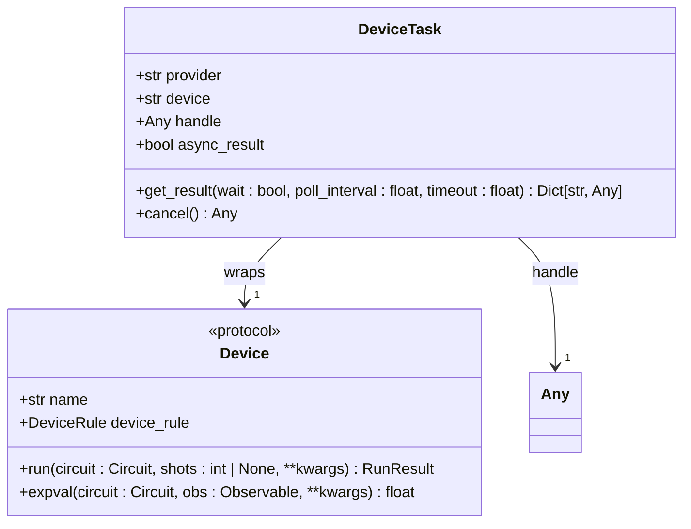
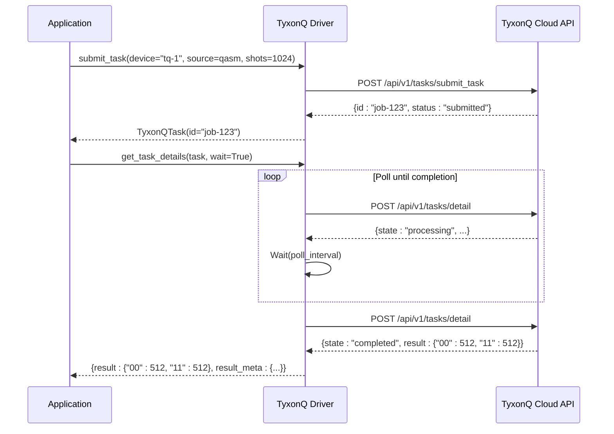
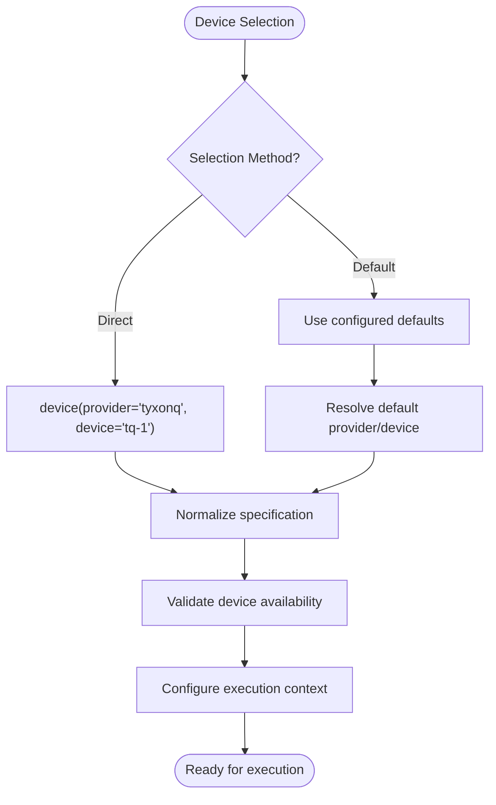
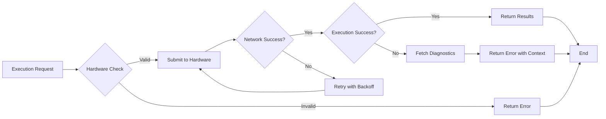

# Hardware Integration

<cite>
**Referenced Files in This Document**   
- [src/tyxonq/devices/base.py](file://src/tyxonq/devices/base.py)
- [src/tyxonq/devices/hardware/tyxonq/driver.py](file://src/tyxonq/devices/hardware/tyxonq/driver.py)
- [src/tyxonq/devices/hardware/ibm/driver.py](file://src/tyxonq/devices/hardware/ibm/driver.py)
- [src/tyxonq/devices/hardware/config.py](file://src/tyxonq/devices/hardware/config.py)
- [src/tyxonq/cloud/api.py](file://src/tyxonq/cloud/api.py)
- [docs-ng/source/next/user/devices.rst](file://docs-ng/source/next/user/devices.rst)
</cite>

## Table of Contents
1. [Introduction](#introduction)
2. [Unified Driver Interface](#unified-driver-interface)
3. [TyxonQ Hardware Driver](#tyxonq-hardware-driver)
4. [IBM Quantum Driver](#ibm-quantum-driver)
5. [Device Selection and Configuration](#device-selection-and-configuration)
6. [Hardware Constraints and Execution Considerations](#hardware-constraints-and-execution-considerations)
7. [Circuit Compilation Best Practices](#circuit-compilation-best-practices)
8. [Conclusion](#conclusion)

## Introduction
This document details the hardware integration framework within the TyxonQ quantum computing platform, focusing on the abstraction layer that enables seamless execution across different quantum hardware providers. The system provides a unified interface for interacting with both proprietary quantum processors via the TyxonQ cloud API and IBM Quantum devices through Qiskit Runtime. The architecture is designed to abstract provider-specific implementation details while maintaining low-latency control, proper error handling, and consistent execution patterns across different backends.

**Section sources**
- [src/tyxonq/devices/base.py](file://src/tyxonq/devices/base.py)
- [docs-ng/source/next/user/devices.rst](file://docs-ng/source/next/user/devices.rst)

## Unified Driver Interface
The hardware integration system is built around a unified driver interface defined in `devices/base.py`, which provides a consistent API for interacting with different quantum hardware providers. This interface abstracts provider-specific details and normalizes the execution workflow across different backends.

The core of the unified interface is the `DeviceTask` class, which wraps hardware-specific task objects with a standardized interface. This wrapper provides consistent methods for result retrieval and task cancellation regardless of the underlying provider. The `get_result()` method implements a polling mechanism with configurable timeout and poll interval parameters, ensuring reliable result retrieval across different hardware backends with varying execution times.

The driver resolution system uses the `resolve_driver()` function to dynamically select the appropriate hardware driver based on the provider specification. This function routes requests to the correct implementation:
- `"simulator"` or `"local"` providers use the local simulator driver
- `"tyxonq"` provider uses the TyxonQ cloud hardware driver
- `"ibm"` provider uses the IBM Quantum driver

The unified interface also includes standardized error handling that normalizes provider-specific error formats into a consistent structure for downstream processing. This ensures that error conditions are handled predictably regardless of the execution backend.

**Diagram sources**
- [src/tyxonq/devices/base.py](file://src/tyxonq/devices/base.py#L13-L38)

**Section sources**
- [src/tyxonq/devices/base.py](file://src/tyxonq/devices/base.py#L77-L295)

## TyxonQ Hardware Driver
The TyxonQ hardware driver provides access to proprietary quantum processors through a cloud-based API with low-latency control and integrated calibration data. Implemented in `src/tyxonq/devices/hardware/tyxonq/driver.py`, this driver enables direct execution of quantum circuits on TyxonQ's quantum hardware infrastructure.

The driver implements three core functions that form the execution workflow:
1. `list_devices()` - Retrieves available quantum processors from the TyxonQ cloud service
2. `submit_task()` - Submits quantum circuits for execution on specified hardware
3. `get_task_details()` - Retrieves execution results and status information

The `submit_task()` function accepts quantum programs in OPENQASM format by default and handles batch submissions for multiple circuits. It includes robust error handling that attempts to retrieve device properties for diagnostic purposes when execution fails, providing valuable context for troubleshooting. The function returns a `TyxonQTask` object that encapsulates the job identifier, target device, and execution status.

The `get_task_details()` function normalizes the response from the TyxonQ cloud API into a unified structure expected by downstream components. It extracts measurement counts, shot information, and device metadata from the raw API response, ensuring consistency with the platform's data processing pipeline. The driver also integrates authentication through bearer tokens managed by the central configuration system.

**Diagram sources**
- [src/tyxonq/devices/hardware/tyxonq/driver.py](file://src/tyxonq/devices/hardware/tyxonq/driver.py#L82-L124)
- [src/tyxonq/devices/hardware/tyxonq/driver.py](file://src/tyxonq/devices/hardware/tyxonq/driver.py#L128-L182)

**Section sources**
- [src/tyxonq/devices/hardware/tyxonq/driver.py](file://src/tyxonq/devices/hardware/tyxonq/driver.py#L12-L182)

## IBM Quantum Driver
The IBM Quantum driver provides a framework for interfacing with IBM's quantum computing resources through the Qiskit Runtime service. Currently implemented as a skeleton in `src/tyxonq/devices/hardware/ibm/driver.py`, this driver establishes the interface contract that will be fulfilled with full Qiskit integration.

The driver defines the same core functions as other hardware drivers to maintain interface consistency:
- `list_devices()` - Currently returns an empty list, with future implementation planned to query available IBM quantum systems
- `submit_task()` - Raises NotImplementedError, indicating that integration with Qiskit providers is pending
- `get_task_details()` - Raises NotImplementedError, with future implementation to retrieve job results from IBM Cloud

The skeleton implementation follows the same pattern as the TyxonQ driver, ensuring that once the Qiskit integration is completed, the interface will be fully compatible with the unified execution framework. This design allows for seamless switching between hardware providers without requiring changes to application code.

The driver is designed to eventually support IBM's RESTful endpoints for circuit submission, job management, and result retrieval, following the same execution pattern as the TyxonQ driver but adapted to IBM's specific API requirements and authentication mechanisms.

**Section sources**
- [src/tyxonq/devices/hardware/ibm/driver.py](file://src/tyxonq/devices/hardware/ibm/driver.py#L16-L36)

## Device Selection and Configuration
Device selection in the TyxonQ platform is accomplished through a consistent syntax that specifies both the provider and target device. The system supports two primary methods for device specification:

1. Direct device selection using the `.device()` method:
   - `.device(provider='tyxonq', device='tq-1')` - Selects a specific TyxonQ quantum processor
   - `.device(provider='ibm', device='ibmq_qasm_simulator')` - Selects an IBM quantum resource

2. Configuration-based selection using default providers and devices:
   - The system maintains default provider and device settings that can be configured globally
   - Users can override defaults for specific executions

Authentication is managed through API tokens that can be set globally or on a per-provider basis using the `set_token()` function. The configuration system first checks in-memory tokens, then falls back to environment variables (TYXONQ_API_KEY), providing flexible authentication options for different deployment scenarios.

The `device_descriptor()` function normalizes device specifications into a consistent dictionary format containing provider, device, and shots information. This normalization ensures that device selection is handled uniformly across the platform, regardless of the input format.

**Diagram sources**
- [src/tyxonq/devices/base.py](file://src/tyxonq/devices/base.py#L130-L160)
- [src/tyxonq/devices/hardware/config.py](file://src/tyxonq/devices/hardware/config.py#L40-L67)

**Section sources**
- [src/tyxonq/devices/base.py](file://src/tyxonq/devices/base.py#L130-L160)
- [src/tyxonq/devices/hardware/config.py](file://src/tyxonq/devices/hardware/config.py#L1-L67)
- [docs-ng/source/next/user/devices.rst](file://docs-ng/source/next/user/devices.rst#L0-L6)

## Hardware Constraints and Execution Considerations
Quantum hardware execution involves several constraints and considerations that must be addressed for successful circuit execution. The platform provides mechanisms to handle these constraints through both pre-execution validation and runtime error handling.

### Hardware-Specific Constraints
Different quantum processors have specific limitations that affect circuit execution:
- **Qubit connectivity**: Physical qubit layouts restrict which qubits can interact directly
- **Gate set limitations**: Hardware supports only specific native gate operations
- **Coherence times**: Quantum states decay over time, limiting circuit depth
- **Queue delays**: Shared quantum systems have job queues that introduce execution delays

The TyxonQ driver includes device availability checks through the `list_devices()` function, which queries the current status of available quantum processors. This allows users to select devices that are currently operational and have acceptable queue times.

### Error Handling
The system implements comprehensive error handling for both network and execution failures:
- Network failures trigger automatic retries with exponential backoff
- Execution failures return detailed diagnostic information including device status
- Authentication failures are handled through token refresh mechanisms
- Timeout conditions are managed with configurable polling intervals

The `submit_task()` function in the TyxonQ driver includes specific error handling that attempts to retrieve device properties when a task submission fails, providing valuable context for diagnosing issues. This diagnostic capability helps users distinguish between transient network issues and fundamental hardware problems.

### Authentication Mechanisms
Authentication is implemented through bearer tokens that are included in HTTP headers for all API requests. The system supports multiple token management approaches:
- In-memory token storage for session-based authentication
- Environment variable fallback for deployment scenarios
- Provider-specific and device-specific token scoping

**Diagram sources**
- [src/tyxonq/devices/hardware/tyxonq/driver.py](file://src/tyxonq/devices/hardware/tyxonq/driver.py#L82-L124)
- [src/tyxonq/devices/hardware/tyxonq/driver.py](file://src/tyxonq/devices/hardware/tyxonq/driver.py#L55-L61)

**Section sources**
- [src/tyxonq/devices/hardware/tyxonq/driver.py](file://src/tyxonq/devices/hardware/tyxonq/driver.py#L55-L182)

## Circuit Compilation Best Practices
Effective circuit compilation is essential for successful execution on quantum hardware. The platform's architecture separates compilation from execution, requiring users to compile circuits to a hardware-specific format before submission.

### Targeted Compilation
When compiling circuits for specific hardware architectures, consider the following best practices:
1. **Map to native gate sets**: Convert high-level gates to the target hardware's native operations
2. **Optimize for connectivity**: Rearrange qubit mappings to minimize SWAP operations
3. **Respect coherence limits**: Ensure circuit depth is within the hardware's coherence time
4. **Account for calibration data**: Incorporate current device calibration parameters

The unified driver interface expects pre-compiled circuits in either string format (OPENQASM) or as compiled circuit objects. This separation of concerns allows for sophisticated compilation strategies to be implemented at the circuit level before hardware submission.

### Execution Patterns
For optimal performance and reliability:
- Use batched submissions for multiple related circuits to reduce API overhead
- Implement appropriate polling intervals based on expected execution times
- Handle asynchronous execution patterns properly with proper timeout settings
- Monitor queue times and select devices with acceptable wait periods

The platform's design encourages users to compile circuits using appropriate tools before submission, ensuring that the hardware drivers can focus on reliable execution and result retrieval rather than complex compilation tasks.

**Section sources**
- [src/tyxonq/devices/base.py](file://src/tyxonq/devices/base.py#L162-L295)
- [src/tyxonq/devices/hardware/tyxonq/driver.py](file://src/tyxonq/devices/hardware/tyxonq/driver.py#L82-L124)

## Conclusion
The TyxonQ platform provides a robust framework for hardware integration that abstracts provider-specific details while maintaining direct access to quantum processors. The unified driver interface enables consistent execution patterns across different hardware backends, with current support for TyxonQ's proprietary quantum processors and a foundation for IBM Quantum integration. The system handles authentication, device selection, execution management, and error handling in a cohesive manner, providing users with a reliable interface for quantum hardware access. By separating circuit compilation from execution, the architecture promotes best practices in quantum circuit design while ensuring efficient and reliable hardware interaction.