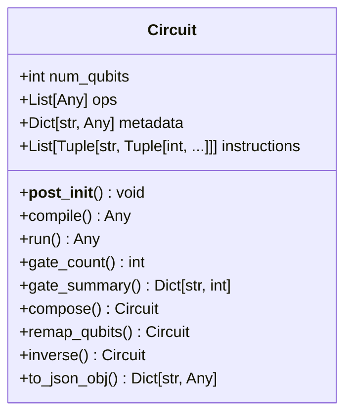
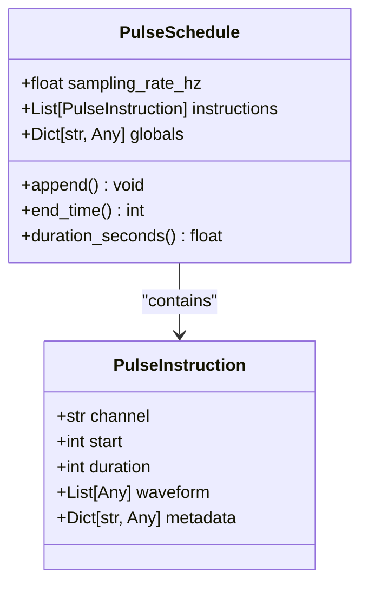
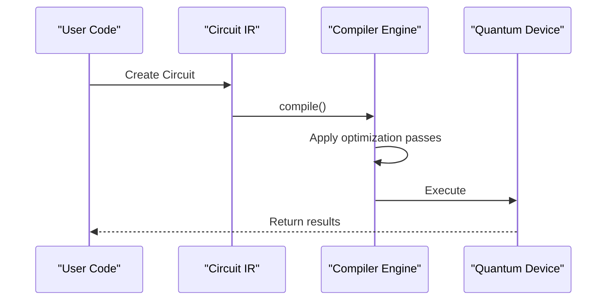
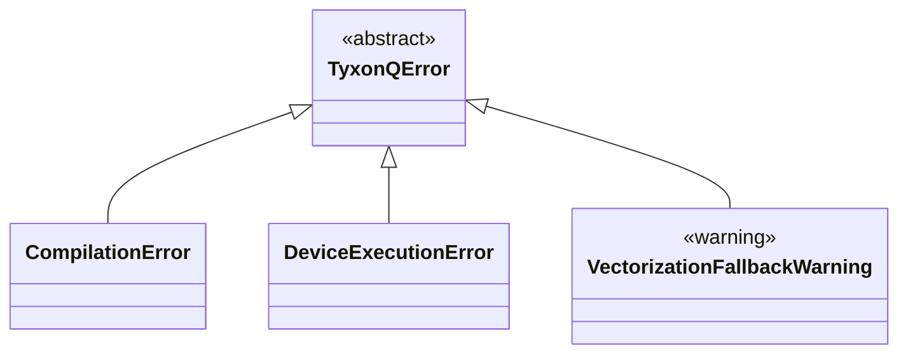

# Intermediate Representation (IR)

<cite>
**Referenced Files in This Document**   
- [circuit.py](file://src/tyxonq/core/ir/circuit.py)
- [pulse.py](file://src/tyxonq/core/ir/pulse.py)
- [core_ir.rst](file://docs-ng/source/next/user/core_ir.rst)
- [errors.py](file://src/tyxonq/core/errors.py)
- [types.py](file://src/tyxonq/core/types.py)
</cite>

## Table of Contents
1. [Introduction](#introduction)
2. [Circuit IR Design](#circuit-ir-design)
3. [Pulse IR Design](#pulse-ir-design)
4. [Instruction Types and Representation](#instruction-types-and-representation)
5. [IR in Compiler Optimization and Device Portability](#ir-in-compiler-optimization-and-device-portability)
6. [Circuit Construction and Manipulation](#circuit-construction-and-manipulation)
7. [IR Stability and System-wide Contract](#ir-stability-and-system-wide-contract)
8. [IR Validation and Error Handling](#ir-validation-and-error-handling)
9. [Conclusion](#conclusion)

## Introduction

The Intermediate Representation (IR) system in TyxonQ serves as the foundational data structure for quantum circuit and pulse-level operations. This document details the design and implementation of the IR system, focusing on the Circuit and Pulse data structures that form the core of the framework's abstraction layer. The IR system enables compiler optimizations, ensures device portability, and maintains stability across compilation stages. It acts as a system-wide contract between different components of the quantum computing stack, from high-level circuit construction to low-level pulse control.

**Section sources**
- [core_ir.rst](file://docs-ng/source/next/user/core_ir.rst#L1-L3)

## Circuit IR Design

The Circuit class is implemented as a dataclass-based IR that encapsulates quantum circuit information. It provides a minimal yet comprehensive representation of quantum circuits with essential attributes including the number of qubits, operations list, and metadata. The design prioritizes structural integrity and validation through the `__post_init__` method, which ensures all qubit indices are within valid range and operations are properly formatted.

The Circuit class supports chainable configuration through methods like `device()` and `postprocessing()`, allowing for fluent API usage. It includes comprehensive validation logic that checks operation types, qubit indices, and instruction formats during initialization. The IR maintains stability by providing a consistent interface regardless of the underlying compilation or execution backend.

**Diagram sources**
- [circuit.py](file://src/tyxonq/core/ir/circuit.py#L48-L778)

**Section sources**
- [circuit.py](file://src/tyxonq/core/ir/circuit.py#L48-L778)

## Pulse IR Design

The Pulse IR system provides low-level control for quantum hardware through precise pulse-level operations. It consists of two primary components: `PulseInstruction` and `PulseSchedule`. The `PulseInstruction` class represents a single pulse operation with attributes for channel, start time, duration, waveform, and metadata. The `PulseSchedule` class manages a collection of timed pulse instructions with a specified sampling rate.

The Pulse IR enables direct manipulation of quantum bit pulse signals for precise quantum control. It supports various waveform types including cosine_drag, flattop, gaussian, and sine waveforms, each with specific parameters for amplitude, duration, and phase control. The system follows a sample-based time convention, remaining backend-agnostic while allowing conversion to physical time units through the sampling rate.

**Diagram sources**
- [pulse.py](file://src/tyxonq/core/ir/pulse.py#L10-L66)

**Section sources**
- [pulse.py](file://src/tyxonq/core/ir/pulse.py#L10-L66)

## Instruction Types and Representation

The IR system supports multiple instruction types that represent different quantum operations. For circuit-level operations, instructions include quantum gates (such as H, RX, RZ, CX), measurements, and reset operations. These are represented as tuples within the operations list, with the first element being the operation name and subsequent elements representing parameters and qubit indices.

For pulse-level operations, instructions are represented by the `PulseInstruction` class, which contains detailed information about hardware channel, timing, and waveform data. The instruction system supports both high-level logical operations and low-level physical control, enabling a seamless transition between abstract circuit design and hardware-specific pulse sequences.

The IR maintains a consistent representation across different instruction types through standardized data structures. Circuit instructions are validated for proper qubit indexing and operation format, while pulse instructions are validated for timing constraints and waveform integrity. This uniform representation enables the compiler to process different instruction types through common optimization passes.

**Section sources**
- [circuit.py](file://src/tyxonq/core/ir/circuit.py#L48-L778)
- [pulse.py](file://src/tyxonq/core/ir/pulse.py#L10-L66)

## IR in Compiler Optimization and Device Portability

The IR serves as a critical abstraction layer that enables compiler optimizations and ensures device portability. By providing a stable intermediate format, the IR allows the compiler to apply various optimization passes such as gate decomposition, circuit simplification, and layout mapping without affecting the original circuit definition.

The system supports multiple compilation targets through the `compile()` method, which can transform the IR into different output formats suitable for various backends. This enables device portability by allowing the same circuit to be executed on different quantum hardware or simulators with minimal modifications. The IR maintains compatibility with external frameworks through adapters like the Qiskit dialect converter.

Compiler optimizations are implemented as stages that operate on the IR, preserving its structural integrity while improving circuit efficiency. These optimizations include lightcone simplification, measurement rewriting, and gate merging. The IR's design ensures that optimization results can be reliably serialized and reconstructed, maintaining consistency across different execution environments.

**Diagram sources**
- [circuit.py](file://src/tyxonq/core/ir/circuit.py#L373-L402)
- [circuit.py](file://src/tyxonq/core/ir/circuit.py#L404-L515)

**Section sources**
- [circuit.py](file://src/tyxonq/core/ir/circuit.py#L373-L515)

## Circuit Construction and Manipulation

The Circuit IR provides multiple methods for constructing and manipulating quantum circuits. Users can build circuits through direct operation appending or through builder-style methods that return the circuit instance for fluent chaining. The IR supports various construction patterns including context manager usage, method chaining, and functional composition.

Circuit manipulation operations include composition, qubit remapping, and inverse generation. The `compose()` method allows combining circuits with optional qubit remapping, while `remap_qubits()` enables reordering of qubit indices. The `inverse()` method generates unitary inverse circuits for supported operations, facilitating quantum algorithm implementation.

The IR also provides analysis helpers such as `gate_count()`, `gate_summary()`, and `count_flop()` for circuit characterization. These methods enable users to understand circuit properties without requiring external dependencies. The system supports JSON serialization through `to_json_obj()` and `to_json_str()` methods, enabling persistent storage and exchange of circuit definitions.

**Section sources**
- [circuit.py](file://src/tyxonq/core/ir/circuit.py#L48-L778)

## IR Stability and System-wide Contract

The IR maintains stability across compilation stages by serving as a system-wide contract between different components of the quantum computing stack. This contract ensures that all stages of the compilation and execution pipeline operate on a consistent data structure, preventing compatibility issues and ensuring predictable behavior.

The stability is enforced through comprehensive validation in the `__post_init__` method, which checks all structural constraints during circuit creation. The IR's design avoids mutable state where possible, using immutable dataclasses and returning new instances for modification operations. This immutability ensures that circuit transformations do not have unintended side effects.

The system-wide contract extends to error handling, serialization, and API compatibility. The IR provides consistent methods for JSON serialization, enabling reliable data exchange between different system components. Its interface remains stable across versions, allowing higher-level applications to depend on the IR without concern for internal implementation changes.

**Section sources**
- [circuit.py](file://src/tyxonq/core/ir/circuit.py#L142-L169)

## IR Validation and Error Handling

The IR system implements robust validation and error handling to ensure circuit integrity and provide meaningful feedback to users. Validation occurs at multiple levels, starting with structural validation in the `__post_init__` method and extending to operation-specific checks during circuit manipulation.

The system defines a hierarchy of error types in `errors.py`, with `TyxonQError` as the base exception class. Specific error types include `CompilationError` for compilation failures and `DeviceExecutionError` for device-level issues. These exceptions provide clear error messages that help users diagnose and fix problems in their circuit definitions.

Validation checks include qubit index bounds, operation format correctness, and instruction validity. For example, the system verifies that all qubit indices are within the valid range and that operations are properly formatted as tuples or lists. The validation process is lightweight but comprehensive, catching common errors while maintaining good performance.

**Diagram sources**
- [errors.py](file://src/tyxonq/core/errors.py#L1-L16)

**Section sources**
- [errors.py](file://src/tyxonq/core/errors.py#L1-L16)
- [circuit.py](file://src/tyxonq/core/ir/circuit.py#L142-L169)

## Conclusion

The Intermediate Representation system in TyxonQ provides a robust foundation for quantum circuit and pulse-level operations. By implementing a dataclass-based design with comprehensive validation, the IR ensures structural integrity while maintaining flexibility for different use cases. The system enables compiler optimizations and device portability through a stable, well-defined contract that spans the entire quantum computing stack.

The Circuit and Pulse IR components work together to support both high-level algorithm development and low-level hardware control. The consistent representation of instructions, comprehensive validation mechanisms, and robust error handling make the IR system reliable and user-friendly. As the central data structure in TyxonQ, the IR plays a crucial role in connecting different components of the quantum computing framework, from circuit construction to execution and analysis.