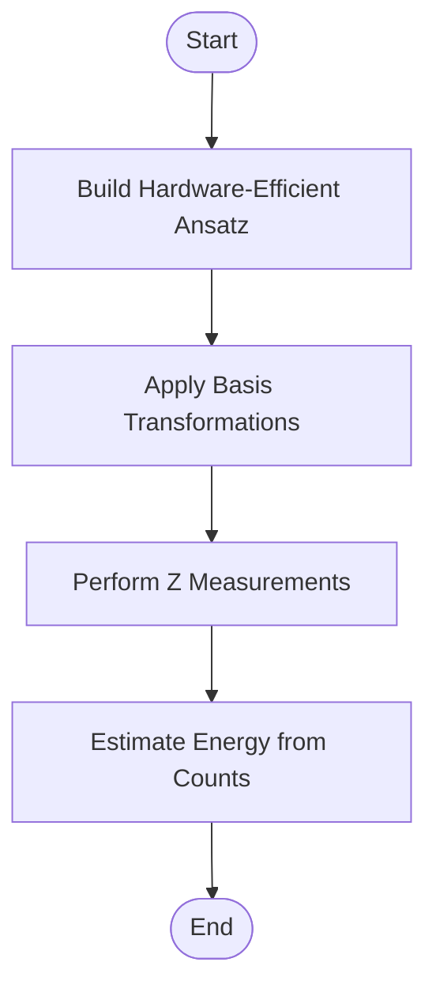
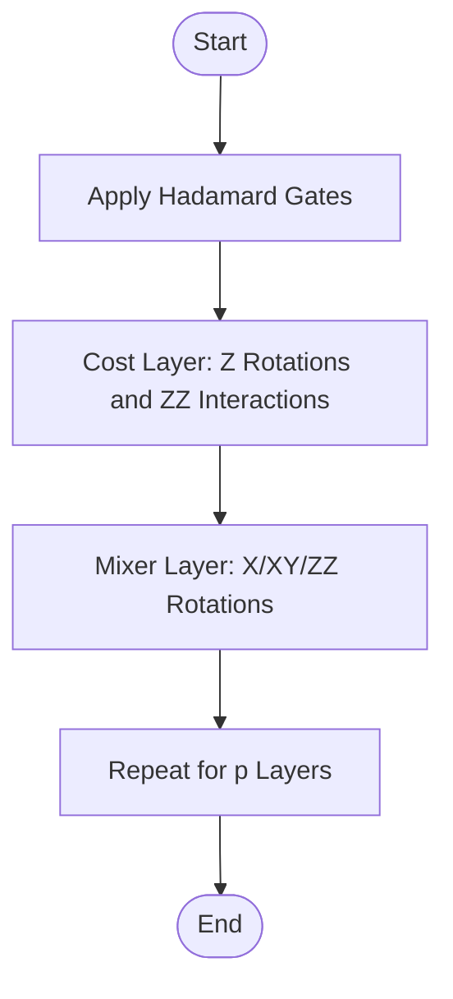
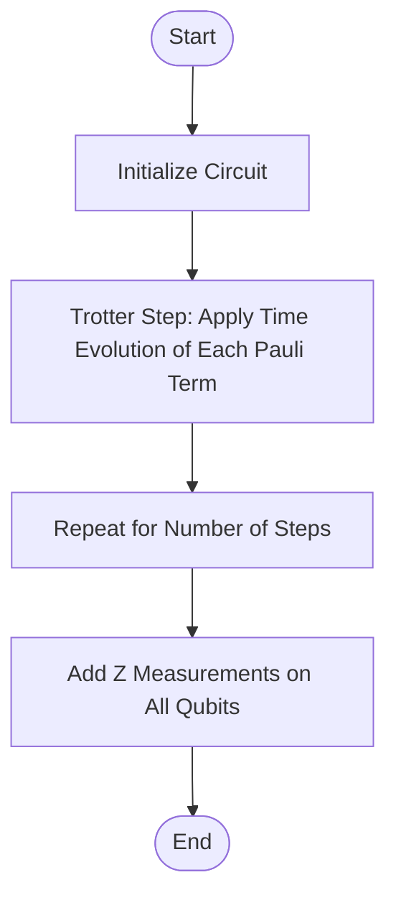
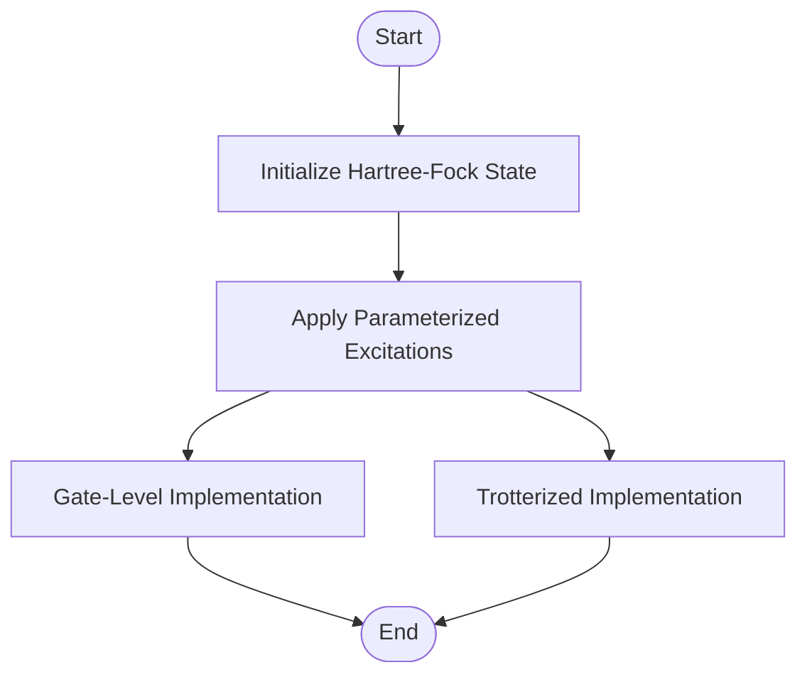

# Circuit Templates

<cite>
**Referenced Files in This Document**   
- [vqe.py](file://src/tyxonq/libs/circuits_library/vqe.py)
- [qaoa_ising.py](file://src/tyxonq/libs/circuits_library/qaoa_ising.py)
- [trotter_circuit.py](file://src/tyxonq/libs/circuits_library/trotter_circuit.py)
- [ucc.py](file://src/tyxonq/libs/circuits_library/ucc.py)
- [variational.py](file://src/tyxonq/libs/circuits_library/variational.py)
- [circuit_chain_demo.py](file://examples/circuit_chain_demo.py)
- [simple_qaoa.py](file://examples/simple_qaoa.py)
- [timeevolution_trotter.py](file://examples/timeevolution_trotter.py)
- [vqe_extra.py](file://examples/vqe_extra.py)
- [cloud_uccsd_hea_demo.py](file://examples/cloud_uccsd_hea_demo.py)
</cite>

## Table of Contents
1. [Introduction](#introduction)
2. [VQE Ansatz Templates](#vqe-ansatz-templates)
3. [QAOA and Ising Model Circuits](#qaoa-and-ising-model-circuits)
4. [Trotter Circuit Generator](#trotter-circuit-generator)
5. [UCC Ansätze](#ucc-ansätze)
6. [Usage Examples via Chain API](#usage-examples-via-chain-api)
7. [Integration with Compiler and Device Constraints](#integration-with-compiler-and-device-constraints)
8. [Customization through Block Composition and Parameter Mapping](#customization-through-block-composition-and-parameter-mapping)

## Introduction
This document provides comprehensive documentation for the Circuit Templates in the TyxonQ framework, focusing on pre-built parameterized quantum circuits. These templates are designed to support a wide range of quantum algorithms, including Variational Quantum Eigensolvers (VQE), Quantum Approximate Optimization Algorithm (QAOA), time evolution simulations via Trotterization, and Unitary Coupled Cluster (UCC) methods. The templates are accessible through a chainable API, enabling seamless integration with compiler optimization passes and device constraints.

**Section sources**
- [vqe.py](file://src/tyxonq/libs/circuits_library/vqe.py)
- [qaoa_ising.py](file://src/tyxonq/libs/circuits_library/qaoa_ising.py)
- [trotter_circuit.py](file://src/tyxonq/libs/circuits_library/trotter_circuit.py)
- [ucc.py](file://src/tyxonq/libs/circuits_library/ucc.py)

## VQE Ansatz Templates
The VQE ansatz templates in TyxonQ support both hardware-efficient and chemistry-inspired structures. The hardware-efficient ansatz is constructed using a sequence of entangling gates (CX) followed by single-qubit rotations (RX, RZ, RX) across multiple layers. The `build_hwe_ansatz_ops` function generates the operations for this ansatz, taking the number of qubits, layers, and parameters as inputs. The length of the parameter list should be 3*n*layers, where n is the number of qubits.

The energy expectation is calculated from measurement counts using the `energy_from_counts` function, which supports Z-terms in the Hamiltonian. The parameter-shift rule is implemented in the `parameter_shift_gradient` function to compute gradients for optimization. The `evaluate_energy` function provides a one-shot evaluation of the energy by building the circuit, applying basis transformations, performing Z measurements, and estimating the energy from the resulting counts.



**Diagram sources**
- [vqe.py](file://src/tyxonq/libs/circuits_library/vqe.py#L22-L40)

**Section sources**
- [vqe.py](file://src/tyxonq/libs/circuits_library/vqe.py#L22-L149)

## QAOA and Ising Model Circuits
The QAOA and Ising model circuits are designed with configurable p-levels and mixer Hamiltonians. The `qaoa_ising` function constructs the QAOA ansatz by first applying Hadamard gates to all qubits, followed by alternating layers of cost and mixer operations. The cost layer includes Z rotations and ZZ interactions (as RZZ), while the mixer layer supports X, XY, and ZZ mixers using RX, RXX, RYY, and RZZ gates. The mixer pairs can be configured for full coupling or a specific pattern.

The function takes the number of qubits, number of layers, Pauli Z terms, weights, parameters, mixer type, and coupling configuration as inputs. The parameters are used to control the rotation angles in both the cost and mixer layers. The circuit is returned as a `Circuit` object with the specified operations.



**Diagram sources**
- [qaoa_ising.py](file://src/tyxonq/libs/circuits_library/qaoa_ising.py#L7-L65)

**Section sources**
- [qaoa_ising.py](file://src/tyxonq/libs/circuits_library/qaoa_ising.py#L7-L65)

## Trotter Circuit Generator
The Trotter circuit generator is used for time evolution simulations with customizable time steps and decomposition methods. The `build_trotter_circuit` function constructs a first-order Trotterized circuit for a Hamiltonian expressed as a sum of Pauli terms. The function supports first-order Trotterization and can handle Pauli terms encoded as lists of integers representing I, X, Y, Z on each qubit.

The circuit is built by applying the time evolution of each Pauli term for a fraction of the total time, determined by the number of Trotter steps. The function takes the Pauli terms, weights, evolution time, number of steps, number of qubits, and order as inputs. The resulting circuit includes Z measurements on all qubits by default.



**Diagram sources**
- [trotter_circuit.py](file://src/tyxonq/libs/circuits_library/trotter_circuit.py#L38-L85)

**Section sources**
- [trotter_circuit.py](file://src/tyxonq/libs/circuits_library/trotter_circuit.py#L38-L85)

## UCC Ansätze
The UCC ansätze include UCCSD and generalized UCC templates with excitation operators. The `build_ucc_circuit` function constructs the UCC circuit by first initializing the Hartree-Fock state or using a user-provided initial state. The circuit then applies parameterized excitations based on the specified excitation operators and parameters.

The function supports both gate-level and Trotterized implementations of the excitations. For gate-level implementation, the excitations are applied using a sequence of CX, CZ, and CRY gates. For Trotterized implementation, the excitations are applied as Pauli evolutions. The function takes the parameters, number of qubits, number of electrons, excitation operators, parameter IDs, mode, initial state, decomposition of multi-control gates, and Trotter flag as inputs.



**Diagram sources**
- [ucc.py](file://src/tyxonq/libs/circuits_library/ucc.py#L82-L122)

**Section sources**
- [ucc.py](file://src/tyxonq/libs/circuits_library/ucc.py#L82-L122)

## Usage Examples via Chain API
The Chain API in TyxonQ provides a fluent interface for constructing and executing quantum circuits. Examples include building a VQE ansatz, QAOA circuit, or Trotter circuit and executing them with specific device and postprocessing configurations. The API supports automatic completion of missing configurations, allowing users to specify only the necessary options.

For example, a QAOA circuit can be constructed and executed with a single chain of method calls:
```python
result = (
    Circuit(n).h(0).cx(0, 1)
    .compile(compile_engine="qiskit")
    .device(provider="simulator", device="statevector", shots=1024)
    .postprocessing(method="none")
    .run()
)
```

**Section sources**
- [circuit_chain_demo.py](file://examples/circuit_chain_demo.py#L0-L304)
- [simple_qaoa.py](file://examples/simple_qaoa.py#L0-L192)

## Integration with Compiler and Device Constraints
The circuit templates are designed to integrate seamlessly with compiler optimization passes and device constraints. The Chain API allows users to specify compiler options, device providers, and postprocessing methods. The compiler can optimize the circuit for specific hardware constraints, such as gate set and connectivity. The device provider and device name determine the execution environment, whether it is a local simulator or a remote quantum device.

**Section sources**
- [circuit_chain_demo.py](file://examples/circuit_chain_demo.py#L0-L304)
- [vqe_extra.py](file://examples/vqe_extra.py#L0-L195)

## Customization through Block Composition and Parameter Mapping
The circuit templates support customization through block composition and parameter mapping. Users can compose multiple circuit blocks, such as ansatz layers and measurement operations, and map parameters to specific gates. The `compose` method allows combining circuits with different qubit mappings, while the `remap_qubits` method enables reordering of qubits. Parameter mapping is handled through the `params` argument in the template functions, allowing flexible assignment of parameters to gates.

**Section sources**
- [circuit_chain_demo.py](file://examples/circuit_chain_demo.py#L0-L304)
- [variational.py](file://src/tyxonq/libs/circuits_library/variational.py#L152-L251)