# Hamiltonian Encoding

<cite>
**Referenced Files in This Document**   
- [fermion_to_qubit.py](file://src/tyxonq/libs/hamiltonian_encoding/fermion_to_qubit.py)
- [operator_encoding.py](file://src/tyxonq/libs/hamiltonian_encoding/operator_encoding.py)
- [pauli_io.py](file://src/tyxonq/libs/hamiltonian_encoding/pauli_io.py)
- [hamiltonian_grouping.py](file://src/tyxonq/libs/hamiltonian_encoding/hamiltonian_grouping.py)
- [gray_binary_encoding.py](file://src/tyxonq/libs/hamiltonian_encoding/gray_binary_encoding.py)
- [hamiltonian_building.py](file://examples/hamiltonian_building.py)
</cite>

## Table of Contents
1. [Introduction](#introduction)
2. [Fermionic-to-Qubit Mappings](#fermionic-to-qubit-mappings)
3. [Operator Encoding Utilities](#operator-encoding-utilities)
4. [Pauli Operator I/O and Representations](#pauli-operator-io-and-representations)
5. [Hamiltonian Grouping and Measurement Optimization](#hamiltonian-grouping-and-measurement-optimization)
6. [Usage Examples with chem_libs Integration](#usage-examples-with-chem_libs-integration)
7. [Performance Considerations for Large Hamiltonians](#performance-considerations-for-large-hamiltonians)
8. [Integration with Compiler Pipeline](#integration-with-compiler-pipeline)
9. [Conclusion](#conclusion)

## Introduction
The Hamiltonian Encoding module in TyxonQ provides a comprehensive framework for transforming fermionic and bosonic operators into qubit representations suitable for quantum algorithms. This system supports multiple fermion-to-qubit mappings, Pauli operator manipulation, and efficient I/O operations for interoperability with quantum chemistry libraries and quantum computing frameworks. The design enables seamless integration between high-level problem specifications and low-level quantum circuit compilation.

**Section sources**
- [fermion_to_qubit.py](file://src/tyxonq/libs/hamiltonian_encoding/fermion_to_qubit.py#L1-L99)
- [operator_encoding.py](file://src/tyxonq/libs/hamiltonian_encoding/operator_encoding.py#L1-L346)

## Fermionic-to-Qubit Mappings
The `fermion_to_qubit` module implements three primary fermionic-to-qubit transformations: Jordan-Wigner, Parity, and Bravyi-Kitaev mappings. Each mapping offers distinct trade-offs in terms of qubit count, Pauli string locality, and operator structure.

### Jordan-Wigner Transformation
The Jordan-Wigner transformation maps fermionic creation and annihilation operators to Pauli operators using non-local string operators that enforce fermionic anti-commutation relations. This mapping preserves the locality of single-particle operators but results in non-local Pauli strings for two-particle interactions.

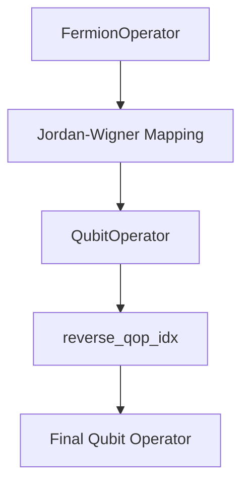

**Diagram sources**
- [fermion_to_qubit.py](file://src/tyxonq/libs/hamiltonian_encoding/fermion_to_qubit.py#L78-L88)

### Parity Mapping with Two-Qubit Reduction
The Parity mapping transforms fermionic operators by encoding occupation parity information into qubit states. This approach enables two-qubit reduction under electron number conservation, effectively reducing the total qubit count required for quantum simulations.

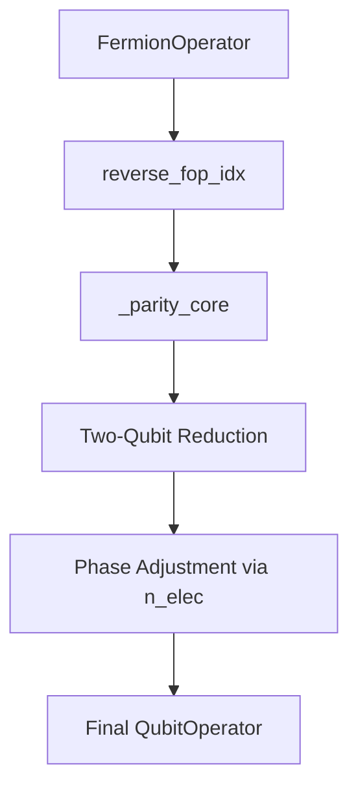

**Diagram sources**
- [fermion_to_qubit.py](file://src/tyxonq/libs/hamiltonian_encoding/fermion_to_qubit.py#L34-L75)

### Bravyi-Kitaev and Binary Mappings
The Bravyi-Kitaev transformation offers logarithmic-depth Pauli strings for certain operators by leveraging a more complex encoding scheme than Jordan-Wigner. The Binary transformation with checksum code provides additional qubit savings through parity constraints.

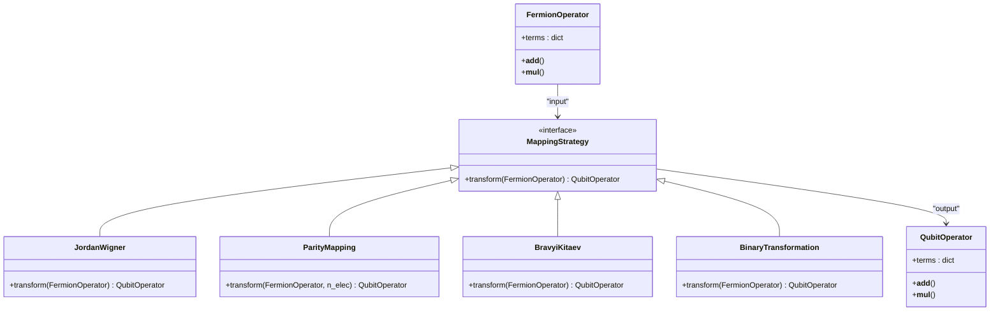

**Diagram sources**
- [fermion_to_qubit.py](file://src/tyxonq/libs/hamiltonian_encoding/fermion_to_qubit.py#L1-L99)

**Section sources**
- [fermion_to_qubit.py](file://src/tyxonq/libs/hamiltonian_encoding/fermion_to_qubit.py#L1-L99)

## Operator Encoding Utilities
The operator encoding utilities provide functions for constructing Pauli strings from fermionic operators and converting between different representations.

### Direct Operator Encoding
The `qubit_encode_op` function transforms elementary operators into qubit representations using direct encoding for spin and electron basis sets.

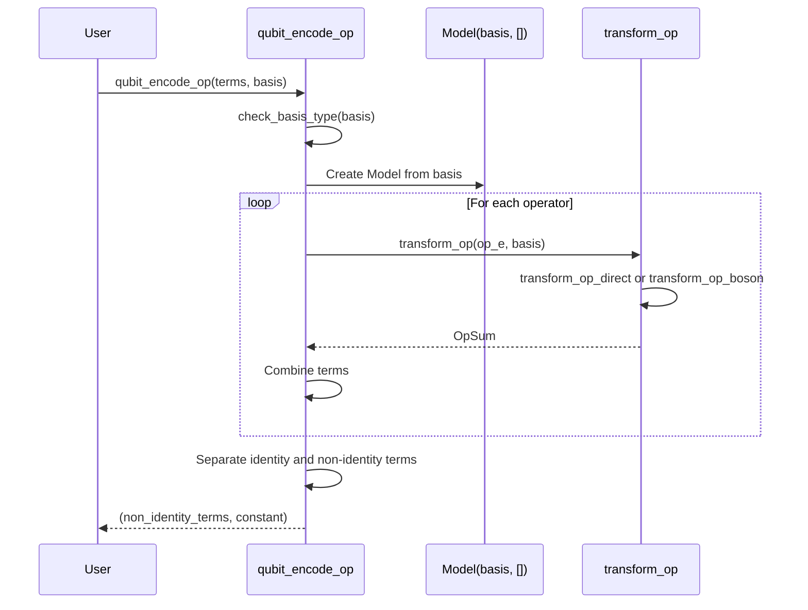

**Diagram sources**
- [operator_encoding.py](file://src/tyxonq/libs/hamiltonian_encoding/operator_encoding.py#L59-L87)

### Bosonic Operator Encoding
Bosonic operators are encoded using various schemes including unary, binary, and Gray code representations. The choice of encoding affects the number of qubits required and the complexity of the resulting Pauli strings.

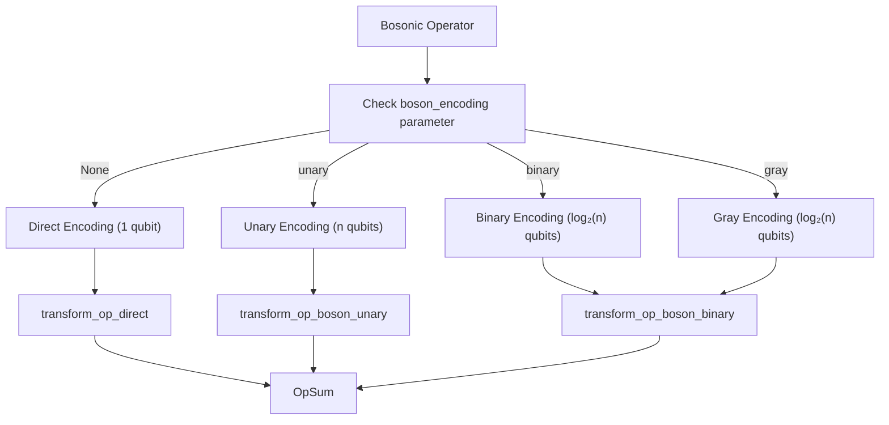

**Diagram sources**
- [operator_encoding.py](file://src/tyxonq/libs/hamiltonian_encoding/operator_encoding.py#L124-L200)

### Basis Encoding
The `qubit_encode_basis` function transforms a list of basis sets into qubit representations, handling both fermionic and bosonic degrees of freedom.

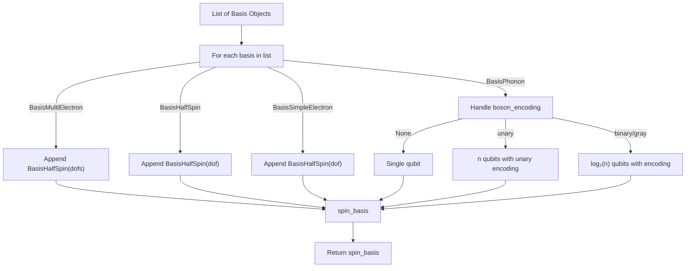

**Diagram sources**
- [operator_encoding.py](file://src/tyxonq/libs/hamiltonian_encoding/operator_encoding.py#L102-L122)

**Section sources**
- [operator_encoding.py](file://src/tyxonq/libs/hamiltonian_encoding/operator_encoding.py#L1-L346)

## Pauli Operator I/O and Representations
The `pauli_io` module provides utilities for reading and writing Hamiltonians in various formats, including OpenFermion and QASM-compatible expressions.

### OpenFermion Integration
The module supports conversion between FermionOperator and sparse matrix representations, enabling interoperability with OpenFermion workflows.

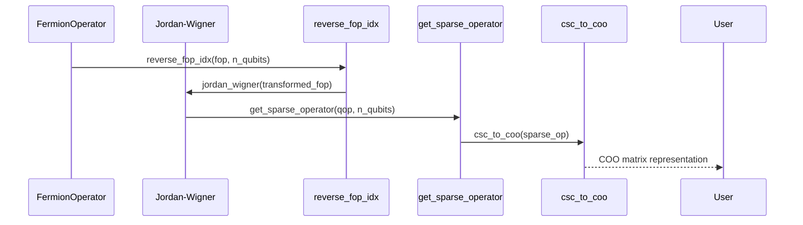

**Diagram sources**
- [pauli_io.py](file://src/tyxonq/libs/hamiltonian_encoding/pauli_io.py#L61-L65)

### QASM-Compatible Output
The `qop_to_qiskit` function converts QubitOperator instances into Qiskit's SparsePauliOp format, enabling execution on Qiskit-based backends.

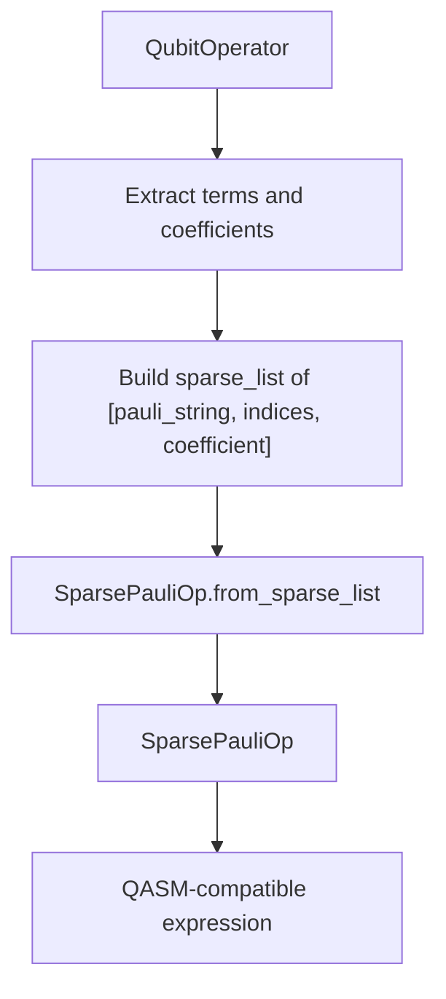

**Diagram sources**
- [pauli_io.py](file://src/tyxonq/libs/hamiltonian_encoding/pauli_io.py#L75-L83)

### Index Reversal Utilities
The module includes utilities for reversing qubit indices to handle endianness differences between various quantum computing frameworks.

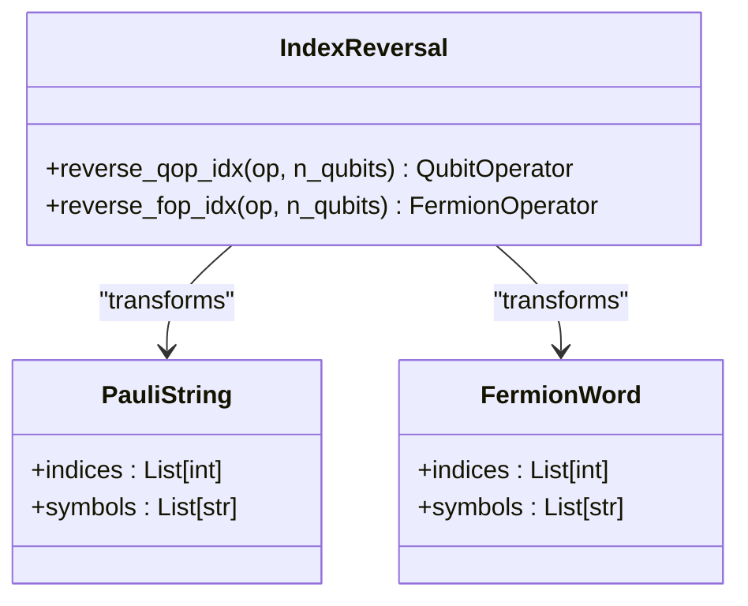

**Section sources**
- [pauli_io.py](file://src/tyxonq/libs/hamiltonian_encoding/pauli_io.py#L1-L208)

## Hamiltonian Grouping and Measurement Optimization
The hamiltonian_grouping module provides functionality for grouping compatible Pauli terms to minimize measurement overhead in variational quantum algorithms.

### Term Grouping Algorithm
The grouping algorithm partitions Pauli terms into sets that can be measured simultaneously, reducing the number of required circuit executions.

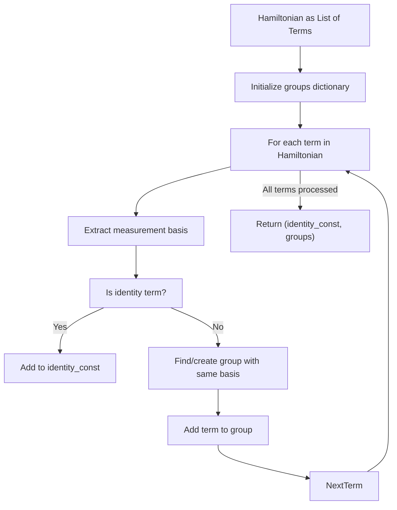

**Diagram sources**
- [hamiltonian_grouping.py](file://src/tyxonq/libs/hamiltonian_encoding/hamiltonian_grouping.py#L11-L44)

### Measurement Basis Compatibility
Terms are grouped based on their measurement basis requirements, where two terms can be measured simultaneously if they share the same Pauli operator on each qubit.

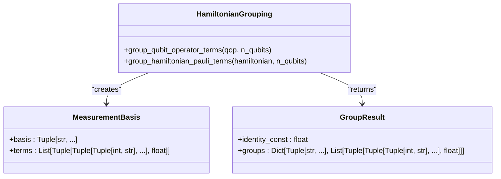

**Section sources**
- [hamiltonian_grouping.py](file://src/tyxonq/libs/hamiltonian_encoding/hamiltonian_grouping.py#L1-L66)

## Usage Examples with chem_libs Integration
The following example demonstrates the conversion of electronic Hamiltonians to qubit operators using chem_libs and hamiltonian_encoding together.

### Electronic Hamiltonian Construction
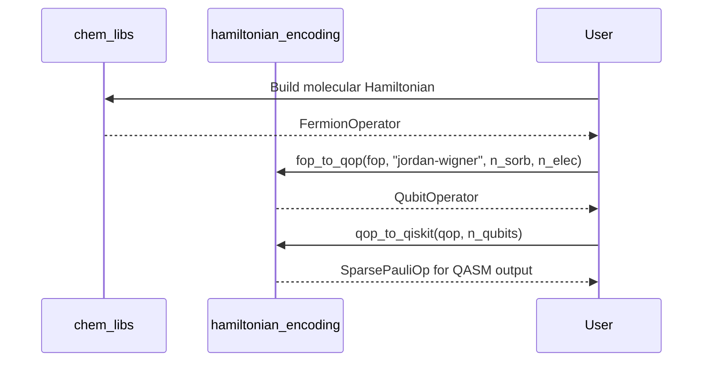

**Section sources**
- [hamiltonian_building.py](file://examples/hamiltonian_building.py#L1-L94)
- [fermion_to_qubit.py](file://src/tyxonq/libs/hamiltonian_encoding/fermion_to_qubit.py#L78-L88)
- [pauli_io.py](file://src/tyxonq/libs/hamiltonian_encoding/pauli_io.py#L75-L83)

## Performance Considerations for Large Hamiltonians
When handling large Hamiltonians, several performance considerations must be addressed:

### Memory Efficiency
- Use sparse representations (COO format) for large Hamiltonians to minimize memory footprint
- Leverage the `fop_to_coo` function for direct conversion from FermionOperator to sparse matrix
- Consider iterative processing of Hamiltonian terms when memory is constrained

### Computational Complexity
- Jordan-Wigner mapping produces longer Pauli strings but has O(1) transformation complexity per term
- Parity and Bravyi-Kitaev mappings offer better locality for certain operators but require more complex transformations
- Binary and Gray encodings reduce qubit count but increase the complexity of operator transformations

### Parallel Processing
- Utilize vectorized operations in NumPy for coefficient manipulations
- Consider batch processing of similar operator types
- Leverage sparse matrix operations for efficient Hamiltonian arithmetic

**Section sources**
- [pauli_io.py](file://src/tyxonq/libs/hamiltonian_encoding/pauli_io.py#L1-L208)
- [operator_encoding.py](file://src/tyxonq/libs/hamiltonian_encoding/operator_encoding.py#L1-L346)

## Integration with Compiler Pipeline
The Hamiltonian encoding system integrates with the compiler pipeline for measurement grouping and circuit optimization.

### Measurement Grouping in Compiler
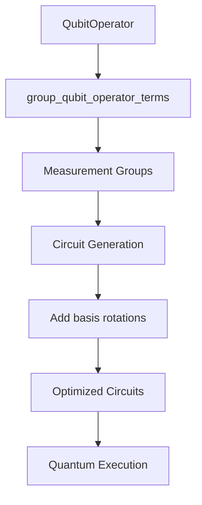

**Section sources**
- [hamiltonian_grouping.py](file://src/tyxonq/libs/hamiltonian_encoding/hamiltonian_grouping.py#L1-L66)
- [fermion_to_qubit.py](file://src/tyxonq/libs/hamiltonian_encoding/fermion_to_qubit.py#L1-L99)

### End-to-End Workflow
The complete workflow from molecular specification to executable quantum circuits involves:
1. Molecular Hamiltonian construction using chem_libs
2. Fermion-to-qubit transformation using selected mapping
3. Pauli operator grouping for measurement optimization
4. Circuit generation with appropriate basis rotations
5. Compiler optimization and backend-specific compilation

**Section sources**
- [fermion_to_qubit.py](file://src/tyxonq/libs/hamiltonian_encoding/fermion_to_qubit.py#L1-L99)
- [operator_encoding.py](file://src/tyxonq/libs/hamiltonian_encoding/operator_encoding.py#L1-L346)
- [pauli_io.py](file://src/tyxonq/libs/hamiltonian_encoding/pauli_io.py#L1-L208)
- [hamiltonian_grouping.py](file://src/tyxonq/libs/hamiltonian_encoding/hamiltonian_grouping.py#L1-L66)

## Conclusion
The Hamiltonian Encoding module in TyxonQ provides a robust framework for transforming fermionic and bosonic operators into qubit representations suitable for quantum algorithms. With support for multiple fermion-to-qubit mappings, efficient operator encoding utilities, and seamless integration with quantum chemistry libraries, this system enables researchers to efficiently prepare Hamiltonians for quantum simulation. The inclusion of measurement grouping and performance optimizations ensures that the framework can handle both small-scale demonstrations and large-scale quantum chemistry calculations.