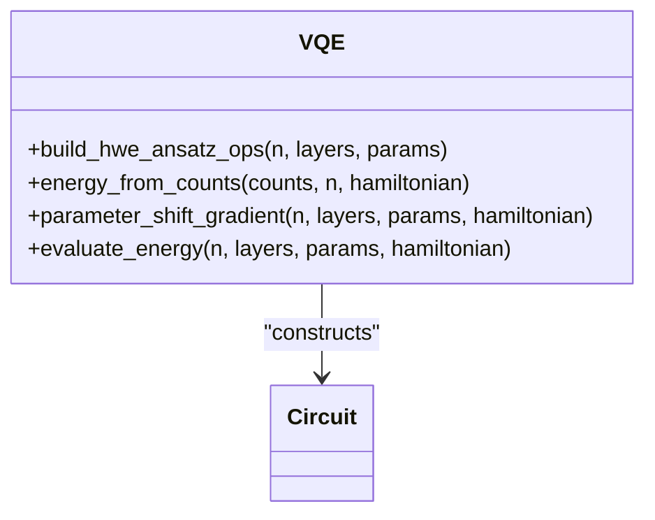
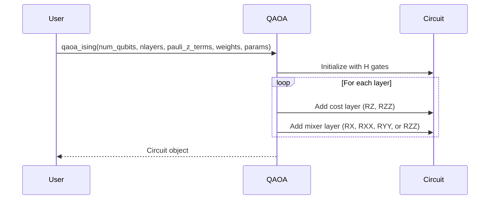
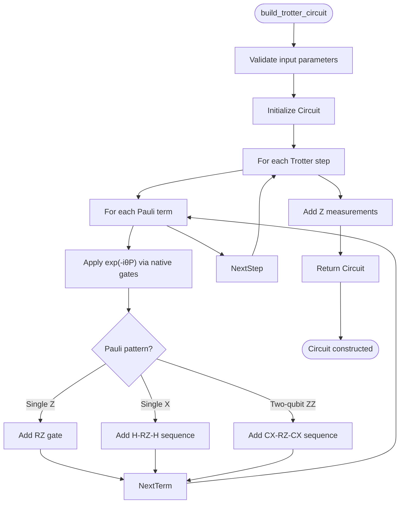
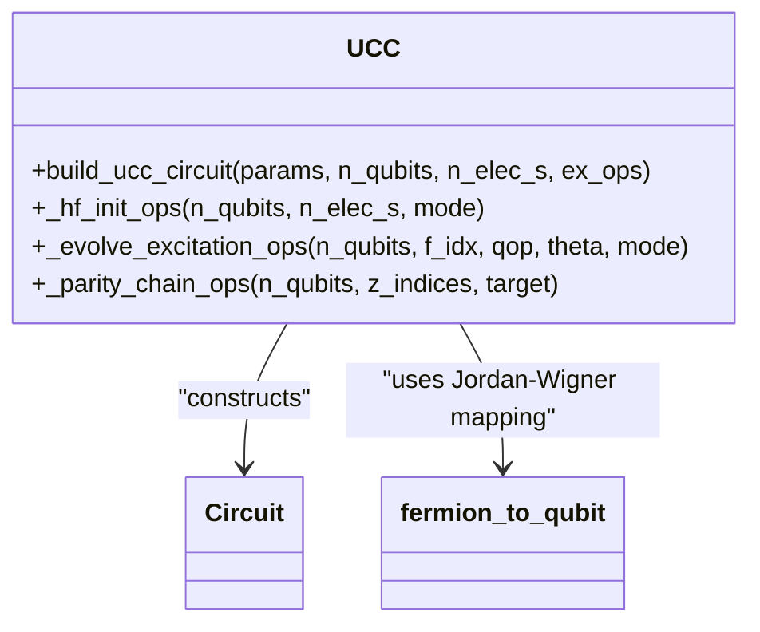
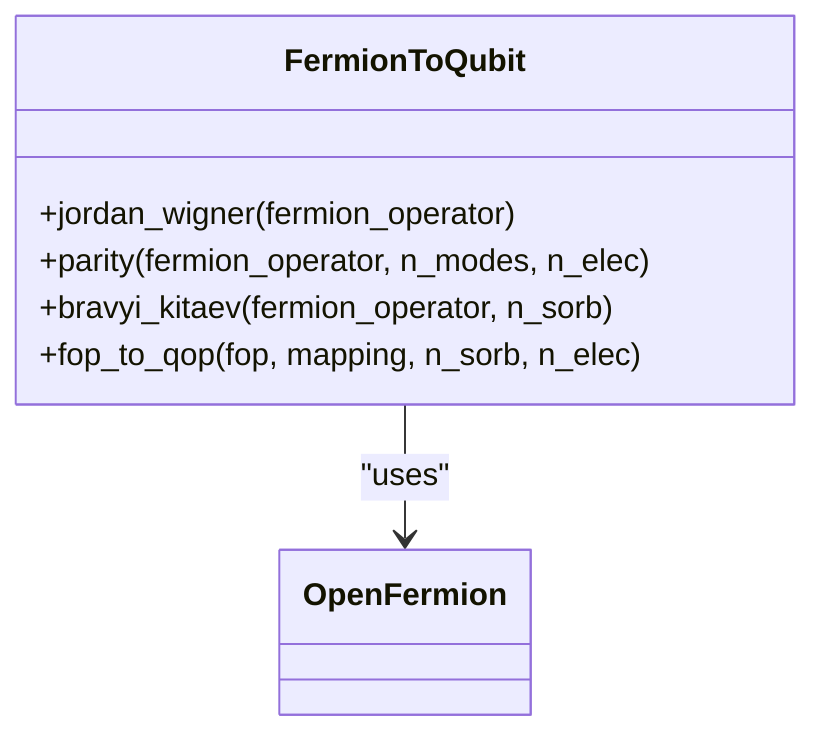
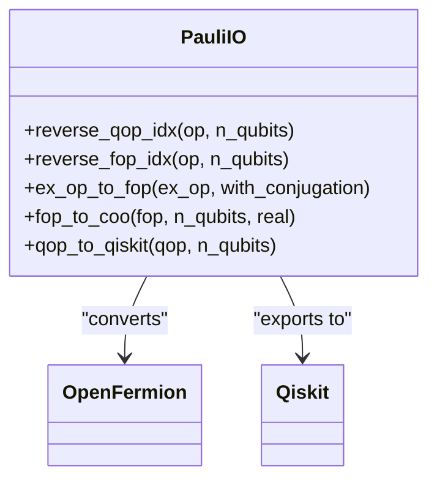
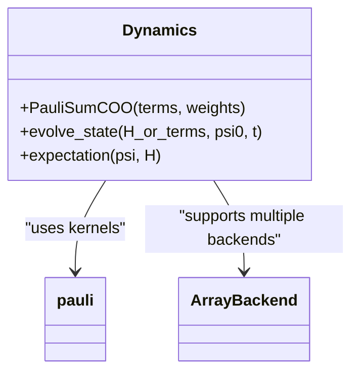
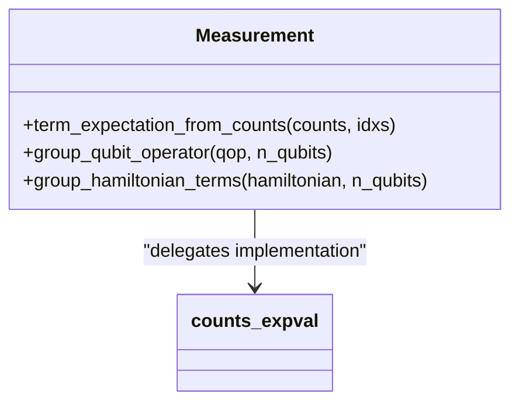

# Libraries and Reusable Components

<cite>
**Referenced Files in This Document**   
- [vqe.py](file://src/tyxonq/libs/circuits_library/vqe.py)
- [qaoa_ising.py](file://src/tyxonq/libs/circuits_library/qaoa_ising.py)
- [trotter_circuit.py](file://src/tyxonq/libs/circuits_library/trotter_circuit.py)
- [ucc.py](file://src/tyxonq/libs/circuits_library/ucc.py)
- [fermion_to_qubit.py](file://src/tyxonq/libs/hamiltonian_encoding/fermion_to_qubit.py)
- [pauli_io.py](file://src/tyxonq/libs/hamiltonian_encoding/pauli_io.py)
- [dynamics.py](file://src/tyxonq/libs/quantum_library/dynamics.py)
- [measurement.py](file://src/tyxonq/libs/quantum_library/measurement.py)
- [utils.py](file://src/tyxonq/libs/circuits_library/utils.py)
- [simple_qaoa.py](file://examples/simple_qaoa.py)
- [hamiltonian_building.py](file://examples/hamiltonian_building.py)
- [timeevolution_trotter.py](file://examples/timeevolution_trotter.py)
- [cloud_uccsd_hea_demo.py](file://examples/cloud_uccsd_hea_demo.py)
</cite>

## Table of Contents
1. [Introduction](#introduction)
2. [Circuit Library](#circuit-library)
3. [Hamiltonian Encoding Library](#hamiltonian-encoding-library)
4. [Quantum Library](#quantum-library)
5. [Integration with Core Framework](#integration-with-core-framework)
6. [Customization and Extension](#customization-and-extension)
7. [Conclusion](#conclusion)

## Introduction
The TyxonQ framework provides a comprehensive suite of reusable quantum components designed to accelerate quantum algorithm development. This document details the pre-built libraries for quantum routines, focusing on standardized templates for variational algorithms, Hamiltonian transformations, and numerical kernels. These components are engineered for modularity, enabling seamless integration with the core framework while supporting customization for advanced use cases.

## Circuit Library
The Circuit Library provides parameterized ansatz templates for prominent quantum algorithms, including VQE, QAOA, Trotter time evolution, and UCC methods. These templates generate quantum circuits using the framework's intermediate representation (IR), ensuring compatibility across different execution backends.

### VQE Ansatz Templates
The VQE module offers tools for constructing hardware-efficient ansätze and computing energy expectations from measurement counts. It implements the parameter-shift rule for gradient computation, supporting variational optimization workflows.

**Diagram sources**
- [vqe.py](file://src/tyxonq/libs/circuits_library/vqe.py#L20-L150)

**Section sources**
- [vqe.py](file://src/tyxonq/libs/circuits_library/vqe.py#L1-L153)

### QAOA/Ising Ansatz Construction
The QAOA module specializes in constructing Quantum Approximate Optimization Algorithm circuits for Ising-type Hamiltonians. It supports various mixer types (X, XY, ZZ) and flexible coupling patterns, enabling implementation of combinatorial optimization algorithms.

**Diagram sources**
- [qaoa_ising.py](file://src/tyxonq/libs/circuits_library/qaoa_ising.py#L10-L68)

**Section sources**
- [qaoa_ising.py](file://src/tyxonq/libs/circuits_library/qaoa_ising.py#L1-L69)
- [simple_qaoa.py](file://examples/simple_qaoa.py#L50-L80)

### Trotter Time Evolution
The Trotter module implements first-order Trotterization for quantum dynamics simulation. It constructs circuits that approximate the time evolution operator exp(-iHt) by decomposing the Hamiltonian into Pauli terms and applying corresponding unitary operations sequentially.

**Diagram sources**
- [trotter_circuit.py](file://src/tyxonq/libs/circuits_library/trotter_circuit.py#L50-L90)

**Section sources**
- [trotter_circuit.py](file://src/tyxonq/libs/circuits_library/trotter_circuit.py#L1-L92)
- [timeevolution_trotter.py](file://examples/timeevolution_trotter.py#L1-L50)

### UCC Ansatz Templates
The UCC module provides Unitary Coupled Cluster circuit construction for quantum chemistry applications. It supports various excitation types and mapping modes (fermion, qubit, HCB), with options for Trotterized evolution or gate-level implementation.

**Diagram sources**
- [ucc.py](file://src/tyxonq/libs/circuits_library/ucc.py#L100-L120)

**Section sources**
- [ucc.py](file://src/tyxonq/libs/circuits_library/ucc.py#L1-L129)
- [cloud_uccsd_hea_demo.py](file://examples/cloud_uccsd_hea_demo.py#L1-L30)

## Hamiltonian Encoding Library
The Hamiltonian Encoding library provides tools for fermion-to-qubit mappings and Pauli operator manipulation, essential for quantum chemistry simulations and Hamiltonian analysis.

### Fermion-to-Qubit Mappings
The library implements several fermionic encoding schemes, including Jordan-Wigner, Parity, and Bravyi-Kitaev transformations. These mappings convert fermionic operators to qubit operators while preserving the algebraic structure.

**Diagram sources**
- [fermion_to_qubit.py](file://src/tyxonq/libs/hamiltonian_encoding/fermion_to_qubit.py#L10-L90)

**Section sources**
- [fermion_to_qubit.py](file://src/tyxonq/libs/hamiltonian_encoding/fermion_to_qubit.py#L1-L99)
- [hamiltonian_building.py](file://examples/hamiltonian_building.py#L1-L20)

### Pauli Operator Manipulation
The library provides utilities for Pauli operator I/O, sparse representations, and index manipulations. These tools facilitate the construction and analysis of Hamiltonians in the qubit basis.

**Diagram sources**
- [pauli_io.py](file://src/tyxonq/libs/hamiltonian_encoding/pauli_io.py#L50-L100)

**Section sources**
- [pauli_io.py](file://src/tyxonq/libs/hamiltonian_encoding/pauli_io.py#L1-L208)

## Quantum Library
The Quantum Library provides numeric kernels for quantum dynamics simulation and measurement processing, enabling classical simulation of quantum systems.

### Dynamics Simulation
The dynamics module offers tools for simulating quantum time evolution and computing expectation values. It includes a lightweight adapter for Pauli-sum Hamiltonians and basic ODE integration methods.

**Diagram sources**
- [dynamics.py](file://src/tyxonq/libs/quantum_library/dynamics.py#L50-L100)

**Section sources**
- [dynamics.py](file://src/tyxonq/libs/quantum_library/dynamics.py#L1-L146)

### Measurement Processing
The measurement module provides functions for computing expectation values from measurement counts and grouping compatible observables. These utilities support efficient post-processing of quantum measurement results.

**Diagram sources**
- [measurement.py](file://src/tyxonq/libs/quantum_library/measurement.py#L10-L40)

**Section sources**
- [measurement.py](file://src/tyxonq/libs/quantum_library/measurement.py#L1-L52)

## Integration with Core Framework
The libraries integrate seamlessly with the core framework components through standardized interfaces. Circuit templates generate IR-compatible operations that can be compiled and executed on various backends. Hamiltonian encoding functions work with OpenFermion operators, enabling interoperability with quantum chemistry packages. Numeric kernels support multiple array backends (NumPy, CuPy, PyTorch), allowing flexible simulation configurations.

## Customization and Extension
Advanced users can extend the libraries by implementing custom templates and mappings. The modular design allows for the addition of new ansatz types, fermionic encodings, and numerical methods. Users can subclass existing components or create new modules following the established patterns for parameterized circuit construction and operator manipulation.

## Conclusion
The TyxonQ libraries provide a comprehensive set of reusable components for quantum algorithm development. By offering standardized implementations of common quantum routines, these libraries reduce development time and ensure consistency across applications. The modular architecture supports both straightforward usage for beginners and extensive customization for advanced researchers, making them valuable tools for quantum computing research and development.