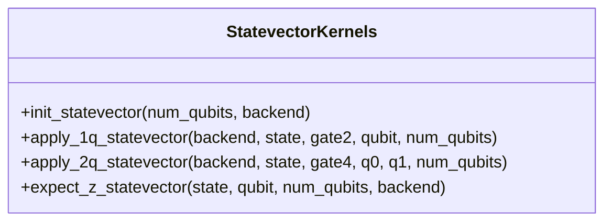
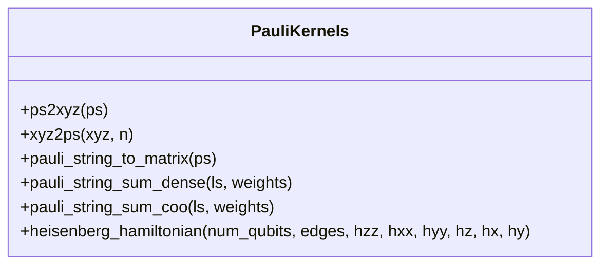
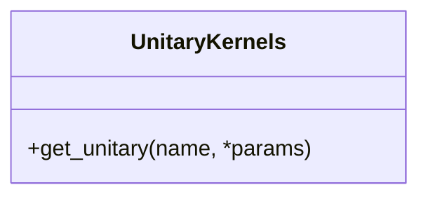
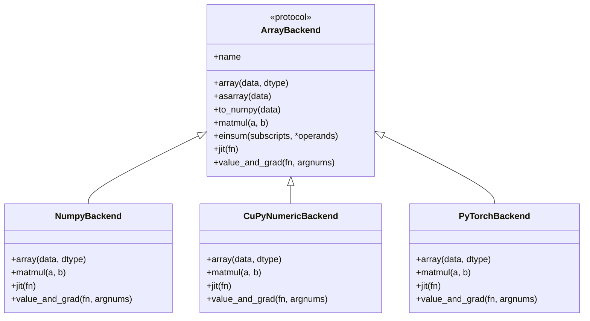
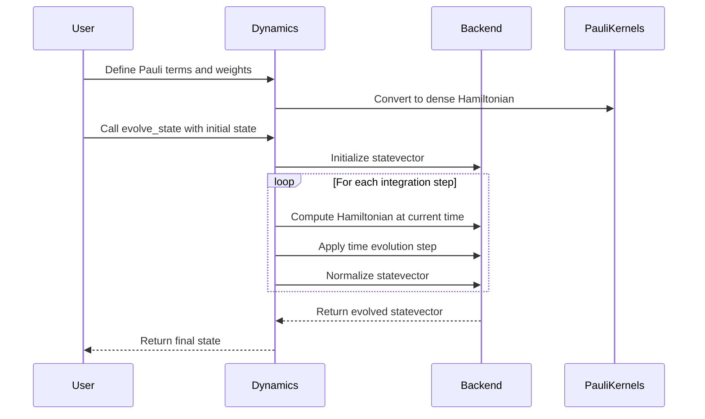
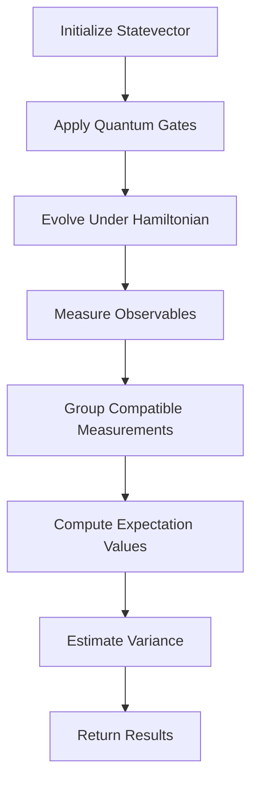

# Quantum Kernels

<cite>
**Referenced Files in This Document**   
- [dynamics.py](file://src/tyxonq/libs/quantum_library/dynamics.py)
- [measurement.py](file://src/tyxonq/libs/quantum_library/measurement.py)
- [statevector.py](file://src/tyxonq/libs/quantum_library/kernels/statevector.py)
- [pauli.py](file://src/tyxonq/libs/quantum_library/kernels/pauli.py)
- [unitary.py](file://src/tyxonq/libs/quantum_library/kernels/unitary.py)
- [numpy_backend.py](file://src/tyxonq/numerics/backends/numpy_backend.py)
- [cupynumeric_backend.py](file://src/tyxonq/numerics/backends/cupynumeric_backend.py)
- [pytorch_backend.py](file://src/tyxonq/numerics/backends/pytorch_backend.py)
- [api.py](file://src/tyxonq/numerics/api.py)
- [context.py](file://src/tyxonq/numerics/context.py)
</cite>

## Table of Contents
1. [Introduction](#introduction)
2. [Dynamics Module](#dynamics-module)
3. [Measurement Module](#measurement-module)
4. [Kernel Implementations](#kernel-implementations)
5. [Numerics Backend Integration](#numerics-backend-integration)
6. [Usage Examples](#usage-examples)
7. [Extending Kernels](#extending-kernels)

## Introduction
The Quantum Kernels system provides a suite of low-level numerical operations and simulation primitives for quantum computing workflows. It is designed to support efficient quantum state evolution, measurement processing, and kernel-level operations across various simulation backends. The architecture is modular, separating concerns between dynamics simulation, measurement computation, and low-level kernel implementations for statevector propagation and unitary synthesis. This document details the core components of the system, focusing on the dynamics and measurement modules, kernel implementations, and integration with the numerics backend for performance optimization.

## Dynamics Module
The dynamics module provides utilities for simulating quantum time evolution using Trotter-Suzuki decompositions and exact diagonalization methods. It enables integration of Schrödinger dynamics for small statevectors under time-dependent Hamiltonians through a basic ODE stepper. The module supports multiple representations of Hamiltonians, including dense matrices, Pauli-term lists with optional weights, and callable functions that return instantaneous Hamiltonians.

The `PauliSumCOO` class serves as a lightweight adapter for Pauli-sum Hamiltonians, allowing conversion between dense matrix representations and COO-like sparse data formats. This facilitates efficient handling of Hamiltonians for small quantum systems. The `evolve_state` function implements a fixed-step integration scheme (currently Euler method) to solve the time-dependent Schrödinger equation dψ/dt = -i H(t) ψ, returning the evolved, normalized statevector. The module also provides the `expectation` function for computing dense expectation values ⟨ψ|H|ψ⟩ in small systems where the Hamiltonian is explicitly dense.

**Section sources**
- [dynamics.py](file://src/tyxonq/libs/quantum_library/dynamics.py#L1-L145)

## Measurement Module
The measurement module handles expectation value computation, variance estimation, and shot sampling with different observables. It provides functions for processing measurement outcomes and computing expectation values from bitstring counts. The module includes deprecated functions that have been moved to the postprocessing package, maintaining backward compatibility while encouraging the use of updated implementations.

The `term_expectation_from_counts` function computes expectation values from measurement counts, though it is now deprecated in favor of implementations in the postprocessing module. The module also contains deprecated grouping functions for qubit operators and Hamiltonian terms, which have been superseded by the compiler's measurement rewriting pass. These functions were used to group measurement terms by non-overlapping wires with basis tags, enabling efficient shot reuse and measurement scheduling.

**Section sources**
- [measurement.py](file://src/tyxonq/libs/quantum_library/measurement.py#L1-L51)

## Kernel Implementations
The kernel implementations provide low-level primitives for statevector propagation, Pauli measurements, and unitary synthesis used across quantum simulators. These kernels are optimized for performance and support various quantum operations essential for simulation.

### Statevector Kernels
The statevector kernels implement fundamental operations for manipulating quantum statevectors. The `init_statevector` function creates an initial statevector for a given number of qubits, typically starting in the |0⟩ state. The `apply_1q_statevector` and `apply_2q_statevector` functions apply single-qubit and two-qubit gates to a statevector using tensor contractions via the einsum operation. These functions handle the reshaping of statevectors into multi-dimensional arrays and apply gate operations through Einstein summation notation. The `expect_z_statevector` function computes the expectation value of the Z operator on a specific qubit by calculating the difference between probabilities of measuring |0⟩ and |1⟩ states.

**Diagram sources**
- [statevector.py](file://src/tyxonq/libs/quantum_library/kernels/statevector.py#L1-L54)

### Pauli Kernels
The Pauli kernels provide utilities for working with Pauli operators and constructing Hamiltonians from Pauli terms. The `ps2xyz` and `xyz2ps` functions convert between list-encoded Pauli strings and dictionary representations. The `pauli_string_to_matrix` function generates dense matrix representations of single Pauli terms, while `pauli_string_sum_dense` constructs full Hamiltonians from lists of Pauli terms with optional weights. The `pauli_string_sum_coo` function provides a sparse COO format representation of Pauli-sum Hamiltonians, suitable for small systems. The module also includes a helper function for constructing Heisenberg Hamiltonians from edge lists and coupling parameters.

**Diagram sources**
- [pauli.py](file://src/tyxonq/libs/quantum_library/kernels/pauli.py#L1-L174)

### Unitary Kernels
The unitary kernels provide canonical unitary matrices for core quantum gates. The `get_unitary` function returns unitary matrices for supported gates such as Hadamard ("h"), Rz rotation ("rz"), and CNOT ("cx"). The implementation depends only on NumPy, making it suitable for use in compilers and tests without requiring execution on a quantum device. Gate matrices are returned with complex128 dtype and follow conventional qubit ordering on the computational basis.

**Diagram sources**
- [unitary.py](file://src/tyxonq/libs/quantum_library/kernels/unitary.py#L1-L82)

## Numerics Backend Integration
The Quantum Kernels system integrates with a flexible numerics backend that supports multiple array computation libraries. The backend system provides a unified interface for array operations, enabling seamless switching between different computational backends while maintaining consistent API behavior.

The `ArrayBackend` protocol defines a comprehensive interface for array operations, including creation, conversion, algebraic operations, elementary math functions, linear algebra, random number generation, and autodiff capabilities. Three primary backend implementations are provided: `NumpyBackend` for CPU-based computation, `CuPyNumericBackend` for GPU/accelerated computation, and `PyTorchBackend` for tensor-based computation with autodiff support.

The backend system supports JIT compilation through the `jit` method, which returns optimized versions of functions when possible. For PyTorch, this leverages `torch.compile`, while other backends provide no-op implementations. The `value_and_grad` method provides gradient computation capabilities, using autograd when available (PyTorch) and falling back to finite-difference methods otherwise.

The system allows global backend configuration through the `set_backend` function and context managers for temporary backend switching. This enables performance optimization by selecting the most appropriate backend for specific computational tasks, such as using GPU acceleration for large-scale simulations or PyTorch for gradient-based optimization workflows.

**Diagram sources**
- [api.py](file://src/tyxonq/numerics/api.py#L1-L194)
- [context.py](file://src/tyxonq/numerics/context.py#L1-L52)
- [numpy_backend.py](file://src/tyxonq/numerics/backends/numpy_backend.py#L1-L165)
- [cupynumeric_backend.py](file://src/tyxonq/numerics/backends/cupynumeric_backend.py#L1-L255)
- [pytorch_backend.py](file://src/tyxonq/numerics/backends/pytorch_backend.py#L1-L259)

## Usage Examples
The Quantum Kernels system provides practical examples for implementing custom dynamics simulations and measurement processing pipelines. These examples demonstrate how to leverage the low-level operations for specific quantum computing tasks.

### Custom Dynamics Simulation
To implement a custom dynamics simulation using the dynamics module, users can define a Hamiltonian as a list of Pauli terms and evolve an initial statevector over time. The `evolve_state` function accepts various Hamiltonian representations, allowing flexibility in simulation design. For time-dependent Hamiltonians, a callable function can be provided that returns the instantaneous Hamiltonian at each time step.

**Diagram sources**
- [dynamics.py](file://src/tyxonq/libs/quantum_library/dynamics.py#L54-L113)
- [pauli.py](file://src/tyxonq/libs/quantum_library/kernels/pauli.py#L73-L86)

### Measurement Processing Pipeline
A measurement processing pipeline can be constructed by combining the statevector evolution with expectation value computation. After evolving a quantum state, users can compute expectation values of observables using either dense matrix methods or measurement-based estimation from shot samples. The pipeline can be optimized by grouping compatible measurements to minimize the number of required circuit executions.

**Diagram sources**
- [statevector.py](file://src/tyxonq/libs/quantum_library/kernels/statevector.py#L8-L14)
- [dynamics.py](file://src/tyxonq/libs/quantum_library/dynamics.py#L54-L113)
- [measurement.py](file://src/tyxonq/libs/quantum_library/measurement.py#L1-L51)

## Extending Kernels
The Quantum Kernels system is designed to be extensible, allowing users to implement custom operator types and measurement strategies. The modular architecture facilitates the addition of new kernel implementations while maintaining compatibility with existing components.

To extend the system with custom operator types, developers can create new kernel modules that implement the same interface patterns as existing kernels. For example, a custom kernel for fermionic operators could provide conversion functions between fermionic and qubit representations, similar to the Pauli kernels' ps2xyz and xyz2ps functions. The new kernel should integrate with the numerics backend system by using the ArrayBackend protocol for all array operations.

For custom measurement strategies, users can implement new grouping algorithms that optimize measurement scheduling based on specific criteria such as variance minimization or circuit depth reduction. These strategies can be integrated into the measurement processing pipeline by extending the measurement module's functionality while maintaining backward compatibility with existing interfaces.

The backend system's protocol-based design allows for the addition of new computational backends, such as specialized quantum simulation libraries or hardware-specific accelerators. New backends must implement the ArrayBackend protocol, providing all required methods and maintaining the same API contract as existing backends.

**Section sources**
- [dynamics.py](file://src/tyxonq/libs/quantum_library/dynamics.py#L1-L145)
- [measurement.py](file://src/tyxonq/libs/quantum_library/measurement.py#L1-L51)
- [statevector.py](file://src/tyxonq/libs/quantum_library/kernels/statevector.py#L1-L54)
- [pauli.py](file://src/tyxonq/libs/quantum_library/kernels/pauli.py#L1-L174)
- [unitary.py](file://src/tyxonq/libs/quantum_library/kernels/unitary.py#L1-L82)