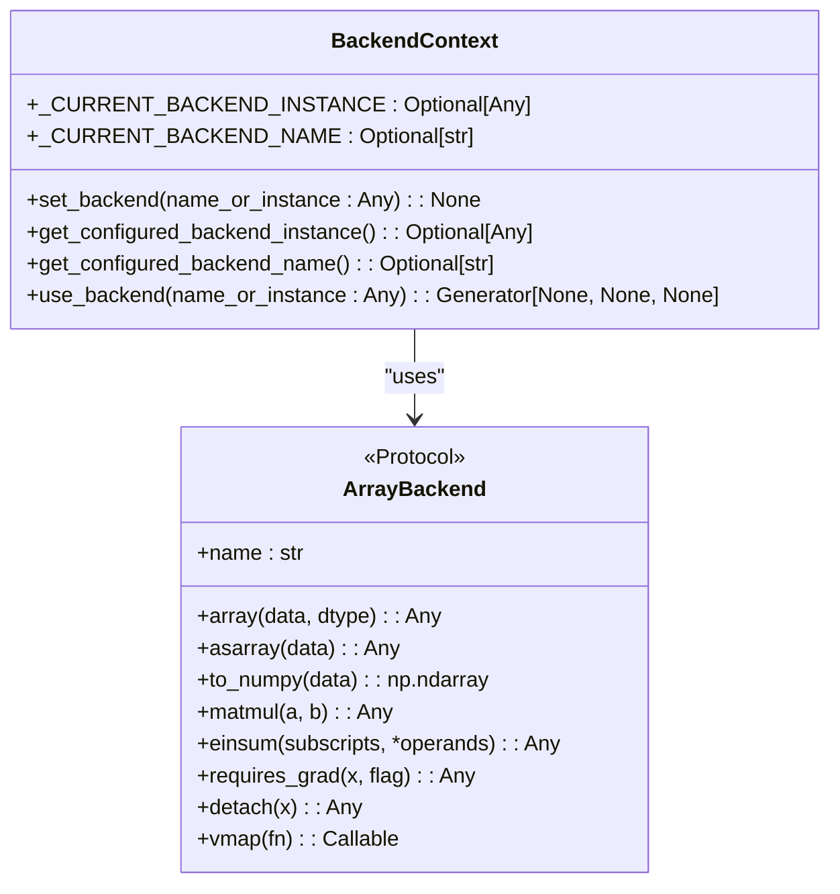
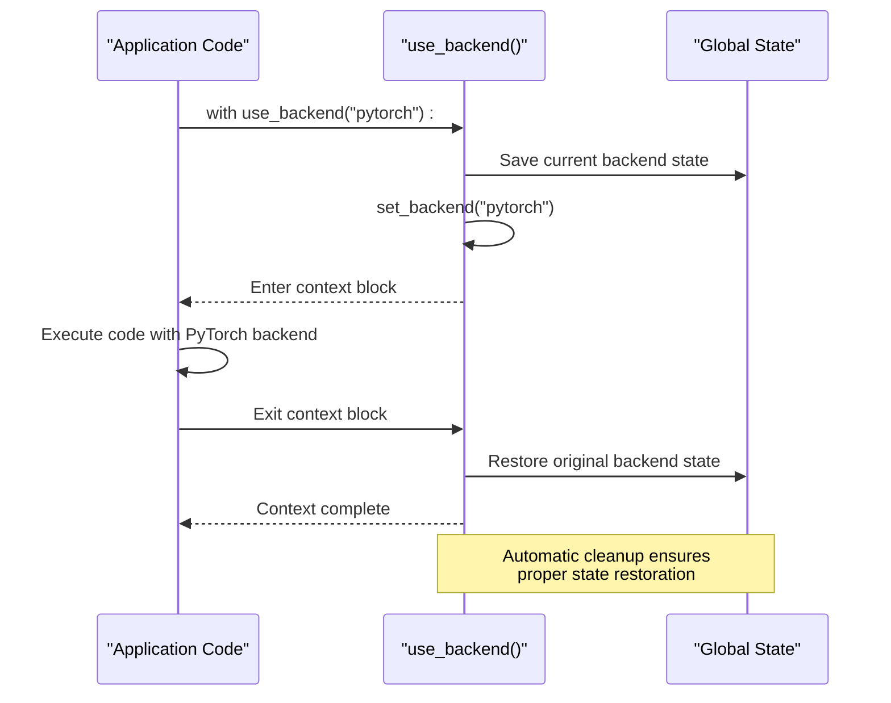
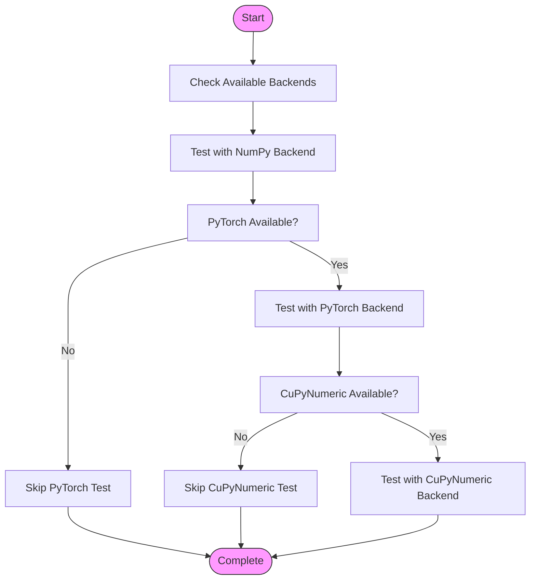

# Backend Context Management

<cite>
**Referenced Files in This Document**   
- [context.py](file://src/tyxonq/numerics/context.py)
- [api.py](file://src/tyxonq/numerics/api.py)
- [aces_for_setting_numeric_backend.py](file://examples-ng/aces_for_setting_numeric_backend.py)
- [aces_test_for_numeric_backend.py](file://examples-ng/aces_test_for_numeric_backend.py)
</cite>

## Table of Contents
1. [Introduction](#introduction)
2. [Core Components](#core-components)
3. [Global Backend Configuration](#global-backend-configuration)
4. [Context Manager for Temporary Backend Switching](#context-manager-for-temporary-backend-switching)
5. [Backend Accessor Functions](#backend-accessor-functions)
6. [Practical Usage Examples](#practical-usage-examples)
7. [Thread-Safety Considerations](#thread-safety-considerations)
8. [Best Practices](#best-practices)

## Introduction

The backend context management system in TyxonQ provides a flexible mechanism for configuring and switching between different numerical computing backends such as NumPy, PyTorch, and CuPyNumeric. This system enables both global configuration and scoped context switching, allowing developers to maintain consistent numerical computation behavior across their applications while also enabling temporary backend changes for specific operations. The design supports both named backend resolution and direct instance pinning, providing flexibility for different use cases from simple prototyping to complex production workflows.

**Section sources**
- [context.py](file://src/tyxonq/numerics/context.py#L1-L52)

## Core Components

The backend context management system consists of several key components that work together to provide a seamless experience for managing numerical backends. At its core are two global variables that track the current backend state, along with functions for setting, getting, and temporarily switching the active backend. The system is designed to minimize the need for explicit backend passing throughout the codebase while still allowing for fine-grained control when needed.

**Diagram sources**
- [context.py](file://src/tyxonq/numerics/context.py#L13-L49)
- [api.py](file://src/tyxonq/numerics/api.py#L20-L194)

**Section sources**
- [context.py](file://src/tyxonq/numerics/context.py#L1-L52)
- [api.py](file://src/tyxonq/numerics/api.py#L1-L195)

## Global Backend Configuration

The backend context management system relies on two global variables: `_CURRENT_BACKEND_INSTANCE` and `_CURRENT_BACKEND_NAME`. These variables serve as the central state for tracking the currently configured backend. The `_CURRENT_BACKEND_INSTANCE` variable stores a direct reference to a backend instance when an explicit instance is set, while `_CURRENT_BACKEND_NAME` stores the name of the backend to be lazily resolved when a string identifier is provided.

The `set_backend()` function serves as the primary interface for configuring the default backend. It accepts either a string name (such as "numpy", "pytorch", or "cupynumeric") or a direct backend instance. When a string is provided, the system will lazily resolve the backend when needed, allowing for deferred initialization and dynamic backend selection. When a direct instance is passed, that specific backend object is pinned for use, providing deterministic behavior regardless of the environment.

This dual approach to backend configuration enables both flexibility and precision in backend management. The lazy resolution via name allows for easy switching between backends during development and testing, while direct instance pinning ensures consistent behavior in production environments where specific backend configurations are required.

**Section sources**
- [context.py](file://src/tyxonq/numerics/context.py#L17-L29)

## Context Manager for Temporary Backend Switching

The `use_backend()` context manager provides a powerful mechanism for temporarily switching the active backend within a specific code block. This function implements the context manager protocol, ensuring that the previous backend configuration is automatically restored when exiting the context, even if an exception occurs. This guarantees proper cleanup and prevents configuration leaks that could affect other parts of the application.

When entering the context, `use_backend()` saves the current values of both `_CURRENT_BACKEND_INSTANCE` and `_CURRENT_BACKEND_NAME`. It then calls `set_backend()` with the specified backend, establishing the new configuration for the duration of the context. Upon exiting the context, whether normally or due to an exception, the original backend state is restored, maintaining the integrity of the global configuration.

This design pattern is particularly valuable for testing and benchmarking scenarios where different backends need to be compared under identical conditions. It also enables integration with external libraries that may require specific tensor types or numerical backends, allowing seamless interoperability without permanently altering the application's global configuration.

**Diagram sources**
- [context.py](file://src/tyxonq/numerics/context.py#L41-L49)

**Section sources**
- [context.py](file://src/tyxonq/numerics/context.py#L41-L49)

## Backend Accessor Functions

The system provides two accessor functions for retrieving the current backend configuration: `get_configured_backend_instance()` and `get_configured_backend_name()`. These functions serve as the standard interface for querying the current backend state without directly accessing the global variables.

The `get_configured_backend_instance()` function returns the currently pinned backend instance, if one has been explicitly set. This is useful for code that needs to work directly with a specific backend object rather than resolving it by name. The `get_configured_backend_name()` function returns the currently configured backend name, which is used for lazy resolution when no direct instance has been set.

These accessor functions are designed to be used in conjunction with the `get_backend()` function in the API module, which handles the actual resolution of backend names to instances. This separation of concerns allows for clean abstraction between configuration storage and backend instantiation, making the system more maintainable and extensible.

**Section sources**
- [context.py](file://src/tyxonq/numerics/context.py#L32-L37)

## Practical Usage Examples

The backend context management system enables several practical use cases that enhance both development and production workflows. The provided examples demonstrate how to configure and switch between different numerical backends for various scenarios.

For testing algorithm correctness across backends, the system allows developers to run identical computations using NumPy, PyTorch, and CuPyNumeric to verify consistent results. This is particularly valuable for numerical algorithms where precision and implementation details can vary between backends. The example code shows how to sequentially test a quantum circuit simulation with different backends, catching any discrepancies in results.

Performance benchmarking is another key use case, where the same operation can be executed with different backends to compare execution times and memory usage. This helps identify the most efficient backend for specific workloads, such as GPU-accelerated computations with PyTorch or CuPyNumeric versus CPU-based NumPy operations.

Integration with external libraries is simplified through the context manager, allowing temporary backend switching to match the requirements of third-party components. For example, when interfacing with machine learning frameworks that expect PyTorch tensors, the `use_backend()` context manager can ensure compatibility without permanently changing the application's default backend.

**Diagram sources**
- [aces_for_setting_numeric_backend.py](file://examples-ng/aces_for_setting_numeric_backend.py#L1-L51)
- [aces_test_for_numeric_backend.py](file://examples-ng/aces_test_for_numeric_backend.py#L1-L45)

**Section sources**
- [aces_for_setting_numeric_backend.py](file://examples-ng/aces_for_setting_numeric_backend.py#L1-L51)
- [aces_test_for_numeric_backend.py](file://examples-ng/aces_test_for_numeric_backend.py#L1-L45)

## Thread-Safety Considerations

While the current implementation provides effective backend management within single-threaded contexts, thread-safety considerations are important for applications that utilize multiple threads. The global nature of the backend configuration variables means that concurrent modifications from different threads could lead to race conditions and unpredictable behavior.

In multi-threaded environments, one thread changing the backend configuration could inadvertently affect computations in other threads, leading to inconsistent results or runtime errors. This is particularly problematic when using the `use_backend()` context manager, as the timing of context entry and exit across threads could result in incorrect backend states.

To mitigate these issues, applications requiring thread-safe backend management should consider implementing additional synchronization mechanisms or adopting a thread-local storage approach for backend configuration. Alternatively, passing backend instances explicitly to functions rather than relying on global state can eliminate these concurrency concerns entirely.

The system's design does include some inherent protections through the context manager's guaranteed cleanup, which helps prevent permanent configuration corruption. However, this does not fully address the race condition issues that can occur during concurrent access to the global state.

**Section sources**
- [context.py](file://src/tyxonq/numerics/context.py#L13-L49)

## Best Practices

When working with the backend context management system, several best practices can help ensure reliable and maintainable code. For development and testing, leveraging the dynamic backend switching capabilities allows for comprehensive validation across different numerical implementations. This approach helps catch backend-specific bugs early in the development cycle.

In production environments, it is generally recommended to pin a specific backend instance rather than relying on name-based resolution. This ensures consistent behavior and eliminates potential issues related to missing dependencies or version incompatibilities. Explicitly setting the backend at application startup provides predictable performance characteristics and simplifies debugging.

For complex applications with multiple components, minimizing reliance on global backend state can improve modularity and testability. Passing backend instances as parameters to functions or storing them in component-specific configuration objects reduces coupling and makes the code more predictable.

When integrating with external libraries, the `use_backend()` context manager should be used judiciously, ensuring that the scope is limited to the minimum necessary code block. This prevents unintended side effects on other parts of the application and makes the code's dependencies more explicit.

Finally, proper error handling around backend operations is essential, particularly when working with optional backends like PyTorch or CuPyNumeric. Checking for backend availability before attempting to use them prevents runtime exceptions and allows for graceful fallback to alternative implementations.