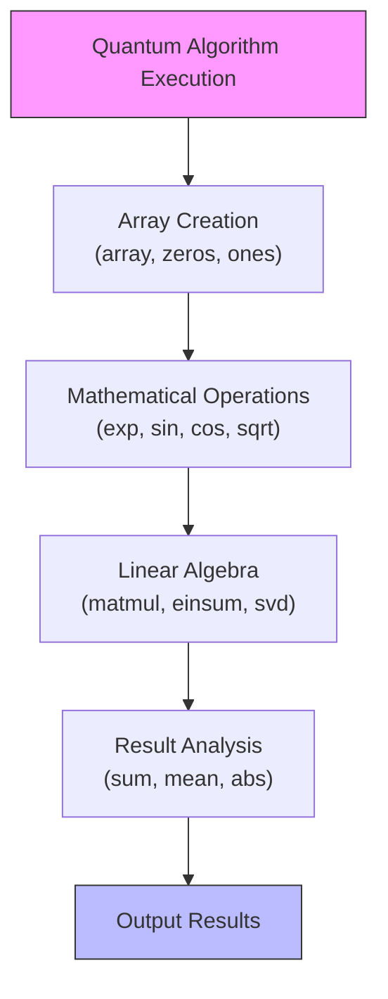
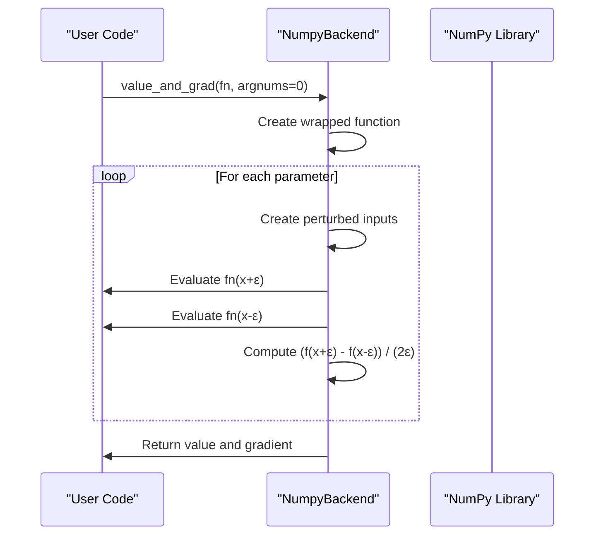

# NumPy Backend

<cite>
**Referenced Files in This Document**   
- [numpy_backend.py](file://src/tyxonq/numerics/backends/numpy_backend.py)
- [context.py](file://src/tyxonq/numerics/context.py)
- [api.py](file://src/tyxonq/numerics/api.py)
</cite>

## Table of Contents
1. [Introduction](#introduction)
2. [Core Implementation](#core-implementation)
3. [Array Creation and Manipulation](#array-creation-and-manipulation)
4. [Mathematical and Linear Algebra Operations](#mathematical-and-linear-algebra-operations)
5. [Random Number Generation](#random-number-generation)
6. [Autodiff and Vectorization Support](#autodiff-and-vectorization-support)
7. [Global Backend Context System](#global-backend-context-system)
8. [Performance and Limitations](#performance-and-limitations)

## Introduction

The NumPy backend serves as the default, CPU-based numerical computation engine within the TyxonQ framework. It provides a robust implementation of the `ArrayBackend` protocol using native NumPy operations, ensuring compatibility and accessibility across diverse computing environments. This backend is designed for reliability, ease of use, and broad compatibility, making it ideal for prototyping, small-scale quantum simulations, and development in environments where GPU acceleration is unavailable or unnecessary.

As the foundational numerical backend, it offers a comprehensive suite of operations for array creation, linear algebra, mathematical functions, and random number generation. Its design prioritizes thread safety and maintains zero external dependencies beyond the NumPy library itself. The backend integrates seamlessly with the framework's global context system, allowing users to set and manage the default numerical backend for their applications.

**Section sources**
- [numpy_backend.py](file://src/tyxonq/numerics/backends/numpy_backend.py#L1-L10)
- [api.py](file://src/tyxonq/numerics/api.py#L25-L58)

## Core Implementation

The `NumpyBackend` class implements the `ArrayBackend` protocol, providing a unified interface for array operations across different computational backends. It exposes standard NumPy data types through class-level constants such as `complex64`, `float64`, and `int32`, ensuring consistent type handling throughout the framework. The implementation directly delegates to NumPy's optimized C-based routines for all mathematical operations, leveraging decades of numerical computing optimization.

Each method in the `NumpyBackend` class corresponds to a fundamental array operation, from basic creation functions like `array()` and `zeros()` to advanced linear algebra operations like `svd()` and `einsum()`. The backend maintains a stateless design, where operations do not modify internal state but instead return new array objects, adhering to functional programming principles. This design enhances predictability and simplifies debugging in quantum computing workflows.

```mermaid
classDiagram
class ArrayBackend {
<<protocol>>
name : str
complex64 : Any
complex128 : Any
float32 : Any
float64 : Any
int32 : Any
int64 : Any
bool : Any
int : Any
array(data, dtype) : Any
asarray(data) : Any
to_numpy(data) : np.ndarray
matmul(a, b) : Any
einsum(subscripts, *operands) : Any
reshape(a, shape) : Any
moveaxis(a, source, destination) : Any
sum(a, axis) : Any
mean(a, axis) : Any
abs(a) : Any
real(a) : Any
conj(a) : Any
diag(a) : Any
zeros(shape, dtype) : Any
ones(shape, dtype) : Any
zeros_like(a) : Any
ones_like(a) : Any
eye(n, dtype) : Any
kron(a, b) : Any
square(a) : Any
exp(a) : Any
sin(a) : Any
cos(a) : Any
sqrt(a) : Any
log(a) : Any
log2(a) : Any
choice(rng, a, size, p) : Any
bincount(x, minlength) : Any
nonzero(x) : Any
svd(a, full_matrices) : Tuple[Any, Any, Any]
rng(seed) : Any
normal(rng, shape, dtype) : Any
requires_grad(x, flag) : Any
detach(x) : Any
}
class NumpyBackend {
name : str
complex64 : Any
complex128 : Any
float32 : Any
float64 : Any
int32 : Any
int64 : Any
bool : Any
int : Any
array(data, dtype) : Any
asarray(data) : Any
to_numpy(data) : np.ndarray
matmul(a, b) : Any
einsum(subscripts, *operands) : Any
reshape(a, shape) : Any
moveaxis(a, source, destination) : Any
sum(a, axis) : Any
mean(a, axis) : Any
abs(a) : Any
real(a) : Any
conj(a) : Any
diag(a) : Any
zeros(shape, dtype) : Any
ones(shape, dtype) : Any
zeros_like(a) : Any
ones_like(a) : Any
eye(n, dtype) : Any
kron(a, b) : Any
square(a) : Any
exp(a) : Any
sin(a) : Any
cos(a) : Any
sqrt(a) : Any
log(a) : Any
log2(a) : Any
choice(rng, a, size, p) : Any
bincount(x, minlength) : Any
nonzero(x) : Any
svd(a, full_matrices) : Tuple[Any, Any, Any]
rng(seed) : Any
normal(rng, shape, dtype) : Any
requires_grad(x, flag) : Any
detach(x) : Any
jit(fn) : Any
value_and_grad(fn, argnums) : Any
}
NumpyBackend ..|> ArrayBackend : "implements"
```



**Diagram sources**
- [numpy_backend.py](file://src/tyxonq/numerics/backends/numpy_backend.py#L7-L162)
- [api.py](file://src/tyxonq/numerics/api.py#L25-L58)

**Section sources**
- [numpy_backend.py](file://src/tyxonq/numerics/backends/numpy_backend.py#L7-L20)
- [api.py](file://src/tyxonq/numerics/api.py#L25-L58)

## Array Creation and Manipulation

The NumPy backend provides comprehensive functionality for array creation and manipulation, forming the foundation for quantum state representation and operator construction. The `array()` method creates arrays from Python lists or other array-like objects, while specialized methods like `zeros()`, `ones()`, and `eye()` enable efficient creation of common matrix forms used in quantum computing. The backend supports reshaping, axis manipulation, and element-wise operations essential for tensor network calculations and quantum circuit simulations.

Key array manipulation methods include `reshape()` for changing tensor dimensions, `moveaxis()` for reordering quantum subsystems, and `kron()` for constructing composite quantum systems through tensor products. These operations are optimized for performance and memory efficiency, leveraging NumPy's underlying C implementation. The `to_numpy()` method ensures interoperability by converting arrays to standard NumPy ndarrays, facilitating integration with external scientific computing libraries.

**Section sources**
- [numpy_backend.py](file://src/tyxonq/numerics/backends/numpy_backend.py#L21-L55)
- [api.py](file://src/tyxonq/numerics/api.py#L59-L85)

## Mathematical and Linear Algebra Operations

The backend implements a wide range of mathematical and linear algebra operations critical for quantum algorithm implementation. Elementary mathematical functions like `exp()`, `sin()`, `cos()`, and `sqrt()` support the calculation of quantum gate operations and time evolution. Linear algebra capabilities include matrix multiplication via `matmul()` and the powerful `einsum()` function for tensor contractions, which is particularly valuable for quantum circuit simulation and measurement calculations.

The singular value decomposition (`svd()`) method enables quantum state analysis and entanglement calculations, while basic operations like `sum()`, `mean()`, and `abs()` support expectation value computations and probability calculations. These operations are implemented using NumPy's highly optimized linear algebra routines, ensuring numerical stability and performance. The `diag()` method facilitates the creation of diagonal operators commonly used in Hamiltonian construction and measurement operators.



**Diagram sources**
- [numpy_backend.py](file://src/tyxonq/numerics/backends/numpy_backend.py#L57-L104)
- [api.py](file://src/tyxonq/numerics/api.py#L87-L119)

**Section sources**
- [numpy_backend.py](file://src/tyxonq/numerics/backends/numpy_backend.py#L57-L104)
- [api.py](file://src/tyxonq/numerics/api.py#L87-L119)

## Random Number Generation

The NumPy backend provides robust random number generation capabilities through its integration with NumPy's random module. The `rng()` method creates a random number generator instance with an optional seed, ensuring reproducibility in quantum simulations and algorithm testing. This generator follows NumPy's modern random number generation architecture, using the PCG64 bit generator by default, which offers excellent statistical properties and performance.

The `normal()` method generates arrays of normally distributed random numbers, essential for simulating quantum noise, initializing variational parameters, and Monte Carlo methods. The backend also includes `choice()` for discrete sampling and `bincount()` for histogram analysis of measurement outcomes. These random operations are thread-safe when using separate generator instances, allowing for parallel quantum circuit simulations without interference between threads.

**Section sources**
- [numpy_backend.py](file://src/tyxonq/numerics/backends/numpy_backend.py#L105-L118)
- [api.py](file://src/tyxonq/numerics/api.py#L120-L125)

## Autodiff and Vectorization Support

While the NumPy backend does not natively support automatic differentiation, it provides compatibility interfaces through the `requires_grad()` and `detach()` methods. These methods act as no-ops, returning the input array unchanged, which allows code written for differentiable backends to run without modification. For gradient computation, the backend implements a finite-difference approximation through the `value_and_grad()` method, enabling basic gradient-based optimization in variational quantum algorithms.

The `jit()` method is also a no-op, as NumPy lacks just-in-time compilation capabilities. However, the backend integrates with the framework's `vectorize_or_fallback()` function, which provides generic vectorization along the leading axis when native vectorization is unavailable. This allows batched execution of quantum circuits with different parameters, though without the performance benefits of true vectorization found in specialized backends.



**Diagram sources**
- [numpy_backend.py](file://src/tyxonq/numerics/backends/numpy_backend.py#L132-L162)
- [api.py](file://src/tyxonq/numerics/api.py#L127-L166)

**Section sources**
- [numpy_backend.py](file://src/tyxonq/numerics/backends/numpy_backend.py#L122-L162)
- [api.py](file://src/tyxonq/numerics/api.py#L127-L166)

## Global Backend Context System

The NumPy backend integrates with the framework's global context system through the `context.py` module, which manages the default numerical backend for the entire application. Users can set the global backend using `set_backend("numpy")` or the equivalent `"cpu"` alias, making NumPy the default for all subsequent operations. The `use_backend()` context manager allows temporary switching to NumPy for specific code blocks, enabling mixed-backend workflows within a single application.

The context system stores either a backend name for lazy resolution or a direct backend instance, providing flexibility in configuration. When no explicit backend is specified, the system defaults to NumPy, ensuring that all operations have a valid computational engine. This design allows users to develop and test quantum algorithms on CPU before deploying them on GPU-accelerated backends, with minimal code changes required for the transition.

```mermaid
graph TD
A["Application Start"] --> B["Default Backend: None"]
B --> C{"User Calls set_backend(\"numpy\")"}
C --> D["Global State: _CURRENT_BACKEND_NAME = \"numpy\""]
D --> E{"User Calls get_backend(None)"}
E --> F["Factory Creates NumpyBackend Instance"]
F --> G["Operations Use NumPy"]
G --> H{"User Enters use_backend(\"pytorch\") Context"}
H --> I["Temporary Backend: PyTorch"]
I --> J["Operations Use PyTorch"]
J --> K{"Context Exits"}
K --> L["Restore Previous Backend: NumPy"]
L --> M["Operations Use NumPy"]
```

**Diagram sources**
- [context.py](file://src/tyxonq/numerics/context.py#L1-L52)
- [api.py](file://src/tyxonq/numerics/api.py#L162-L191)

**Section sources**
- [context.py](file://src/tyxonq/numerics/context.py#L1-L52)
- [api.py](file://src/tyxonq/numerics/api.py#L162-L191)

## Performance and Limitations

The NumPy backend offers excellent performance for small to medium-scale quantum simulations, leveraging highly optimized BLAS libraries for linear algebra operations. However, it has several limitations compared to specialized backends like PyTorch. It lacks native support for automatic differentiation, requiring finite-difference approximations that are computationally expensive and less accurate than true autodiff. The backend also does not support GPU acceleration, limiting its scalability for large quantum systems.

Memory layout follows NumPy's default C-order (row-major) arrangement, with no special optimizations for quantum tensor contractions. While thread-safe for read operations, concurrent writes to shared arrays require external synchronization. The backend's vectorization capabilities are limited to the generic fallback implementation, lacking the performance benefits of true vectorized execution. Despite these limitations, the NumPy backend remains invaluable for prototyping, educational purposes, and environments where simplicity and reliability are prioritized over raw performance.

**Section sources**
- [numpy_backend.py](file://src/tyxonq/numerics/backends/numpy_backend.py)
- [api.py](file://src/tyxonq/numerics/api.py)
- [context.py](file://src/tyxonq/numerics/context.py)