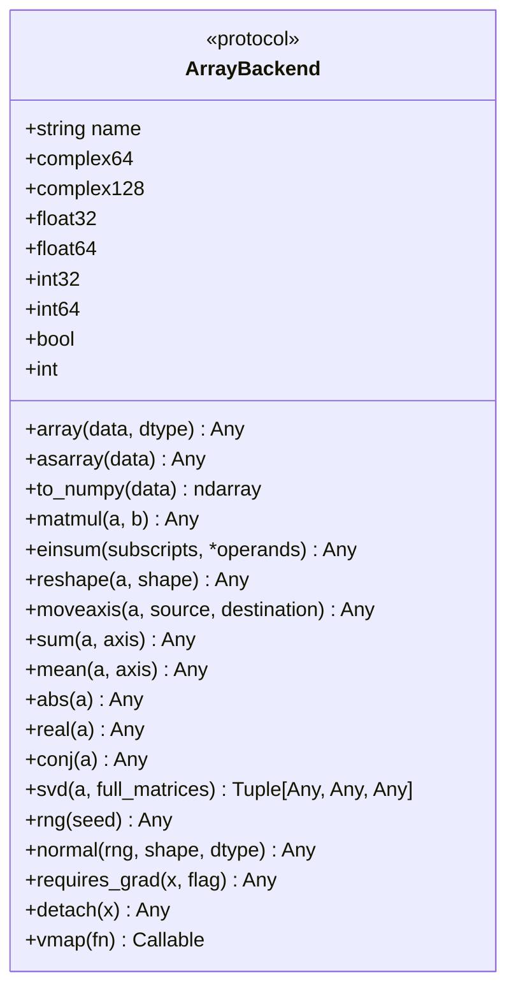
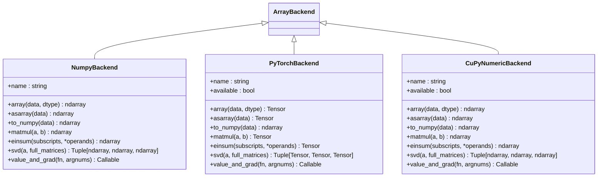
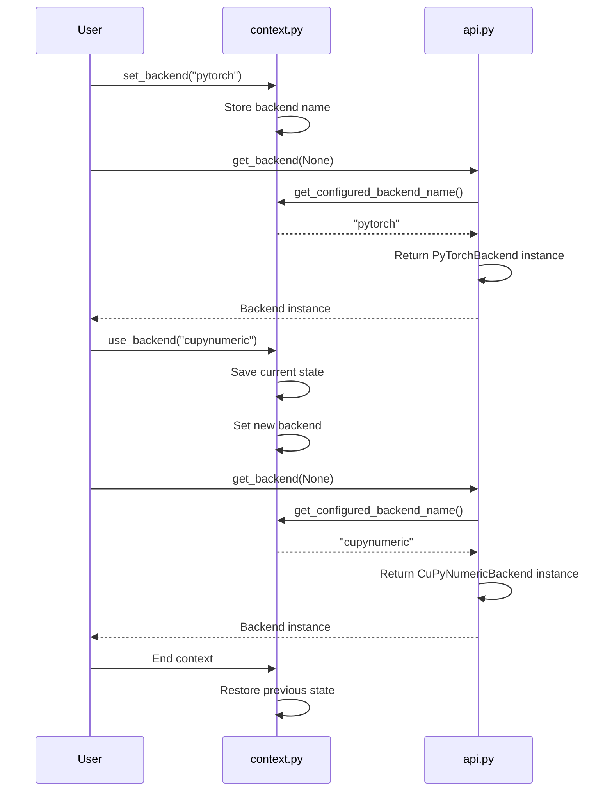
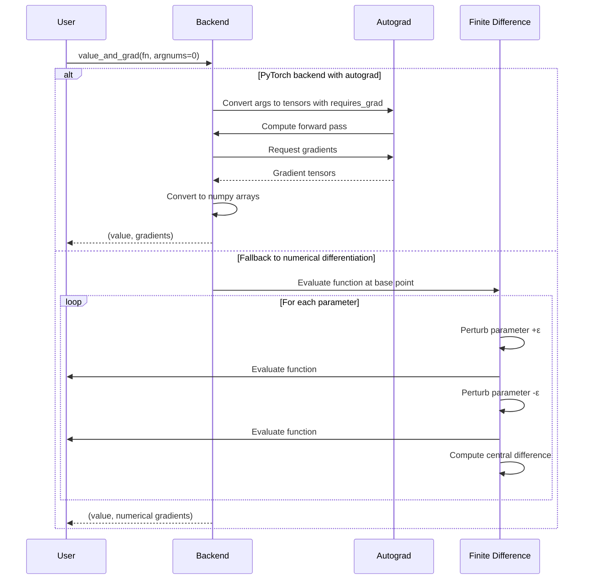

# Numerics Backend

<cite>
**Referenced Files in This Document**   
- [api.py](file://src/tyxonq/numerics/api.py)
- [context.py](file://src/tyxonq/numerics/context.py)
- [numpy_backend.py](file://src/tyxonq/numerics/backends/numpy_backend.py)
- [pytorch_backend.py](file://src/tyxonq/numerics/backends/pytorch_backend.py)
- [cupynumeric_backend.py](file://src/tyxonq/numerics/backends/cupynumeric_backend.py)
- [numerics.rst](file://docs-ng/source/next/user/numerics.rst)
- [aces_for_setting_numeric_backend.py](file://examples-ng/aces_for_setting_numeric_backend.py)
- [aces_test_for_numeric_backend.py](file://examples-ng/aces_test_for_numeric_backend.py)
</cite>

## Table of Contents
1. [Introduction](#introduction)
2. [ArrayBackend Protocol](#arraybackend-protocol)
3. [Backend Implementations](#backend-implementations)
4. [Backend Selection and Context Management](#backend-selection-and-context-management)
5. [Integration with Gradient Computation](#integration-with-gradient-computation)
6. [Memory Management and GPU Acceleration](#memory-management-and-gpu-acceleration)
7. [Numerical Precision Considerations](#numerical-precision-considerations)
8. [Use Case Guidance](#use-case-guidance)
9. [Interoperability with External Libraries](#interoperability-with-external-libraries)
10. [Performance Implications](#performance-implications)

## Introduction
The Numerics Backend system provides a unified interface for array operations across different computational frameworks, enabling seamless integration of NumPy, PyTorch, and CuPyNumeric backends. This architecture allows users to switch between backends without modifying their core algorithmic code, facilitating both research experimentation and production deployment. The system is designed to abstract away framework-specific details while preserving access to advanced features like automatic differentiation, GPU acceleration, and optimized linear algebra operations.

**Section sources**
- [numerics.rst](file://docs-ng/source/next/user/numerics.rst#L0-L6)

## ArrayBackend Protocol
The ArrayBackend protocol defines a comprehensive interface for unified array operations across computational frameworks. This Protocol-based abstraction ensures consistent behavior regardless of the underlying implementation. The protocol includes essential operations for array creation, mathematical computations, linear algebra, and automatic differentiation. Key components include array creation methods (`array`, `asarray`), mathematical operations (`matmul`, `einsum`, `exp`, `sqrt`), linear algebra functions (`svd`), and autodiff utilities (`requires_grad`, `detach`). The protocol also defines standard data type constants (complex64, float32, int64, etc.) to ensure type consistency across backends.

**Diagram sources**
- [api.py](file://src/tyxonq/numerics/api.py#L18-L101)

**Section sources**
- [api.py](file://src/tyxonq/numerics/api.py#L18-L194)

## Backend Implementations
The system provides three primary backend implementations that adhere to the ArrayBackend protocol: NumPyBackend, PyTorchBackend, and CuPyNumericBackend. Each implementation translates the protocol's abstract methods to their respective framework's native operations. The NumPyBackend serves as the reference implementation, providing CPU-based numerical computing with extensive mathematical functions. The PyTorchBackend enables GPU acceleration and automatic differentiation through PyTorch's tensor operations. The CuPyNumericBackend offers GPU-accelerated computing with NumPy-compatible syntax, allowing for easy migration of existing NumPy code to GPU execution.

**Diagram sources**
- [numpy_backend.py](file://src/tyxonq/numerics/backends/numpy_backend.py#L7-L162)
- [pytorch_backend.py](file://src/tyxonq/numerics/backends/pytorch_backend.py#L12-L256)
- [cupynumeric_backend.py](file://src/tyxonq/numerics/backends/cupynumeric_backend.py#L12-L252)

**Section sources**
- [numpy_backend.py](file://src/tyxonq/numerics/backends/numpy_backend.py#L7-L165)
- [pytorch_backend.py](file://src/tyxonq/numerics/backends/pytorch_backend.py#L12-L259)
- [cupynumeric_backend.py](file://src/tyxonq/numerics/backends/cupynumeric_backend.py#L12-L255)

## Backend Selection and Context Management
Backend selection is managed through the context.py module, which provides both global configuration and context manager functionality. The system maintains internal state with _CURRENT_BACKEND_INSTANCE and _CURRENT_BACKEND_NAME variables, allowing for flexible backend management. Users can set the backend globally using set_backend() with either a backend name string or an instance. The use_backend() context manager enables temporary backend switching within a specific code block, automatically restoring the previous configuration upon exit. This design supports both application-wide defaults and localized overrides, accommodating complex workflows that require different backends for different computational tasks.

**Diagram sources**
- [context.py](file://src/tyxonq/numerics/context.py#L0-L52)

**Section sources**
- [context.py](file://src/tyxonq/numerics/context.py#L0-L52)
- [api.py](file://src/tyxonq/numerics/api.py#L162-L191)

## Integration with Gradient Computation
The numerics system integrates with automatic differentiation through the value_and_grad method implemented in each backend. The PyTorchBackend leverages PyTorch's autograd system for efficient gradient computation, falling back to numerical differentiation when autograd fails. The NumPyBackend and CuPyNumericBackend implement finite-difference methods for gradient calculation, providing consistent API behavior across all backends. The requires_grad and detach methods enable gradient tracking control, allowing users to manage computational graphs explicitly. This integration supports both research applications requiring precise gradients and production systems needing reliable numerical differentiation.

**Diagram sources**
- [pytorch_backend.py](file://src/tyxonq/numerics/backends/pytorch_backend.py#L200-L256)
- [numpy_backend.py](file://src/tyxonq/numerics/backends/numpy_backend.py#L140-L162)
- [cupynumeric_backend.py](file://src/tyxonq/numerics/backends/cupynumeric_backend.py#L230-L252)

**Section sources**
- [pytorch_backend.py](file://src/tyxonq/numerics/backends/pytorch_backend.py#L200-L259)
- [numpy_backend.py](file://src/tyxonq/numerics/backends/numpy_backend.py#L140-L165)
- [cupynumeric_backend.py](file://src/tyxonq/numerics/backends/cupynumeric_backend.py#L230-L255)

## Memory Management and GPU Acceleration
Memory management strategies vary significantly between backends, with important implications for performance and resource utilization. The NumPyBackend operates exclusively on CPU memory, providing predictable performance but limited by system RAM. The PyTorchBackend enables GPU acceleration through CUDA tensors, automatically managing memory transfers between CPU and GPU. The CuPyNumericBackend provides GPU acceleration with NumPy-compatible syntax, handling memory allocation on GPU devices transparently. Each backend implements appropriate memory cleanup strategies, with PyTorch's detach() method and CuPyNumeric's array management ensuring efficient resource utilization. The system automatically handles data conversion between backends when necessary, minimizing memory overhead.

**Section sources**
- [pytorch_backend.py](file://src/tyxonq/numerics/backends/pytorch_backend.py#L120-L125)
- [cupynumeric_backend.py](file://src/tyxonq/numerics/backends/cupynumeric_backend.py#L120-L125)

## Numerical Precision Considerations
The system supports multiple numerical precision formats through standardized dtype constants (float32, float64, complex64, complex128). Backend implementations handle precision conversion appropriately, with the PyTorchBackend providing additional flexibility through its _to_torch_dtype method. The choice of precision impacts both computational accuracy and performance, with float32 offering faster computation and lower memory usage, while float64 provides higher precision for sensitive calculations. Automatic differentiation accuracy is particularly sensitive to precision choice, with finite-difference methods requiring careful epsilon selection based on the data type. The unified dtype interface ensures consistent precision management across all backends.

**Section sources**
- [api.py](file://src/tyxonq/numerics/api.py#L30-L37)
- [numpy_backend.py](file://src/tyxonq/numerics/backends/numpy_backend.py#L10-L17)
- [pytorch_backend.py](file://src/tyxonq/numerics/backends/pytorch_backend.py#L18-L25)
- [cupynumeric_backend.py](file://src/tyxonq/numerics/backends/cupynumeric_backend.py#L18-L25)

## Use Case Guidance
Backend selection should be guided by specific use case requirements. For research and development, the PyTorchBackend is recommended due to its superior automatic differentiation capabilities and GPU acceleration. For production deployments requiring stability and broad compatibility, the NumPyBackend provides reliable CPU-based computation. For large-scale numerical simulations that can benefit from GPU acceleration without requiring deep learning features, the CuPyNumericBackend offers an excellent balance of performance and ease of use. Memory-constrained environments should favor the NumPyBackend, while compute-intensive tasks benefit from GPU-accelerated backends. The context management system enables hybrid approaches, allowing different backends to be used for different stages of a computational workflow.

**Section sources**
- [aces_for_setting_numeric_backend.py](file://examples-ng/aces_for_setting_numeric_backend.py#L0-L50)
- [aces_test_for_numeric_backend.py](file://examples-ng/aces_test_for_numeric_backend.py#L0-L44)

## Interoperability with External Libraries
The numerics system is designed for seamless interoperability with external machine learning and scientific computing libraries. The to_numpy() method provides a standard interface for data exchange with libraries expecting NumPy arrays. The PyTorchBackend enables integration with the PyTorch ecosystem, including neural network frameworks and optimization libraries. The system's protocol-based design facilitates future extensions to support additional backends. The vectorize_or_fallback utility enhances interoperability by providing consistent vectorization behavior across backends, with automatic fallback to element-wise processing when native vectorization is unavailable. This design ensures that algorithms can be easily shared and reused across different computational environments.

**Section sources**
- [api.py](file://src/tyxonq/numerics/api.py#L103-L140)
- [pytorch_backend.py](file://src/tyxonq/numerics/backends/pytorch_backend.py#L120-L125)

## Performance Implications
Performance characteristics vary significantly between backends, with important trade-offs to consider. The NumPyBackend provides consistent CPU performance suitable for small to medium-sized problems. The PyTorchBackend offers substantial speedups for large tensor operations through GPU acceleration, particularly when using torch.compile for just-in-time compilation. The CuPyNumericBackend provides GPU acceleration with lower overhead than PyTorch for pure numerical computing tasks. Automatic differentiation performance is best with PyTorch's native autograd, while other backends rely on slower finite-difference methods. The choice of backend should consider not only raw computational speed but also startup time, memory overhead, and compatibility with existing infrastructure.

**Section sources**
- [aces_for_setting_numeric_backend.py](file://examples-ng/aces_for_setting_numeric_backend.py#L0-L50)
- [pytorch_backend.py](file://src/tyxonq/numerics/backends/pytorch_backend.py#L200-L259)
- [numpy_backend.py](file://src/tyxonq/numerics/backends/numpy_backend.py#L140-L165)