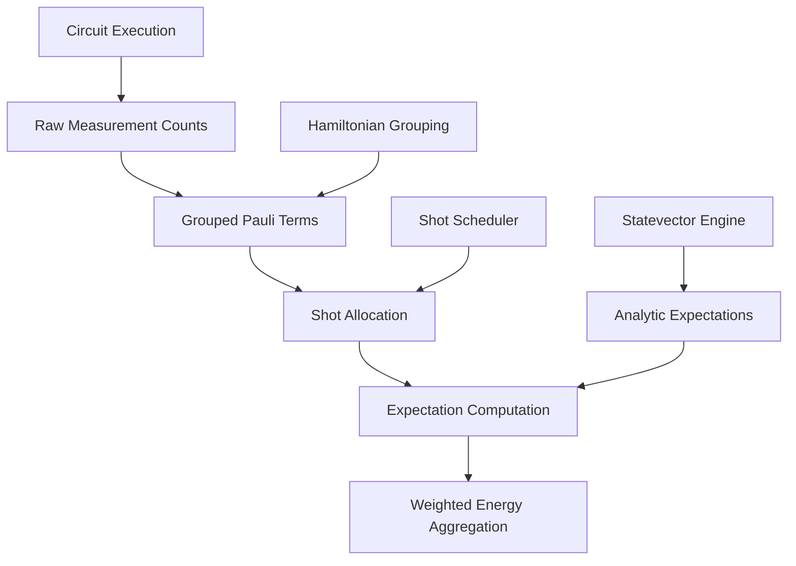
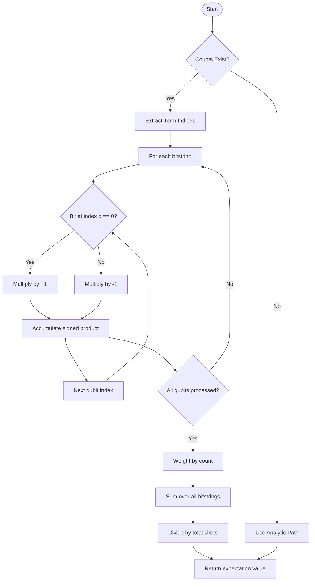
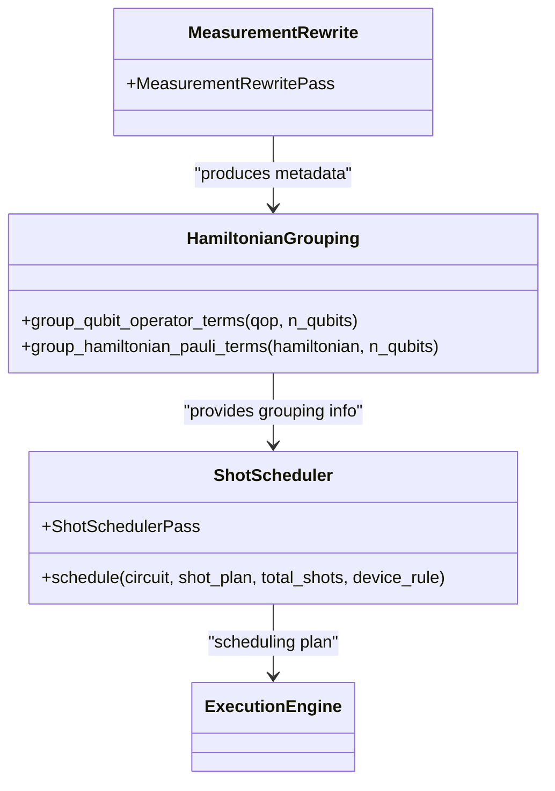
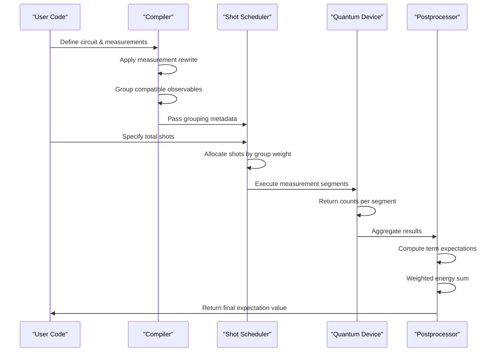

# Counts to Expectation Value

<cite>
**Referenced Files in This Document**   
- [counts_expval.py](file://src/tyxonq/postprocessing/counts_expval.py)
- [hamiltonian_grouping.py](file://src/tyxonq/compiler/utils/hamiltonian_grouping.py)
- [shot_scheduler.py](file://src/tyxonq/compiler/stages/scheduling/shot_scheduler.py)
- [measurement.py](file://src/tyxonq/libs/quantum_library/measurement.py)
- [hamiltonian_grouping.py](file://src/tyxonq/libs/hamiltonian_encoding/hamiltonian_grouping.py)
</cite>

## Table of Contents
1. [Introduction](#introduction)
2. [Core Components](#core-components)
3. [Architecture Overview](#architecture-overview)
4. [Detailed Component Analysis](#detailed-component-analysis)
5. [Dependency Analysis](#dependency-analysis)
6. [Performance Considerations](#performance-considerations)
7. [Troubleshooting Guide](#troubleshooting-guide)
8. [Conclusion](#conclusion)

## Introduction
This document details the transformation process from raw quantum measurement counts to expectation values for observables, focusing on Pauli operator measurements. It explains how the system integrates compiler-driven Hamiltonian grouping and shot scheduling to optimize measurement efficiency. The analysis covers the workflow from circuit execution to final energy computation, including handling of sparse and dense observable sets, numerical stability, and memory usage patterns. The implementation supports both shot-based sampling and analytic statevector evaluation paths.

## Core Components

The transformation pipeline consists of three main components: count processing, Hamiltonian grouping, and shot scheduling. The `term_expectation_from_counts` function computes expectation values from bitstring histograms by aggregating signed contributions based on measurement outcomes. The `expval_pauli_sum` function orchestrates the weighted averaging of grouped Pauli terms to compute total energy. Compiler utilities enable Hamiltonian grouping by measurement basis, while the shot scheduler allocates measurement budgets across groups based on variance weights.

**Section sources**
- [counts_expval.py](file://src/tyxonq/postprocessing/counts_expval.py#L6-L114)
- [hamiltonian_grouping.py](file://src/tyxonq/compiler/utils/hamiltonian_grouping.py#L15-L22)
- [shot_scheduler.py](file://src/tyxonq/compiler/stages/scheduling/shot_scheduler.py#L43-L118)

## Architecture Overview



**Diagram sources **
- [counts_expval.py](file://src/tyxonq/postprocessing/counts_expval.py)
- [shot_scheduler.py](file://src/tyxonq/compiler/stages/scheduling/shot_scheduler.py)
- [hamiltonian_grouping.py](file://src/tyxonq/compiler/utils/hamiltonian_grouping.py)

## Detailed Component Analysis

### Counts to Expectation Transformation
The transformation process begins with raw measurement counts from quantum circuit execution. Each bitstring outcome contributes to the expectation value based on the sign determined by qubit measurements in the target Pauli basis.



**Diagram sources **
- [counts_expval.py](file://src/tyxonq/postprocessing/counts_expval.py#L6-L19)

**Section sources**
- [counts_expval.py](file://src/tyxonq/postprocessing/counts_expval.py#L6-L19)

### Hamiltonian Grouping and Shot Scheduling
The compiler groups compatible Pauli terms that can be measured simultaneously, reducing the number of required circuit executions. The shot scheduler then allocates measurement budgets across these groups based on their contribution weights.



**Diagram sources **
- [hamiltonian_grouping.py](file://src/tyxonq/libs/hamiltonian_encoding/hamiltonian_grouping.py#L11-L65)
- [shot_scheduler.py](file://src/tyxonq/compiler/stages/scheduling/shot_scheduler.py#L43-L118)

**Section sources**
- [hamiltonian_grouping.py](file://src/tyxonq/libs/hamiltonian_encoding/hamiltonian_grouping.py#L11-L65)
- [shot_scheduler.py](file://src/tyxonq/compiler/stages/scheduling/shot_scheduler.py#L43-L118)

### Integration Workflow
The complete workflow integrates circuit compilation, measurement grouping, shot allocation, and expectation computation in a cohesive pipeline.



**Diagram sources **
- [counts_expval.py](file://src/tyxonq/postprocessing/counts_expval.py)
- [shot_scheduler.py](file://src/tyxonq/compiler/stages/scheduling/shot_scheduler.py)
- [measurement.py](file://src/tyxonq/libs/quantum_library/measurement.py)

**Section sources**
- [counts_expval.py](file://src/tyxonq/postprocessing/counts_expval.py#L86-L111)
- [shot_scheduler.py](file://src/tyxonq/compiler/stages/scheduling/shot_scheduler.py#L43-L118)

## Dependency Analysis

```mermaid
graph TD
    A["src.tyxonq.postprocessing.counts_expval"] --> B["src.tyxonq.compiler.utils.hamiltonian_grouping"]
    B --> C["src.tyxonq.libs.hamiltonian_encoding.hamiltonian_grouping"]
    A --> D["src.tyxonq.libs.quantum_library.measurement"]
    E["src.tyxonq.compiler.stages.scheduling.shot_scheduler"] --> F["src.tyxonq.core.ir.Circuit"]
    E --> G["src.tyxonq.devices.DeviceRule"]
    A --> E["consumes scheduling plan"]
    C --> H["openfermion"]["optional dependency"]
```

**Diagram sources **
- [counts_expval.py](file://src/tyxonq/postprocessing/counts_expval.py)
- [hamiltonian_grouping.py](file://src/tyxonq/compiler/utils/hamiltonian_grouping.py)
- [shot_scheduler.py](file://src/tyxonq/compiler/stages/scheduling/shot_scheduler.py)

**Section sources**
- [counts_expval.py](file://src/tyxonq/postprocessing/counts_expval.py#L86-L111)
- [hamiltonian_grouping.py](file://src/tyxonq/compiler/utils/hamiltonian_grouping.py#L15-L22)
- [shot_scheduler.py](file://src/tyxonq/compiler/stages/scheduling/shot_scheduler.py#L43-L118)

## Performance Considerations

The system optimizes performance through several mechanisms: measurement grouping reduces circuit compilation and execution overhead; deterministic shot allocation ensures reproducible results; and memory-efficient counting avoids storing individual shot outcomes. For large-scale measurements, the implementation processes counts incrementally rather than storing all shot data, minimizing memory footprint. The use of weighted averaging based on Pauli term coefficients ensures optimal shot distribution across terms. Numerical stability is maintained by proper normalization and handling of edge cases like zero counts.

**Section sources**
- [counts_expval.py](file://src/tyxonq/postprocessing/counts_expval.py#L6-L114)
- [shot_scheduler.py](file://src/tyxonq/compiler/stages/scheduling/shot_scheduler.py#L43-L118)

## Troubleshooting Guide

Common issues include improper basis rotations for X/Y measurements, incorrect term grouping, and shot allocation imbalances. Ensure that circuits include appropriate basis transformations (H for X, S†H for Y) before measurement. Verify that the measurement grouping preserves commutation relations and that shot weights reflect term coefficients. For numerical instability, check for terms with negligible coefficients that may contribute noise, and validate that count normalization is properly applied. When using analytic evaluation paths, confirm that statevector or density matrix representations are available.

**Section sources**
- [counts_expval.py](file://src/tyxonq/postprocessing/counts_expval.py#L6-L114)
- [hamiltonian_grouping.py](file://src/tyxonq/libs/hamiltonian_encoding/hamiltonian_grouping.py#L11-L65)

## Conclusion

The counts-to-expectation-value transformation provides a robust framework for quantum observable measurement, integrating compiler optimizations with efficient postprocessing. By leveraging Hamiltonian grouping and intelligent shot scheduling, the system maximizes measurement efficiency while maintaining numerical accuracy. The modular design separates concerns between circuit compilation, execution planning, and result aggregation, enabling extensibility and testability. This approach supports both near-term noisy devices through shot-based sampling and idealized simulations through analytic evaluation, providing a unified interface for quantum algorithm development.