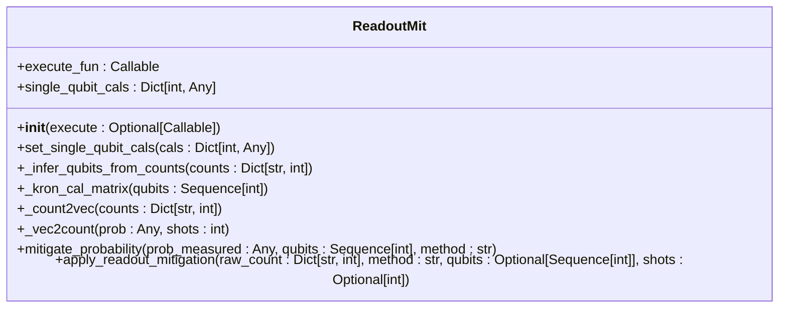
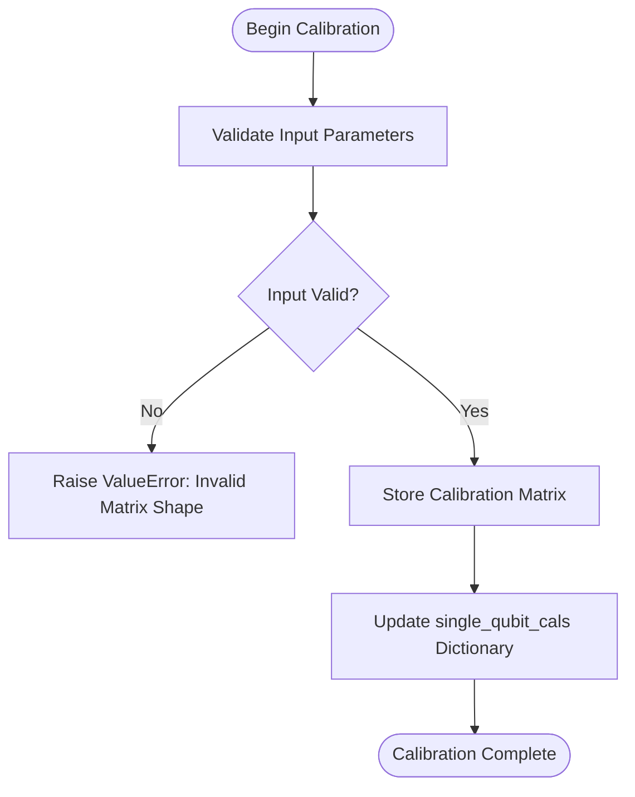
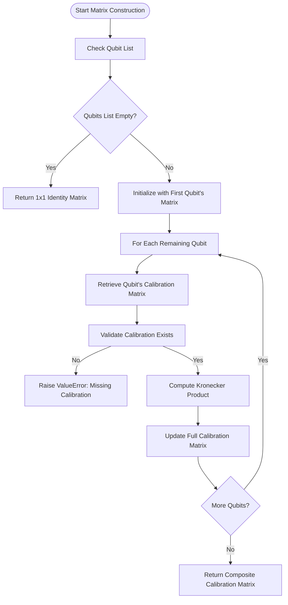
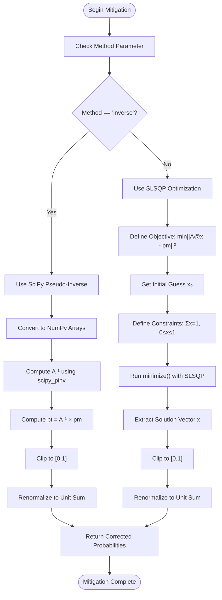
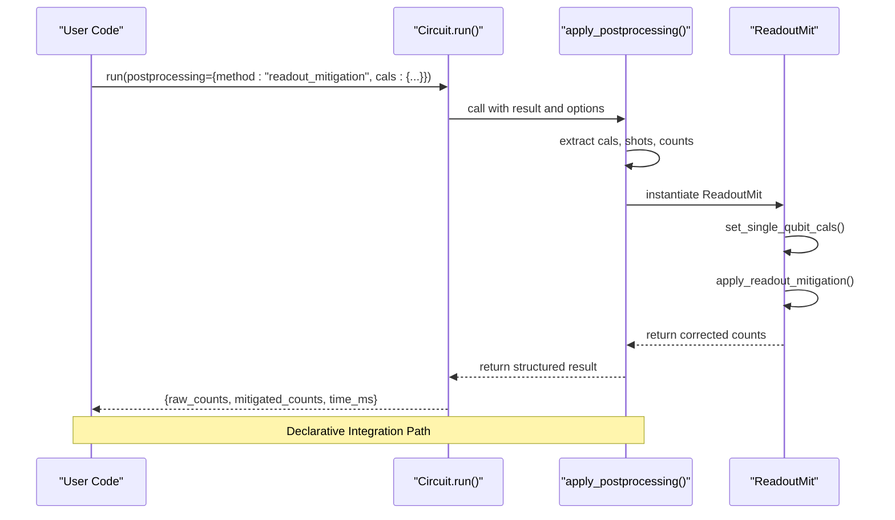

# Readout Mitigation

<cite>
**Referenced Files in This Document**   
- [readout.py](file://src/tyxonq/postprocessing/readout.py)
- [__init__.py](file://src/tyxonq/postprocessing/__init__.py)
- [readout_mitigation.py](file://examples/readout_mitigation.py)
</cite>

## Table of Contents
1. [Introduction](#introduction)
2. [Core Components](#core-components)
3. [Workflow for Single-Qubit Calibration](#workflow-for-single-qubit-calibration)
4. [Kronecker Product Construction](#kronecker-product-construction)
5. [_count2vec and _vec2count Conversion Utilities](#_count2vec-and-_vec2count-conversion-utilities)
6. [Mitigation Strategies in mitigate_probability](#mitigation-strategies-in-mitigate_probability)
7. [Integration with Execution Pipelines](#integration-with-execution-pipelines)
8. [Edge Case Handling](#edge-case-handling)
9. [Performance Considerations](#performance-considerations)
10. [Conclusion](#conclusion)

## Introduction

Readout error mitigation is a critical post-processing technique in quantum computing that corrects measurement inaccuracies caused by imperfect readout operations. The `ReadoutMit` class in the TyxonQ framework provides a robust implementation for mitigating these errors through calibration matrix application and probabilistic correction. This document details the architecture and functionality of the `ReadoutMit` class, focusing on its core methods and integration within quantum execution workflows. The system supports both numerical application of mitigation and seamless integration with circuit execution pipelines via callback mechanisms.

**Section sources**
- [readout.py](file://src/tyxonq/postprocessing/readout.py#L14-L136)

## Core Components

The `ReadoutMit` class serves as the central component for readout error mitigation, encapsulating calibration management, probability transformation, and correction strategies. It operates on measured bitstring counts to reconstruct estimated true probabilities by inverting the effects of readout noise. The class maintains per-qubit calibration matrices and applies them through Kronecker product construction for multi-qubit systems. Key methods include `set_single_qubit_cals` for calibration setup, `mitigate_probability` for core correction logic, and utility functions `_count2vec` and `_vec2count` for data format conversion between raw counts and probability vectors.



**Diagram sources**
- [readout.py](file://src/tyxonq/postprocessing/readout.py#L14-L136)

**Section sources**
- [readout.py](file://src/tyxonq/postprocessing/readout.py#L14-L136)

## Workflow for Single-Qubit Calibration

The calibration process begins with the `set_single_qubit_cals` method, which accepts a dictionary mapping qubit indices to their respective 2x2 calibration matrices. These matrices represent the conditional probabilities of measuring a particular state given the true underlying state, effectively modeling the readout error channel. Each calibration matrix must be validated for correct dimensions (2x2) before storage in the `single_qubit_cals` dictionary. This per-qubit approach enables flexible calibration across heterogeneous quantum devices where individual qubits may exhibit different error characteristics. The calibration matrices are later used in constructing the full system calibration matrix through Kronecker products.



**Diagram sources**
- [readout.py](file://src/tyxonq/postprocessing/readout.py#L32-L42)

**Section sources**
- [readout.py](file://src/tyxonq/postprocessing/readout.py#L32-L42)

## Kronecker Product Construction

For multi-qubit systems, the full calibration matrix is constructed as the Kronecker product of individual single-qubit calibration matrices in ascending wire order. The `_kron_cal_matrix` method implements this construction, iterating through the specified qubits and combining their calibration matrices sequentially. This approach assumes independent readout errors across qubits, which is a common approximation in near-term quantum devices. The resulting composite matrix captures the joint probability distribution of measurement outcomes across all qubits, enabling correction of correlated readout errors within the independent noise assumption. Missing calibrations for any qubit in the system raise a `ValueError` to prevent incomplete mitigation.



**Diagram sources**
- [readout.py](file://src/tyxonq/postprocessing/readout.py#L44-L59)

**Section sources**
- [readout.py](file://src/tyxonq/postprocessing/readout.py#L44-L59)

## _count2vec and _vec2count Conversion Utilities

The `_count2vec` and `_vec2count` methods serve as essential utilities for transforming between bitstring count representations and probability vectors. `_count2vec` converts raw measurement counts into a normalized probability vector by mapping each bitstring to its corresponding index in a 2^n-dimensional vector, where n is the number of qubits. The counts are normalized by the total number of shots to produce relative frequencies. Conversely, `_vec2count` transforms a probability vector back into integer counts suitable for quantum measurement results, applying clipping to ensure non-negative probabilities and renormalization to maintain unit sum. Both methods include safeguards for edge cases such as zero-shot measurements by defaulting to a minimum shot value of 1.0.

```mermaid
flowchart LR
subgraph "Forward Transformation: _count2vec"
A[Raw Counts Dictionary] --> B[Initialize Zero Vector]
B --> C[Map Bitstrings to Indices]
C --> D[Populate Vector with Counts]
D --> E[Normalize by Total Shots]
E --> F[Return Probability Vector]
end
subgraph "Reverse Transformation: _vec2count"
G[Probability Vector] --> H[Clip Values to [0,1]]
H --> I[Renormalize to Unit Sum]
I --> J[Multiply by Shot Count]
J --> K[Round to Integers]
K --> L[Map Indices to Bitstrings]
L --> M[Return Counts Dictionary]
end
```

**Diagram sources**
- [readout.py](file://src/tyxonq/postprocessing/readout.py#L62-L91)

**Section sources**
- [readout.py](file://src/tyxonq/postprocessing/readout.py#L62-L91)

## Mitigation Strategies in mitigate_probability

The `mitigate_probability` method implements two complementary strategies for readout error correction: matrix inversion and constrained least-squares optimization. The inverse method employs SciPy's pseudo-inverse (`pinv`) for numerical stability when inverting the calibration matrix, transforming measured probabilities into estimated true probabilities. This approach includes clipping to ensure physical probability bounds [0,1] and renormalization to maintain unit sum. The alternative SLSQP-based constrained optimization approach formulates mitigation as a quadratic minimization problem subject to simplex constraints (non-negativity and unit sum), providing a physically valid solution even when the inverse method produces non-physical probabilities. Both strategies incorporate numerical safeguards against division by zero through small epsilon thresholds (1e-12).



**Diagram sources**
- [readout.py](file://src/tyxonq/postprocessing/readout.py#L93-L128)

**Section sources**
- [readout.py](file://src/tyxonq/postprocessing/readout.py#L93-L128)

## Integration with Execution Pipelines

The readout mitigation system integrates seamlessly with quantum execution pipelines through the `apply_postprocessing` function in the postprocessing module. This integration enables automatic mitigation when executing circuits with the `postprocessing` option set to "readout_mitigation". The system extracts calibration matrices and shot counts from the execution context, applies mitigation to raw measurement results, and returns both original and corrected counts along with performance metrics. The `execute_fun` callback mechanism allows for flexible integration patterns, supporting both direct numerical application and circuit-level automation. Example usage demonstrates how mitigation can be applied either through explicit numerical calls or through declarative pipeline configuration.



**Diagram sources**
- [__init__.py](file://src/tyxonq/postprocessing/__init__.py#L15-L73)
- [readout.py](file://src/tyxonq/postprocessing/readout.py#L130-L136)

**Section sources**
- [__init__.py](file://src/tyxonq/postprocessing/__init__.py#L15-L73)
- [readout_mitigation.py](file://examples/readout_mitigation.py#L100-L130)

## Edge Case Handling

The implementation includes comprehensive handling of edge cases to ensure robust operation in practical scenarios. Zero-shot measurements are addressed by defaulting to a minimum shot value of 1.0 during normalization, preventing division by zero. Near-zero probability sums (below 1e-12) trigger automatic renormalization with a unit sum assumption, maintaining numerical stability. The system validates all calibration matrices for correct dimensions (2x2) and raises descriptive `ValueError` exceptions for missing qubit calibrations. Probability clipping ensures all values remain within the physical range [0,1], while integer rounding in `_vec2count` preserves the total shot count through careful handling of floating-point precision errors. These safeguards collectively ensure reliable operation across diverse experimental conditions.

**Section sources**
- [readout.py](file://src/tyxonq/postprocessing/readout.py#L62-L91)
- [readout.py](file://src/tyxonq/postprocessing/readout.py#L93-L128)

## Performance Considerations

Performance optimization is critical for readout mitigation in high-qubit systems due to the exponential growth of the calibration matrix (2^n × 2^n). The implementation leverages efficient numeric backends through the `nb` (numeric backend) interface, minimizing data transfer overhead. For large systems, the Kronecker product construction avoids explicit storage of intermediate matrices when possible. The SLSQP optimization method provides a numerically stable alternative to matrix inversion, particularly beneficial when calibration matrices are ill-conditioned. Memory usage scales with 4^n for the full calibration matrix, making mitigation computationally intensive beyond approximately 10 qubits. The system includes timing instrumentation to monitor mitigation duration, enabling performance profiling in production workflows.

**Section sources**
- [readout.py](file://src/tyxonq/postprocessing/readout.py#L14-L136)
- [__init__.py](file://src/tyxonq/postprocessing/__init__.py#L15-L73)

## Conclusion

The `ReadoutMit` class provides a comprehensive solution for readout error mitigation in quantum computing experiments. Its design supports both direct numerical application and seamless integration with quantum execution pipelines, offering flexibility for various use cases. The implementation combines rigorous mathematical foundations with practical engineering considerations, including numerical stability, physical constraint enforcement, and edge case handling. By supporting both matrix inversion and constrained optimization approaches, the system accommodates different accuracy and performance requirements. The modular architecture enables easy extension and integration within larger quantum computing workflows, making it a valuable tool for improving the fidelity of quantum measurement results.

**Section sources**
- [readout.py](file://src/tyxonq/postprocessing/readout.py#L14-L136)
- [__init__.py](file://src/tyxonq/postprocessing/__init__.py#L15-L132)
- [readout_mitigation.py](file://examples/readout_mitigation.py#L1-L133)