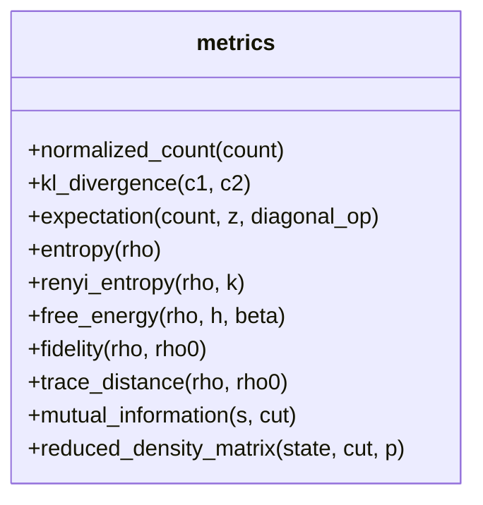
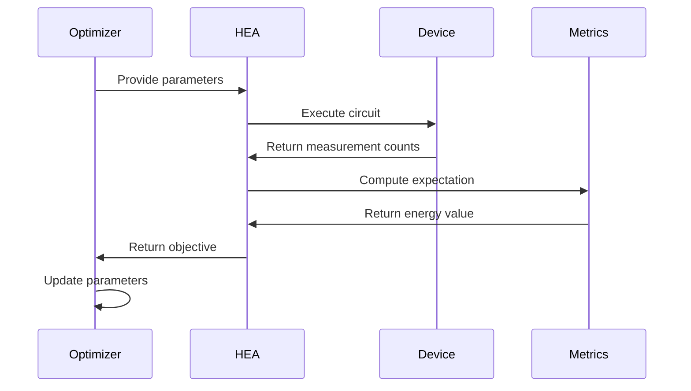
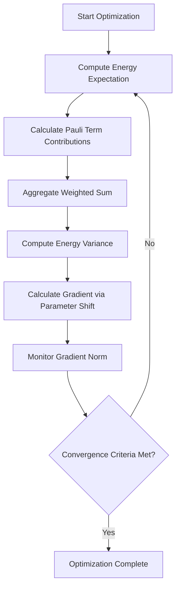
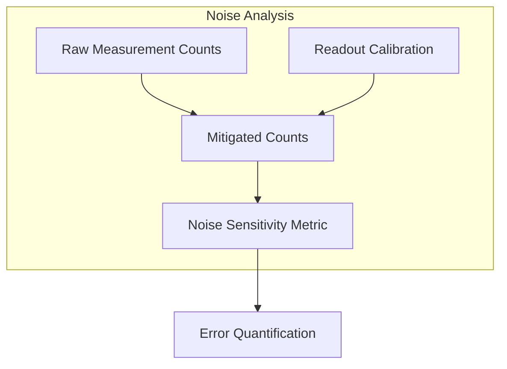
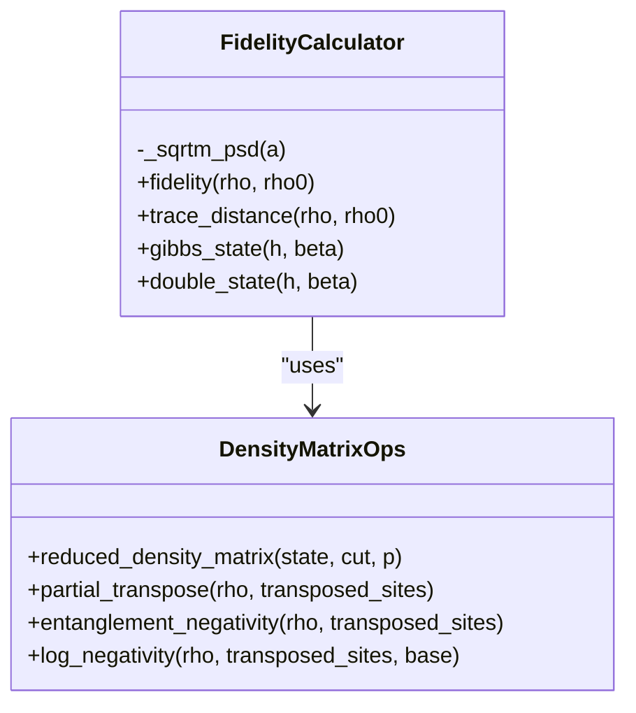
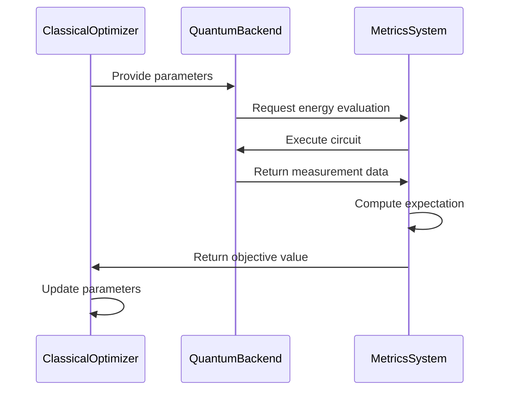
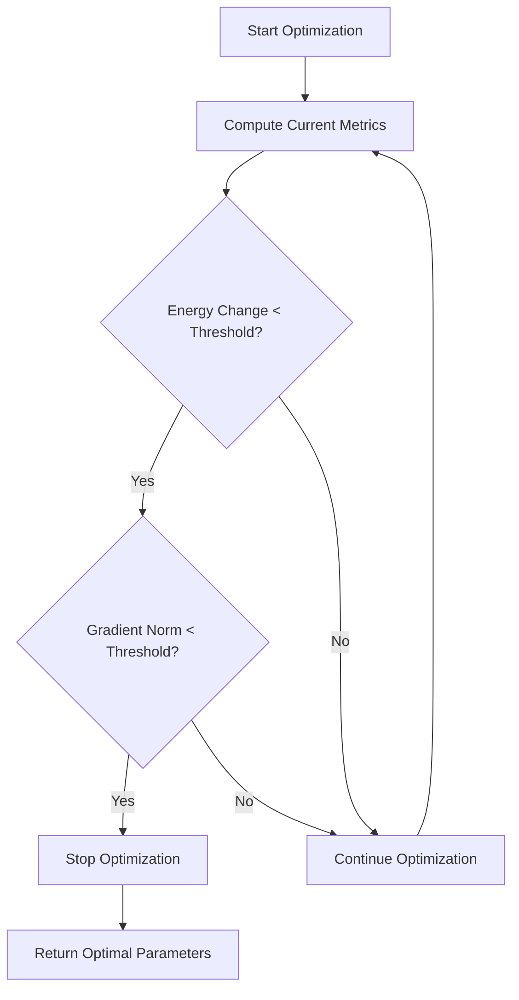
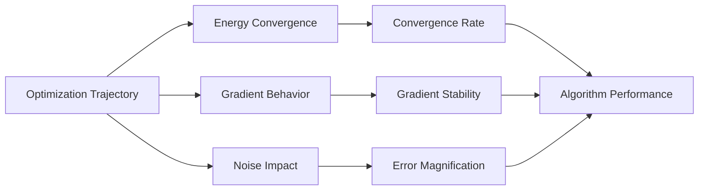

# Metrics and Analysis

<cite>
**Referenced Files in This Document**   
- [metrics.py](file://src/tyxonq/postprocessing/metrics.py)
- [counts_expval.py](file://src/tyxonq/postprocessing/counts_expval.py)
- [vqe_noisyopt.py](file://examples/vqe_noisyopt.py)
- [hea.py](file://src/tyxonq/applications/chem/algorithms/hea.py)
</cite>

## Table of Contents
1. [Introduction](#introduction)
2. [Core Metrics Implementation](#core-metrics-implementation)
3. [Convergence Tracking in Variational Algorithms](#convergence-tracking-in-variational-algorithms)
4. [Energy Variance and Gradient Norm Monitoring](#energy-variance-and-gradient-norm-monitoring)
5. [Noise Sensitivity Metrics](#noise-sensitivity-metrics)
6. [Fidelity Estimation from Measurement Data](#fidelity-estimation-from-measurement-data)
7. [Integration with Classical Optimizers](#integration-with-classical-optimizers)
8. [Early Stopping Criteria](#early-stopping-criteria)
9. [Interpretation of Metric Trends](#interpretation-of-metric-trends)
10. [Conclusion](#conclusion)

## Introduction
This document details the implementation and application of postprocessing metrics used in evaluating quantum algorithm performance, with a focus on variational quantum algorithms such as VQE. The metrics system provides tools for convergence tracking, energy variance calculations, gradient norm monitoring, noise sensitivity analysis, and fidelity estimation. These capabilities are essential for optimizing quantum circuits under realistic hardware constraints and noise models. The implementation is designed to be lightweight and dependency-free, enabling broad applicability across different quantum devices and simulators.

## Core Metrics Implementation
The metrics system is implemented in the `metrics.py` module, providing a comprehensive suite of functions for quantum state analysis and measurement processing. Key metrics include expectation value computation, entropy calculations, free energy estimation, fidelity measurement, and entanglement quantification.

**Diagram sources**
- [metrics.py](file://src/tyxonq/postprocessing/metrics.py#L1-L305)

**Section sources**
- [metrics.py](file://src/tyxonq/postprocessing/metrics.py#L1-L305)

## Convergence Tracking in Variational Algorithms
Convergence tracking is implemented through energy expectation monitoring during variational optimization. The system supports both exact statevector-based evaluation and finite-shot measurement-based estimation. For VQE applications, the energy expectation is computed by aggregating Pauli term measurements, with optional readout error mitigation.

**Diagram sources**
- [metrics.py](file://src/tyxonq/postprocessing/metrics.py#L1-L305)
- [counts_expval.py](file://src/tyxonq/postprocessing/counts_expval.py#L1-L115)
- [hea.py](file://src/tyxonq/applications/chem/algorithms/hea.py#L1-L659)

**Section sources**
- [metrics.py](file://src/tyxonq/postprocessing/metrics.py#L1-L305)
- [counts_expval.py](file://src/tyxonq/postprocessing/counts_expval.py#L1-L115)
- [hea.py](file://src/tyxonq/applications/chem/algorithms/hea.py#L1-L659)

## Energy Variance and Gradient Norm Monitoring
Energy variance and gradient norm monitoring are critical for assessing optimization progress and stability. The system computes energy expectation through Pauli term aggregation, with variance estimated from finite measurement statistics. Gradient norms are derived using parameter shift rules, enabling gradient-based optimization.

**Diagram sources**
- [metrics.py](file://src/tyxonq/postprocessing/metrics.py#L1-L305)
- [counts_expval.py](file://src/tyxonq/postprocessing/counts_expval.py#L1-L115)
- [vqe_noisyopt.py](file://examples/vqe_noisyopt.py#L1-L289)

**Section sources**
- [metrics.py](file://src/tyxonq/postprocessing/metrics.py#L1-L305)
- [counts_expval.py](file://src/tyxonq/postprocessing/counts_expval.py#L1-L115)
- [vqe_noisyopt.py](file://examples/vqe_noisyopt.py#L1-L289)

## Noise Sensitivity Metrics
Noise sensitivity metrics quantify the impact of hardware noise on quantum computations. The system implements readout error mitigation through calibration matrix inversion and supports noise model simulation. These metrics enable accurate error quantification and correction in noisy intermediate-scale quantum (NISQ) devices.

**Diagram sources**
- [metrics.py](file://src/tyxonq/postprocessing/metrics.py#L1-L305)
- [counts_expval.py](file://src/tyxonq/postprocessing/counts_expval.py#L1-L115)

**Section sources**
- [metrics.py](file://src/tyxonq/postprocessing/metrics.py#L1-L305)
- [counts_expval.py](file://src/tyxonq/postprocessing/counts_expval.py#L1-L115)

## Fidelity Estimation from Measurement Data
Fidelity estimation provides a measure of quantum state similarity, crucial for assessing algorithm performance and error mitigation effectiveness. The implementation uses the Uhlmann fidelity formula, computing the trace of the square root of the product of density matrices. This metric is particularly valuable for comparing experimental results with theoretical predictions.

**Diagram sources**
- [metrics.py](file://src/tyxonq/postprocessing/metrics.py#L1-L305)

**Section sources**
- [metrics.py](file://src/tyxonq/postprocessing/metrics.py#L1-L305)

## Integration with Classical Optimizers
The metrics system integrates seamlessly with classical optimization frameworks, supporting both gradient-based and gradient-free methods. The implementation provides objective functions that return energy values for optimization, with optional gradient computation through parameter shift rules. This integration enables efficient variational quantum algorithm execution.

**Diagram sources**
- [metrics.py](file://src/tyxonq/postprocessing/metrics.py#L1-L305)
- [vqe_noisyopt.py](file://examples/vqe_noisyopt.py#L1-L289)
- [hea.py](file://src/tyxonq/applications/chem/algorithms/hea.py#L1-L659)

**Section sources**
- [metrics.py](file://src/tyxonq/postprocessing/metrics.py#L1-L305)
- [vqe_noisyopt.py](file://examples/vqe_noisyopt.py#L1-L289)
- [hea.py](file://src/tyxonq/applications/chem/algorithms/hea.py#L1-L659)

## Early Stopping Criteria
Early stopping criteria are implemented based on metric thresholds to prevent over-optimization and reduce computational costs. The system monitors energy convergence, gradient norm, and other metrics to determine optimal stopping points. This approach balances optimization quality with computational efficiency, particularly important in resource-constrained quantum computing environments.

**Diagram sources**
- [metrics.py](file://src/tyxonq/postprocessing/metrics.py#L1-L305)
- [vqe_noisyopt.py](file://examples/vqe_noisyopt.py#L1-L289)

**Section sources**
- [metrics.py](file://src/tyxonq/postprocessing/metrics.py#L1-L305)
- [vqe_noisyopt.py](file://examples/vqe_noisyopt.py#L1-L289)

## Interpretation of Metric Trends
Interpreting metric trends under different noise models and hardware constraints is essential for effective quantum algorithm development. The system provides tools to analyze optimization trajectories, noise-induced error patterns, and convergence behavior. These insights enable researchers to adapt algorithms to specific hardware characteristics and improve overall performance.

**Diagram sources**
- [metrics.py](file://src/tyxonq/postprocessing/metrics.py#L1-L305)
- [vqe_noisyopt.py](file://examples/vqe_noisyopt.py#L1-L289)

**Section sources**
- [metrics.py](file://src/tyxonq/postprocessing/metrics.py#L1-L305)
- [vqe_noisyopt.py](file://examples/vqe_noisyopt.py#L1-L289)

## Conclusion
The metrics and analysis system provides a comprehensive framework for evaluating quantum algorithm performance, with particular emphasis on variational methods. By implementing convergence tracking, energy variance calculations, gradient norm monitoring, noise sensitivity metrics, and fidelity estimation, the system enables robust optimization and error analysis. The integration with classical optimizers and support for early stopping criteria make it a powerful tool for developing and deploying quantum algorithms on real hardware. These capabilities are essential for advancing quantum computing research and applications in the NISQ era.