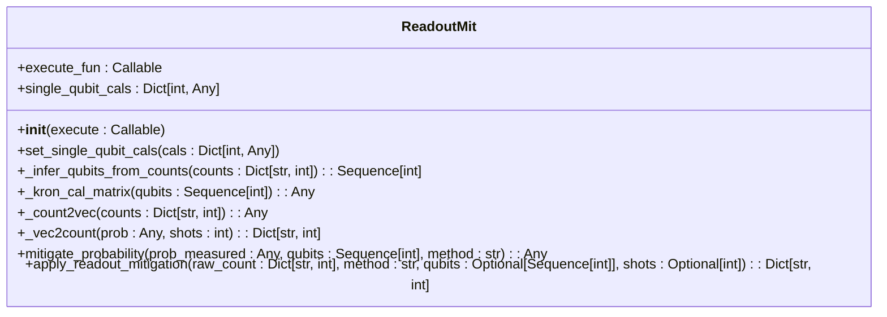

# Postprocessing

<cite>
**Referenced Files in This Document**   
- [postprocessing.rst](file://docs-ng/source/next/user/postprocessing.rst)
- [counts_expval.py](file://src/tyxonq/postprocessing/counts_expval.py)
- [readout.py](file://src/tyxonq/postprocessing/readout.py)
- [classical_shadows.py](file://src/tyxonq/postprocessing/classical_shadows.py)
- [noise_analysis.py](file://src/tyxonq/postprocessing/noise_analysis.py)
- [metrics.py](file://src/tyxonq/postprocessing/metrics.py)
- [shot_scheduler.py](file://src/tyxonq/compiler/stages/scheduling/shot_scheduler.py)
- [hamiltonian_grouping.py](file://src/tyxonq/libs/hamiltonian_encoding/hamiltonian_grouping.py)
</cite>

## Table of Contents
1. [Introduction](#introduction)
2. [Design Philosophy: Counts-First Semantics](#design-philosophy-counts-first-semantics)
3. [Expectation Value Calculation from Counts](#expectation-value-calculation-from-counts)
4. [Error Mitigation Techniques](#error-mitigation-techniques)
   - [Readout Error Correction](#readout-error-correction)
   - [Classical Shadows for Scalable Tomography](#classical-shadows-for-scalable-tomography)
   - [Noise Analysis Tools](#noise-analysis-tools)
5. [Metrics Computation for Algorithm Evaluation](#metrics-computation-for-algorithm-evaluation)
6. [Integration with Compiler-Driven Measurement Grouping and Shot Scheduling](#integration-with-compiler-driven-measurement-grouping-and-shot-scheduling)
7. [Method Selection Guidance](#method-selection-guidance)
8. [Conclusion](#conclusion)

## Introduction
The postprocessing layer in TyxonQ is responsible for transforming raw quantum measurement outcomes into meaningful physical quantities and performance metrics. This document details the architecture and functionality of this layer, focusing on the counts-first processing paradigm, error mitigation strategies, and integration with the compiler's measurement scheduling system. The design emphasizes accuracy, scalability, and noise resilience in the analysis of quantum algorithm results.

**Section sources**
- [postprocessing.rst](file://docs-ng/source/next/user/postprocessing.rst#L1-L7)

## Design Philosophy: Counts-First Semantics
The postprocessing layer adheres to a counts-first semantics, where raw measurement counts are the primary input for all subsequent analysis. This approach ensures that all computations are grounded in the actual experimental or simulated data, preserving the statistical nature of quantum measurements. The philosophy prioritizes processing the histogram of bitstrings before any aggregation or expectation value calculation, which allows for the application of error mitigation techniques at the most fundamental level. This design enables accurate propagation of statistical uncertainties and supports advanced analysis methods like classical shadows and readout error correction.

**Section sources**
- [counts_expval.py](file://src/tyxonq/postprocessing/counts_expval.py#L1-L114)
- [metrics.py](file://src/tyxonq/postprocessing/metrics.py#L1-L304)

## Expectation Value Calculation from Counts
The core of the postprocessing layer is the computation of expectation values from raw measurement counts. The `expval_pauli_sum` function in `counts_expval.py` serves as the primary entry point, aggregating energy values from a sum of Pauli terms. It processes a dictionary of bitstring counts, where each key is a binary string (e.g., "010") and the value is the number of times that outcome was observed. For each Pauli term, the function calculates the expectation by iterating over the counts, assigning a sign (+1 or -1) to each bit based on the Pauli operator (Z) at the corresponding qubit position, and summing the weighted contributions. The final energy is computed by combining these individual expectation values with their respective coefficients. This method is efficient and directly reflects the empirical distribution of measurement outcomes.

```mermaid
flowchart TD
Start([Raw Counts]) --> Validate["Validate Input Counts"]
Validate --> ProcessTerms["For Each Pauli Term"]
ProcessTerms --> ExtractIndices["Extract Qubit Indices"]
ExtractIndices --> ComputeSign["Compute Sign for Each Bitstring"]
ComputeSign --> Accumulate["Accumulate Weighted Contributions"]
Accumulate --> Normalize["Normalize by Total Shots"]
Normalize --> StoreExpval["Store Expectation Value"]
StoreExpval --> NextTerm["Next Term?"]
NextTerm --> |Yes| ProcessTerms
NextTerm --> |No| Aggregate["Aggregate with Coefficients"]
Aggregate --> ReturnEnergy["Return Total Energy"]
ReturnEnergy --> End([Output: {energy, expvals}])
```

**Diagram sources**
- [counts_expval.py](file://src/tyxonq/postprocessing/counts_expval.py#L86-L111)

**Section sources**
- [counts_expval.py](file://src/tyxonq/postprocessing/counts_expval.py#L1-L114)

## Error Mitigation Techniques

### Readout Error Correction
The `ReadoutMit` class provides robust readout error correction by applying inverse calibration matrices to the measured counts. It operates by first converting the raw count dictionary into a probability vector using the `_count2vec` method. The class maintains per-qubit 2x2 calibration matrices, which are combined via Kronecker product to form the full system calibration matrix using the `_kron_cal_matrix` method. The mitigation is performed by solving the linear system `A * p_true = p_measured`, where `A` is the calibration matrix. Two methods are supported: direct matrix inversion using the pseudo-inverse (`method="inverse"`) and constrained least squares optimization to ensure the corrected probabilities remain non-negative and sum to one. The corrected probability vector is then converted back to integer counts using `_vec2count`, preserving the total number of shots.



**Diagram sources**
- [readout.py](file://src/tyxonq/postprocessing/readout.py#L14-L136)

**Section sources**
- [readout.py](file://src/tyxonq/postprocessing/readout.py#L1-L142)

### Classical Shadows for Scalable Tomography
The classical shadows module enables scalable estimation of quantum state properties without full state tomography. The `random_pauli_basis` function generates random measurement bases for each shot, while `estimate_expectation_pauli_product` computes the expectation of a target Pauli observable by post-selecting shots where the measurement basis matches the observable. This method provides an unbiased estimate with variance that scales favorably with system size. The workflow involves measuring the same circuit in randomly chosen Pauli bases, recording the outcomes, and then using the `bitstrings_to_bits` function to convert the results into a format suitable for analysis. This approach is particularly efficient for estimating low-weight observables and is a key tool for large-scale quantum simulations.

**Section sources**
- [classical_shadows.py](file://src/tyxonq/postprocessing/classical_shadows.py#L1-L114)

### Noise Analysis Tools
The noise analysis utilities provide lightweight methods to simulate the effects of common noise channels directly on classical count data. The `apply_bitflip_counts` function models independent bit-flip noise by probabilistically flipping each bit in the count distribution, distributing the probability mass to neighboring bitstrings. The `apply_depolarizing_counts` function approximates an n-qubit depolarizing channel by taking a convex combination of the original counts and a uniform distribution over all possible bitstrings. These tools are designed for rapid what-if analysis and baseline comparisons, allowing users to assess the robustness of their algorithms to noise without requiring full quantum state simulation.

**Section sources**
- [noise_analysis.py](file://src/tyxonq/postprocessing/noise_analysis.py#L1-L105)

## Metrics Computation for Algorithm Evaluation
The metrics module offers a comprehensive suite of functions for evaluating algorithm performance and quantum state properties. The `expectation` function computes the expectation value of a diagonal observable from counts, supporting both Z-basis measurements and arbitrary diagonal operators. Divergence metrics like `kl_divergence` quantify the difference between two probability distributions. For density matrix analysis, functions such as `entropy`, `fidelity`, and `trace_distance` provide measures of state purity, similarity, and distinguishability. The `reduced_density_matrix` function enables the calculation of subsystem properties, which is essential for entanglement analysis. These metrics are implemented with minimal dependencies, ensuring broad compatibility across different execution backends.

**Section sources**
- [metrics.py](file://src/tyxonq/postprocessing/metrics.py#L1-L304)

## Integration with Compiler-Driven Measurement Grouping and Shot Scheduling
The postprocessing layer is tightly integrated with the compiler's measurement optimization pipeline. The `shot_scheduler.py` module consumes the `measurement_groups` metadata attached to a circuit by the compiler's measurement rewrite stage. This metadata contains information about grouped Pauli terms that can be measured simultaneously in a common basis. The `schedule` function uses the `estimated_shots_per_group` weights from these groups to distribute the total shot budget proportionally, ensuring that more resources are allocated to terms with higher coefficients or variances. The resulting execution plan consists of segments, each specifying the number of shots, measurement basis, and qubit wires, which are then executed to produce the raw counts for postprocessing. This integration ensures an optimal and efficient use of quantum resources.

**Section sources**
- [shot_scheduler.py](file://src/tyxonq/compiler/stages/scheduling/shot_scheduler.py#L1-L136)
- [hamiltonian_grouping.py](file://src/tyxonq/libs/hamiltonian_encoding/hamiltonian_grouping.py#L1-L66)

## Method Selection Guidance
Selecting the appropriate postprocessing method depends on the circuit size, noise levels, and required accuracy. For small circuits (<20 qubits) with high noise, full readout error mitigation using `ReadoutMit` is recommended. For larger circuits, classical shadows provide a scalable alternative for estimating specific observables. In low-noise environments or for high-accuracy requirements, the basic counts-to-expectation pipeline is sufficient. When shot budget is limited, the compiler-driven shot scheduling ensures optimal allocation across measurement groups. For algorithm benchmarking, the full suite of metrics in `metrics.py` should be employed to assess both accuracy and robustness.

**Section sources**
- [counts_expval.py](file://src/tyxonq/postprocessing/counts_expval.py#L1-L114)
- [readout.py](file://src/tyxonq/postprocessing/readout.py#L1-L142)
- [classical_shadows.py](file://src/tyxonq/postprocessing/classical_shadows.py#L1-L114)
- [metrics.py](file://src/tyxonq/postprocessing/metrics.py#L1-L304)

## Conclusion
The postprocessing layer in TyxonQ provides a robust and flexible framework for analyzing quantum computation results. By adhering to a counts-first philosophy, it ensures that all analyses are grounded in empirical data. The integration of advanced error mitigation techniques, scalable tomography methods, and comprehensive metrics enables accurate and reliable evaluation of quantum algorithms. Its seamless connection with the compiler's measurement optimization ensures efficient resource utilization, making it a critical component for both research and practical applications in quantum computing.