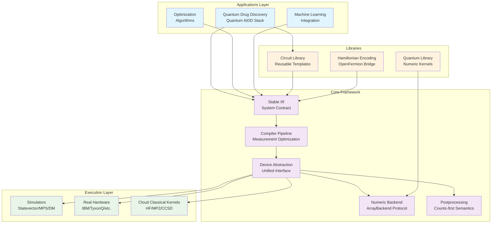
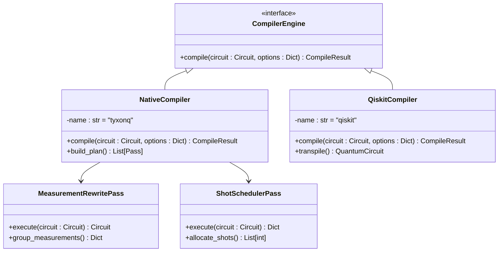
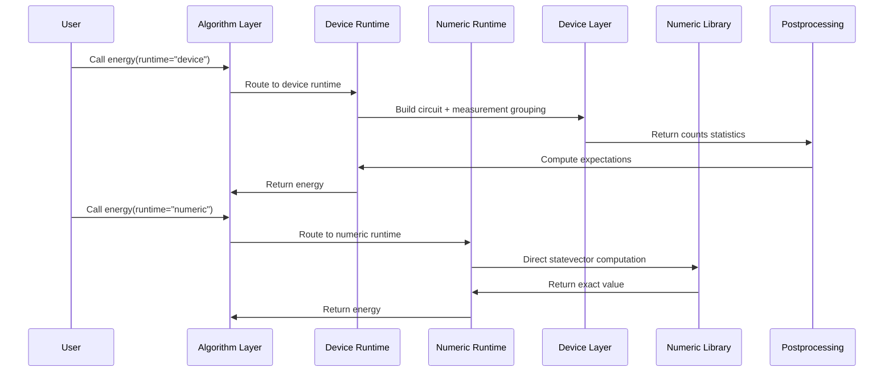

# Project Overview

<cite>
**Referenced Files in This Document**   
- [README.md](file://README.md)
- [TYXONQ_TECHNICAL_WHITEPAPER.md](file://TYXONQ_TECHNICAL_WHITEPAPER.md)
- [src/tyxonq/core/ir/circuit.py](file://src/tyxonq/core/ir/circuit.py)
- [src/tyxonq/numerics/api.py](file://src/tyxonq/numerics/api.py)
- [src/tyxonq/devices/base.py](file://src/tyxonq/devices/base.py)
- [src/tyxonq/postprocessing/__init__.py](file://src/tyxonq/postprocessing/__init__.py)
</cite>

## Table of Contents
1. [Introduction](#introduction)
2. [Framework Purpose and Vision](#framework-purpose-and-vision)
3. [Core Architectural Principles](#core-architectural-principles)
4. [Key Innovations](#key-innovations)
5. [Integration with Quantum Chemistry](#integration-with-quantum-chemistry)
6. [Target Audience and Use Cases](#target-audience-and-use-cases)
7. [Performance and Extensibility](#performance-and-extensibility)
8. [Practical Usage Examples](#practical-usage-examples)
9. [Conclusion](#conclusion)

## Introduction
TyxonQ is a next-generation modular full-stack quantum software framework designed to bridge the gap between quantum research and real-world applications. The framework provides a stable intermediate representation (IR), pluggable compiler, unified device abstraction, and single numerics backend interface. This document provides a comprehensive overview of TyxonQ's architecture, innovations, and capabilities, focusing on its role in enabling hardware-realistic quantum programming for advanced applications in quantum chemistry and drug discovery.

## Framework Purpose and Vision
TyxonQ aims to revolutionize quantum software engineering by addressing critical challenges in the quantum computing ecosystem. The framework's vision centers on creating a system-architect-friendly, hardware-realistic programming model that mirrors real device execution while maintaining simplicity for engineers and scientists. TyxonQ's core mission is to enable quantum computational chemistry for advanced AI drug design (Quantum AIDD), providing researchers with the tools to generate microscopic quantum chemistry data and robust computational methods for AI-driven drug discovery.

The framework is designed to prioritize drug design applications by offering missing quantum chemistry data and computational tools that integrate seamlessly with AI drug discovery pipelines. TyxonQ's architecture ensures that algorithms developed for research can be directly deployed on real quantum hardware without code modifications, eliminating the traditional gap between research and production environments.

**Section sources**
- [README.md](file://README.md#L1-L50)
- [TYXONQ_TECHNICAL_WHITEPAPER.md](file://TYXONQ_TECHNICAL_WHITEPAPER.md#L1-L100)

## Core Architectural Principles
TyxonQ's architecture is built on five foundational principles that address the fragmentation and unpredictability issues prevalent in quantum software ecosystems.

### Stable Intermediate Representation (IR)
The framework employs a minimal, stable IR as a system-wide contract between components. This IR contains only essential information—number of qubits and operation sequences—while maintaining genericity to allow different backends to interpret operations according to their requirements. The stable IR ensures structural validation through compile-time type safety and runtime integrity checks, providing a reliable foundation for the entire framework.

### Pluggable Compiler Architecture
TyxonQ features a modular compiler architecture that supports multiple compilation engines while maintaining compatibility with mainstream quantum ecosystems. The compiler elevates critical optimization logic—such as measurement grouping and shot scheduling—from the device layer to the compiler layer, ensuring deterministic and predictable quantum program execution. This approach enables compiler-driven measurement optimization with explicit grouping and shot scheduling, solving the problem of scattered measurement semantics across different quantum vendors.

### Unified Device Abstraction
The framework provides a unified device interface that abstracts both simulators and real quantum hardware. This abstraction layer ensures explicit shots/noise semantics, where `shots=0` indicates exact simulation and `shots>0` indicates sampling simulation. All device drivers return a consistent result format, enabling cross-vendor portability and predictable behavior across different quantum platforms.

### Single Numerics Backend Interface
TyxonQ implements a unified ArrayBackend protocol that supports NumPy, PyTorch, and CuPyNumeric, enabling seamless switching between different numeric computing frameworks. This single backend abstraction allows researchers to write quantum algorithms once and run them across different computational environments without code modifications, supporting both CPU and GPU acceleration with transparent gradient integration.

### Counts-First Postprocessing
The framework adopts a counts-first semantics approach, where all device drivers return uniform counts format, and expectations are computed by a unified postprocessing layer. This design ensures cross-vendor consistency and enables pluggable mitigation strategies such as readout correction and zero-noise extrapolation to be standardized in the postprocessing layer.



**Diagram sources**
- [TYXONQ_TECHNICAL_WHITEPAPER.md](file://TYXONQ_TECHNICAL_WHITEPAPER.md#L150-L250)

**Section sources**
- [TYXONQ_TECHNICAL_WHITEPAPER.md](file://TYXONQ_TECHNICAL_WHITEPAPER.md#L250-L400)
- [src/tyxonq/core/ir/circuit.py](file://src/tyxonq/core/ir/circuit.py#L1-L100)
- [src/tyxonq/numerics/api.py](file://src/tyxonq/numerics/api.py#L1-L50)
- [src/tyxonq/devices/base.py](file://src/tyxonq/devices/base.py#L1-L50)

## Key Innovations
TyxonQ introduces several groundbreaking innovations that distinguish it from existing quantum software frameworks.

### Chain API Pattern
The framework's chain-style API explicitly models the entire execution flow of quantum programs as a linear chain: `Circuit.compile().device(...).postprocessing(...).run()`. This pattern provides execution flow transparency, making it easy to understand and debug the compilation, device selection, and postprocessing stages. The chain API supports modular assembly, allowing each node to be independently configured with different optimization strategies, and implements lazy execution, where only calling `.run()` triggers actual execution.

### Counts-First Postprocessing
TyxonQ's counts-first semantics ensure that all device raw outputs are normalized through a unified postprocessing layer, achieving format consistency across different quantum vendors. This approach enables pluggable mitigation strategies such as readout correction and zero-noise extrapolation to be uniformly managed in the postprocessing layer, with smart processing based on compiler-generated measurement metadata.



**Diagram sources**
- [TYXONQ_TECHNICAL_WHITEPAPER.md](file://TYXONQ_TECHNICAL_WHITEPAPER.md#L250-L350)

### Dual Execution Paths
TyxonQ's dual-path execution model provides semantic consistency while separately optimizing device and numeric paths. The device path is optimized for real hardware execution, handling measurement grouping, shot scheduling, and noise models, while the numeric path is optimized for fast iteration and gradient computation using exact statevector or matrix product state simulations. This dual-path approach enables researchers to maintain fast iteration cycles with exact numeric simulations while ensuring seamless transition to realistic hardware execution with consistent semantics.



**Diagram sources**
- [TYXONQ_TECHNICAL_WHITEPAPER.md](file://TYXONQ_TECHNICAL_WHITEPAPER.md#L450-L550)

**Section sources**
- [TYXONQ_TECHNICAL_WHITEPAPER.md](file://TYXONQ_TECHNICAL_WHITEPAPER.md#L400-L600)
- [src/tyxonq/core/ir/circuit.py](file://src/tyxonq/core/ir/circuit.py#L500-L600)
- [src/tyxonq/postprocessing/__init__.py](file://src/tyxonq/postprocessing/__init__.py#L1-L20)

## Integration with Quantum Chemistry
TyxonQ provides comprehensive support for quantum chemistry applications, particularly in the domain of AI-driven drug discovery (Quantum AIDD).

### Quantum AIDD Application Stack
The framework's quantum chemistry stack exemplifies the dual-path execution model with domain-specific optimizations for drug discovery workflows. It supports a wide range of quantum chemistry algorithms including HEA, UCC, UCCSD, k-UpCCGSD, and pUCCD, all exposing a consistent energy/gradient/kernel API. The stack integrates seamlessly with established quantum chemistry tools like PySCF, enabling validation of results against reference calculations.

### Drug-Design-Oriented Features
TyxonQ prioritizes drug-design-oriented Hamiltonians and workflows, including ligand-receptor fragments, solvent/embedding models, and coarse-grained representations. The framework provides method optimization for AIDD tasks with tailored ansatz design, measurement grouping, batched parameter-shift/QNG, and adaptive shot allocation. It also offers AI-for-QC bridges with standardized data schemas for exporting quantum chemistry data (energies, RDMs, expectations, ansatz, active space) to support QC algorithm development.

### Cloud-Local Hybrid Classical Acceleration
For quantum chemistry workflows, TyxonQ implements a cloud-local hybrid classical acceleration path that offloads heavy PySCF kernels (HF/post-HF) to cloud resources while keeping VQE iteration locally controlled. This approach uses artifact-based HF state transfer via chkfile artifacts, preserving local control of VQE optimization while leveraging cloud computing resources for computationally intensive tasks.

**Section sources**
- [README.md](file://README.md#L150-L200)
- [TYXONQ_TECHNICAL_WHITEPAPER.md](file://TYXONQ_TECHNICAL_WHITEPAPER.md#L600-L700)

## Target Audience and Use Cases
TyxonQ is designed for three primary audiences: quantum researchers, computational chemists, and quantum machine learning practitioners.

### Quantum Researchers
For quantum researchers, TyxonQ provides a hardware-realistic programming model that enables the development of quantum algorithms with direct applicability to real quantum hardware. The framework's stable IR and pluggable compiler architecture allow researchers to focus on algorithm design while ensuring compatibility with different quantum platforms.

### Computational Chemists
Computational chemists benefit from TyxonQ's PySCF-like user experience with hardware readiness. The framework's quantum chemistry stack provides familiar molecule and ansatz APIs that route to device or numeric execution paths without code changes, enabling computational chemists to leverage quantum computing for advanced molecular simulations and drug discovery applications.

### Quantum ML Practitioners
Quantum machine learning practitioners can leverage TyxonQ's single numeric backend interface to integrate quantum algorithms with machine learning workflows. The framework's support for PyTorch autograd enables seamless integration of quantum circuits into deep learning pipelines, supporting end-to-end training of hybrid quantum-classical models.

**Section sources**
- [README.md](file://README.md#L1-L100)
- [TYXONQ_TECHNICAL_WHITEPAPER.md](file://TYXONQ_TECHNICAL_WHITEPAPER.md#L1-L150)

## Performance and Extensibility
TyxonQ is designed with performance and extensibility as core considerations.

### Performance Characteristics
The framework's architecture enables optimal performance across different execution scenarios. The dual-path execution model allows researchers to use the numeric path for fast iteration and gradient computation during algorithm development, then seamlessly switch to the device path for hardware-realistic execution. The single numeric backend abstraction supports GPU acceleration through PyTorch and CuPyNumeric, enabling high-performance computation for large-scale quantum simulations.

### Scalability
TyxonQ's modular architecture supports scalability through several mechanisms. The framework includes simulators for different quantum representations (statevector, density matrix, matrix product state), allowing users to select the appropriate simulation method based on system size and computational resources. The cloud-local hybrid classical acceleration path enables scaling of computationally intensive quantum chemistry calculations by offloading heavy kernels to cloud resources.

### Extensibility Points
The framework provides multiple extensibility points for specialized applications. The pluggable compiler architecture allows for the addition of custom compilation passes, while the unified device abstraction enables integration with new quantum hardware platforms. The domain layer is designed to be extensible, supporting modular extensions for specialized algorithms and chemistry libraries.

**Section sources**
- [TYXONQ_TECHNICAL_WHITEPAPER.md](file://TYXONQ_TECHNICAL_WHITEPAPER.md#L700-L780)
- [src/tyxonq/numerics/api.py](file://src/tyxonq/numerics/api.py#L100-L150)

## Practical Usage Examples
TyxonQ provides straightforward usage patterns for both general quantum computing and quantum chemistry applications.

### Minimal Circuit Execution
The framework supports a simple chain API for circuit execution that works across simulators and real quantum hardware:

```python
import tyxonq as tq
from tyxonq.postprocessing import metrics

tq.set_backend("numpy")

# Build quantum circuit
c = tq.Circuit(2).h(0).cx(0, 1).measure_z(0).measure_z(1)

# Execute on simulator
sim = (
    c.compile()
     .device(provider="simulator", device="statevector", shots=4096)
     .postprocessing(method=None)
     .run()
)

# Execute on real hardware
hw = (
    c.compile(output="qasm")
     .device(provider="tyxonq", device="homebrew_s2", shots=4096)
     .run()
)
```

### Quantum Chemistry Workflow
For quantum chemistry applications, TyxonQ provides a PySCF-like interface that routes to device or numeric execution paths:

```python
import tyxonq as tq
from tyxonq.applications.chem.algorithms.uccsd import UCCSD
from tyxonq.applications.chem import molecule

tq.set_backend("numpy")

# Create UCCSD instance for H2 molecule
ucc = UCCSD(molecule.h2)

# Execute on simulator (counts → energy)
e = ucc.kernel(shots=2048, provider="simulator", device="statevector")

# Execute on real machine (counts → energy)
# e = ucc.kernel(shots=2048, provider="tyxonq", device="homebrew_s2")
```

**Section sources**
- [README.md](file://README.md#L100-L200)

## Conclusion
TyxonQ represents a significant advancement in quantum software engineering by introducing novel architectural patterns that solve fundamental challenges in the quantum computing ecosystem. The framework's five key innovations—stable IR, compiler-driven measurement optimization, dual-path execution, counts-first semantics, and single numeric backend abstraction—collectively address the fragmentation, unpredictability, and vendor lock-in issues that have hindered the maturity of quantum software.

The dual-path execution model is particularly innovative, enabling researchers to maintain fast iteration cycles with exact numeric simulations while ensuring seamless transition to realistic hardware execution with consistent semantics. This bridges the traditional gap between research and deployment in quantum computing.

The Quantum AIDD application stack demonstrates how domain-specific optimizations for AI-driven drug discovery can be elegantly integrated into a general framework without compromising core architectural principles. By providing PySCF-level user experience with hardware readiness, TyxonQ enables quantum chemists and pharmaceutical researchers to focus on scientific problems rather than software engineering challenges.

TyxonQ's modular architecture and clear separation of concerns position it well for the evolving quantum computing landscape, ensuring that innovations can be rapidly integrated without disrupting existing workflows. The framework's emphasis on reproducibility, portability, and hardware realism makes it particularly valuable for the quantum computing community as it transitions from experimental research to practical applications in drug discovery and pharmaceutical research.