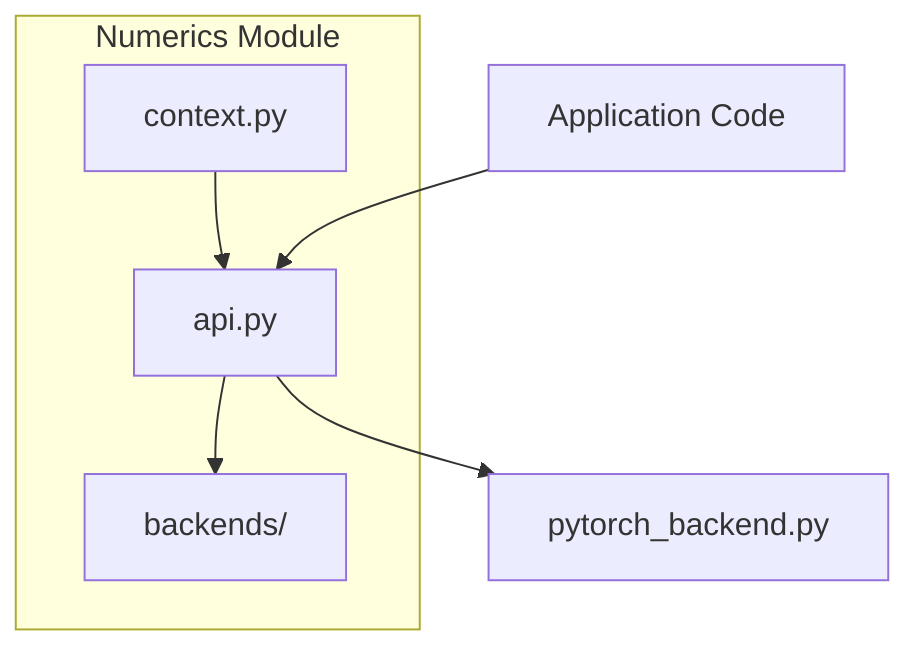
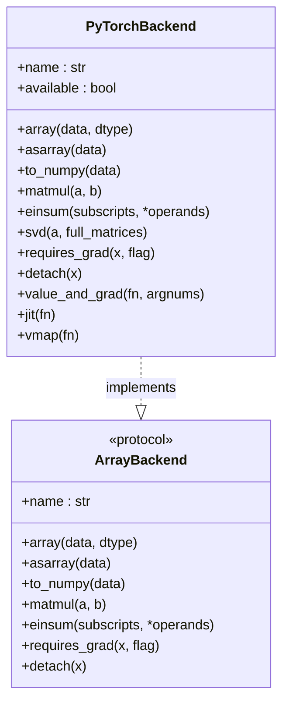
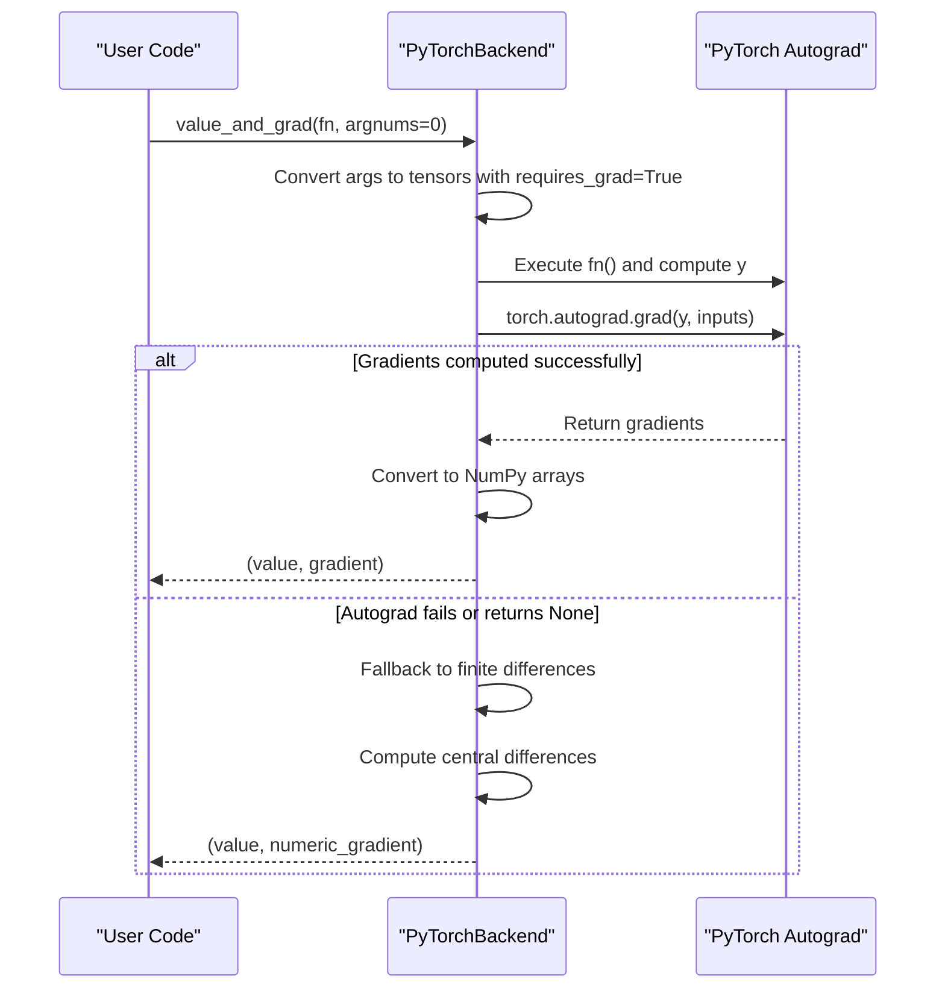
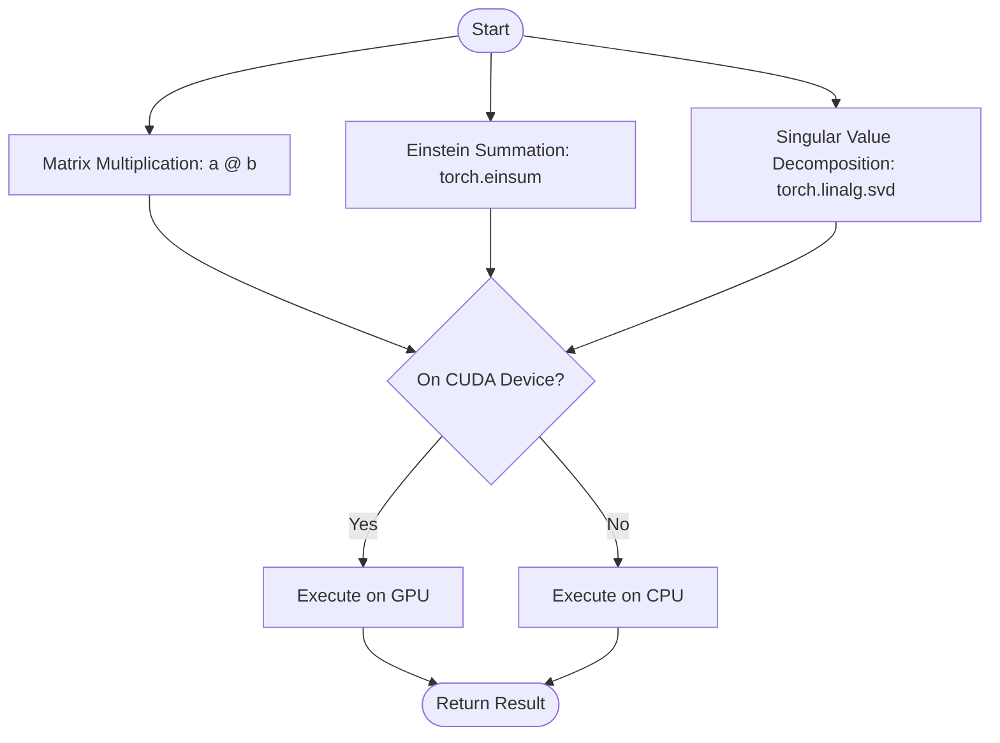
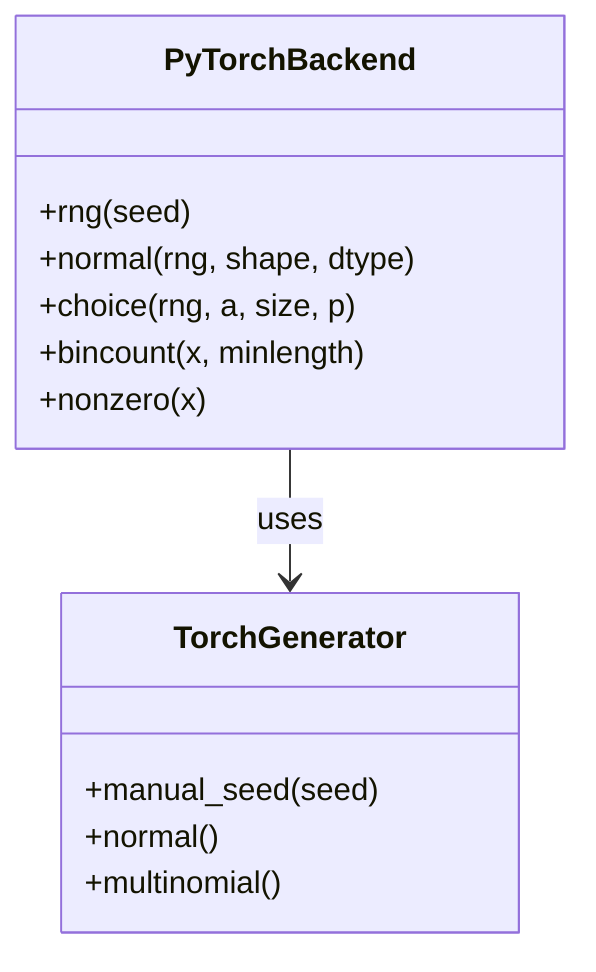
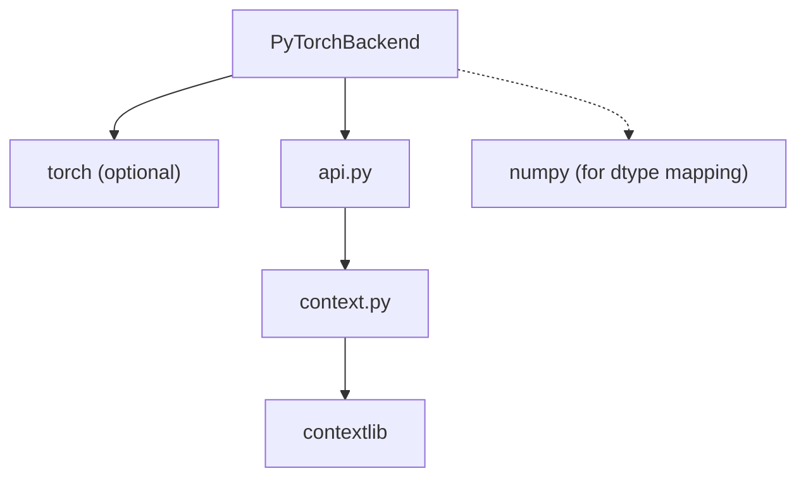

# PyTorch Backend

<cite>
**Referenced Files in This Document**   
- [pytorch_backend.py](file://src/tyxonq/numerics/backends/pytorch_backend.py)
- [api.py](file://src/tyxonq/numerics/api.py)
- [context.py](file://src/tyxonq/numerics/context.py)
</cite>

## Table of Contents
1. [Introduction](#introduction)
2. [Project Structure](#project-structure)
3. [Core Components](#core-components)
4. [Architecture Overview](#architecture-overview)
5. [Detailed Component Analysis](#detailed-component-analysis)
6. [Dependency Analysis](#dependency-analysis)
7. [Performance Considerations](#performance-considerations)
8. [Troubleshooting Guide](#troubleshooting-guide)
9. [Conclusion](#conclusion)

## Introduction
The PyTorch backend in TyxonQ provides GPU-accelerated computation and automatic differentiation capabilities through integration with PyTorch tensors. It implements the `ArrayBackend` protocol to enable seamless array operations, gradient tracking, and device management for quantum simulations and variational algorithms. This backend supports CUDA-enabled execution, automatic gradient computation via `requires_grad()`, and detachment from computation graphs using `detach()`. It also integrates with PyTorch's random number generator and provides optimized implementations of key tensor operations such as `matmul`, `einsum`, and `svd`. Designed for large-scale quantum simulations, this backend enables high-performance workflows interoperable with machine learning pipelines while managing challenges related to GPU non-determinism.

## Project Structure
The PyTorch backend is located within the numerics module of the TyxonQ library, specifically under `src/tyxonq/numerics/backends/pytorch_backend.py`. The backend interacts with core numerical APIs defined in `api.py` and uses global configuration utilities from `context.py` to manage backend selection. The structure supports pluggable backends, allowing users to switch between NumPy, PyTorch, and CuPyNumeric implementations based on performance and feature requirements.

**Diagram sources**
- [pytorch_backend.py](file://src/tyxonq/numerics/backends/pytorch_backend.py#L1-L20)
- [api.py](file://src/tyxonq/numerics/api.py#L1-L10)
- [context.py](file://src/tyxonq/numerics/context.py#L1-L10)

**Section sources**
- [pytorch_backend.py](file://src/tyxonq/numerics/backends/pytorch_backend.py#L1-L50)
- [api.py](file://src/tyxonq/numerics/api.py#L1-L20)
- [context.py](file://src/tyxonq/numerics/context.py#L1-L15)

## Core Components
The core component of the PyTorch backend is the `PyTorchBackend` class, which implements the `ArrayBackend` protocol. This class provides tensor creation, mathematical operations, linear algebra routines, and autodiff support using PyTorch's computational graph. Key methods include `array`, `matmul`, `einsum`, `svd`, `requires_grad`, and `detach`. The backend also exposes `vmap` and `jit` wrappers when available, enabling vectorized execution and compilation optimizations. Error handling ensures graceful fallback when PyTorch is not installed or CUDA is unavailable.

**Section sources**
- [pytorch_backend.py](file://src/tyxonq/numerics/backends/pytorch_backend.py#L12-L100)
- [api.py](file://src/tyxonq/numerics/api.py#L18-L101)

## Architecture Overview
The PyTorch backend architecture follows a protocol-based design where `PyTorchBackend` conforms to the `ArrayBackend` interface. This allows runtime swapping of numerical backends while maintaining consistent API usage. The backend delegates tensor operations directly to PyTorch, leverages its autograd engine for gradient computation, and manages device placement through standard PyTorch mechanisms. Integration with the global backend context enables both per-call and global backend configuration.

**Diagram sources**
- [pytorch_backend.py](file://src/tyxonq/numerics/backends/pytorch_backend.py#L12-L256)
- [api.py](file://src/tyxonq/numerics/api.py#L18-L101)

## Detailed Component Analysis

### PyTorch Backend Implementation
The `PyTorchBackend` class implements all required and optional methods of the `ArrayBackend` protocol. It wraps PyTorch tensor operations with consistent signatures, enabling drop-in replacement for other backends. The implementation handles dtype conversion via `_to_torch_dtype`, supports GPU execution transparently, and integrates with PyTorch’s automatic differentiation system.

#### Automatic Differentiation and Gradient Tracking
The backend supports gradient computation through `requires_grad()` and `detach()` methods, which interface directly with PyTorch's autograd system. The `value_and_grad` method provides a higher-order function that returns both function values and gradients, with automatic fallback to numerical differentiation if autograd fails.

**Diagram sources**
- [pytorch_backend.py](file://src/tyxonq/numerics/backends/pytorch_backend.py#L199-L256)

**Section sources**
- [pytorch_backend.py](file://src/tyxonq/numerics/backends/pytorch_backend.py#L171-L177)
- [pytorch_backend.py](file://src/tyxonq/numerics/backends/pytorch_backend.py#L199-L256)

#### Tensor Operations and Linear Algebra
The backend implements key tensor operations including `matmul`, `einsum`, and `svd` using native PyTorch functions. These operations benefit from GPU acceleration when tensors are placed on CUDA devices. The `einsum` method supports flexible tensor contractions, while `svd` provides singular value decomposition with configurable matrix formats.

**Diagram sources**
- [pytorch_backend.py](file://src/tyxonq/numerics/backends/pytorch_backend.py#L50-L90)

**Section sources**
- [pytorch_backend.py](file://src/tyxonq/numerics/backends/pytorch_backend.py#L50-L90)

#### Random Number Generation and Sampling
The backend integrates with PyTorch's random number generator via the `rng()` and `normal()` methods. It implements discrete sampling operations like `choice` and `bincount` using PyTorch primitives, with CPU fallback for compatibility.

**Diagram sources**
- [pytorch_backend.py](file://src/tyxonq/numerics/backends/pytorch_backend.py#L150-L170)

**Section sources**
- [pytorch_backend.py](file://src/tyxonq/numerics/backends/pytorch_backend.py#L150-L170)

## Dependency Analysis
The PyTorch backend depends on the optional availability of the `torch` package, which is imported with error handling to support graceful degradation. It integrates with the global backend configuration system through `context.py` and adheres to the `ArrayBackend` protocol defined in `api.py`. The backend uses lazy import patterns to avoid hard dependencies, enabling modular deployment.

**Diagram sources**
- [pytorch_backend.py](file://src/tyxonq/numerics/backends/pytorch_backend.py#L1-L20)
- [api.py](file://src/tyxonq/numerics/api.py#L1-L30)
- [context.py](file://src/tyxonq/numerics/context.py#L1-L10)

**Section sources**
- [pytorch_backend.py](file://src/tyxonq/numerics/backends/pytorch_backend.py#L1-L30)
- [api.py](file://src/tyxonq/numerics/api.py#L1-L30)
- [context.py](file://src/tyxonq/numerics/context.py#L1-L30)

## Performance Considerations
The PyTorch backend delivers significant performance benefits for large-scale quantum simulations and variational algorithms by leveraging GPU acceleration. Operations such as matrix multiplication, tensor contractions, and SVD scale efficiently on CUDA-enabled devices. The `jit` method attempts to use `torch.compile` for further optimization when available. However, GPU non-determinism may affect reproducibility in deterministic computations, requiring careful seed management and synchronization. For maximum performance, users should ensure tensors are created on the target device and minimize host-device transfers.

## Troubleshooting Guide
Common issues include missing PyTorch installations, CUDA unavailability, and gradient computation failures. The backend raises descriptive errors when PyTorch is not importable or when requested operations fail. Users should verify installation via `pip install torch` and check GPU availability using `torch.cuda.is_available()`. When autograd fails, the `value_and_grad` function automatically falls back to numerical differentiation. Device placement errors can be resolved by explicitly moving tensors using standard PyTorch `.to(device)` syntax.

**Section sources**
- [pytorch_backend.py](file://src/tyxonq/numerics/backends/pytorch_backend.py#L1-L30)
- [api.py](file://src/tyxonq/numerics/api.py#L159-L191)

## Conclusion
The PyTorch backend in TyxonQ provides a powerful foundation for GPU-accelerated quantum computing workflows with full support for automatic differentiation. By implementing the `ArrayBackend` protocol, it enables seamless switching between numerical backends while exposing PyTorch's high-performance tensor operations and autograd system. Its design supports large-scale variational algorithms, integrates with machine learning pipelines, and handles error conditions gracefully. With proper configuration, it delivers substantial performance gains for quantum simulations, making it ideal for research and production environments requiring high computational throughput.