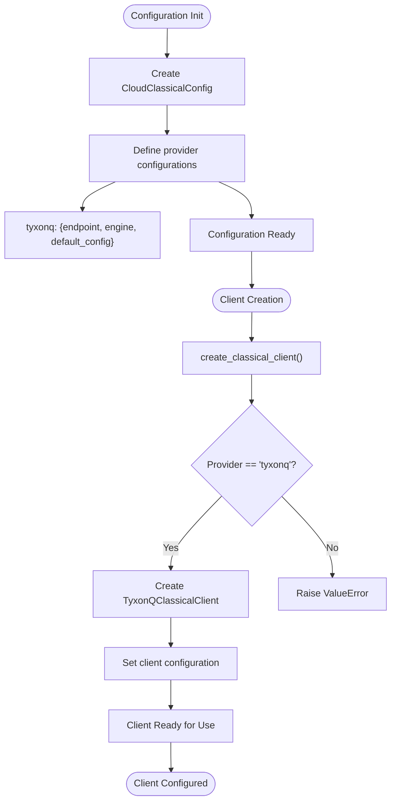

# Classical Chemistry Integration

<cite>
**Referenced Files in This Document**   
- [app.py](file://src/tyxonq/applications/chem/classical_chem_cloud/server/app.py)
- [classical_methods.py](file://src/tyxonq/applications/chem/classical_chem_cloud/classical_methods.py)
- [clients.py](file://src/tyxonq/applications/chem/classical_chem_cloud/clients.py)
- [config.py](file://src/tyxonq/applications/chem/classical_chem_cloud/config.py)
- [cpu_chem.py](file://src/tyxonq/applications/chem/classical_chem_cloud/server/cpu_chem.py)
- [gpu_chem.py](file://src/tyxonq/applications/chem/classical_chem_cloud/server/gpu_chem.py)
- [cloud_uccsd_hea_demo.py](file://examples/cloud_uccsd_hea_demo.py)
</cite>

## Table of Contents
1. [Introduction](#introduction)
2. [Cloud-Based Classical Computation Architecture](#cloud-based-classical-computation-architecture)
3. [Classical Methods Implementation](#classical-methods-implementation)
4. [Client-Server Communication](#client-server-communication)
5. [Configuration Management](#configuration-management)
6. [Hybrid Quantum-Classical Workflow](#hybrid-quantum-classical-workflow)
7. [Security and Error Handling](#security-and-error-handling)
8. [Setup and Deployment](#setup-and-deployment)
9. [Conclusion](#conclusion)

## Introduction
This document provides comprehensive documentation for the classical chemistry integration within TyxonQ, focusing on the cloud-based architecture for remote quantum chemistry calculations. The system leverages a FastAPI server to enable distributed computation of classical quantum chemistry methods, allowing quantum algorithms to consume pre-computed integrals and initial guesses. This integration enables efficient hybrid quantum-classical workflows by offloading computationally intensive classical calculations to remote servers with optimized hardware.

**Section sources**
- [classical_methods.py](file://src/tyxonq/applications/chem/classical_chem_cloud/classical_methods.py#L1-L20)
- [app.py](file://src/tyxonq/applications/chem/classical_chem_cloud/server/app.py#L1-L10)

## Cloud-Based Classical Computation Architecture
The cloud-based classical computation architecture in TyxonQ is built around a FastAPI server that handles remote PySCF calculations. The server, implemented in `app.py`, exposes a RESTful endpoint at `/classical/compute` that accepts JSON payloads containing molecular data and method specifications. The architecture supports both CPU and GPU computation through a routing mechanism that automatically selects the appropriate backend based on availability and client preferences.

The server architecture consists of two main computational backends: `cpu_chem.py` and `gpu_chem.py`. The CPU backend utilizes standard PySCF implementations with optimized threading and memory management, while the GPU backend leverages gpu4pyscf for accelerated computation. The routing function `_route_backend` in `app.py` determines the appropriate backend based on the `classical_device` parameter in the request payload, with automatic fallback to CPU if GPU computation fails.


**Diagram sources**
- [app.py](file://src/tyxonq/applications/chem/classical_chem_cloud/server/app.py#L15-L30)
- [cpu_chem.py](file://src/tyxonq/applications/chem/classical_chem_cloud/server/cpu_chem.py#L1-L20)
- [gpu_chem.py](file://src/tyxonq/applications/chem/classical_chem_cloud/server/gpu_chem.py#L1-L20)

**Section sources**
- [app.py](file://src/tyxonq/applications/chem/classical_chem_cloud/server/app.py#L1-L42)
- [cpu_chem.py](file://src/tyxonq/applications/chem/classical_chem_cloud/server/cpu_chem.py#L1-L190)
- [gpu_chem.py](file://src/tyxonq/applications/chem/classical_chem_cloud/server/gpu_chem.py#L1-L170)

## Classical Methods Implementation
The `classical_methods.py` module provides cloud-accelerated implementations of traditional quantum chemistry methods including Hartree-Fock, MP2, CCSD, and FCI. These methods are encapsulated within the `CloudClassicalMethodsWrapper` class, which serves as a unified interface for accessing cloud-based classical computations. The wrapper prepares molecular data for transmission and submits calculation tasks to the remote server through the classical client.

Each method implementation follows a consistent pattern: preparing a task specification with molecular data, method options, and device preferences, then submitting this specification to the cloud client. The supported methods include:
- **Hartree-Fock (HF)**: Self-consistent field calculations for molecular orbitals
- **Møller-Plesset perturbation theory (MP2)**: Second-order perturbation theory for electron correlation
- **Coupled Cluster Singles and Doubles (CCSD)**: High-accuracy method for electron correlation
- **Full Configuration Interaction (FCI)**: Exact solution within the specified basis set
- **Density Functional Theory (DFT)**: Implementation with configurable functionals
- **Complete Active Space SCF (CASSCF)**: Multi-configurational method for active spaces

The `cloud_classical_methods` factory function simplifies the creation of the wrapper, accepting a PySCF molecule object and provider configuration to return an instance with all cloud-accelerated methods available.


**Diagram sources**
- [classical_methods.py](file://src/tyxonq/applications/chem/classical_chem_cloud/classical_methods.py#L16-L168)
- [clients.py](file://src/tyxonq/applications/chem/classical_chem_cloud/clients.py#L21-L72)
- [config.py](file://src/tyxonq/applications/chem/classical_chem_cloud/config.py#L7-L41)

**Section sources**
- [classical_methods.py](file://src/tyxonq/applications/chem/classical_chem_cloud/classical_methods.py#L1-L168)

## Client-Server Communication
Client-server communication in the TyxonQ classical chemistry system follows a RESTful API pattern using HTTP POST requests. The `clients.py` module implements the `TyxonQClassicalClient` class, which handles all communication with the remote classical computation server. The client prepares JSON payloads containing calculation specifications and sends them to the server endpoint, then processes the JSON responses containing calculation results.

The communication workflow consists of several key steps:
1. Client initialization with device preferences and configuration
2. Preparation of task specification with molecular data and method parameters
3. HTTP POST request to the server's `/classical/compute` endpoint
4. Response handling with error checking and result extraction
5. Return of structured results to the calling application

The client implements robust error handling for network-related issues, including timeouts and connection failures. The `_post` method in `TyxonQClassicalClient` manages the HTTP request lifecycle, including setting appropriate headers, handling timeouts from the configuration, and parsing JSON responses. The `submit_classical_calculation` method serves as the primary interface, adding the client's device preference to the task specification before submission.


**Diagram sources**
- [clients.py](file://src/tyxonq/applications/chem/classical_chem_cloud/clients.py#L21-L72)
- [app.py](file://src/tyxonq/applications/chem/classical_chem_cloud/server/app.py#L32-L42)
- [classical_methods.py](file://src/tyxonq/applications/chem/classical_chem_cloud/classical_methods.py#L48-L60)

**Section sources**
- [clients.py](file://src/tyxonq/applications/chem/classical_chem_cloud/clients.py#L1-L72)

## Configuration Management
Configuration management in the TyxonQ classical chemistry system is handled through the `config.py` module, which defines the `CloudClassicalConfig` class and the `create_classical_client` factory function. The configuration system supports provider selection between local and cloud-based computation, with the current implementation focused on the "tyxonq" cloud provider.

The `CloudClassicalConfig` class maintains a dictionary of provider configurations, with each provider specifying an endpoint URL, engine type, and default configuration parameters such as timeout values. The current configuration points to a local development server at `http://127.0.0.1:8009`, but this can be changed to a production cloud endpoint. The `get_provider_config` method validates the requested provider and returns its configuration, raising an error for unknown providers.

The `create_classical_client` factory function simplifies client creation by handling the instantiation of the appropriate client class based on the provider. Currently, only the "tyxonq" provider is supported, and attempts to use other providers will raise a `ValueError`. This factory pattern allows for future expansion to support additional classical computation providers while maintaining a consistent interface.



**Diagram sources**
- [config.py](file://src/tyxonq/applications/chem/classical_chem_cloud/config.py#L7-L41)

**Section sources**
- [config.py](file://src/tyxonq/applications/chem/classical_chem_cloud/config.py#L1-L42)

## Hybrid Quantum-Classical Workflow
The hybrid quantum-classical workflow in TyxonQ enables quantum algorithms to leverage classically computed integrals and initial guesses, creating an efficient division of labor between classical and quantum computation. This workflow is demonstrated in the `cloud_uccsd_hea_demo.py` example, which shows how to use cloud-based classical methods to accelerate quantum chemistry calculations.

In this workflow, computationally intensive classical calculations such as Hartree-Fock, MP2, and CCSD are performed on remote servers, while quantum algorithms like UCCSD and HEA consume the resulting integrals and initial parameter guesses. The `classical_provider='tyxonq'` parameter in the example demonstrates how to configure algorithms to use cloud-based classical computation. This approach significantly reduces the computational burden on local systems and enables the use of specialized hardware for classical calculations.

The workflow follows these steps:
1. Molecular system definition using PySCF
2. Cloud-based classical calculation of integrals and reference energies
3. Transfer of results to quantum algorithm components
4. Quantum circuit construction using classically computed parameters
5. Quantum energy evaluation and optimization

This hybrid approach combines the accuracy of classical quantum chemistry methods with the potential advantages of quantum computation, creating a powerful framework for molecular simulation.


**Diagram sources**
- [cloud_uccsd_hea_demo.py](file://examples/cloud_uccsd_hea_demo.py#L1-L57)
- [classical_methods.py](file://src/tyxonq/applications/chem/classical_chem_cloud/classical_methods.py#L134-L164)

**Section sources**
- [cloud_uccsd_hea_demo.py](file://examples/cloud_uccsd_hea_demo.py#L1-L57)

## Security and Error Handling
The TyxonQ classical chemistry system implements comprehensive security and error handling mechanisms to ensure reliable operation in distributed environments. The client-server communication includes timeout handling, network error recovery, and input validation to prevent service disruptions.

Security considerations include:
- Endpoint configuration through secure configuration files
- Input validation for molecular data and method parameters
- Timeout protection to prevent hanging requests
- Error isolation to prevent server crashes from malformed requests

Error handling is implemented at multiple levels:
1. **Client-side**: Network errors (HTTPError, URLError) are caught and converted to `RuntimeError` with descriptive messages
2. **Server-side**: Exception handling in the compute functions prevents server crashes
3. **Fallback mechanisms**: Automatic fallback from GPU to CPU computation when GPU resources are unavailable or fail
4. **Input validation**: Provider validation in the configuration system prevents use of unauthorized services

The system also includes fallback mechanisms for cloud service unavailability. When the GPU backend fails, the server automatically falls back to CPU computation, ensuring that calculations can still complete, albeit with potentially longer execution times. This resilience is critical for production environments where service availability may vary.

**Section sources**
- [app.py](file://src/tyxonq/applications/chem/classical_chem_cloud/server/app.py#L15-L30)
- [clients.py](file://src/tyxonq/applications/chem/classical_chem_cloud/clients.py#L35-L45)
- [cpu_chem.py](file://src/tyxonq/applications/chem/classical_chem_cloud/server/cpu_chem.py#L1-L20)

## Setup and Deployment
Setting up and deploying the classical chemistry server in TyxonQ requires the following steps:

1. **Install dependencies**:
```bash
pip install fastapi uvicorn pydantic
pip install pyscf
pip install gpu4pyscf-cuda12x 
pip install cutensor-cu12
```

2. **Start the server**:
```python
python -m uvicorn src.tyxonq.applications.chem.classical_chem_cloud.server.app:app --host 0.0.0.0 --port 8009
```

3. **Configure the client**:
Update the endpoint in `config.py` to point to the deployed server:
```python
"endpoint": "https://classical.tyxonq.com"
```

4. **Integrate with quantum backends**:
Configure quantum algorithms to use the cloud classical provider:
```python
u_ccsd = UCCSD(mol, classical_provider="tyxonq", classical_device="auto")
hea = HEA(molecule=mol, classical_provider="tyxonq", classical_device="auto")
```

The server can be deployed on cloud infrastructure with GPU support for optimal performance. For production deployment, consider using containerization (Docker) and orchestration (Kubernetes) for scalability and reliability. The configuration system allows easy switching between development and production endpoints.

**Section sources**
- [app.py](file://src/tyxonq/applications/chem/classical_chem_cloud/server/app.py#L40-L42)
- [config.py](file://src/tyxonq/applications/chem/classical_chem_cloud/config.py#L11-L20)

## Conclusion
The classical chemistry integration in TyxonQ provides a robust framework for cloud-based quantum chemistry calculations. By leveraging a FastAPI server architecture, the system enables efficient distribution of computationally intensive classical methods such as Hartree-Fock, MP2, CCSD, and FCI. The client-server communication through RESTful APIs allows seamless integration with quantum algorithms, creating a powerful hybrid quantum-classical workflow.

The architecture supports both CPU and GPU computation with automatic fallback mechanisms, ensuring reliability and performance. Configuration management through the `config.py` module enables easy provider selection and endpoint management. The system's design prioritizes security, error handling, and resilience, making it suitable for both research and production environments.

This integration significantly enhances the capabilities of quantum chemistry simulations by offloading classical computations to optimized cloud infrastructure, allowing researchers to focus quantum resources on the most challenging aspects of molecular simulation.