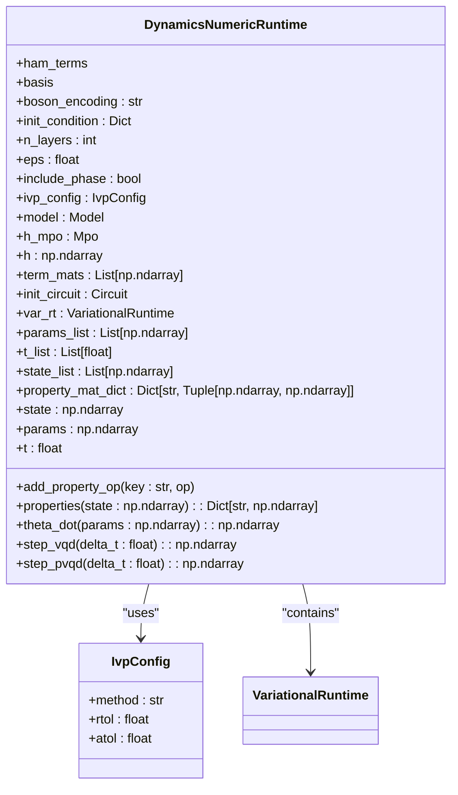
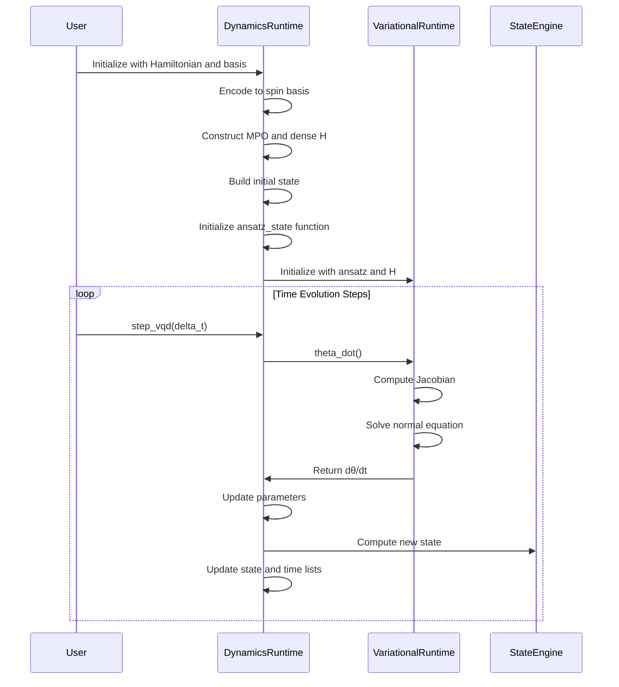

# Dynamics Numeric Runtime

<cite>
**Referenced Files in This Document**   
- [dynamics_numeric.py](file://src/tyxonq/applications/chem/runtimes/dynamics_numeric.py)
- [variational.py](file://src/tyxonq/libs/circuits_library/variational.py)
- [operator_encoding.py](file://src/tyxonq/libs/hamiltonian_encoding/operator_encoding.py)
- [time_evolution.py](file://examples-ng/time_evolution.py)
</cite>

## Table of Contents
1. [Introduction](#introduction)
2. [Core Time Evolution Framework](#core-time-evolution-framework)
3. [Trotter-Based and Variational Time Evolution](#trotter-based-and-variational-time-evolution)
4. [Configuration and Execution Options](#configuration-and-execution-options)
5. [Integration with UCC and HEA Runtimes](#integration-with-ucc-and-hea-runtimes)
6. [Numerical Stability and Error Mitigation](#numerical-stability-and-error-mitigation)
7. [Applications in Quantum Chemistry](#applications-in-quantum-chemistry)
8. [Conclusion](#conclusion)

## Introduction

The Dynamics Numeric Runtime provides a robust framework for simulating time evolution in quantum chemistry systems. It enables both Trotter-based and exact time evolution methods to study molecular dynamics and excited states. This runtime supports variational quantum dynamics (VQD) and projected variational quantum dynamics (pVQD) approaches, allowing efficient simulation of electron dynamics under time-dependent or time-independent Hamiltonians. The implementation leverages numerical backends for accurate state propagation while maintaining compatibility with variational ansatz structures from UCC and HEA frameworks.

**Section sources**
- [dynamics_numeric.py](file://src/tyxonq/applications/chem/runtimes/dynamics_numeric.py#L1-L50)

## Core Time Evolution Framework

The core functionality revolves around the `DynamicsNumericRuntime` class, which orchestrates time evolution through parameterized quantum circuits. The runtime accepts Hamiltonian terms and basis sets, encoding them into spin basis representations using configurable boson encoding schemes (default: gray code). It constructs dense Hamiltonian matrices via Matrix Product Operator (MPO) representations from the renormalizer library, enabling efficient numerical operations.

Key features include:
- Lazy loading and caching of Hamiltonian term matrices to minimize computational overhead
- Support for both pre-encoded and raw input formats to reduce redundant encoding costs
- Robust initial state preparation through multiple fallback mechanisms
- Built-in property monitoring for tracking observables during evolution

The time evolution process maintains synchronized lists of parameters, states, and timestamps, enabling comprehensive trajectory analysis. The runtime exposes the current state, parameters, and simulation time through intuitive property accessors.



**Diagram sources**
- [dynamics_numeric.py](file://src/tyxonq/applications/chem/runtimes/dynamics_numeric.py#L53-L221)

**Section sources**
- [dynamics_numeric.py](file://src/tyxonq/applications/chem/runtimes/dynamics_numeric.py#L53-L221)

## Trotter-Based and Variational Time Evolution

The runtime implements two primary time evolution strategies: Variational Quantum Dynamics (VQD) and Projected Variational Quantum Dynamics (pVQD). These methods leverage Trotter decomposition principles to propagate quantum states through small time steps while maintaining representation within a variational ansatz manifold.

### VQD Implementation

The VQD approach computes parameter time derivatives by solving the normal equation derived from the Dirac-Frenkel variational principle. The parameter update follows:
```
dθ/dt = Re[J†J]⁻¹ · Im[J†(H|ψ⟩)]
```
where J is the Jacobian of the ansatz state with respect to parameters. This implementation includes regularization for numerical stability and optional global phase tracking.

### pVQD Implementation

The pVQD method formulates time evolution as an optimization problem, minimizing the distance between the Trotter-evolved state and the variational ansatz state:
```
L(Δθ) = 1 - |⟨ψ(θ)|exp(iHΔt)|ψ(θ+Δθ)⟩|²
```
This approach generally provides better accuracy than VQD but requires access to optimization routines.

The ansatz structure groups Hamiltonian terms into evolution operators, with each layer applying exponentials of encoded spin operators. The number of parameters scales as `n_layers × n_hamiltonian_terms`, providing flexibility to balance accuracy and computational cost.



**Diagram sources**
- [dynamics_numeric.py](file://src/tyxonq/applications/chem/runtimes/dynamics_numeric.py#L53-L221)
- [variational.py](file://src/tyxonq/libs/circuits_library/variational.py#L152-L251)

**Section sources**
- [dynamics_numeric.py](file://src/tyxonq/applications/chem/runtimes/dynamics_numeric.py#L53-L221)
- [variational.py](file://src/tyxonq/libs/circuits_library/variational.py#L152-L251)

## Configuration and Execution Options

The runtime offers extensive configuration options to tailor simulations to specific requirements:

### Evolution Parameters
- **n_layers**: Number of ansatz layers (default: 3), controlling expressiveness
- **eps**: Regularization parameter for matrix inversion (default: 1e-5)
- **include_phase**: Flag to include global phase in evolution equations
- **ivp_config**: Integration configuration with method, relative tolerance (rtol), and absolute tolerance (atol)

### Encoding Options
- **boson_encoding**: Encoding scheme for bosonic degrees of freedom ("gray", "binary", "unary", or None)
- Support for mixed fermionic and bosonic systems through appropriate basis encoding

### Performance Optimizations
The implementation incorporates several performance optimizations:
- Lazy construction of dense Hamiltonian term matrices, cached after first use
- Direct statevector initialization when possible, avoiding circuit simulation overhead
- Efficient Jacobian computation through finite-difference methods
- Memory-efficient storage of evolution trajectories

Example usage for simulating electron dynamics:
```python
# Configuration for convergence testing
config = IvpConfig(method="RK45", rtol=1e-6, atol=1e-9)
runtime = DynamicsNumericRuntime(
    ham_terms=hamiltonian_terms,
    basis=molecular_basis,
    n_layers=5,
    eps=1e-6,
    ivp_config=config
)

# Time evolution with variable step sizes
t_final = 10.0
n_steps = 100
delta_t = t_final / n_steps

for _ in range(n_steps):
    runtime.step_vqd(delta_t)
    # Monitor properties during evolution
    props = runtime.properties()
```

**Section sources**
- [dynamics_numeric.py](file://src/tyxonq/applications/chem/runtimes/dynamics_numeric.py#L53-L221)

## Integration with UCC and HEA Runtimes

The Dynamics Numeric Runtime seamlessly integrates with UCC (Unitary Coupled Cluster) and HEA (Hardware-Efficient Ansatz) frameworks, enabling variational time evolution for quantum chemistry applications.

### UCC Integration

The runtime shares architectural similarities with UCC methods, particularly in ansatz construction. Both use parameterized exponential operators based on excitation operators. The dynamics runtime can leverage UCC-generated excitation operators as evolution generators, creating a unified framework for ground state and excited state simulations.

### HEA Compatibility

While HEA typically uses fixed gate structures (e.g., alternating rotation and entanglement layers), the dynamics runtime can adapt HEA circuits as initial states or constrain the variational manifold. This enables hybrid approaches where HEA prepares an initial state that subsequently evolves under a molecular Hamiltonian.

The integration is facilitated through shared components:
- Common numerical backend infrastructure
- Unified circuit representation and execution
- Consistent parameter handling and optimization interfaces
- Shared Hamiltonian encoding utilities

This interoperability allows researchers to transition smoothly between static quantum chemistry calculations (VQE) and dynamic simulations (VQD) using consistent tooling and workflows.

**Section sources**
- [dynamics_numeric.py](file://src/tyxonq/applications/chem/runtimes/dynamics_numeric.py#L53-L221)
- [ucc.py](file://src/tyxonq/applications/chem/algorithms/ucc.py#L0-L799)
- [hea.py](file://src/tyxonq/applications/chem/algorithms/hea.py#L0-L658)

## Numerical Stability and Error Mitigation

Long-time simulations present significant numerical challenges that the runtime addresses through multiple strategies:

### Regularization and Inversion
The normal equation solution employs Tikhonov regularization with adaptive damping:
```
(A + ε·exp(-A/ε))⁻¹
```
This prevents singularities when the quantum Fisher information matrix becomes ill-conditioned, particularly near convergence points.

### Step Size Control
The runtime supports adaptive step sizing through the IVP configuration:
- Smaller steps for higher accuracy in critical regions
- Larger steps in smooth evolution regions to improve efficiency
- Configurable tolerances (rtol, atol) for error control

### Error Sources and Mitigation
Key error sources and corresponding mitigation strategies:

| Error Source | Impact | Mitigation Strategy |
|-------------|-------|-------------------|
| Trotter Error | Systematic deviation from exact evolution | Increase Trotter steps, use higher-order decompositions |
| Variational Inexpressibility | Limited ansatz cannot represent exact state | Increase n_layers, optimize ansatz structure |
| Numerical Instability | Unphysical state growth or decay | Regularization, state normalization, adaptive stepping |
| Finite Precision | Accumulated floating-point errors | Use complex128 precision, monitor norm conservation |

The runtime automatically normalizes states after each evolution step to preserve unitarity, ensuring physical validity of results even in the presence of numerical errors.

**Section sources**
- [dynamics_numeric.py](file://src/tyxonq/applications/chem/runtimes/dynamics_numeric.py#L53-L221)
- [variational.py](file://src/tyxonq/libs/circuits_library/variational.py#L152-L251)

## Applications in Quantum Chemistry

The Dynamics Numeric Runtime enables diverse applications in quantum chemistry, bridging static and dynamic electronic structure calculations.

### Non-Equilibrium Dynamics
The framework excels at simulating non-equilibrium processes such as:
- Photoexcitation dynamics following laser pulses
- Electron transfer in chemical reactions
- Vibronic coupling in excited states
- Relaxation processes from non-thermal initial states

### Excited State Characterization
By evolving from reference states, the runtime can probe excited state properties:
- Energy level spectra through Fourier analysis of autocorrelation functions
- Transition dipole moments and oscillator strengths
- Non-adiabatic coupling between electronic states
- Conical intersection dynamics

### Convergence Testing
The runtime facilitates systematic convergence studies with respect to:
- Trotter step size (Δt)
- Number of ansatz layers (n_layers)
- Basis set size and quality
- Hamiltonian truncation schemes

Example convergence testing protocol:
```python
# Test Trotter step convergence
step_sizes = [0.1, 0.05, 0.025, 0.01]
for dt in step_sizes:
    runtime = DynamicsNumericRuntime(ham_terms, basis, n_layers=4)
    for _ in range(int(1.0/dt)):
        runtime.step_vqd(dt)
    energy_final = compute_energy(runtime.state, hamiltonian)
    # Compare results across step sizes
```

The runtime's design enables efficient exploration of the accuracy-computation trade-off space, making it suitable for both high-precision benchmarking and resource-constrained exploratory simulations.

**Section sources**
- [dynamics_numeric.py](file://src/tyxonq/applications/chem/runtimes/dynamics_numeric.py#L53-L221)
- [time_evolution.py](file://examples-ng/time_evolution.py#L0-L74)

## Conclusion

The Dynamics Numeric Runtime provides a comprehensive framework for quantum dynamics simulations in chemistry. By combining Trotter-based evolution with variational principles, it offers a flexible approach to studying molecular dynamics and excited states. The implementation balances accuracy and efficiency through configurable ansatz structures, adaptive integration, and performance optimizations. Its integration with UCC and HEA frameworks creates a unified ecosystem for both static and dynamic quantum chemical calculations, enabling researchers to investigate non-equilibrium processes, photochemical reactions, and excited state phenomena with high fidelity. The runtime's robust numerical foundation and extensive configuration options make it suitable for both methodological development and practical applications in computational chemistry.