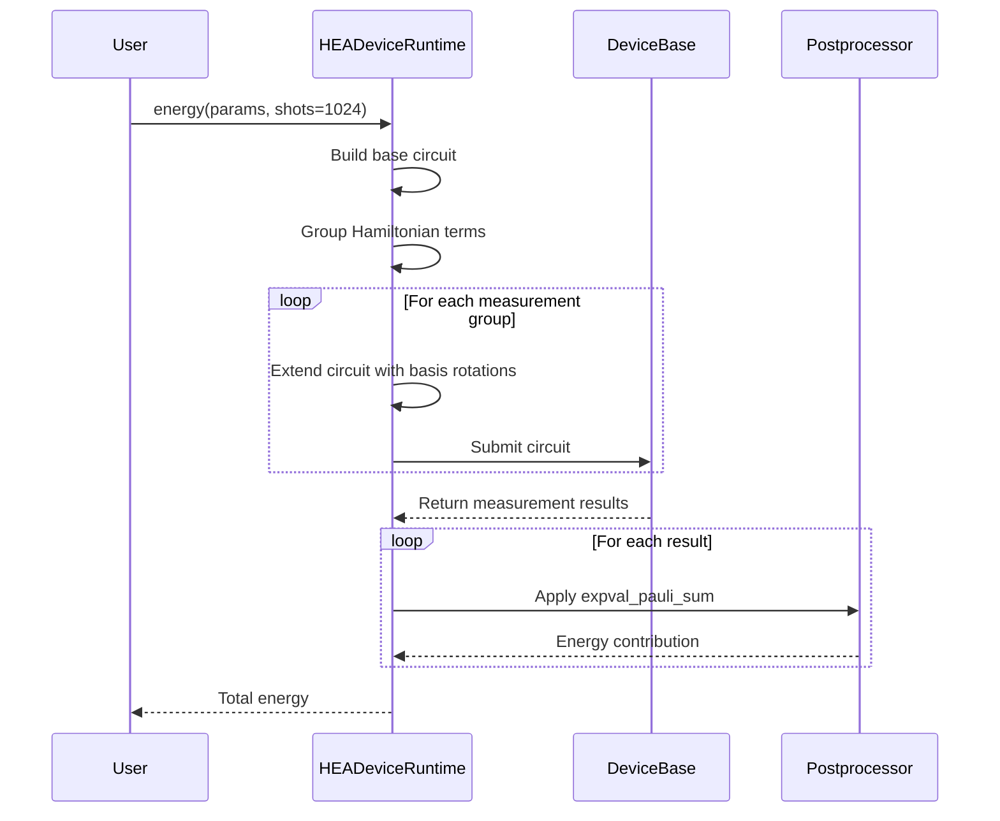
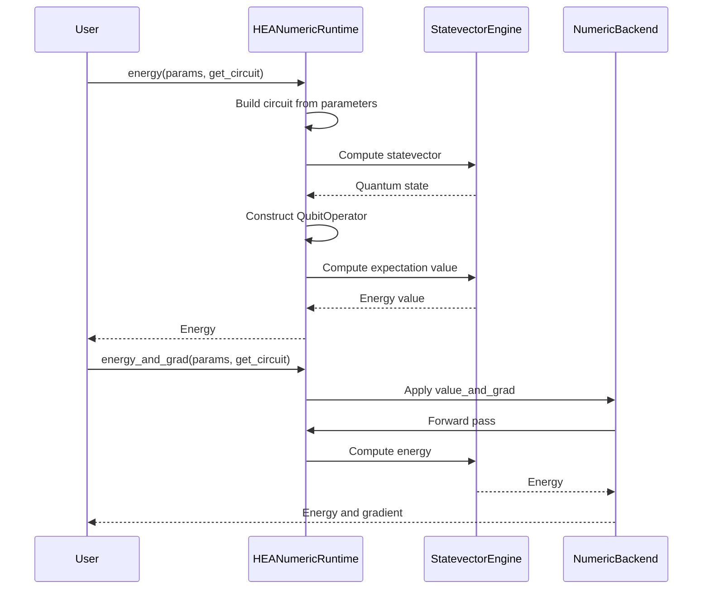
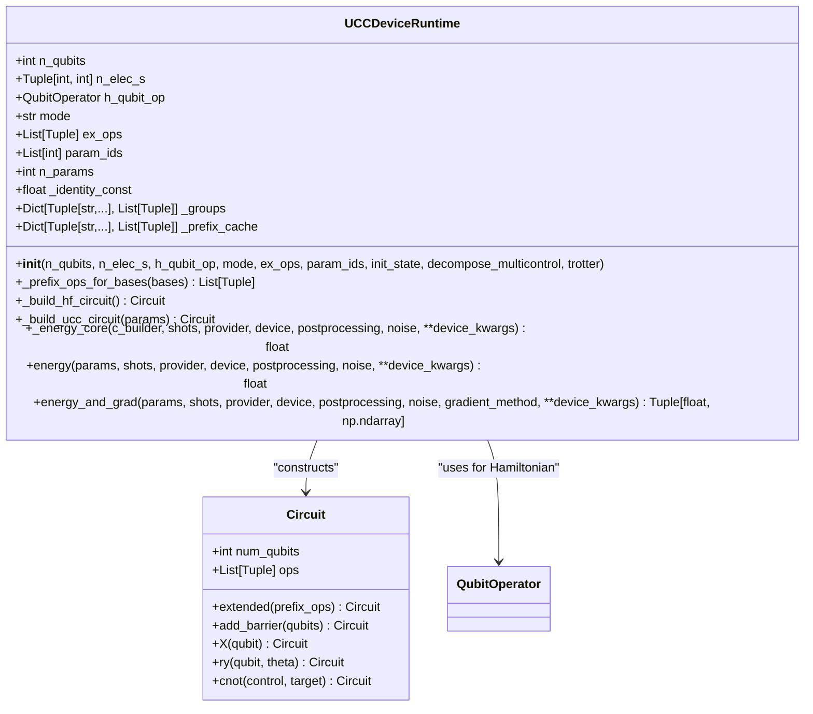
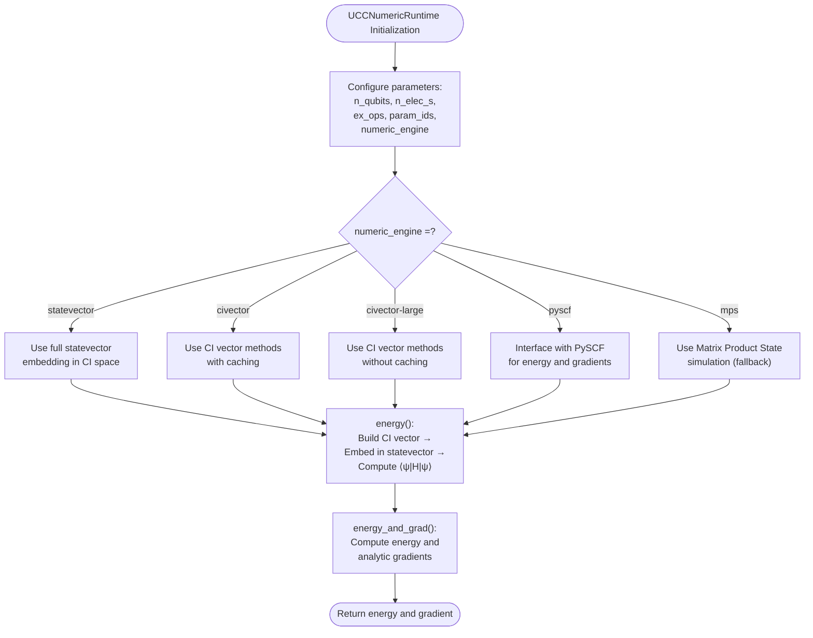
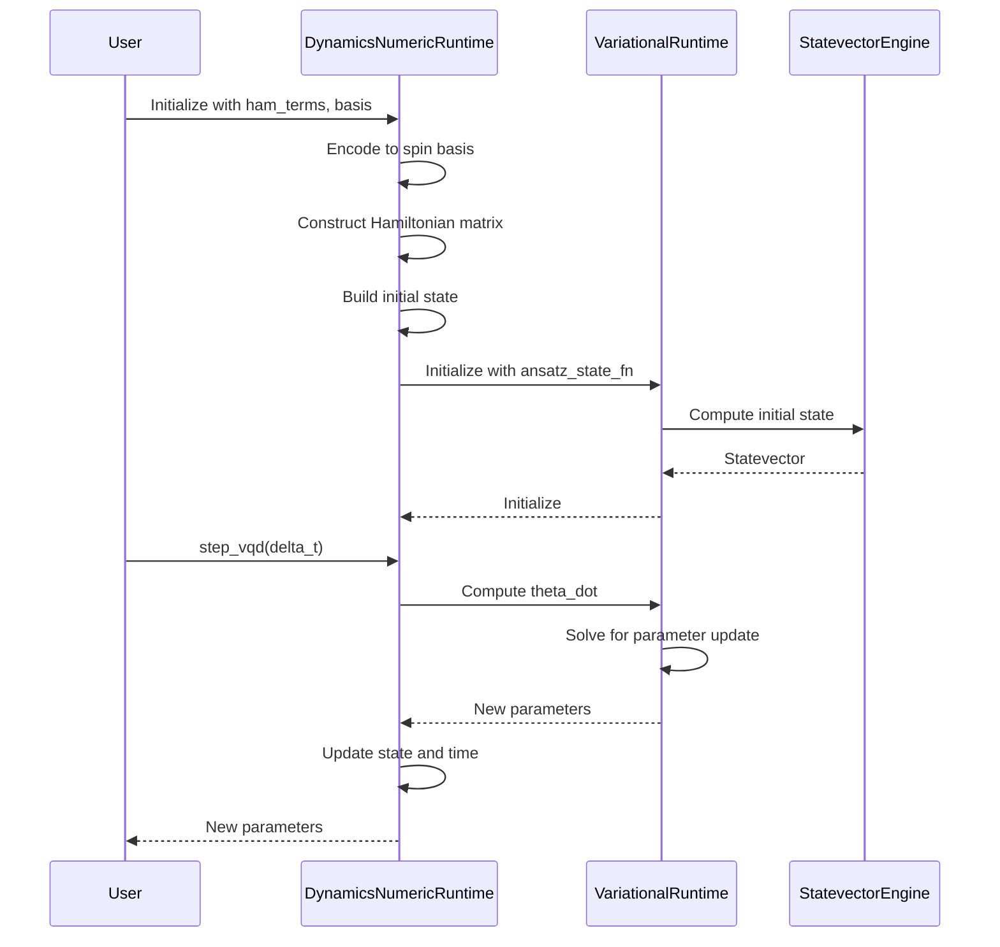

# Execution Runtimes

<cite>
**Referenced Files in This Document**   
- [hea_device_runtime.py](file://src/tyxonq/applications/chem/runtimes/hea_device_runtime.py)
- [hea_numeric_runtime.py](file://src/tyxonq/applications/chem/runtimes/hea_numeric_runtime.py)
- [ucc_device_runtime.py](file://src/tyxonq/applications/chem/runtimes/ucc_device_runtime.py)
- [ucc_numeric_runtime.py](file://src/tyxonq/applications/chem/runtimes/ucc_numeric_runtime.py)
- [dynamics_numeric.py](file://src/tyxonq/applications/chem/runtimes/dynamics_numeric.py)
- [statevector/engine.py](file://src/tyxonq/devices/simulators/statevector/engine.py)
- [blocks.py](file://src/tyxonq/libs/circuits_library/blocks.py)
- [qiskit_real_amplitudes.py](file://src/tyxonq/libs/circuits_library/qiskit_real_amplitudes.py)
- [hamiltonian_grouping.py](file://src/tyxonq/compiler/utils/hamiltonian_grouping.py)
- [apply_postprocessing.py](file://src/tyxonq/postprocessing/__init__.py)
</cite>

## Table of Contents
1. [Introduction](#introduction)
2. [Dual-Path Runtime Architecture](#dual-path-runtime-architecture)
3. [HEA Runtime Implementations](#hea-runtime-implementations)
4. [UCC Runtime Implementations](#ucc-runtime-implementations)
5. [Dynamics Numeric Runtime](#dynamics-numeric-runtime)
6. [Runtime Configuration and Selection](#runtime-configuration-and-selection)
7. [Performance Trade-offs](#performance-trade-offs)
8. [Usage Examples](#usage-examples)
9. [Conclusion](#conclusion)

## Introduction
The TyxonQ quantum chemistry framework provides a dual-path execution model for quantum algorithm runtimes, supporting both device-based execution with sampling and numeric simulation with exact computation. This architecture enables researchers to seamlessly switch between realistic hardware simulation with shot noise and idealized exact computation for algorithm development and validation. The runtime system abstracts away execution details while maintaining consistent interfaces across different algorithm families, including Hardware-Efficient Ansatz (HEA) and Unitary Coupled Cluster (UCC) methods. This document details the implementation and usage of these runtimes, focusing on their design patterns, configuration options, and performance characteristics.

## Dual-Path Runtime Architecture
The execution runtime system follows a dual-path architecture that separates device-based execution from numeric simulation. This design allows quantum chemistry algorithms to be executed in two distinct modes: through quantum device interfaces that simulate real hardware constraints and through exact numeric computation that provides idealized results. The architecture maintains a consistent interface across both execution paths, enabling seamless switching between them based on research requirements or production constraints.

The dual-path approach addresses the fundamental trade-off between physical realism and computational efficiency in quantum chemistry simulations. Device-based runtimes simulate the probabilistic nature of quantum measurements by executing parameterized circuits on quantum simulators or hardware, while numeric runtimes perform exact statevector computations that provide deterministic results. Both paths implement the same core functionality—energy evaluation and gradient computation—but through different computational paradigms.

This architecture enables researchers to develop and debug algorithms using exact numeric simulation before deploying them on quantum devices, where sampling noise and hardware constraints affect performance. The consistent interface across both paths ensures that algorithm logic remains unchanged when switching between execution modes, reducing development complexity and improving reproducibility.

**Section sources**
- [hea_device_runtime.py](file://src/tyxonq/applications/chem/runtimes/hea_device_runtime.py#L22-L190)
- [hea_numeric_runtime.py](file://src/tyxonq/applications/chem/runtimes/hea_numeric_runtime.py#L14-L97)

## HEA Runtime Implementations

### HEADeviceRuntime
The HEADeviceRuntime class implements the device-based execution path for Hardware-Efficient Ansatz (HEA) algorithms. This runtime evaluates variational energy and computes gradients through parameter shift methods, using quantum device interfaces to simulate circuit execution. The implementation supports both default RY-only ansatz circuits and custom circuit templates, providing flexibility for different quantum hardware architectures.

The runtime employs Hamiltonian term grouping to optimize measurement efficiency, reducing the number of required circuit executions by measuring commuting Pauli terms simultaneously. Measurement prefixes are cached to avoid redundant computation across multiple energy evaluations. For gradient computation, the implementation batches base energy evaluation with parameter-shifted variants in a single device submission, minimizing communication overhead and improving computational efficiency.

Energy evaluation follows a measurement-based approach where the expectation value is computed from sampled counts. The runtime constructs measurement circuits by extending the base ansatz circuit with basis rotation operations (H for X measurements, S†H for Y measurements) followed by Z-basis measurements. Post-processing aggregates results from grouped measurements, adding the identity term contribution to obtain the final energy value.



**Diagram sources **
- [hea_device_runtime.py](file://src/tyxonq/applications/chem/runtimes/hea_device_runtime.py#L22-L190)

**Section sources**
- [hea_device_runtime.py](file://src/tyxonq/applications/chem/runtimes/hea_device_runtime.py#L22-L190)

### HEANumericRuntime
The HEANumericRuntime class provides the numeric simulation path for HEA algorithms, performing exact statevector computations to evaluate energy and gradients. This implementation uses the StatevectorEngine to compute quantum state evolution and expectation values without sampling noise, providing deterministic results for algorithm development and validation.

The numeric runtime supports multiple backend engines, including statevector simulation and matrix product state (MPS) methods, with statevector being the default. Qubit operators are cached using LRU caching to avoid redundant construction across multiple evaluations. The implementation leverages automatic differentiation through the NumericBackend to compute gradients efficiently, avoiding the need for finite difference methods.

Energy evaluation in the numeric path computes the expectation value ⟨ψ|H|ψ⟩ directly from the statevector and Hamiltonian operator. The runtime constructs the full Hamiltonian matrix in sparse format and computes the expectation value using vector-matrix multiplication. This approach provides exact results but scales exponentially with system size, making it suitable for small to medium-sized quantum systems.



**Diagram sources **
- [hea_numeric_runtime.py](file://src/tyxonq/applications/chem/runtimes/hea_numeric_runtime.py#L14-L97)

**Section sources**
- [hea_numeric_runtime.py](file://src/tyxonq/applications/chem/runtimes/hea_numeric_runtime.py#L14-L97)

## UCC Runtime Implementations

### UCCDeviceRuntime
The UCCDeviceRuntime class implements device-based execution for Unitary Coupled Cluster (UCC) algorithms, supporting both fermionic and qubit-based excitations. This runtime evaluates energy and gradients through parameterized ansatz circuits executed on quantum devices or simulators, with support for various excitation operators and parameter mappings.

The implementation constructs UCC circuits from excitation operators and parameter identifiers, allowing flexible configuration of the ansatz structure. Hartree-Fock initial state preparation is integrated into the circuit construction process, with qubit initialization following standard quantum chemistry conventions. The runtime supports Trotterization and multicontrol gate decomposition, enabling execution on hardware with limited connectivity.

Gradient computation follows the parameter shift rule with π/2 shifts, batching multiple circuit evaluations to minimize device communication overhead. The implementation supports both finite difference (FD) and small-step gradient methods, with FD being the default. Measurement grouping optimizes the evaluation process by combining commuting Hamiltonian terms, reducing the total number of required circuit executions.



**Diagram sources **
- [ucc_device_runtime.py](file://src/tyxonq/applications/chem/runtimes/ucc_device_runtime.py#L25-L302)

**Section sources**
- [ucc_device_runtime.py](file://src/tyxonq/applications/chem/runtimes/ucc_device_runtime.py#L25-L302)

### UCCNumericRuntime
The UCCNumericRuntime class provides numeric simulation for UCC algorithms, supporting multiple computational engines for exact and approximate quantum chemistry calculations. This implementation offers various numeric backends, including full statevector simulation, configuration interaction (CI) vector methods, and integration with external quantum chemistry libraries like PySCF.

The numeric runtime supports different excitation semantics and mode configurations, enabling simulation of fermionic, qubit, and hard-core boson systems. CI vector construction is optimized for sparse representation, reducing memory requirements for large systems. The implementation provides compatibility with legacy quantum chemistry methods while maintaining the same interface as device-based execution.

Energy and gradient computation leverage specialized quantum chemistry algorithms that exploit the structure of electronic Hamiltonians. For CI-based methods, the runtime computes energy and gradients directly in the CI space, avoiding the exponential overhead of full statevector representation. This approach enables simulation of larger systems than possible with full configuration interaction methods.



**Diagram sources **
- [ucc_numeric_runtime.py](file://src/tyxonq/applications/chem/runtimes/ucc_numeric_runtime.py#L40-L241)

**Section sources**
- [ucc_numeric_runtime.py](file://src/tyxonq/applications/chem/runtimes/ucc_numeric_runtime.py#L40-L241)

## Dynamics Numeric Runtime
The dynamics_numeric.py runtime provides time evolution simulation capabilities for quantum systems using variational methods. This implementation supports both variational quantum dynamics (VQD) and projected VQD (pVQD) algorithms, enabling simulation of quantum system evolution under time-dependent Hamiltonians.

The runtime constructs a variational ansatz from Hamiltonian terms, using Trotter-like decomposition to approximate time evolution. Each layer of the ansatz applies exponentials of individual Hamiltonian terms with variational parameters, allowing optimization of the time evolution process. The implementation supports both Runge-Kutta and variational integration methods for time stepping.

Performance optimizations include lazy loading and caching of Hamiltonian term matrices, reducing computational overhead in iterative simulations. The runtime supports pre-encoded Hamiltonian inputs to minimize repeated encoding costs and provides robust initial state construction through multiple fallback methods. Memory efficiency is improved by avoiding redundant matrix construction during parameter iterations.

The dynamics runtime integrates with the general variational framework, reusing components for gradient computation and parameter optimization. This design ensures consistency with other quantum chemistry methods while providing specialized functionality for time evolution simulations.



**Diagram sources **
- [dynamics_numeric.py](file://src/tyxonq/applications/chem/runtimes/dynamics_numeric.py#L0-L224)

**Section sources**
- [dynamics_numeric.py](file://src/tyxonq/applications/chem/runtimes/dynamics_numeric.py#L0-L224)

## Runtime Configuration and Selection
Runtime selection in the TyxonQ framework is controlled through configuration parameters that specify the execution mode and backend options. The primary selection mechanism uses the runtime parameter, which can be set to 'device' for device-based execution or 'numeric' for exact simulation. This parameter determines which runtime class is instantiated and governs the computational approach for energy and gradient evaluation.

Backend selection is configured through the numeric_engine parameter in numeric runtimes, supporting 'statevector', 'mps', 'civector', and 'pyscf' options. Device-based runtimes configure execution through provider and device parameters, specifying the quantum device interface and simulator type. The shots parameter controls the number of measurements for device-based execution, with shots=0 indicating analytic evaluation when supported.

Classical computation offloading is managed through the numerics backend system, which supports numpy, pytorch, and cupynumeric backends. Backend selection can be configured globally or per-runtime, enabling optimization for different hardware environments. The get_backend function provides a factory interface for backend instantiation, handling dependency checking and configuration.

Configuration options are designed to be orthogonal and composable, allowing researchers to mix and match execution strategies based on their specific requirements. Default values provide sensible starting points, while advanced options enable fine-grained control over computational resources and accuracy.

```mermaid
classDiagram
class RuntimeConfig {
+str runtime : 'device'|'numeric'
+str numeric_engine : 'statevector'|'mps'|'civector'|'pyscf'
+str provider : 'simulator'|'local'|'cloud'
+str device : 'statevector'|'density_matrix'|'mps'
+int shots : 0-1000000
+dict postprocessing : {method, options}
+dict noise : {type, parameters}
+str backend : 'numpy'|'pytorch'|'cupynumeric'
+dict device_kwargs : {specific options}
}
class HEADeviceRuntime {
+energy(params, shots=1024, provider='simulator', device='statevector', postprocessing=None, noise=None, **device_kwargs)
+energy_and_grad(params, shots=1024, provider='simulator', device='statevector', postprocessing=None, noise=None, **device_kwargs)
}
class HEANumericRuntime {
+energy(params, get_circuit)
+energy_and_grad(params, get_circuit)
}
class UCCDeviceRuntime {
+energy(params, shots=1024, provider='simulator', device='statevector', postprocessing=None, noise=None, **device_kwargs)
+energy_and_grad(params, shots=1024, provider='simulator', device='statevector', postprocessing=None, noise=None, gradient_method='fd', **device_kwargs)
}
class UCCNumericRuntime {
+energy(params)
+energy_and_grad(params)
}
RuntimeConfig --> HEADeviceRuntime : "configures"
RuntimeConfig --> UCCDeviceRuntime : "configures"
RuntimeConfig --> HEANumericRuntime : "configures via numeric_engine"
RuntimeConfig --> UCCNumericRuntime : "configures via numeric_engine"
```

**Diagram sources **
- [hea_device_runtime.py](file://src/tyxonq/applications/chem/runtimes/hea_device_runtime.py#L22-L190)
- [hea_numeric_runtime.py](file://src/tyxonq/applications/chem/runtimes/hea_numeric_runtime.py#L14-L97)
- [ucc_device_runtime.py](file://src/tyxonq/applications/chem/runtimes/ucc_device_runtime.py#L25-L302)
- [ucc_numeric_runtime.py](file://src/tyxonq/applications/chem/runtimes/ucc_numeric_runtime.py#L40-L241)

**Section sources**
- [hea_device_runtime.py](file://src/tyxonq/applications/chem/runtimes/hea_device_runtime.py#L22-L190)
- [hea_numeric_runtime.py](file://src/tyxonq/applications/chem/runtimes/hea_numeric_runtime.py#L14-L97)
- [ucc_device_runtime.py](file://src/tyxonq/applications/chem/runtimes/ucc_device_runtime.py#L25-L302)
- [ucc_numeric_runtime.py](file://src/tyxonq/applications/chem/runtimes/ucc_numeric_runtime.py#L40-L241)

## Performance Trade-offs
The dual-path runtime architecture presents fundamental performance trade-offs between computational accuracy and physical realism. Device-based execution introduces sampling noise proportional to 1/√shots, requiring many measurements to achieve high precision, while numeric simulation provides exact results but with exponential memory and time complexity.

For small quantum systems (≤20 qubits), numeric runtimes offer superior performance due to their deterministic nature and avoidance of statistical uncertainty. The exact statevector computation scales as O(4^N) for memory and O(M×4^N) for time, where N is the number of qubits and M is the number of gates. This makes numeric simulation practical for algorithm development and validation on small systems.

Device-based execution scales more favorably in memory, requiring only O(N) space for state representation, but incurs significant overhead from measurement repetition. The number of required measurements depends on Hamiltonian complexity, with O(L×ε^-2) scaling where L is the number of measurement groups and ε is the desired precision. This makes device-based execution more suitable for larger systems where exact simulation becomes infeasible.

The choice between runtimes depends on the research phase and computational requirements. Numeric runtimes are preferred for algorithm development, convergence testing, and analytical gradient validation, while device-based runtimes are essential for assessing algorithm robustness to noise and hardware constraints. Hybrid approaches can leverage numeric runtimes for initial optimization followed by device-based validation.

**Section sources**
- [hea_device_runtime.py](file://src/tyxonq/applications/chem/runtimes/hea_device_runtime.py#L22-L190)
- [hea_numeric_runtime.py](file://src/tyxonq/applications/chem/runtimes/hea_numeric_runtime.py#L14-L97)
- [ucc_device_runtime.py](file://src/tyxonq/applications/chem/runtimes/ucc_device_runtime.py#L25-L302)
- [ucc_numeric_runtime.py](file://src/tyxonq/applications/chem/runtimes/ucc_numeric_runtime.py#L40-L241)

## Usage Examples
Runtime selection is accomplished through direct instantiation of the appropriate runtime class or through factory methods that abstract the selection process. The following examples demonstrate common usage patterns for quantum chemistry simulations.

For HEA algorithms, researchers can choose between device-based and numeric execution based on their requirements:

```python
# Device-based execution for HEA
runtime = HEADeviceRuntime(n=4, layers=3, hamiltonian=ham)
energy = runtime.energy(params, shots=1024, provider="simulator", device="statevector")
energy, gradient = runtime.energy_and_grad(params, shots=1024)

# Numeric execution for HEA  
runtime = HEANumericRuntime(n=4, layers=3, hamiltonian=ham, numeric_engine="statevector")
energy = runtime.energy(params, get_circuit=build_circuit)
energy, gradient = runtime.energy_and_grad(params, get_circuit=build_circuit)
```

For UCC algorithms, similar patterns apply with additional configuration for excitation operators:

```python
# Device-based execution for UCC
runtime = UCCDeviceRuntime(n_qubits=4, n_elec_s=(2,2), h_qubit_op=h_qubit_op, ex_ops=ex_ops)
energy = runtime.energy(params, shots=1024)
energy, gradient = runtime.energy_and_grad(params, shots=1024, gradient_method="fd")

# Numeric execution for UCC
runtime = UCCNumericRuntime(n_qubits=4, n_elec_s=(2,2), h_qubit_op=h_qubit_op, 
                           ex_ops=ex_ops, numeric_engine="civector")
energy = runtime.energy(params)
energy, gradient = runtime.energy_and_grad(params)
```

The dynamics runtime provides specialized functionality for time evolution simulations:

```python
# Time evolution with dynamics numeric runtime
runtime = DynamicsNumericRuntime(ham_terms, basis, n_layers=3)
initial_params = runtime.params
for i in range(10):
    new_params = runtime.step_vqd(delta_t=0.1)
    print(f"Time {runtime.t:.2f}, Energy {runtime.var_rt.energy:.6f}")
```

**Section sources**
- [hea_device_runtime.py](file://src/tyxonq/applications/chem/runtimes/hea_device_runtime.py#L22-L190)
- [hea_numeric_runtime.py](file://src/tyxonq/applications/chem/runtimes/hea_numeric_runtime.py#L14-L97)
- [ucc_device_runtime.py](file://src/tyxonq/applications/chem/runtimes/ucc_device_runtime.py#L25-L302)
- [ucc_numeric_runtime.py](file://src/tyxonq/applications/chem/runtimes/ucc_numeric_runtime.py#L40-L241)
- [dynamics_numeric.py](file://src/tyxonq/applications/chem/runtimes/dynamics_numeric.py#L0-L224)

## Conclusion
The execution runtime system in TyxonQ provides a comprehensive framework for quantum chemistry simulations with support for both device-based and numeric computation paths. The dual-path architecture enables researchers to balance physical realism with computational efficiency, choosing the appropriate execution mode based on their specific requirements.

The consistent interface across runtime implementations simplifies algorithm development and allows seamless switching between execution modes. This design supports the full research lifecycle, from algorithm development with exact numeric simulation to validation on quantum devices with realistic noise models.

Future development may focus on enhancing the integration between execution paths, enabling hybrid approaches that combine the strengths of both methods. Performance optimizations for large-scale simulations and improved support for distributed computation could further extend the capabilities of the runtime system.

**Section sources**
- [hea_device_runtime.py](file://src/tyxonq/applications/chem/runtimes/hea_device_runtime.py#L22-L190)
- [hea_numeric_runtime.py](file://src/tyxonq/applications/chem/runtimes/hea_numeric_runtime.py#L14-L97)
- [ucc_device_runtime.py](file://src/tyxonq/applications/chem/runtimes/ucc_device_runtime.py#L25-L302)
- [ucc_numeric_runtime.py](file://src/tyxonq/applications/chem/runtimes/ucc_numeric_runtime.py#L40-L241)
- [dynamics_numeric.py](file://src/tyxonq/applications/chem/runtimes/dynamics_numeric.py#L0-L224)