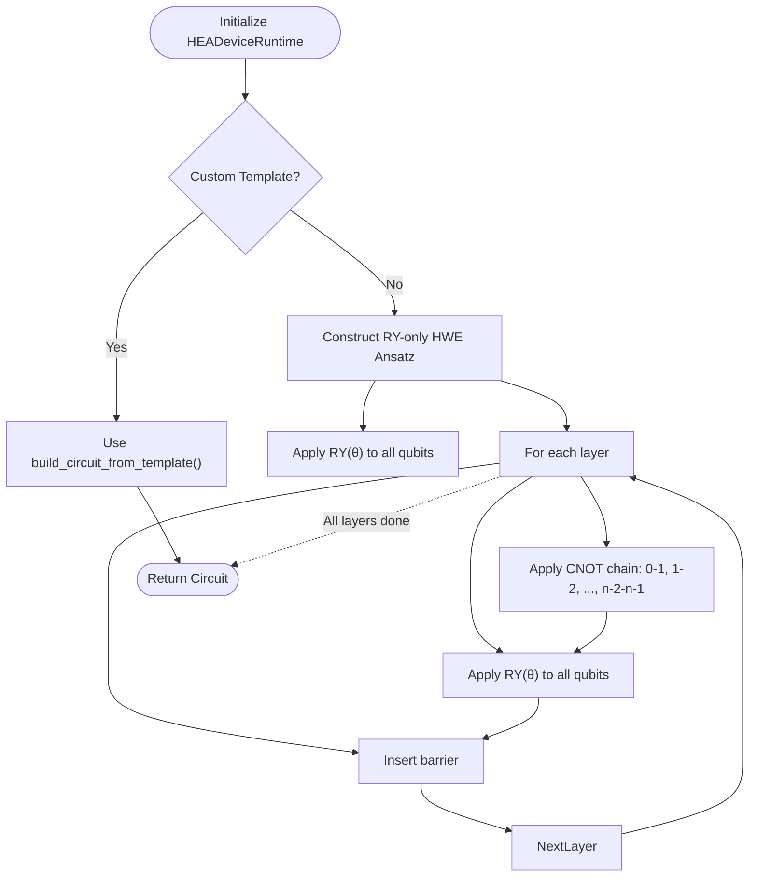
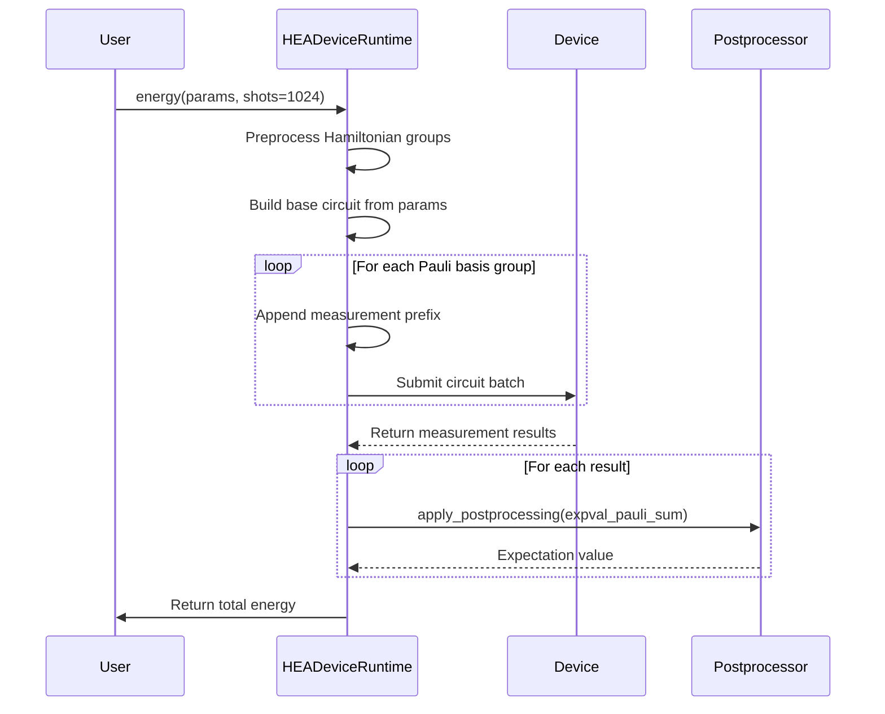
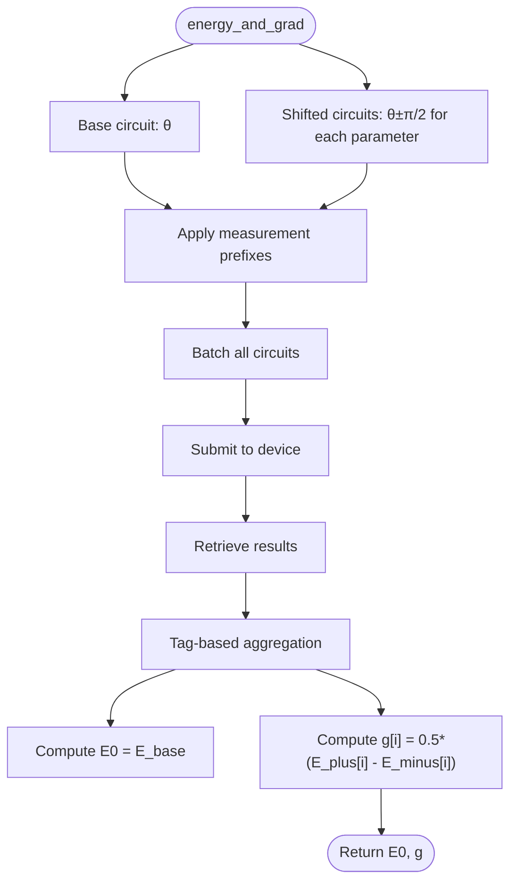

# HEA Device Runtime

<cite>
**Referenced Files in This Document**   
- [hea_device_runtime.py](file://src/tyxonq/applications/chem/runtimes/hea_device_runtime.py)
- [blocks.py](file://src/tyxonq/libs/circuits_library/blocks.py)
- [qiskit_real_amplitudes.py](file://src/tyxonq/libs/circuits_library/qiskit_real_amplitudes.py)
- [hamiltonian_grouping.py](file://src/tyxonq/libs/hamiltonian_encoding/hamiltonian_grouping.py)
- [hamiltonian_grouping.py](file://src/tyxonq/compiler/utils/hamiltonian_grouping.py)
- [postprocessing.py](file://src/tyxonq/postprocessing/__init__.py)
</cite>

## Table of Contents
1. [Introduction](#introduction)
2. [Core Components](#core-components)
3. [Hardware-Efficient Ansatz Implementation](#hardware-efficient-ansatz-implementation)
4. [Energy Computation with Grouped Pauli Measurements](#energy-computation-with-grouped-pauli-measurements)
5. [Gradient Calculation via Parameter-Shift Rule](#gradient-calculation-via-parameter-shift-rule)
6. [Measurement Optimization and Caching](#measurement-optimization-and-caching)
7. [Configuration Options and Execution Settings](#configuration-options-and-execution-settings)
8. [Performance Considerations](#performance-considerations)
9. [Troubleshooting and Debugging Guidance](#troubleshooting-and-debugging-guidance)

## Introduction
The `HEADeviceRuntime` class enables variational quantum algorithms on quantum devices by implementing the hardware-efficient ansatz (HEA) for quantum chemistry simulations. It supports both RY-only and custom circuit templates, computes energy expectation values using grouped Pauli measurements, and calculates gradients via the parameter-shift rule. This document details its architecture, core methods, optimization strategies, and usage patterns for executing on simulators or real quantum hardware.

## Core Components

The `HEADeviceRuntime` class is designed to execute variational quantum algorithms on quantum devices with support for customizable ansatz circuits and efficient measurement grouping. It integrates with backend simulators and hardware providers through a unified interface, enabling execution across different quantum computing platforms.

**Section sources**
- [hea_device_runtime.py](file://src/tyxonq/applications/chem/runtimes/hea_device_runtime.py#L22-L190)

## Hardware-Efficient Ansatz Implementation

The class implements the hardware-efficient ansatz (HEA) using either a default RY-only structure or a user-defined circuit template. The RY-only ansatz consists of alternating layers of single-qubit Y-rotations and entangling CNOT gates arranged in a linear topology. For custom templates, users can provide a parameterized circuit structure derived from external frameworks such as Qiskit's RealAmplitudes circuit.

When no custom template is provided, the default ansatz uses `(layers + 1) * n` parameters, where `n` is the number of qubits. Each layer applies RY rotations followed by nearest-neighbor CNOT entanglers. Barrier operations are inserted between layers to enforce scheduling boundaries during compilation.

Custom templates are instantiated using the `build_circuit_from_template` function, which maps parameter placeholders to actual values from the input vector. This allows integration with pre-designed circuit architectures while maintaining compatibility with the runtime's execution pipeline.

**Diagram sources**
- [hea_device_runtime.py](file://src/tyxonq/applications/chem/runtimes/hea_device_runtime.py#L64-L70)
- [blocks.py](file://src/tyxonq/libs/circuits_library/blocks.py#L58-L81)
- [qiskit_real_amplitudes.py](file://src/tyxonq/libs/circuits_library/qiskit_real_amplitudes.py#L76-L91)

**Section sources**
- [hea_device_runtime.py](file://src/tyxonq/applications/chem/runtimes/hea_device_runtime.py#L64-L70)
- [blocks.py](file://src/tyxonq/libs/circuits_library/blocks.py#L58-L81)

## Energy Computation with Grouped Pauli Measurements

The `energy()` method computes the expectation value of the molecular Hamiltonian using grouped Pauli measurements. It first groups commuting Pauli terms using the `group_hamiltonian_pauli_terms` function, which partitions the Hamiltonian into subsets measurable in a single basis. This reduces the number of required circuit executions compared to measuring each term individually.

For each group, a measurement basis prefix is applied to transform the computational basis into the appropriate Pauli basis (X or Y). These prefixes consist of Hadamard (H) gates for X-basis and S†+H gates for Y-basis measurements. The transformed circuits are executed on the specified device with the given number of shots.

Postprocessing aggregates the results using the `apply_postprocessing` function with the `expval_pauli_sum` method, which computes weighted sums of expectation values while accounting for the identity component of the Hamiltonian. The total energy is reconstructed by summing contributions from all groups plus the cached identity constant.

**Diagram sources**
- [hea_device_runtime.py](file://src/tyxonq/applications/chem/runtimes/hea_device_runtime.py#L72-L107)
- [hamiltonian_grouping.py](file://src/tyxonq/libs/hamiltonian_encoding/hamiltonian_grouping.py#L47-L65)
- [postprocessing.py](file://src/tyxonq/postprocessing/__init__.py#L15-L132)

**Section sources**
- [hea_device_runtime.py](file://src/tyxonq/applications/chem/runtimes/hea_device_runtime.py#L72-L107)

## Gradient Calculation via Parameter-Shift Rule

The `energy_and_grad()` method computes both the energy and its gradient using the parameter-shift rule with π/2 shifts. Instead of executing separate circuits for each parameter shift, it batches all variants—base, plus-shifted, and minus-shifted circuits—for all parameters into a single device submission. This minimizes overhead from circuit compilation and device communication.

For each parameter `i`, two shifted parameter vectors are created: `params[i] + π/2` and `params[i] - π/2`. The gradient component is calculated as `g[i] = 0.5 * (E_plus[i] - E_minus[i])`. By batching all circuit variants together, the runtime achieves significant efficiency gains, especially for high-dimensional parameter spaces.

The method tags each circuit variant during construction to enable correct aggregation of results after execution. After retrieving results, it separates contributions by tag type ("base", "plus", "minus") and accumulates energy values accordingly before computing the final gradient vector.

**Diagram sources**
- [hea_device_runtime.py](file://src/tyxonq/applications/chem/runtimes/hea_device_runtime.py#L109-L189)

**Section sources**
- [hea_device_runtime.py](file://src/tyxonq/applications/chem/runtimes/hea_device_runtime.py#L109-L189)

## Measurement Optimization and Caching

The runtime employs two key optimizations to minimize redundant operations: internal grouping cache and measurement prefix optimization. During initialization, the Hamiltonian is pre-grouped into commuting Pauli bases using `group_hamiltonian_pauli_terms`, avoiding repeated grouping computations across multiple energy evaluations.

The `_prefix_cache` dictionary stores measurement circuit prefixes for each unique Pauli basis tuple. When the same measurement basis is reused across different parameter settings or gradient evaluations, the cached prefix is reused instead of reconstructing the gate sequence. This significantly reduces circuit generation time, especially in optimization loops where the same Hamiltonian structure is evaluated repeatedly.

Prefix generation follows standard conventions: X-basis measurements use H gates, Y-basis use S† followed by H, and Z-basis require no transformation. Measurement gates are appended after basis rotation to capture outcomes in the computational basis.

**Section sources**
- [hea_device_runtime.py](file://src/tyxonq/applications/chem/runtimes/hea_device_runtime.py#L52-L62)
- [hamiltonian_grouping.py](file://src/tyxonq/libs/hamiltonian_encoding/hamiltonian_grouping.py#L47-L65)

## Configuration Options and Execution Settings

The `HEADeviceRuntime` supports flexible configuration through multiple parameters:

- **Provider**: Specifies the execution backend (`"simulator"` or cloud provider)
- **Device**: Selects the target device (`"statevector"`, `"mps"`, or hardware device)
- **Shots**: Number of measurement repetitions (0 for analytic simulation)
- **Noise**: Dictionary specifying noise model configuration
- **Postprocessing**: Options for readout mitigation, expectation value aggregation
- **Circuit Template**: Optional custom ansatz structure
- **Mapping**: Fermion-to-qubit mapping strategy (e.g., `"parity"`)

Execution can be performed on statevector simulators for exact results or matrix product state (MPS) simulators for larger systems. Real hardware execution is supported through provider-specific drivers. Shot-based execution enables realistic noise modeling, while zero-shot mode uses analytic statevector propagation for noiseless simulations.

**Section sources**
- [hea_device_runtime.py](file://src/tyxonq/applications/chem/runtimes/hea_device_runtime.py#L72-L189)

## Performance Considerations

Performance scales with circuit depth, qubit count, and Hamiltonian size. Deeper circuits increase compilation and execution time, while larger qubit counts impact both memory usage and gate fidelity on real devices. The number of measurement groups affects total circuit submissions—fewer groups mean fewer runs due to commuting term aggregation.

For large-scale simulations, MPS simulators offer better scalability than full statevector methods. On hardware, shot allocation should prioritize terms with larger coefficients to maintain accuracy within budget constraints. Batching gradient evaluations reduces overhead but increases memory footprint due to simultaneous circuit storage.

The parameter-shift rule with π/2 shifts provides numerical stability but requires 2N+1 circuit evaluations for N parameters. For very deep circuits, alternative gradient estimation methods may be considered, though they sacrifice exactness.

**Section sources**
- [hea_device_runtime.py](file://src/tyxonq/applications/chem/runtimes/hea_device_runtime.py#L72-L189)

## Troubleshooting and Debugging Guidance

Common issues include incorrect parameter vector lengths, unsupported Pauli terms in the Hamiltonian, and measurement grouping inefficiencies. Ensure that parameter vectors match the expected length `(layers + 1) * n` when using the RY ansatz.

To debug measurement grouping, inspect the `_groups` attribute to verify that commuting terms are properly aggregated. Large numbers of small groups indicate suboptimal grouping, potentially due to fine-grained non-commutativity.

For gradient calculation issues, confirm that π/2 shifts produce measurable changes in energy. Numerical instabilities may arise from insufficient shots or excessive noise. Use zero-shot mode for validation against analytic expectations.

Verify that custom circuit templates correctly map parameter indices and support the required gate set. Unsupported operations in templates will raise errors during instantiation.

**Section sources**
- [hea_device_runtime.py](file://src/tyxonq/applications/chem/runtimes/hea_device_runtime.py#L72-L189)