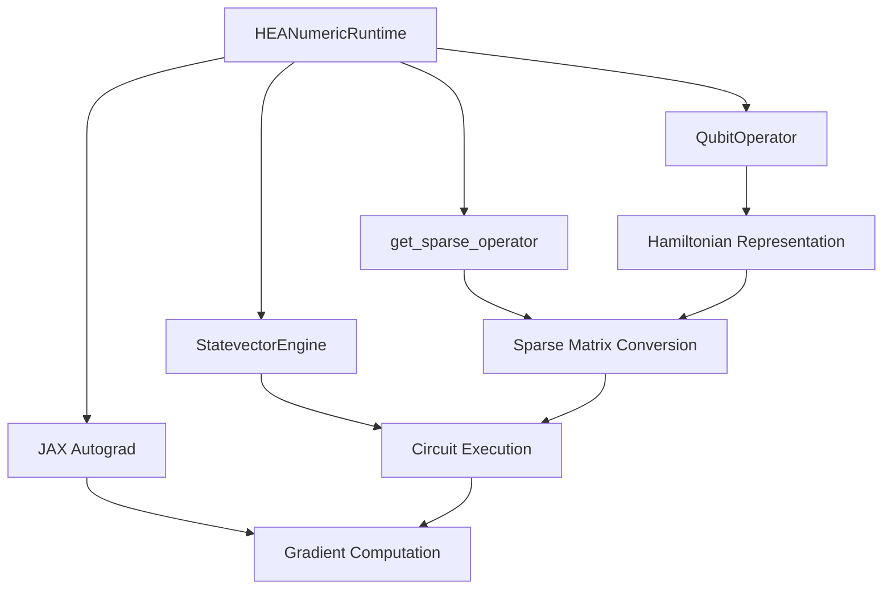
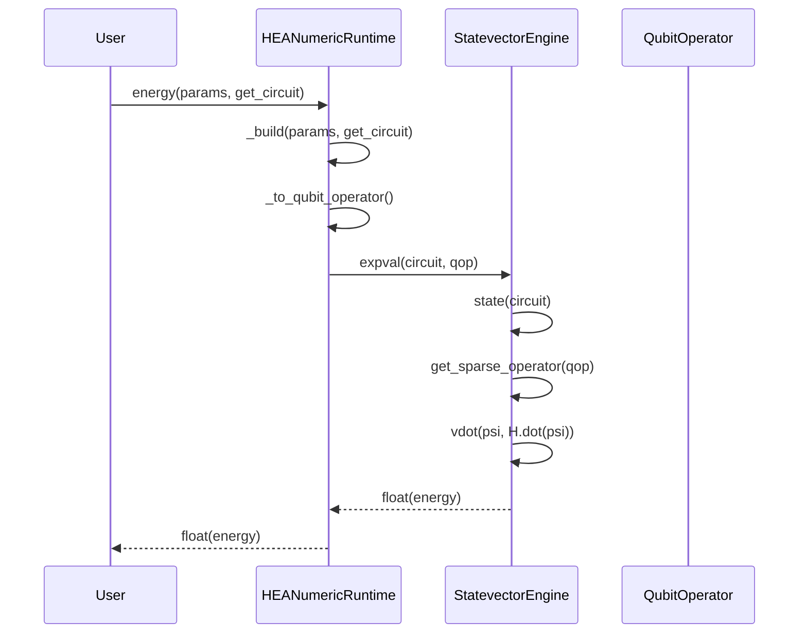
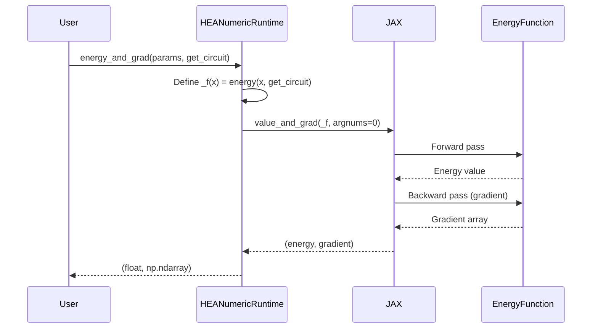
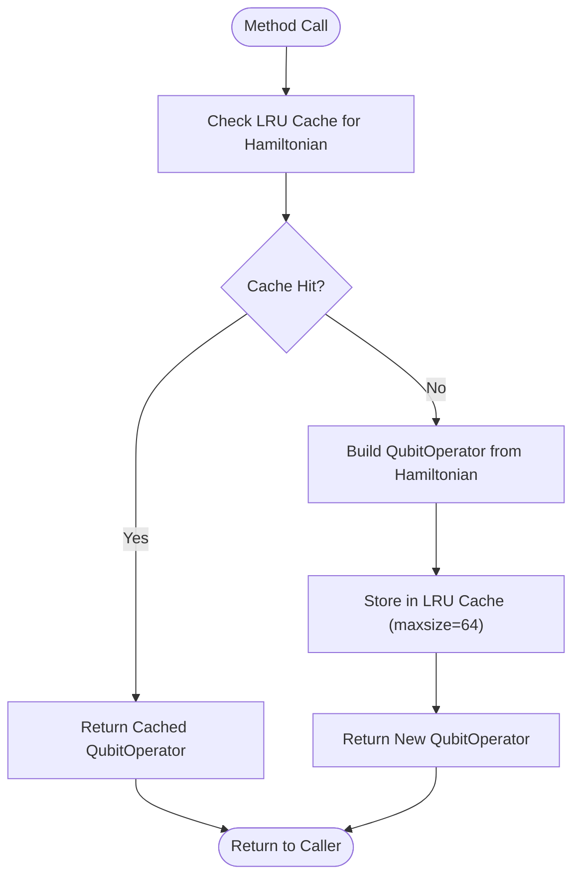

# HEA Numeric Runtime

<cite>
**Referenced Files in This Document**   
- [hea_numeric_runtime.py](file://src/tyxonq/applications/chem/runtimes/hea_numeric_runtime.py)
- [engine.py](file://src/tyxonq/devices/simulators/statevector/engine.py)
- [mpsvsexact.py](file://examples-ng/mpsvsexact.py)
- [aces_test_for_numeric_backend.py](file://examples-ng/aces_test_for_numeric_backend.py)
</cite>

## Table of Contents
1. [Introduction](#introduction)
2. [Core Components](#core-components)
3. [Architecture Overview](#architecture-overview)
4. [Detailed Component Analysis](#detailed-component-analysis)
5. [Performance and Memory Considerations](#performance-and-memory-considerations)
6. [Integration and Usage Examples](#integration-and-usage-examples)
7. [Conclusion](#conclusion)

## Introduction

The HEANumericRuntime class provides exact numerical simulation capabilities for Hardware-Efficient Ansatz (HEA) based quantum chemistry calculations. Unlike device-based runtimes that rely on sampling and are subject to statistical noise, this numeric runtime leverages full statevector simulation to compute exact energy values and gradients. This enables precise optimization in variational quantum algorithms without the uncertainty introduced by finite shot measurements. The runtime is designed for small to medium-sized quantum systems where exact simulation is computationally feasible, providing a reference implementation for validating approximate methods.

## Core Components

The HEANumericRuntime class implements a high-precision simulation backend for HEA circuits, focusing on exact energy computation and gradient evaluation. It utilizes statevector simulation to avoid sampling noise, making it ideal for benchmarking and optimization tasks where precision is critical. The class provides two primary computational methods: `energy()` for computing expectation values and `energy_and_grad()` for simultaneous energy and gradient computation using automatic differentiation. Internal caching mechanisms optimize performance during iterative optimization loops by avoiding redundant operator conversions.

**Section sources**
- [hea_numeric_runtime.py](file://src/tyxonq/applications/chem/runtimes/hea_numeric_runtime.py#L14-L97)

## Architecture Overview



**Diagram sources **
- [hea_numeric_runtime.py](file://src/tyxonq/applications/chem/runtimes/hea_numeric_runtime.py)
- [engine.py](file://src/tyxonq/devices/simulators/statevector/engine.py)

## Detailed Component Analysis

### HEANumericRuntime Class Analysis

The HEANumericRuntime class serves as a precise computational engine for HEA-based quantum chemistry simulations, leveraging full statevector simulation to eliminate sampling noise from energy and gradient calculations.

#### Energy Computation


**Diagram sources **
- [hea_numeric_runtime.py](file://src/tyxonq/applications/chem/runtimes/hea_numeric_runtime.py#L86-L90)
- [engine.py](file://src/tyxonq/devices/simulators/statevector/engine.py#L250-L261)

#### Gradient Computation


**Diagram sources **
- [hea_numeric_runtime.py](file://src/tyxonq/applications/chem/runtimes/hea_numeric_runtime.py#L92-L97)
- [engine.py](file://src/tyxonq/devices/simulators/statevector/engine.py#L250-L261)

#### Internal Caching Mechanisms


**Diagram sources **
- [hea_numeric_runtime.py](file://src/tyxonq/applications/chem/runtimes/hea_numeric_runtime.py#L54-L74)

**Section sources**
- [hea_numeric_runtime.py](file://src/tyxonq/applications/chem/runtimes/hea_numeric_runtime.py#L14-L97)

## Performance and Memory Considerations

The HEANumericRuntime provides exact simulation at the cost of exponential memory scaling. The statevector representation requires O(2^n) memory, limiting practical application to systems with approximately 30 or fewer qubits on typical hardware. For larger systems, users should transition to device-based runtimes or approximate simulation methods like Matrix Product States (MPS). The LRU caching strategy for operator conversions significantly improves performance during optimization loops by avoiding repeated Hamiltonian parsing and operator construction. However, the cache size is limited to 64 entries, which is sufficient for most VQE optimization scenarios but may need adjustment for complex multi-Hamiltonian workflows.

## Integration and Usage Examples

The HEANumericRuntime integrates seamlessly with parameterized circuit builders and supports comparison with device-based results. Users can construct circuits using external templates or dynamic circuit generation functions. The numeric_engine parameter allows selection between statevector and future MPS backends, enabling a smooth transition from exact to approximate simulation as system size increases. Example workflows demonstrate how to validate numeric results against device-based simulations and benchmark the accuracy of approximate methods.

```mermaid
flowchart TD
A[Initialize HEANumericRuntime] --> B[Set Hamiltonian and Parameters]
B --> C{Use Template Circuit?}
C --> |Yes| D[Provide circuit_template]
C --> |No| E[Provide get_circuit function]
D --> F[Build Circuit]
E --> F
F --> G[Compute energy()]
G --> H[Compute energy_and_grad()]
H --> I[Optimize Parameters]
I --> J{Converged?}
J --> |No| G
J --> |Yes| K[Return Optimal Energy]
```

**Diagram sources **
- [mpsvsexact.py](file://examples-ng/mpsvsexact.py)
- [aces_test_for_numeric_backend.py](file://examples-ng/aces_test_for_numeric_backend.py)

**Section sources**
- [mpsvsexact.py](file://examples-ng/mpsvsexact.py#L1-L91)
- [aces_test_for_numeric_backend.py](file://examples-ng/aces_test_for_numeric_backend.py#L1-L44)

## Conclusion

The HEANumericRuntime class provides a powerful tool for exact quantum chemistry simulations using HEA circuits. By leveraging full statevector simulation and automatic differentiation, it enables precise energy and gradient computation essential for reliable optimization. The internal caching mechanisms optimize performance during iterative calculations, while the flexible backend selection prepares for future expansion to approximate simulation methods. This runtime serves as both a production tool for small systems and a validation benchmark for approximate methods, bridging the gap between theoretical precision and practical computational constraints.