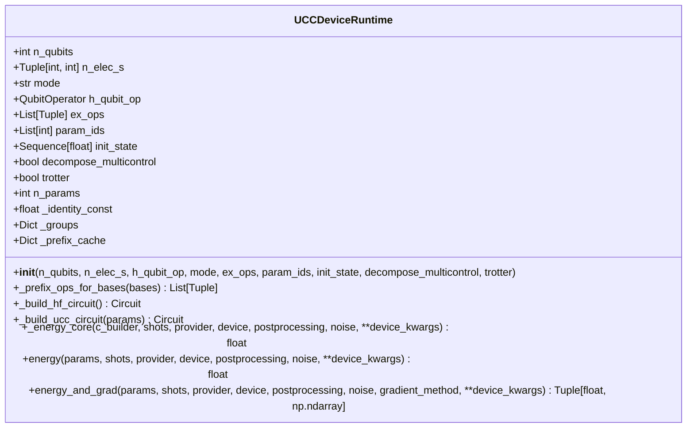
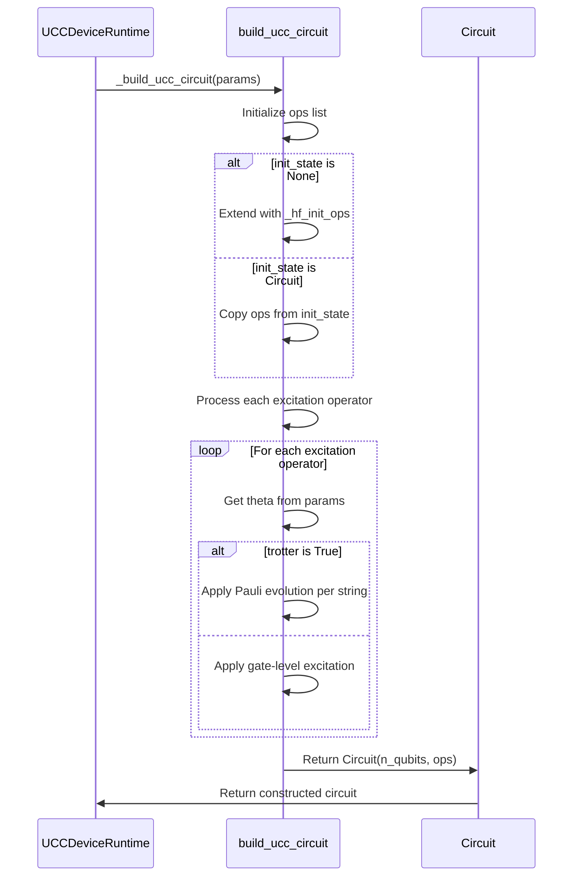
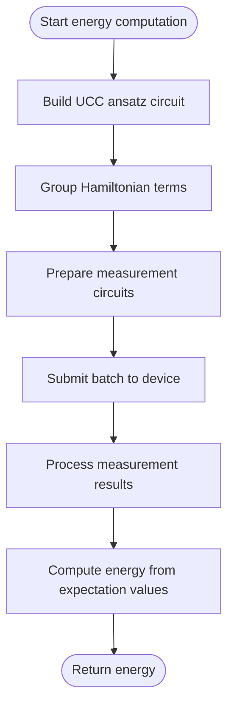
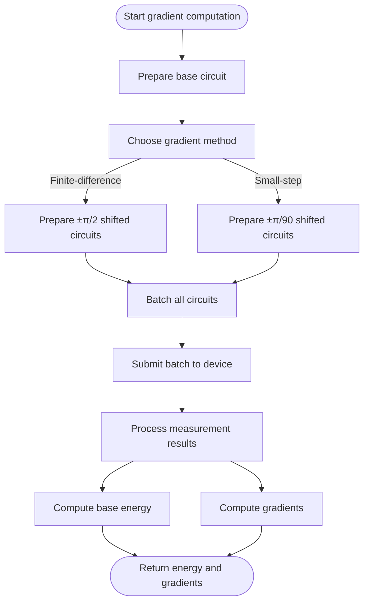
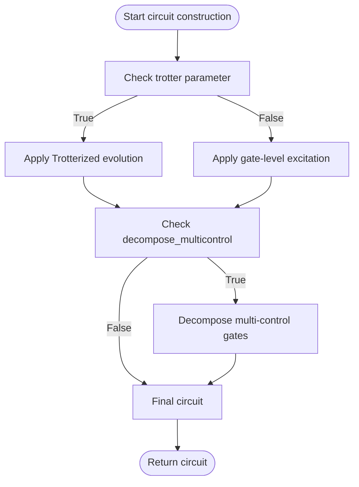
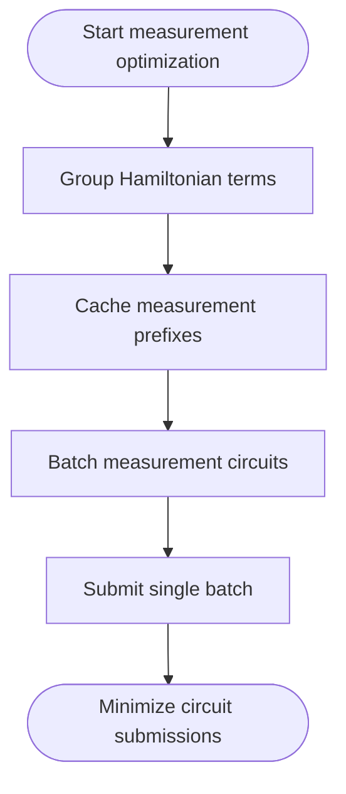

<cite>
**Referenced Files in This Document**   
- [ucc_device_runtime.py](file://src/tyxonq/applications/chem/runtimes/ucc_device_runtime.py)
- [ucc.py](file://src/tyxonq/libs/circuits_library/ucc.py)
- [hamiltonian_grouping.py](file://src/tyxonq/libs/hamiltonian_encoding/hamiltonian_grouping.py)
- [cloud_uccsd_hea_demo.py](file://examples/cloud_uccsd_hea_demo.py)
</cite>

# UCC Device Runtime

## Table of Contents
1. [Introduction](#introduction)
2. [Core Components](#core-components)
3. [UCC Ansatz Construction](#ucc-ansatz-construction)
4. [Energy Computation](#energy-computation)
5. [Gradient Computation](#gradient-computation)
6. [Trotterization and Gate Decomposition](#trotterization-and-gate-decomposition)
7. [Configuration Options](#configuration-options)
8. [Example Usage](#example-usage)
9. [Measurement Optimization](#measurement-optimization)
10. [Performance Trade-offs](#performance-trade-offs)

## Introduction

The UCCDeviceRuntime class provides a quantum device runtime implementation for unitary coupled cluster (UCC) methods in quantum chemistry applications. It enables the execution of UCC algorithms on quantum hardware or simulators by constructing parameterized ansatz circuits from excitation operators and computing molecular energies and gradients through grouped measurements. The runtime is designed to interface with PySCF-derived Hamiltonians and excitation operators, supporting various configuration options for excitation types, parameter indexing, and noise mitigation strategies.

**Section sources**
- [ucc_device_runtime.py](file://src/tyxonq/applications/chem/runtimes/ucc_device_runtime.py#L25-L302)

## Core Components

The UCCDeviceRuntime class is the central component for executing UCC methods on quantum devices. It manages the construction of UCC ansatz circuits from excitation operators and parameters, starting from Hartree-Fock initial states. The runtime handles energy computation via grouped measurements on quantum hardware or simulators, using bit-reversed measurement prefixes for OpenFermion compatibility. It also implements gradient computation using both finite-difference (π/2 shift) and small-step numerical methods, with batching of all shifted circuits for efficient execution.



**Diagram sources**
- [ucc_device_runtime.py](file://src/tyxonq/applications/chem/runtimes/ucc_device_runtime.py#L25-L302)

**Section sources**
- [ucc_device_runtime.py](file://src/tyxonq/applications/chem/runtimes/ucc_device_runtime.py#L25-L302)

## UCC Ansatz Construction

The UCCDeviceRuntime constructs UCC ansatz circuits from excitation operators and parameters using the build_ucc_circuit function from the circuits_library. The ansatz starts from a Hartree-Fock initial state, which is prepared by applying X gates to specific qubits based on the number of alpha and beta electrons. The excitation operators are then applied as parameterized gates, with the parameters controlling the amplitude of each excitation.

The construction process involves mapping excitation operators to qubit operators using the Jordan-Wigner transformation and caching the results for efficiency. For each excitation operator, the corresponding quantum circuit operations are generated and appended to the circuit. The runtime supports both standard gate-level implementation and Trotterized evolution of the excitation operators.



**Diagram sources**
- [ucc_device_runtime.py](file://src/tyxonq/applications/chem/runtimes/ucc_device_runtime.py#L150-L170)
- [ucc.py](file://src/tyxonq/libs/circuits_library/ucc.py#L82-L122)

**Section sources**
- [ucc_device_runtime.py](file://src/tyxonq/applications/chem/runtimes/ucc_device_runtime.py#L150-L170)
- [ucc.py](file://src/tyxonq/libs/circuits_library/ucc.py#L82-L122)

## Energy Computation

The energy() method computes molecular energy via grouped measurements on quantum hardware or simulators. It uses bit-reversed measurement prefixes for OpenFermion compatibility, ensuring that the measurement bases are correctly mapped to the qubit indices. The method first groups the Hamiltonian terms into commuting sets, allowing for simultaneous measurement of multiple terms.

The energy computation process involves constructing a base circuit from the UCC ansatz, then extending it with measurement prefixes for each group of commuting terms. These extended circuits are submitted as a batch to the quantum device or simulator, and the results are post-processed to compute the expectation values. The energy is obtained by summing the contributions from all groups, including the identity constant term.



**Diagram sources**
- [ucc_device_runtime.py](file://src/tyxonq/applications/chem/runtimes/ucc_device_runtime.py#L225-L250)

**Section sources**
- [ucc_device_runtime.py](file://src/tyxonq/applications/chem/runtimes/ucc_device_runtime.py#L225-L250)

## Gradient Computation

The energy_and_grad() method implements both finite-difference (π/2 shift) and small-step numerical gradients, with batching of all shifted circuits for efficient execution. The method supports two gradient computation methods: "fd" for finite-difference with π/2 shifts, and a small-step method with a step size of π/90.

The gradient computation process involves preparing circuits for the base parameters and all ± shifts across all parameters. These circuits are batched together and submitted to the quantum device or simulator in a single call. The results are then processed to compute the energy and gradients simultaneously. For the finite-difference method, the gradient is computed as half the difference between the plus and minus energy values. For the small-step method, the gradient is computed as the difference divided by twice the step size.



**Diagram sources**
- [ucc_device_runtime.py](file://src/tyxonq/applications/chem/runtimes/ucc_device_runtime.py#L255-L302)

**Section sources**
- [ucc_device_runtime.py](file://src/tyxonq/applications/chem/runtimes/ucc_device_runtime.py#L255-L302)

## Trotterization and Gate Decomposition

The UCCDeviceRuntime supports Trotterized evolution of excitation operators and decomposition of multi-control gates. When the trotter parameter is set to True, the excitation operators are evolved using Trotterization, where each Pauli string in the operator is evolved separately. This approach can reduce circuit depth but may introduce Trotter errors.

The runtime also supports decomposition of multi-control gates into simpler gates when the decompose_multicontrol parameter is set to True. This is particularly useful for hardware with limited connectivity or gate sets. The decomposition process converts multi-control gates into sequences of single-qubit and two-qubit gates that are native to the target hardware.



**Diagram sources**
- [ucc_device_runtime.py](file://src/tyxonq/applications/chem/runtimes/ucc_device_runtime.py#L150-L170)
- [ucc.py](file://src/tyxonq/libs/circuits_library/ucc.py#L82-L122)

**Section sources**
- [ucc_device_runtime.py](file://src/tyxonq/applications/chem/runtimes/ucc_device_runtime.py#L150-L170)
- [ucc.py](file://src/tyxonq/libs/circuits_library/ucc.py#L82-L122)

## Configuration Options

The UCCDeviceRuntime provides several configuration options to customize its behavior:

- **excitation types**: The ex_ops parameter allows specifying custom excitation operators, enabling support for different UCC variants (e.g., UCCSD, UCCGSD).
- **parameter indexing**: The param_ids parameter allows mapping excitation operators to specific parameters, enabling parameter sharing or custom parameterization schemes.
- **noise mitigation**: The noise parameter accepts a dictionary of noise models to apply during circuit execution, supporting various noise mitigation strategies.
- **initial state**: The init_state parameter allows specifying a custom initial state, either as a Circuit or None for the default Hartree-Fock state.
- **Trotterization**: The trotter parameter enables Trotterized evolution of excitation operators.
- **gate decomposition**: The decompose_multicontrol parameter enables decomposition of multi-control gates into native gates.

These configuration options provide flexibility in adapting the runtime to different quantum chemistry problems and hardware constraints.

**Section sources**
- [ucc_device_runtime.py](file://src/tyxonq/applications/chem/runtimes/ucc_device_runtime.py#L40-L70)

## Example Usage

The following example demonstrates initialization of the UCCDeviceRuntime with PySCF-derived Hamiltonians and excitation operators:

```python
from pyscf import gto
from tyxonq.applications.chem.molecule import h2
from tyxonq.applications.chem.algorithms.uccsd import UCCSD
from tyxonq.applications.chem.runtimes.ucc_device_runtime import UCCDeviceRuntime

# Build molecule
mol = gto.Mole()
mol.atom = "H 0 0 0; H 0 0 0.74"
mol.basis = "sto-3g"
mol.charge = 0
mol.spin = 0
mol.build()

# Create UCCSD instance
uccsd = UCCSD(mol)

# Extract Hamiltonian and excitation operators
h_qubit_op = uccsd.get_qubit_hamiltonian()
ex_ops = uccsd.get_excitation_operators()

# Initialize UCCDeviceRuntime
runtime = UCCDeviceRuntime(
    n_qubits=uccsd.n_qubits,
    n_elec_s=uccsd.n_elec_s,
    h_qubit_op=h_qubit_op,
    ex_ops=ex_ops,
    mode="fermion"
)

# Compute energy
energy = runtime.energy(params=[0.1, 0.2, 0.3], shots=1024, provider="simulator", device="statevector")
print(f"Energy: {energy}")
```

This example shows how to set up a UCC calculation using PySCF for molecular data and the UCCDeviceRuntime for quantum execution.

**Section sources**
- [cloud_uccsd_hea_demo.py](file://examples/cloud_uccsd_hea_demo.py#L1-L57)

## Measurement Optimization

The UCCDeviceRuntime addresses measurement overhead from Hamiltonian term grouping through several optimization strategies:

1. **Term grouping**: The runtime groups commuting Hamiltonian terms to minimize the number of measurement circuits required.
2. **Circuit batching**: All measurement circuits are batched together and submitted in a single call to reduce communication overhead.
3. **Prefix caching**: Measurement prefixes are cached to avoid redundant computation.
4. **Bit-reversed ordering**: The use of bit-reversed measurement prefixes ensures compatibility with OpenFermion and optimizes measurement efficiency.

The grouping is performed using the group_qubit_operator_terms function, which partitions the Hamiltonian into sets of mutually commuting terms. This reduces the number of separate measurements needed, directly impacting the total circuit submission count and execution time.



**Diagram sources**
- [ucc_device_runtime.py](file://src/tyxonq/applications/chem/runtimes/ucc_device_runtime.py#L65-L75)
- [hamiltonian_grouping.py](file://src/tyxonq/libs/hamiltonian_encoding/hamiltonian_grouping.py#L1-L66)

**Section sources**
- [ucc_device_runtime.py](file://src/tyxonq/applications/chem/runtimes/ucc_device_runtime.py#L65-L75)
- [hamiltonian_grouping.py](file://src/tyxonq/libs/hamiltonian_encoding/hamiltonian_grouping.py#L1-L66)

## Performance Trade-offs

The UCCDeviceRuntime involves several performance trade-offs in practical quantum chemistry applications:

1. **Accuracy vs. circuit depth**: Trotterization reduces circuit depth but introduces Trotter errors, while gate-level implementation is more accurate but deeper.
2. **Measurement overhead vs. precision**: Term grouping reduces measurement overhead but may require more shots per group to achieve the same precision.
3. **Gradient method choice**: The finite-difference method with π/2 shifts is more robust but requires more circuit evaluations, while the small-step method is more efficient but sensitive to noise.
4. **Hardware constraints vs. circuit optimization**: Multi-control gate decomposition makes circuits compatible with hardware constraints but increases gate count and circuit depth.

These trade-offs must be carefully balanced based on the specific quantum chemistry problem, available hardware, and desired accuracy. The runtime provides configuration options to navigate these trade-offs effectively.

**Section sources**
- [ucc_device_runtime.py](file://src/tyxonq/applications/chem/runtimes/ucc_device_runtime.py#L255-L302)