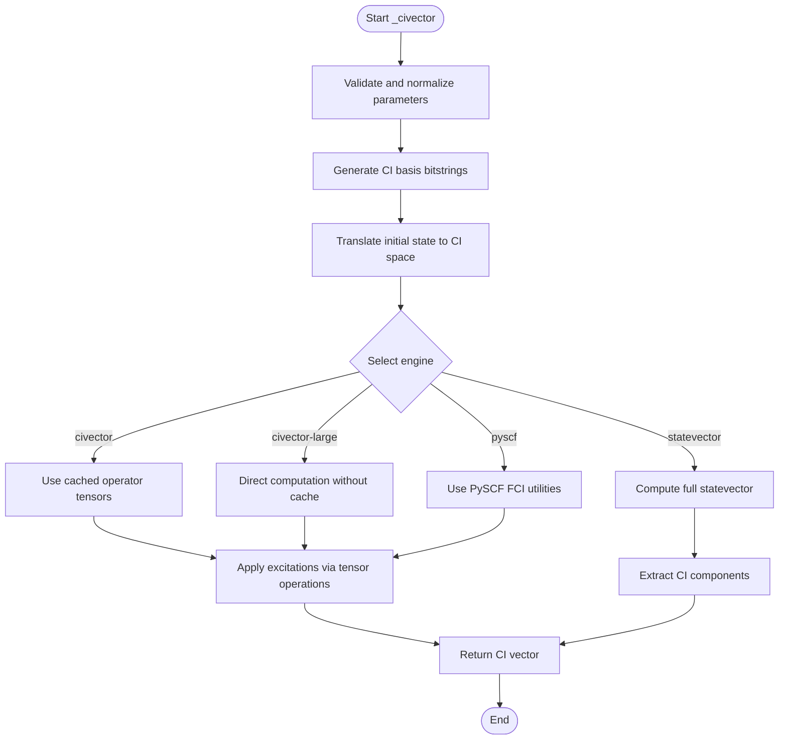
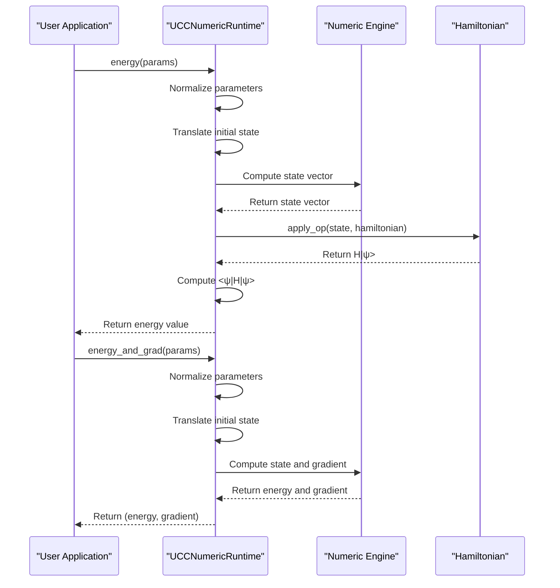

# UCC Numeric Runtime

<cite>
**Referenced Files in This Document**   
- [ucc_numeric_runtime.py](file://src/tyxonq/applications/chem/runtimes/ucc_numeric_runtime.py)
- [ci_state_mapping.py](file://src/tyxonq/applications/chem/chem_libs/quantum_chem_library/ci_state_mapping.py)
- [civector_ops.py](file://src/tyxonq/applications/chem/chem_libs/quantum_chem_library/civector_ops.py)
- [pyscf_civector.py](file://src/tyxonq/applications/chem/chem_libs/quantum_chem_library/pyscf_civector.py)
- [statevector_ops.py](file://src/tyxonq/applications/chem/chem_libs/quantum_chem_library/statevector_ops.py)
- [hamiltonian_builders.py](file://src/tyxonq/applications/chem/chem_libs/hamiltonians_chem_library/hamiltonian_builders.py)
</cite>

## Table of Contents
1. [Introduction](#introduction)
2. [Core Components](#core-components)
3. [Numeric Engine Architecture](#numeric-engine-architecture)
4. [Configuration Interaction Vector Construction](#configuration-interaction-vector-construction)
5. [Energy Computation and Gradient Evaluation](#energy-computation-and-gradient-evaluation)
6. [Excitation Modes and State Initialization](#excitation-modes-and-state-initialization)
7. [Performance Characteristics and Complexity](#performance-characteristics-and-complexity)
8. [Engine Selection Guidance](#engine-selection-guidance)
9. [Integration with Quantum Chemistry Workflows](#integration-with-quantum-chemistry-workflows)

## Introduction
The UCCNumericRuntime class provides exact numerical simulation capabilities for unitary coupled cluster (UCC) methods in quantum chemistry applications. This runtime enables high-precision quantum simulations by supporting multiple numeric engines that balance computational efficiency with accuracy requirements. The implementation is designed to handle various excitation modes and initialization strategies while maintaining compatibility with classical quantum chemistry workflows through integration with PySCF.

The runtime serves as the computational backbone for UCC-based quantum algorithms, offering both full statevector simulation and configuration interaction (CI) vector approaches. It supports different excitation modes including fermion, qubit, and hard-core boson (hcb) representations, allowing flexibility in quantum chemistry problem formulation. The architecture is optimized for both small-scale exact simulations and larger systems where computational constraints require specialized approaches.

**Section sources**
- [ucc_numeric_runtime.py](file://src/tyxonq/applications/chem/runtimes/ucc_numeric_runtime.py#L40-L70)

## Core Components
The UCCNumericRuntime class encapsulates the core functionality for exact numerical simulation of unitary coupled cluster methods. Key components include the initialization of system parameters, excitation operators, and numeric engine selection. The class maintains internal state for qubit count, electron configuration, Hamiltonian representation, excitation operators, and initialization parameters.

Central to the runtime's functionality is the ability to switch between different numeric engines based on system requirements and computational constraints. The initialization process establishes the active space for quantum simulations, defines excitation operators, and sets up the appropriate numeric backend. The runtime supports parameterized excitation operators with customizable parameter indexing, enabling flexible circuit construction for variational quantum algorithms.

The architecture separates concerns between circuit construction, state preparation, and energy evaluation, allowing for efficient computation paths depending on the selected numeric engine. This modular design enables the runtime to optimize performance for different problem scales and precision requirements while maintaining a consistent interface for quantum chemistry applications.

**Section sources**
- [ucc_numeric_runtime.py](file://src/tyxonq/applications/chem/runtimes/ucc_numeric_runtime.py#L40-L70)

## Numeric Engine Architecture
The UCCNumericRuntime implements a multi-engine architecture that supports various computational approaches for quantum chemistry simulations. The primary engines include full statevector simulation, configuration interaction (CI) vector computation, and PySCF-integrated computation. Each engine is optimized for specific use cases and system characteristics, allowing users to select the most appropriate approach based on their requirements.

The statevector engine provides complete quantum state representation by embedding CI vectors into the full Hilbert space. This approach is suitable for smaller systems where memory constraints permit full statevector representation. The CI vector engines (civector and civector-large) operate directly in the configuration interaction space, significantly reducing memory requirements for larger active spaces. The civector engine utilizes caching mechanisms for repeated operations, while civector-large avoids caching to handle very large systems.

The PySCF integration engine provides high-precision reference calculations by leveraging the established PySCF quantum chemistry package. This engine is particularly valuable for validation and benchmarking purposes, offering a trusted baseline for quantum algorithm development. All engines maintain consistent interfaces and output formats, ensuring seamless integration with higher-level quantum chemistry workflows regardless of the underlying computational approach.

```mermaid
classDiagram
class UCCNumericRuntime {
+int n_qubits
+Tuple[int, int] n_elec_s
+QubitOperator h_qubit_op
+List[Tuple] ex_ops
+List[int] param_ids
+Sequence[float] | Circuit init_state
+str mode
+bool trotter
+bool decompose_multicontrol
+str numeric_engine
+Any hamiltonian
+int n_params
+dict _ci_cache
+__init__(n_qubits, n_elec_s, h_qubit_op, ex_ops, param_ids, init_state, mode, trotter, decompose_multicontrol, numeric_engine, hamiltonian)
+_build(params) Circuit
+_state(params) np.ndarray
+_civector(params) np.ndarray
+_align_statevector_order(psi) np.ndarray
+energy(params) float
+energy_and_grad(params) Tuple[float, np.ndarray]
}
class CIvectorOps {
+get_civector(params, n_qubits, n_elec_s, ex_ops, param_ids, mode, init_state) np.ndarray
+get_civector_nocache(params, n_qubits, n_elec_s, ex_ops, param_ids, mode, init_state) np.ndarray
+get_civector_pyscf(params, n_qubits, n_elec_s, ex_ops, param_ids, mode, init_state) np.ndarray
+get_operator_tensors(n_qubits, n_elec_s, ex_ops, mode) Tuple[np.ndarray, np.ndarray, np.ndarray, np.ndarray]
+evolve_civector_by_tensor(civector, fket_permutation_tensor, fket_phase_tensor, f2ket_phase_tensor, theta_sin, theta_1mcos) np.ndarray
}
class StatevectorOps {
+get_statevector(params, n_qubits, n_elec_s, ex_ops, param_ids, mode, init_state) np.ndarray
+apply_excitation_statevector(statevector, n_qubits, f_idx, mode) np.ndarray
+evolve_excitation(statevector, f_idx, theta, mode) np.ndarray
+energy_and_grad_statevector(params, hamiltonian, n_qubits, n_elec_s, ex_ops, param_ids, mode, init_state) Tuple[float, np.ndarray]
}
class HamiltonianBuilders {
+apply_op(hamiltonian, ket) np.ndarray
}
UCCNumericRuntime --> CIvectorOps : "uses for CI vector operations"
UCCNumericRuntime --> StatevectorOps : "uses for statevector operations"
UCCNumericRuntime --> HamiltonianBuilders : "uses for Hamiltonian application"
UCCNumericRuntime --> "ci_state_mapping" : "uses for CI string generation"
```

**Diagram sources**
- [ucc_numeric_runtime.py](file://src/tyxonq/applications/chem/runtimes/ucc_numeric_runtime.py#L40-L241)
- [civector_ops.py](file://src/tyxonq/applications/chem/chem_libs/quantum_chem_library/civector_ops.py#L98-L116)
- [statevector_ops.py](file://src/tyxonq/applications/chem/chem_libs/quantum_chem_library/statevector_ops.py#L65-L103)
- [hamiltonian_builders.py](file://src/tyxonq/applications/chem/chem_libs/hamiltonians_chem_library/hamiltonian_builders.py#L279-L295)

## Configuration Interaction Vector Construction
The _civector() method is central to the UCCNumericRuntime's ability to perform efficient quantum chemistry simulations in the configuration interaction space. This method constructs CI vectors in the active space, enabling simulation when full statevector representation becomes computationally infeasible. The implementation follows TCC (Tensor Contraction Engine) conventions for consistent behavior across different computational approaches.

The method begins by normalizing input parameters and determining the appropriate initial state representation. It then generates the CI basis bitstrings for the given particle numbers and excitation mode using the get_ci_strings() function. The initial state is translated into the CI vector space, handling various input formats including circuits, statevectors, and direct CI vector specifications.

Depending on the selected numeric engine, the method dispatches to the appropriate CI vector construction function. For the civector engine, it uses cached operator tensors for efficient computation. The civector-large engine employs a non-cached approach suitable for very large active spaces, while the PySCF engine leverages external quantum chemistry libraries for high-precision reference calculations. The statevector engine computes the full statevector and extracts the CI components.

The method ensures proper alignment between different representations by maintaining consistent ordering with OpenFermion conventions. This compatibility is crucial for interoperability with other quantum chemistry software and ensures consistent results across different computational platforms.



**Diagram sources**
- [ucc_numeric_runtime.py](file://src/tyxonq/applications/chem/runtimes/ucc_numeric_runtime.py#L122-L149)
- [civector_ops.py](file://src/tyxonq/applications/chem/chem_libs/quantum_chem_library/civector_ops.py#L98-L116)
- [pyscf_civector.py](file://src/tyxonq/applications/chem/chem_libs/quantum_chem_library/pyscf_civector.py#L140-L158)
- [statevector_ops.py](file://src/tyxonq/applications/chem/chem_libs/quantum_chem_library/statevector_ops.py#L65-L103)

**Section sources**
- [ucc_numeric_runtime.py](file://src/tyxonq/applications/chem/runtimes/ucc_numeric_runtime.py#L122-L149)

## Energy Computation and Gradient Evaluation
The energy() method computes exact energy values using either embedded CI vectors or full statevector evolution, providing high-precision results for quantum chemistry applications. The method supports multiple numeric engines, allowing users to balance computational efficiency with accuracy requirements. For each engine, the method follows a consistent computational pattern: parameter validation, initial state preparation, state evolution, and energy calculation.

The energy computation process begins with parameter normalization and initial state translation into the appropriate representation. Depending on the selected numeric engine, the method computes the quantum state using either CI vector operations or full statevector simulation. The resulting state vector is then used to compute the expectation value of the Hamiltonian through the apply_op() function, which handles various Hamiltonian representations including sparse matrices, callable functions, and direct matrix multiplication.

The energy_and_grad() method extends this functionality by providing analytical gradients alongside energy values, essential for variational quantum algorithms. This method implements different gradient computation strategies for each numeric engine, maintaining consistency in results while optimizing for computational efficiency. The gradients are computed using parameter shift rules or analytical differentiation, depending on the engine, and are returned in a format compatible with optimization algorithms.

Both methods ensure numerical stability and precision by using appropriate data types and computational approaches. The implementation handles edge cases such as zero parameters and empty excitation operators, providing consistent behavior across different usage scenarios.



**Diagram sources**
- [ucc_numeric_runtime.py](file://src/tyxonq/applications/chem/runtimes/ucc_numeric_runtime.py#L169-L193)
- [ucc_numeric_runtime.py](file://src/tyxonq/applications/chem/runtimes/ucc_numeric_runtime.py#L195-L241)
- [hamiltonian_builders.py](file://src/tyxonq/applications/chem/chem_libs/hamiltonians_chem_library/hamiltonian_builders.py#L279-L295)

**Section sources**
- [ucc_numeric_runtime.py](file://src/tyxonq/applications/chem/runtimes/ucc_numeric_runtime.py#L169-L193)
- [ucc_numeric_runtime.py](file://src/tyxonq/applications/chem/runtimes/ucc_numeric_runtime.py#L195-L241)

## Excitation Modes and State Initialization
The UCCNumericRuntime supports multiple excitation modes including fermion, qubit, and hard-core boson (hcb) representations, providing flexibility for different quantum chemistry problem formulations. Each mode defines how excitation operators are interpreted and applied to the quantum state. The fermion mode follows standard second quantization conventions, while the qubit mode uses direct qubit representations. The hcb mode is optimized for systems with paired excitations or spinless fermions.

State initialization strategies are designed to handle various input formats and physical scenarios. The runtime accepts initialization from quantum circuits, statevectors, or direct CI vector specifications. When initialized with a circuit, the runtime executes the circuit using a statevector simulator to obtain the initial quantum state. For statevector initialization, the input is validated and converted to the appropriate representation. Direct CI vector initialization allows users to specify the initial state in the configuration interaction basis, useful for advanced quantum chemistry calculations.

The initialization process includes translation between different representations to ensure consistency across computational engines. The translate_init_state() function handles conversion between circuit, statevector, and CI vector representations, maintaining proper normalization and phase conventions. This translation ensures that the initial state is correctly represented in the CI space, regardless of the input format.

The runtime also supports automatic initialization of the Hartree-Fock state when no initial state is provided, following standard quantum chemistry conventions. This default behavior ensures consistent starting points for variational quantum algorithms while allowing customization for specialized applications.

**Section sources**
- [ucc_numeric_runtime.py](file://src/tyxonq/applications/chem/runtimes/ucc_numeric_runtime.py#L122-L149)
- [ci_state_mapping.py](file://src/tyxonq/applications/chem/chem_libs/quantum_chem_library/ci_state_mapping.py#L143-L154)

## Performance Characteristics and Complexity
The UCCNumericRuntime exhibits different performance characteristics and computational complexity depending on the selected numeric engine and system parameters. Memory and computational requirements vary significantly between engines, making engine selection crucial for large-scale quantum chemistry simulations.

The full statevector engine has exponential memory complexity O(2^N) where N is the number of qubits, making it suitable only for small systems (typically N ≤ 30 on standard hardware). The computational complexity for state evolution is also exponential, scaling with the number of excitation operators and system size. This engine provides the most complete quantum state representation but is limited by available memory.

The CI vector engines (civector and civector-large) operate in the configuration interaction space, reducing memory requirements to O(M) where M is the number of CI basis states. For systems with N qubits and n electrons, M scales combinatorially as C(N/2, n/2)^2 for unrestricted calculations. This represents a significant reduction compared to the full statevector approach, enabling simulation of larger active spaces. The civector engine uses caching to optimize repeated operations, while civector-large avoids caching overhead for very large systems.

The PySCF integration engine inherits the performance characteristics of the underlying PySCF implementation, typically optimized for medium-sized systems with efficient sparse matrix operations. Computational complexity depends on the specific FCI algorithm used but generally scales polynomially with system size for fixed active spaces.

All engines maintain consistent time complexity for energy evaluation, dominated by Hamiltonian application which scales with the number of non-zero elements in the Hamiltonian matrix. The _align_statevector_order() method ensures compatibility with OpenFermion conventions with O(N*2^N) complexity for bit-reversal operations.

**Section sources**
- [ucc_numeric_runtime.py](file://src/tyxonq/applications/chem/runtimes/ucc_numeric_runtime.py#L153-L167)
- [ci_state_mapping.py](file://src/tyxonq/applications/chem/chem_libs/quantum_chem_library/ci_state_mapping.py#L37-L96)

## Engine Selection Guidance
Selecting the appropriate numeric engine in UCCNumericRuntime depends on system size, required precision, and computational resources. For small systems (≤ 20 qubits), the full statevector engine provides complete quantum state information and is recommended for algorithm development and debugging. This engine is particularly useful when analyzing quantum state properties beyond energy values.

For medium-sized systems (20-30 qubits) with moderate active spaces, the civector engine offers an optimal balance between accuracy and efficiency. The caching mechanism provides performance benefits for iterative algorithms like VQE, where the same excitation operators are applied repeatedly with different parameters. This engine is recommended for production quantum chemistry calculations on available hardware.

For large active spaces or systems with many electrons, the civector-large engine is preferred as it avoids memory overhead from caching while maintaining computational efficiency. This engine is suitable for exploring large configuration spaces where memory constraints would otherwise limit calculations.

The PySCF engine should be used when high-precision reference values are required for validation or when comparing quantum algorithms with classical quantum chemistry methods. This engine is particularly valuable for benchmarking and method development, providing a trusted baseline for quantum algorithm accuracy.

Memory constraints are the primary factor in engine selection. Users should estimate the memory requirements based on the number of CI basis states and available system resources. For systems approaching the limits of available memory, the civector-large engine provides the most memory-efficient option while maintaining high computational accuracy.

**Section sources**
- [ucc_numeric_runtime.py](file://src/tyxonq/applications/chem/runtimes/ucc_numeric_runtime.py#L40-L70)

## Integration with Quantum Chemistry Workflows
The UCCNumericRuntime integrates seamlessly with classical quantum chemistry workflows through multiple interfaces and compatibility features. The most significant integration is with PySCF, a widely used quantum chemistry package, allowing users to leverage established methods for reference calculations and validation. This integration enables direct comparison between quantum algorithms and classical computational chemistry results.

The runtime maintains compatibility with OpenFermion conventions for statevector ordering and CI string representation, ensuring interoperability with other quantum chemistry software packages. The _align_statevector_order() method specifically addresses bit-ordering differences between simulation frameworks, providing consistent results across different computational platforms.

The design supports hybrid quantum-classical workflows where classical quantum chemistry calculations provide initial parameters, active space definitions, or reference energies for quantum algorithms. The ability to initialize from various state representations (circuits, statevectors, CI vectors) facilitates integration with different stages of quantum chemistry workflows.

The runtime's modular architecture allows it to serve as both a standalone simulation tool and a component in larger quantum chemistry pipelines. Its consistent interface and multiple output formats make it suitable for automated workflows, high-throughput screening, and method benchmarking studies.

**Section sources**
- [ucc_numeric_runtime.py](file://src/tyxonq/applications/chem/runtimes/ucc_numeric_runtime.py#L153-L167)
- [ci_state_mapping.py](file://src/tyxonq/applications/chem/chem_libs/quantum_chem_library/ci_state_mapping.py#L37-L96)