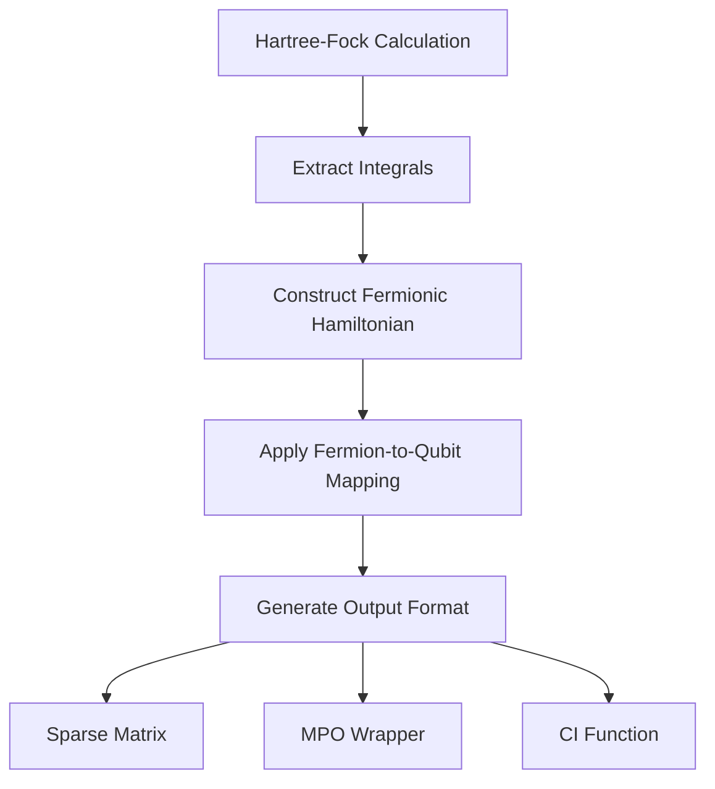
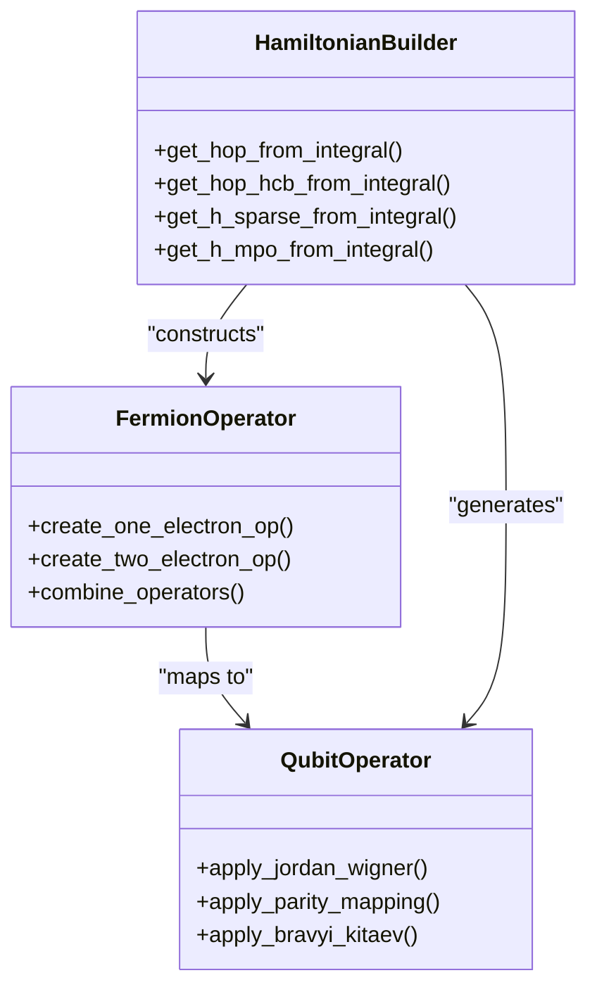
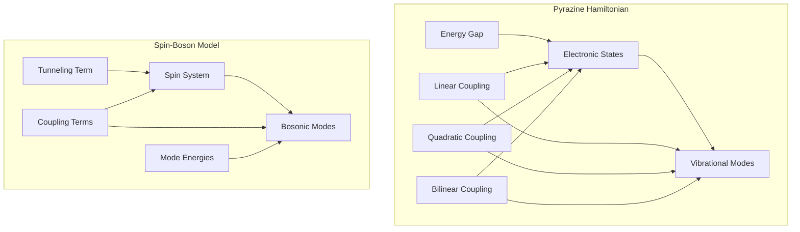

# Molecule Representation and Hamiltonian Construction

<cite>
**Referenced Files in This Document**   
- [molecule.py](file://src/tyxonq/applications/chem/molecule.py)
- [hamiltonian_builders.py](file://src/tyxonq/applications/chem/chem_libs/hamiltonians_chem_library/hamiltonian_builders.py)
- [pyrazine.py](file://src/tyxonq/applications/chem/chem_libs/hamiltonians_chem_library/pyrazine.py)
- [sbm.py](file://src/tyxonq/applications/chem/chem_libs/hamiltonians_chem_library/sbm.py)
</cite>

## Table of Contents
1. [Introduction](#introduction)
2. [Molecule Class Design and Integration with PySCF](#molecule-class-design-and-integration-with-pyscf)
3. [Hamiltonian Construction Process](#hamiltonian-construction-process)
4. [Fermion-to-Qubit Mappings](#fermion-to-qubit-mappings)
5. [Specialized Hamiltonian Implementations](#specialized-hamiltonian-implementations)
6. [Active Space Approximation](#active-space-approximation)
7. [Usage Patterns](#usage-patterns)
8. [Numerical Precision and Symmetry Handling](#numerical-precision-and-symmetry-handling)
9. [Conclusion](#conclusion)

## Introduction
This document provides a comprehensive overview of molecule representation and Hamiltonian construction in TyxonQ, a quantum chemistry framework. It details the design of the Molecule class, its integration with PySCF for molecular geometry and electronic structure calculations, and the process of constructing molecular Hamiltonians from integrals using various fermion-to-qubit mappings. The document also covers specialized Hamiltonian implementations for benchmark models like pyrazine and spin-boson models (SBM), along with practical usage patterns for both built-in and custom molecular inputs.

## Molecule Class Design and Integration with PySCF

The Molecule class in TyxonQ is designed as a duck-typed wrapper around PySCF's Mole object, enabling seamless integration with PySCF's powerful quantum chemistry capabilities. The class provides a flexible interface for defining molecular systems through atomic coordinates, basis sets, and electronic configurations.

The `_Molecule` class inherits from PySCF's `Mole` class and extends it with additional functionality for quantum computing applications. It supports initialization with one- and two-electron integrals, nuclear repulsion energy, and overlap matrices, allowing for both direct integral input and construction from atomic specifications.

Key features of the Molecule class include:
- Support for random molecule generation for testing purposes
- Built-in constructors for common molecular systems (H2, H4, H2O, etc.)
- Integration with PySCF for Hartree-Fock (HF) calculations
- Methods for retrieving molecular integrals and properties

The integration with PySCF enables TyxonQ to leverage PySCF's robust algorithms for computing one- and two-electron integrals, performing Hartree-Fock calculations, and generating molecular orbital coefficients.

**Section sources**
- [molecule.py](file://src/tyxonq/applications/chem/molecule.py#L1-L310)

## Hamiltonian Construction Process

The Hamiltonian construction process in TyxonQ follows a modular approach, separating the calculation of molecular integrals from the generation of qubit Hamiltonians. This process is orchestrated through the `hamiltonian_builders.py` module.

The construction workflow begins with obtaining molecular integrals from a Hartree-Fock (HF) calculation using PySCF. The `get_integral_from_hf` function extracts the one-electron (`int1e`) and two-electron (`int2e`) integrals, along with the core energy term, from an RHF object. These integrals are then used to construct the electronic Hamiltonian in second quantization form.

The process involves several key steps:
1. **Integral extraction**: Retrieving one- and two-electron integrals from the HF calculation
2. **Hamiltonian operator construction**: Converting integrals into FermionOperator objects
3. **Qubit mapping**: Transforming fermionic operators into qubit operators using various mappings
4. **Format conversion**: Generating Hamiltonians in different formats (sparse, MPO, CI function)

The `get_h_from_integral` function serves as the main entry point for Hamiltonian construction, delegating to specific functions based on the desired output format and mapping.

**Diagram sources**
- [hamiltonian_builders.py](file://src/tyxonq/applications/chem/chem_libs/hamiltonians_chem_library/hamiltonian_builders.py#L42-L213)

**Section sources**
- [hamiltonian_builders.py](file://src/tyxonq/applications/chem/chem_libs/hamiltonians_chem_library/hamiltonian_builders.py#L42-L213)

## Fermion-to-Qubit Mappings

TyxonQ supports multiple fermion-to-qubit mappings for constructing molecular Hamiltonians, each with different trade-offs in terms of qubit count, gate complexity, and symmetry preservation. The primary mappings implemented are Jordan-Wigner (JW), Parity, and Bravyi-Kitaev (BK), though the specific implementation details are abstracted through the OpenFermion library.

The `get_hop_from_integral` function constructs the fermionic Hamiltonian from molecular integrals by:
1. Creating one-electron operators from the one-electron integral matrix
2. Constructing two-electron operators from the two-electron integral tensor
3. Combining these operators into a single FermionOperator

For hard-core boson (HCB) representations, the `get_hop_hcb_from_integral` function implements a specialized mapping that reduces the qubit count by exploiting the HCB constraint. This mapping is particularly useful for certain quantum chemistry problems where the HCB approximation is valid.

The choice of mapping affects both the number of qubits required and the structure of the resulting Hamiltonian. The Jordan-Wigner transformation preserves the locality of operators but results in longer Pauli strings, while the Bravyi-Kitaev transformation offers better scaling for certain operations at the cost of more complex mappings.

**Diagram sources**
- [hamiltonian_builders.py](file://src/tyxonq/applications/chem/chem_libs/hamiltonians_chem_library/hamiltonian_builders.py#L67-L135)

**Section sources**
- [hamiltonian_builders.py](file://src/tyxonq/applications/chem/chem_libs/hamiltonians_chem_library/hamiltonian_builders.py#L67-L135)

## Specialized Hamiltonian Implementations

TyxonQ includes specialized Hamiltonian implementations for benchmark models in quantum chemistry, including the pyrazine vibronic coupling model and spin-boson models (SBM). These implementations provide pre-configured Hamiltonians for testing and validation of quantum algorithms.

### Pyrazine Model
The pyrazine model implements a bi-linear vibronic coupling Hamiltonian with four vibrational modes, based on parameters from the Heidelberg MCTDH package. The Hamiltonian includes:
- Electronic energy gap terms
- Vibrational kinetic and potential energy terms
- Linear and quadratic coupling terms between electronic and vibrational degrees of freedom
- Bilinear coupling terms

The `get_ham_terms` function in `pyrazine.py` constructs the Hamiltonian by iterating over all possible combinations of electronic and vibrational operators, applying the appropriate coupling coefficients from predefined parameters.

### Spin-Boson Model (SBM)
The SBM implementation provides a flexible framework for constructing spin-boson Hamiltonians with arbitrary numbers of bosonic modes. The model includes:
- Spin terms (σ_z and σ_x)
- Bosonic mode terms (b†b)
- Spin-boson coupling terms (σ_z ⊗ (b† + b))

The `get_ham_terms` function in `sbm.py` allows customization of model parameters including energy bias (ε), tunneling amplitude (δ), number of modes, mode frequencies (ω), and coupling strengths (g).

**Diagram sources**
- [pyrazine.py](file://src/tyxonq/applications/chem/chem_libs/hamiltonians_chem_library/pyrazine.py#L1-L138)
- [sbm.py](file://src/tyxonq/applications/chem/chem_libs/hamiltonians_chem_library/sbm.py#L1-L25)

**Section sources**
- [pyrazine.py](file://src/tyxonq/applications/chem/chem_libs/hamiltonians_chem_library/pyrazine.py#L1-L138)
- [sbm.py](file://src/tyxonq/applications/chem/chem_libs/hamiltonians_chem_library/sbm.py#L1-L25)

## Active Space Approximation

TyxonQ supports active space approximation during Hamiltonian construction, allowing users to focus computational resources on the most chemically relevant orbitals. This is implemented through the `active_space` and `active_orbital_indices` parameters in the `get_integral_from_hf` function.

The active space approximation works by:
1. Defining an active space with a specified number of electrons and orbitals
2. Using CASCI (Complete Active Space Self-Consistent Field) to compute effective one- and two-electron integrals within the active space
3. Treating orbitals outside the active space as inactive (frozen)

This approach significantly reduces the number of qubits required for quantum simulations while preserving the essential electronic correlation effects. The `sort_mo` method allows for custom ordering of molecular orbitals, enabling user-defined active space selections.

The active space approximation is particularly valuable for large molecular systems where full configuration interaction calculations are intractable. By focusing on the active space, TyxonQ enables efficient quantum simulations of chemically important processes such as bond breaking, excited states, and reaction pathways.

**Section sources**
- [hamiltonian_builders.py](file://src/tyxonq/applications/chem/chem_libs/hamiltonians_chem_library/hamiltonian_builders.py#L42-L64)

## Usage Patterns

TyxonQ provides flexible usage patterns for both built-in molecules and custom molecular inputs. The framework supports multiple entry points for Hamiltonian construction, catering to different user needs and expertise levels.

### Built-in Molecules
For common molecular systems, TyxonQ provides pre-defined constructors:
- Hydrogen chains (H2, H4, H6, etc.)
- Water (H2O)
- Ammonia (NH3)
- Methane (CH4)
- Benzene (C6H6)

These built-in molecules can be instantiated with minimal parameters, such as bond lengths and angles, making them ideal for quick prototyping and educational purposes.

### Custom Molecular Inputs
For arbitrary molecular systems, users can:
1. Define molecules directly using atomic coordinates and basis sets
2. Provide pre-computed integrals for specialized calculations
3. Use PySCF to compute integrals on-the-fly

The `get_h_from_hf` function serves as the primary interface for Hamiltonian construction, accepting parameters for:
- Output format (sparse, MPO, CI function)
- Fermion-to-qubit mapping (fermion, qubit, hcb)
- Active space specification

Example usage patterns include:
- Constructing sparse Hamiltonians for exact diagonalization
- Generating MPO wrappers for tensor network simulations
- Creating CI functions for iterative solvers

**Section sources**
- [molecule.py](file://src/tyxonq/applications/chem/molecule.py#L1-L310)
- [hamiltonian_builders.py](file://src/tyxonq/applications/chem/chem_libs/hamiltonians_chem_library/hamiltonian_builders.py#L231-L241)

## Numerical Precision and Symmetry Handling

TyxonQ incorporates several features to ensure numerical stability and exploit molecular symmetries in Hamiltonian generation. The framework handles numerical precision through:
- Thresholding of small integral values (default 1e-12)
- Symmetrization of two-electron integrals to ensure proper permutational symmetry
- Use of appropriate data types for different computational backends

Symmetry handling is implemented at multiple levels:
1. **Molecular symmetry**: The underlying PySCF integration preserves molecular point group symmetries when available
2. **Spin symmetry**: The Hamiltonian construction preserves spin symmetry through proper handling of α and β electrons
3. **Orbital symmetry**: Active space selection can leverage orbital symmetries to reduce computational cost

The framework also provides tools for analyzing and exploiting symmetries in the resulting Hamiltonians, such as block-diagonalization and symmetry-adapted basis transformations. These features enable more efficient quantum simulations by reducing the effective Hilbert space dimension and improving convergence of iterative algorithms.

**Section sources**
- [hamiltonian_builders.py](file://src/tyxonq/applications/chem/chem_libs/hamiltonians_chem_library/hamiltonian_builders.py#L138-L149)
- [hamiltonian_builders.py](file://src/tyxonq/applications/chem/chem_libs/hamiltonians_chem_library/hamiltonian_builders.py#L290-L297)

## Conclusion
TyxonQ provides a comprehensive framework for molecule representation and Hamiltonian construction in quantum chemistry applications. The integration with PySCF enables accurate calculation of molecular integrals, while the modular Hamiltonian construction process supports multiple fermion-to-qubit mappings and output formats. The framework's support for active space approximation, specialized Hamiltonian implementations, and flexible usage patterns makes it suitable for both educational purposes and advanced research in quantum chemistry. By combining robust numerical methods with efficient symmetry handling, TyxonQ enables accurate and efficient quantum simulations of molecular systems.