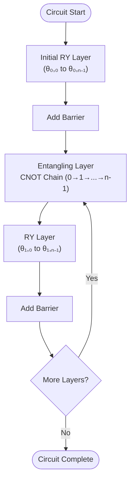
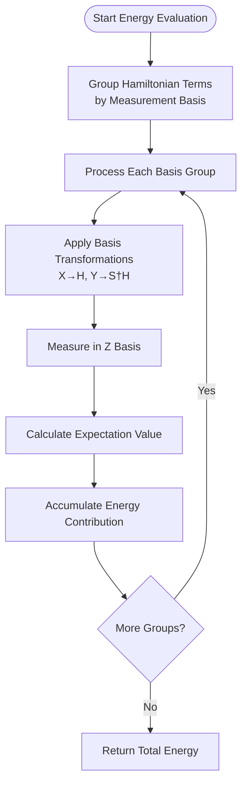
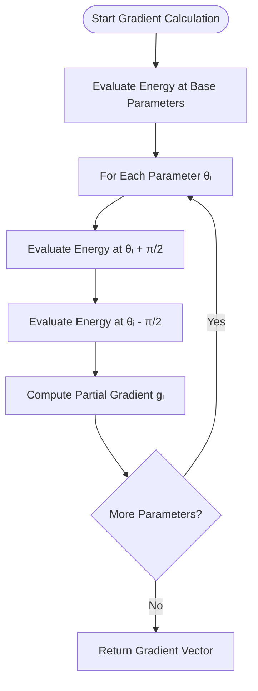
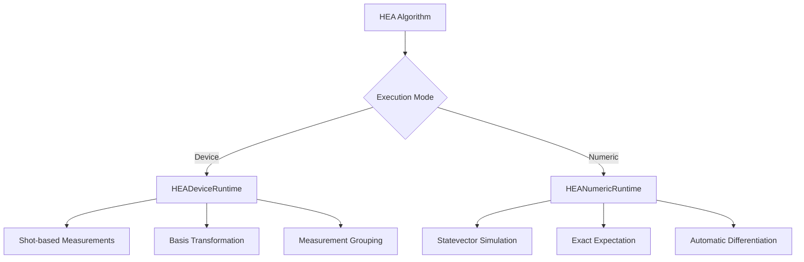
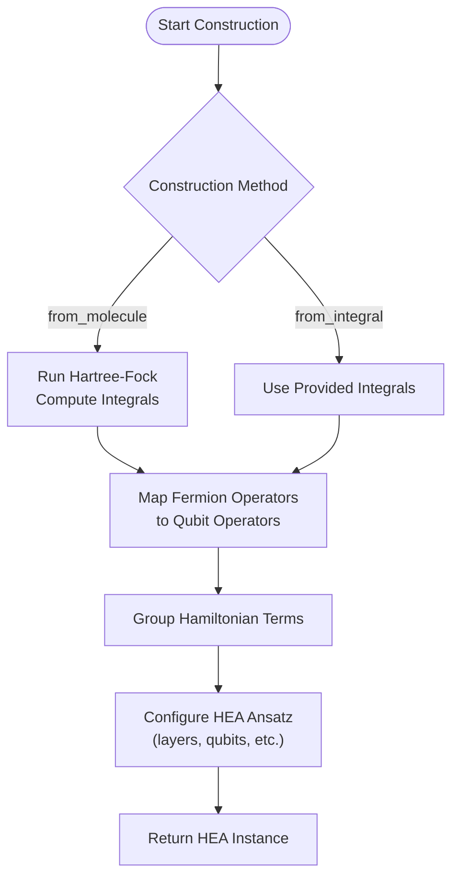

# HEA Algorithm

<cite>
**Referenced Files in This Document**   
- [hea.py](file://src/tyxonq/applications/chem/algorithms/hea.py)
- [hea_device_runtime.py](file://src/tyxonq/applications/chem/runtimes/hea_device_runtime.py)
- [hea_numeric_runtime.py](file://src/tyxonq/applications/chem/runtimes/hea_numeric_runtime.py)
- [cloud_uccsd_hea_demo.py](file://examples/cloud_uccsd_hea_demo.py)
- [blocks.py](file://src/tyxonq/libs/circuits_library/blocks.py)
- [hamiltonian_grouping.py](file://src/tyxonq/libs/hamiltonian_encoding/hamiltonian_grouping.py)
- [fermion_to_qubit.py](file://src/tyxonq/libs/hamiltonian_encoding/fermion_to_qubit.py)
</cite>

## Table of Contents
1. [Introduction](#introduction)
2. [Circuit Structure and Parameterization](#circuit-structure-and-parameterization)
3. [Energy Evaluation Process](#energy-evaluation-process)
4. [Gradient Computation](#gradient-computation)
5. [Dual Execution Paths](#dual-execution-paths)
6. [Molecular Construction Methods](#molecular-construction-methods)
7. [Configuration Options](#configuration-options)
8. [Integration with External Libraries](#integration-with-external-libraries)
9. [Optimization Workflows](#optimization-workflows)
10. [Usage Examples](#usage-examples)

## Introduction

The Hardware-Efficient Ansatz (HEA) algorithm is a variational quantum algorithm designed to balance expressivity and hardware feasibility for quantum chemistry simulations. The implementation provides a flexible framework for constructing parameterized quantum circuits that can be used in Variational Quantum Eigensolver (VQE) and other variational algorithms. The core design philosophy emphasizes practical implementation on near-term quantum devices by using alternating layers of single-qubit rotations and entangling gates that align with hardware connectivity constraints.

The HEA class serves as the primary interface for constructing and optimizing quantum circuits for molecular energy calculations. It supports multiple construction pathways, execution modes, and integration with classical quantum chemistry software, making it suitable for both research and practical applications in quantum computational chemistry.

**Section sources**
- [hea.py](file://src/tyxonq/applications/chem/algorithms/hea.py#L27-L40)

## Circuit Structure and Parameterization

The HEA algorithm implements a hardware-efficient parameterized circuit structure based on alternating layers of RY rotations and CNOT chains. The circuit architecture follows a specific pattern designed to maximize entanglement while maintaining hardware compatibility:

- **Initial Layer**: A layer of RY rotations applied to all qubits
- **Alternating Layers**: L layers of entangling operations followed by RY rotations
- **Entangling Pattern**: CNOT gates arranged in a linear chain (0→1→...→n-1)
- **Barriers**: Inserted between layers for compilation control and visualization

The parameterization scheme results in (layers + 1) * n_qubits total parameters, where each parameter corresponds to the rotation angle of an RY gate. This structure provides a balance between expressivity and trainability, avoiding overly complex entanglement patterns that could lead to barren plateaus while still enabling sufficient expressiveness for quantum chemistry applications.

**Diagram sources**
- [blocks.py](file://src/tyxonq/libs/circuits_library/blocks.py#L58-L81)
- [hea.py](file://src/tyxonq/applications/chem/algorithms/hea.py#L120-L145)

**Section sources**
- [hea.py](file://src/tyxonq/applications/chem/algorithms/hea.py#L27-L40)
- [blocks.py](file://src/tyxonq/libs/circuits_library/blocks.py#L58-L81)

## Energy Evaluation Process

The energy evaluation process in the HEA algorithm involves measuring the expectation value of the molecular Hamiltonian. This is accomplished through a systematic approach that groups Hamiltonian terms by their measurement basis to minimize the number of required circuit executions. The process follows these steps:

1. **Hamiltonian Term Grouping**: Terms are grouped by their Pauli basis to enable simultaneous measurement
2. **Basis Transformation**: For each group, appropriate basis transformations are applied:
   - X basis: Apply Hadamard (H) gate
   - Y basis: Apply S† followed by H gate
   - Z basis: No transformation needed
3. **Z-basis Measurement**: After basis transformation, all qubits are measured in the Z basis
4. **Expectation Value Calculation**: The expectation value is computed from measurement counts

The algorithm leverages the `group_hamiltonian_pauli_terms` function to organize Hamiltonian terms into measurement-compatible groups, significantly reducing the total number of circuit executions required for energy estimation.

**Diagram sources**
- [hamiltonian_grouping.py](file://src/tyxonq/libs/hamiltonian_encoding/hamiltonian_grouping.py#L47-L65)
- [hea_device_runtime.py](file://src/tyxonq/applications/chem/runtimes/hea_device_runtime.py#L51-L97)

**Section sources**
- [hea_device_runtime.py](file://src/tyxonq/applications/chem/runtimes/hea_device_runtime.py#L51-L97)
- [hamiltonian_grouping.py](file://src/tyxonq/libs/hamiltonian_encoding/hamiltonian_grouping.py#L47-L65)

## Gradient Computation

The HEA algorithm implements gradient computation using the parameter shift rule, a technique well-suited for noisy intermediate-scale quantum (NISQ) devices. The parameter shift method calculates gradients by evaluating the energy at parameter values shifted by ±π/2, avoiding the need for ancillary qubits or complex controlled operations.

For each parameter θₖ, the gradient is computed as:
gₖ = 0.5 × (E(θₖ + π/2) - E(θₖ - π/2))

The implementation optimizes this process by batching the evaluation of the base energy and all parameter-shifted energies into a single job submission, reducing communication overhead and improving efficiency. This approach is particularly beneficial when running on cloud-based quantum devices where job submission latency can be significant.

**Diagram sources**
- [hea_device_runtime.py](file://src/tyxonq/applications/chem/runtimes/hea_device_runtime.py#L99-L175)
- [hea_numeric_runtime.py](file://src/tyxonq/applications/chem/runtimes/hea_numeric_runtime.py#L92-L97)

**Section sources**
- [hea_device_runtime.py](file://src/tyxonq/applications/chem/runtimes/hea_device_runtime.py#L99-L175)
- [hea_numeric_runtime.py](file://src/tyxonq/applications/chem/runtimes/hea_numeric_runtime.py#L92-L97)

## Dual Execution Paths

The HEA algorithm supports two distinct execution paths to accommodate different use cases and hardware availability:

### Device-Based Execution
The device-based execution path uses shot-based measurements on quantum hardware or simulators. This approach:
- Simulates realistic quantum device behavior with sampling noise
- Uses the `HEADeviceRuntime` class for execution
- Supports various providers and devices through the runtime system
- Implements measurement batching for efficiency
- Handles post-processing of measurement results

### Numeric Simulation
The numeric simulation path uses statevector methods for exact calculations. This approach:
- Provides noise-free, exact expectation values
- Uses the `HEANumericRuntime` class for execution
- Leverages statevector simulators for efficient computation
- Enables gradient computation through automatic differentiation
- Serves as a baseline for algorithm validation

The dual execution model allows users to seamlessly switch between simulation and hardware execution, facilitating algorithm development and validation before deployment on actual quantum devices.

**Diagram sources**
- [hea.py](file://src/tyxonq/applications/chem/algorithms/hea.py#L147-L182)
- [hea_device_runtime.py](file://src/tyxonq/applications/chem/runtimes/hea_device_runtime.py#L51-L175)
- [hea_numeric_runtime.py](file://src/tyxonq/applications/chem/runtimes/hea_numeric_runtime.py#L86-L97)

**Section sources**
- [hea.py](file://src/tyxonq/applications/chem/algorithms/hea.py#L147-L182)
- [hea_device_runtime.py](file://src/tyxonq/applications/chem/runtimes/hea_device_runtime.py#L51-L175)
- [hea_numeric_runtime.py](file://src/tyxonq/applications/chem/runtimes/hea_numeric_runtime.py#L86-L97)

## Molecular Construction Methods

The HEA algorithm provides multiple methods for constructing instances from molecular data, enabling integration with quantum chemistry workflows. The primary construction methods are:

### from_molecule
This method constructs an HEA instance directly from a PySCF molecule object. It automatically:
- Performs Hartree-Fock calculations to obtain molecular orbitals
- Computes one- and two-electron integrals
- Applies fermion-to-qubit mapping
- Configures the ansatz with appropriate parameters

### from_integral
This method constructs an HEA instance from pre-computed molecular integrals. It accepts:
- One-electron integrals (int1e)
- Two-electron integrals (int2e)
- Electron count and core energy
- Configuration parameters for mapping and layers

The construction process involves transforming fermionic operators to qubit operators using the specified mapping (parity, Jordan-Wigner, or Bravyi-Kitaev), then converting the resulting Hamiltonian to a list of Pauli terms for measurement.

**Diagram sources**
- [hea.py](file://src/tyxonq/applications/chem/algorithms/hea.py#L352-L410)
- [hea.py](file://src/tyxonq/applications/chem/algorithms/hea.py#L296-L349)

**Section sources**
- [hea.py](file://src/tyxonq/applications/chem/algorithms/hea.py#L296-L410)

## Configuration Options

The HEA algorithm supports several configuration options that control its behavior and integration with different systems:

### Mapping
Specifies the fermion-to-qubit mapping method:
- **parity**: Parity mapping with two-qubit reduction
- **jordan-wigner**: Jordan-Wigner transformation
- **bravyi-kitaev**: Bravyi-Kitaev transformation

### Runtime
Determines the execution backend:
- **device**: Execute on quantum hardware or device simulators
- **numeric**: Use numeric statevector simulation

### Classical Provider
Controls where classical computations are performed:
- **local**: Run on local machine
- **tyxonq**: Offload to cloud-based classical computing

### Numeric Engine
Specifies the simulation backend for numeric execution:
- **statevector**: Full statevector simulation
- **mps**: Matrix Product State simulation (not yet implemented)

These configuration options provide flexibility in balancing accuracy, computational cost, and hardware constraints based on the specific requirements of the quantum chemistry problem.

**Section sources**
- [hea.py](file://src/tyxonq/applications/chem/algorithms/hea.py#L70-L110)

## Integration with External Libraries

The HEA algorithm integrates with several external libraries to provide comprehensive quantum chemistry capabilities:

### PySCF Integration
The algorithm uses PySCF for classical quantum chemistry calculations, including:
- Hartree-Fock self-consistent field (SCF) calculations
- Molecular orbital computation
- One- and two-electron integral evaluation
- Active space specification

### OpenFermion Integration
OpenFermion is used for fermion-to-qubit mapping and operator manipulation:
- FermionOperator and QubitOperator classes
- Jordan-Wigner, Bravyi-Kitaev, and parity transformations
- Operator algebra and simplification
- Sparse matrix representation for Hamiltonians

### SciPy Integration
SciPy optimizers are used for the variational optimization loop:
- L-BFGS-B for gradient-based optimization
- COBYLA for gradient-free optimization
- Customizable optimization options through scipy_minimize_options

This integration ecosystem enables the HEA algorithm to leverage state-of-the-art classical quantum chemistry software while providing a modern quantum computing interface.

**Section sources**
- [hea.py](file://src/tyxonq/applications/chem/algorithms/hea.py#L10-L15)
- [fermion_to_qubit.py](file://src/tyxonq/libs/hamiltonian_encoding/fermion_to_qop.py#L78-L88)

## Optimization Workflows

The HEA algorithm implements optimization workflows using SciPy minimizers to find the ground state energy of molecular systems. The optimization process follows these steps:

1. **Initialization**: Set up the optimization with appropriate methods based on gradient availability
2. **Objective Function**: Create a callable function that evaluates energy (and gradients)
3. **Minimization**: Use SciPy's minimize function with appropriate settings
4. **Result Storage**: Store optimization results including parameters and energy

The algorithm automatically selects between gradient-based (L-BFGS-B) and gradient-free (COBYLA) optimizers based on the gradient computation method. Default maximum iterations are set to 200 for exact simulations and 100 for shot-based executions to balance convergence and computational cost.

To avoid gradient plateaus, the implementation uses a deterministic non-trivial initial guess generated with a fixed random seed, ensuring reproducible results while avoiding the zero-gradient problem that can occur with symmetric initial parameter values.

**Section sources**
- [hea.py](file://src/tyxonq/applications/chem/algorithms/hea.py#L210-L253)

## Usage Examples

The HEA algorithm is demonstrated in the `cloud_uccsd_hea_demo.py` example, which shows how to perform quantum chemistry calculations on molecular systems. The example workflow includes:

1. **Molecule Definition**: Create a hydrogen molecule (H₂) with specified geometry
2. **HEA Construction**: Initialize HEA instances with different configurations
3. **Energy Calculation**: Compute ground state energy using the kernel method
4. **Result Comparison**: Compare results from different execution modes

The example demonstrates both local execution and cloud-based execution, showing how to leverage different computational resources for quantum chemistry simulations. It also illustrates the use of different fermion-to-qubit mappings and the impact of circuit depth (layers) on the accuracy of energy calculations.

**Section sources**
- [cloud_uccsd_hea_demo.py](file://examples/cloud_uccsd_hea_demo.py#L30-L56)