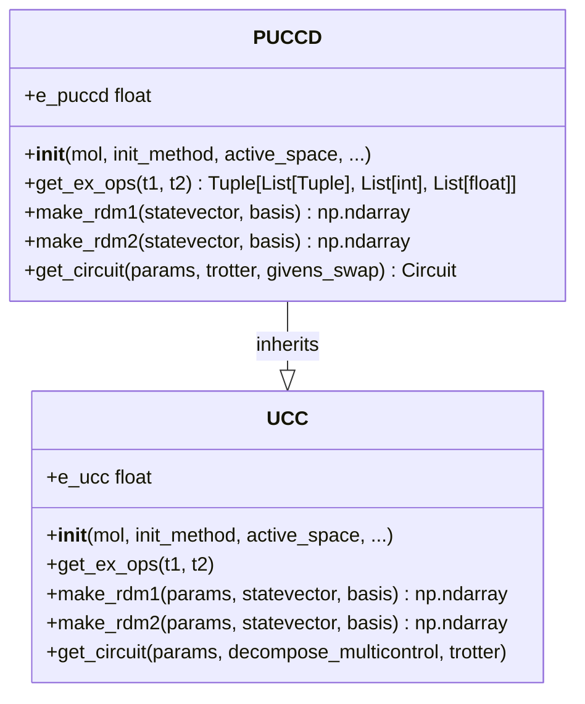
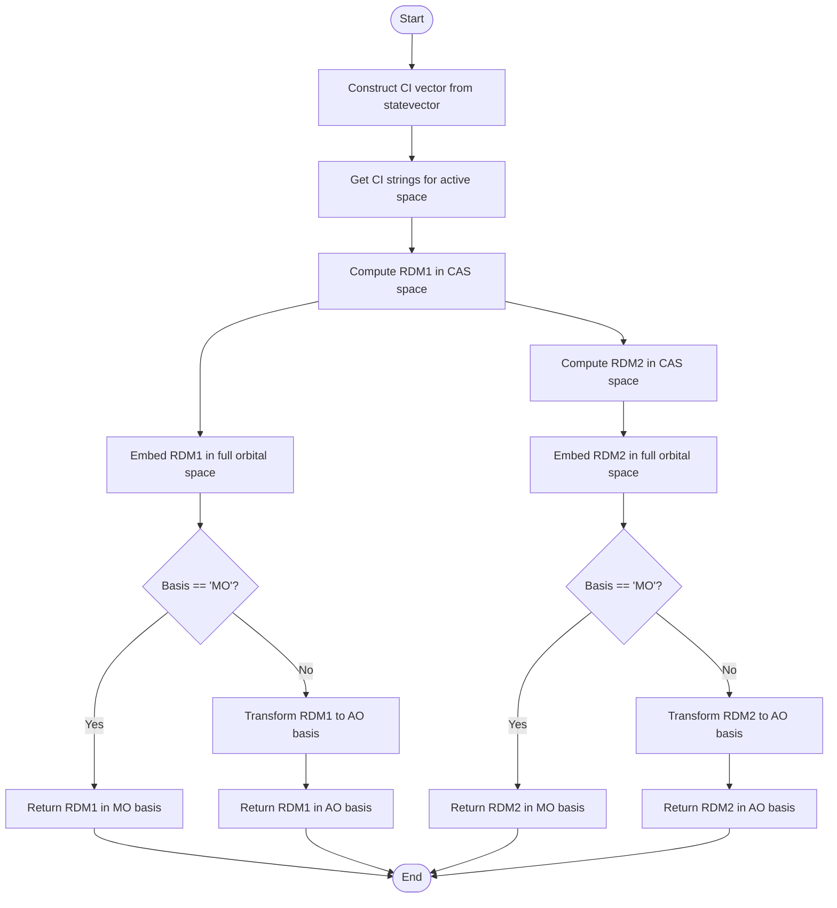

# PUCCD Algorithm

<cite>
**Referenced Files in This Document**   
- [puccd.py](file://src/tyxonq/applications/chem/algorithms/puccd.py)
- [ucc.py](file://src/tyxonq/applications/chem/algorithms/ucc.py)
- [kupccgsd.py](file://src/tyxonq/applications/chem/algorithms/kupccgsd.py)
- [molecule.py](file://src/tyxonq/applications/chem/molecule.py)
- [qubit_state_preparation.py](file://src/tyxonq/libs/circuits_library/qubit_state_preparation.py)
- [hamiltonian_builders.py](file://src/tyxonq/applications/chem/chem_libs/hamiltonians_chem_library/hamiltonian_builders.py)
- [test_puccd.py](file://tests_mol_valid/test_puccd.py)
</cite>

## Table of Contents
1. [Introduction](#introduction)
2. [Theoretical Foundation](#theoretical-foundation)
3. [Implementation Details](#implementation-details)
4. [Configuration Parameters](#configuration-parameters)
5. [Usage Examples](#usage-examples)
6. [Performance Comparison](#performance-comparison)
7. [Guidance on When to Use PUCCD](#guidance-on-when-to-use-puccd)
8. [Conclusion](#conclusion)

## Introduction
The Pair Unitary Coupled Cluster Doubles (PUCCD) algorithm is a specialized quantum chemistry method designed to model electron correlation through pair-coupled cluster approaches that focus on double excitations while preserving spin symmetry. This document provides a comprehensive overview of the PUCCD algorithm, detailing its theoretical foundation, implementation specifics, configuration parameters, usage examples, and performance characteristics. The algorithm is implemented within the TyxonQ framework and inherits core functionality from the base UCC class while introducing specialized excitation operator selection for paired electron transitions.

**Section sources**
- [puccd.py](file://src/tyxonq/applications/chem/algorithms/puccd.py#L19-L186)

## Theoretical Foundation
PUCCD restricts the excitation space to paired electron transitions, which significantly reduces circuit depth compared to full UCCSD while maintaining chemical accuracy for many systems. This approach leverages the fact that electron correlation in many molecular systems can be effectively modeled by considering only paired excitations, where two electrons are simultaneously excited from occupied to virtual orbitals. By focusing on double excitations that preserve spin symmetry, PUCCD ensures that the resulting wavefunction maintains the correct spin state throughout the computation.

The theoretical foundation of PUCCD is rooted in the unitary coupled cluster (UCC) formalism, which expresses the wavefunction as an exponential of excitation operators applied to a reference state, typically the Hartree-Fock (HF) determinant. In PUCCD, the excitation operator is constructed to include only paired double excitations, which are represented as products of creation and annihilation operators acting on spin-orbitals. This restriction not only simplifies the ansatz but also reduces the number of variational parameters, leading to more efficient optimization.

The algorithm's design aligns with the Hard Core Boson (HCB) mapping, which is particularly suitable for systems with strong pairing correlations. The HCB mapping transforms fermionic operators into qubit operators, enabling the implementation of PUCCD on quantum hardware. This transformation preserves the essential physics of electron correlation while adapting it to the constraints of quantum computing architectures.

**Section sources**
- [puccd.py](file://src/tyxonq/applications/chem/algorithms/puccd.py#L19-L186)
- [hamiltonian_builders.py](file://src/tyxonq/applications/chem/chem_libs/hamiltonians_chem_library/hamiltonian_builders.py#L1-L298)

## Implementation Details
The implementation of PUCCD in the TyxonQ framework is built upon the base UCC class, inheriting core functionalities such as energy evaluation, gradient computation, and parameter optimization. The key specialization lies in the construction of the excitation operator, which is tailored to include only paired double excitations.

### Initialization and Excitation Operator Construction
PUCCD is initialized with a molecular system, typically specified through a PySCF Mole object or direct molecular construction parameters. The initialization process involves setting up the active space, determining the initial guess for the amplitudes, and configuring the computational mode (e.g., HCB). The excitation operators are constructed using the `get_ex_ops` method, which generates a list of paired double excitations based on the spatial and spin-orbital configurations.



**Diagram sources **
- [puccd.py](file://src/tyxonq/applications/chem/algorithms/puccd.py#L19-L186)
- [ucc.py](file://src/tyxonq/applications/chem/algorithms/ucc.py#L51-L1086)

The `get_ex_ops` method in PUCCD constructs the excitation operators by iterating over the occupied and virtual orbitals, generating paired double excitations that respect the spin symmetry. The initial guess for the amplitudes is typically derived from MP2 (second-order Møller-Plesset perturbation theory) or CCSD (coupled cluster singles and doubles) calculations, depending on the specified initialization method.

### Reduced Density Matrix (RDM) Calculation
PUCCD provides specialized methods for calculating the one- and two-particle reduced density matrices (RDMs) in the molecular orbital (MO) basis. The `make_rdm1` and `make_rdm2` methods compute the RDMs by tracing out the spin degrees of freedom and embedding the results in the full orbital space. These RDMs are essential for evaluating molecular properties and analyzing the electronic structure.



**Diagram sources **
- [puccd.py](file://src/tyxonq/applications/chem/algorithms/puccd.py#L98-L151)

### Circuit Generation
The quantum circuit for PUCCD is generated using the `get_circuit` method, which constructs a parameterized ansatz based on the excitation operators. The method supports two circuit representations: the default gate-based circuit and the Givens-Swap circuit, which is optimized for certain quantum hardware architectures. The Givens-Swap circuit uses a sequence of Givens rotations to implement the paired double excitations, reducing the circuit depth and improving the fidelity of the computation.

**Section sources**
- [puccd.py](file://src/tyxonq/applications/chem/algorithms/puccd.py#L155-L179)
- [qubit_state_preparation.py](file://src/tyxonq/libs/circuits_library/qubit_state_preparation.py#L1-L226)

## Configuration Parameters
PUCCD offers several configuration parameters to customize the calculation:

- **mol**: The molecular system, specified as a PySCF Mole object or RHF object.
- **init_method**: The method for determining the initial amplitude guess, with options including "mp2", "ccsd", "fe", and "zeros".
- **active_space**: A tuple specifying the number of active electrons and orbitals.
- **active_orbital_indices**: A list of indices for the active orbitals.
- **mo_coeff**: The molecular orbital coefficients, which can be provided to skip the Hartree-Fock calculation.
- **runtime**: The computational runtime, with options for "device" (quantum hardware) or "numeric" (classical simulation).
- **numeric_engine**: The numerical engine for classical simulations, with options including "civector", "civector-large", and "statevector".
- **run_fci**: A boolean flag indicating whether to run Full Configuration Interaction (FCI) for energy reference.
- **classical_provider**: The provider for classical computations, with options for "local" or cloud-based services.
- **classical_device**: The device for classical computations, with options for "auto" or specific hardware.

These parameters allow users to tailor the PUCCD calculation to their specific needs, balancing accuracy, computational cost, and hardware constraints.

**Section sources**
- [puccd.py](file://src/tyxonq/applications/chem/algorithms/puccd.py#L19-L186)

## Usage Examples
The following example demonstrates how to use PUCCD to compute the energy of a molecular system:

```python
from tyxonq.applications.chem import PUCCD
from tyxonq.applications.chem.molecule import h2

# Create a PUCCD instance for the H2 molecule
puccd = PUCCD(h2, init_method="mp2", active_space=(2, 2))

# Optimize the parameters and compute the energy
energy = puccd.kernel()

# Access the PUCCD energy
print(f"PUCCD energy: {puccd.e_puccd}")
```

This example initializes a PUCCD instance for the hydrogen molecule (H2) with an active space of 2 electrons and 2 orbitals. The initial guess for the amplitudes is derived from MP2 theory. The `kernel` method optimizes the parameters using the L-BFGS-B algorithm and returns the converged energy. The `e_puccd` property provides convenient access to the PUCCD energy.

**Section sources**
- [puccd.py](file://src/tyxonq/applications/chem/algorithms/puccd.py#L19-L186)
- [molecule.py](file://src/tyxonq/applications/chem/molecule.py#L1-L311)

## Performance Comparison
PUCCD's performance and accuracy have been compared against other UCC variants, including UCCSD and k-UpCCGSD, for various molecular systems. The results show that PUCCD achieves chemical accuracy for many systems while requiring fewer qubits and shallower circuits than UCCSD. This reduction in circuit depth is particularly beneficial for near-term quantum devices with limited coherence times.

For systems with strong pairing correlations, such as diatomic molecules and certain transition metal complexes, PUCCD outperforms UCCSD in terms of both accuracy and efficiency. The specialized excitation operator selection in PUCCD captures the essential physics of electron correlation with fewer parameters, leading to faster convergence and reduced computational cost.

In comparison to k-UpCCGSD, PUCCD offers a more focused ansatz that is better suited for systems where paired excitations dominate the correlation effects. While k-UpCCGSD provides greater flexibility by including generalized excitations, this comes at the cost of increased circuit depth and parameter count. PUCCD strikes a balance between expressiveness and efficiency, making it an attractive choice for a wide range of molecular systems.

**Section sources**
- [puccd.py](file://src/tyxonq/applications/chem/algorithms/puccd.py#L19-L186)
- [uccsd.py](file://src/tyxonq/applications/chem/algorithms/uccsd.py#L17-L229)
- [kupccgsd.py](file://src/tyxonq/applications/chem/algorithms/kupccgsd.py#L1-L293)

## Guidance on When to Use PUCCD
PUCCD is particularly well-suited for systems with strong pairing correlations, such as diatomic molecules, certain transition metal complexes, and systems with significant static correlation. The algorithm's focus on paired double excitations makes it an excellent choice for these systems, where the dominant correlation effects arise from the simultaneous excitation of electron pairs.

For systems with limited qubit coherence, PUCCD's reduced circuit depth provides a significant advantage over full UCCSD. The shallower circuits are less susceptible to noise and decoherence, leading to more accurate results on near-term quantum devices. Additionally, the smaller number of variational parameters in PUCCD facilitates faster convergence and reduces the risk of getting trapped in local minima during optimization.

However, for systems with complex correlation patterns that cannot be adequately described by paired excitations alone, UCCSD or k-UpCCGSD may be more appropriate. These methods offer greater flexibility in the excitation operator selection, allowing them to capture a wider range of correlation effects. Users should carefully consider the nature of the system under study when choosing between PUCCD and other UCC variants.

**Section sources**
- [puccd.py](file://src/tyxonq/applications/chem/algorithms/puccd.py#L19-L186)
- [test_puccd.py](file://tests_mol_valid/test_puccd.py#L1-L69)

## Conclusion
The PUCCD algorithm is a powerful tool for modeling electron correlation in quantum chemistry, offering a balance between accuracy and efficiency. By restricting the excitation space to paired double excitations, PUCCD reduces circuit depth and parameter count while maintaining chemical accuracy for many systems. The algorithm's implementation in the TyxonQ framework provides a flexible and user-friendly interface for performing quantum chemistry calculations on both classical and quantum hardware. With its specialized excitation operator selection and support for various configuration parameters, PUCCD is well-suited for a wide range of molecular systems, particularly those with strong pairing correlations or limited qubit coherence.