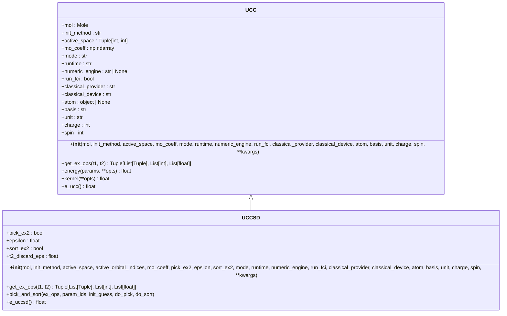
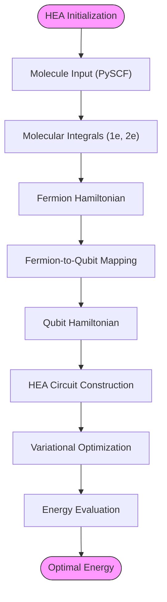
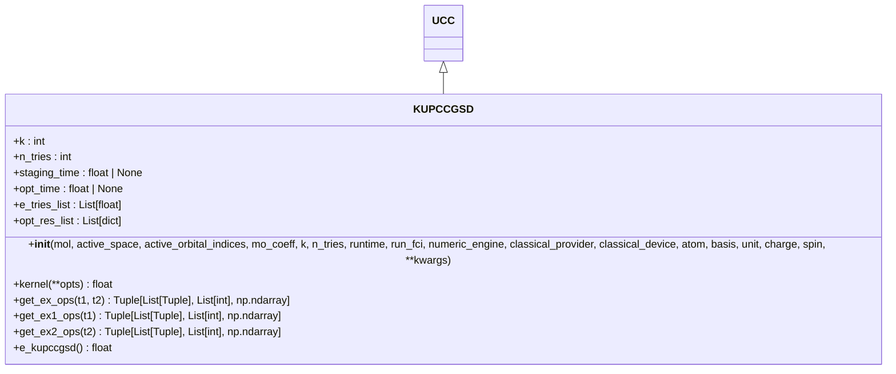
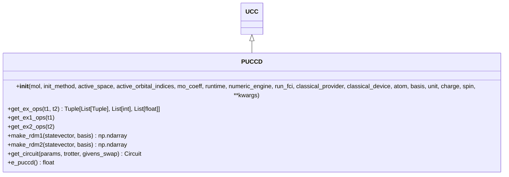
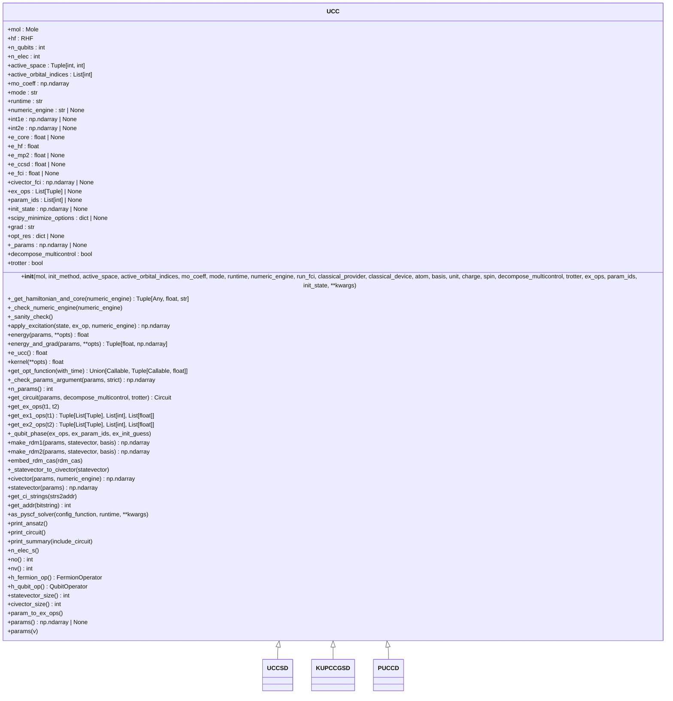
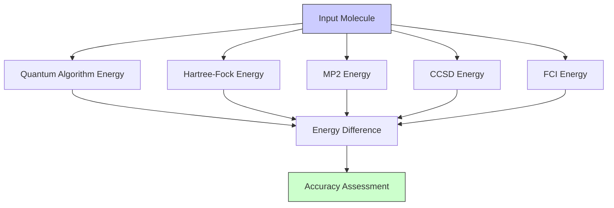

# Quantum Chemistry Algorithms

<cite>
**Referenced Files in This Document**   
- [uccsd.py](file://src/tyxonq/applications/chem/algorithms/uccsd.py)
- [hea.py](file://src/tyxonq/applications/chem/algorithms/hea.py)
- [kupccgsd.py](file://src/tyxonq/applications/chem/algorithms/kupccgsd.py)
- [puccd.py](file://src/tyxonq/applications/chem/algorithms/puccd.py)
- [ucc.py](file://src/tyxonq/applications/chem/algorithms/ucc.py)
- [cloud_uccsd_hea_demo.py](file://examples/cloud_uccsd_hea_demo.py)
</cite>

## Table of Contents
1. [Introduction](#introduction)
2. [UCCSD Algorithm](#uccsd-algorithm)
3. [HEA Algorithm](#hea-algorithm)
4. [k-UpCCGSD Algorithm](#k-upccgsd-algorithm)
5. [PUCCD Algorithm](#puccd-algorithm)
6. [Base UCC Class and Inheritance](#base-ucc-class-and-inheritance)
7. [Configuration and Runtime Options](#configuration-and-runtime-options)
8. [Code Examples and Usage](#code-examples-and-usage)
9. [Energy Evaluation and Optimization](#energy-evaluation-and-optimization)
10. [Chemical Accuracy and Validation](#chemical-accuracy-and-validation)

## Introduction
This document provides a comprehensive overview of quantum chemistry algorithms implemented in the TyxonQ framework, focusing on UCCSD, HEA, k-UpCCGSD, and PUCCD methods for molecular energy calculations. These algorithms leverage quantum computing to solve electronic structure problems by constructing parameterized quantum circuits that represent electronic wavefunctions. The document explains the theoretical foundations, implementation details, and practical usage of these methods, including their integration with classical computational chemistry tools like PySCF for molecular initialization, active space selection, and amplitude initialization.

**Section sources**
- [uccsd.py](file://src/tyxonq/applications/chem/algorithms/uccsd.py#L17-L229)
- [hea.py](file://src/tyxonq/applications/chem/algorithms/hea.py#L27-L648)
- [kupccgsd.py](file://src/tyxonq/applications/chem/algorithms/kupccgsd.py#L14-L292)
- [puccd.py](file://src/tyxonq/applications/chem/algorithms/puccd.py#L19-L186)

## UCCSD Algorithm
The UCCSD (Unitary Coupled Cluster Singles and Doubles) algorithm implements a quantum version of the classical coupled cluster method, using a unitary ansatz to represent the electronic wavefunction. It constructs an excitation operator that includes all single and double excitations from a Hartree-Fock reference state, ensuring the wavefunction remains normalized. The algorithm initializes with PySCF integration, allowing for seamless transition from classical to quantum computational chemistry workflows.

The UCCSD class inherits from a base UCC class and extends it with specific functionality for singles and doubles excitations. It supports various initialization methods for amplitudes, including MP2 (second-order Møller-Plesset perturbation theory), CCSD (coupled cluster singles and doubles), and zero initialization. The algorithm implements active space approximation, allowing users to specify a subset of molecular orbitals for correlation treatment, which significantly reduces computational complexity.

Amplitude initialization in UCCSD can be performed using MP2 or CCSD calculations, which provide physically meaningful starting points for the variational optimization. The algorithm includes options to filter out small amplitude excitations based on a threshold (epsilon parameter) and to sort excitations by amplitude magnitude, which can influence the convergence behavior of the optimization process.



**Diagram sources**
- [ucc.py](file://src/tyxonq/applications/chem/algorithms/ucc.py#L59-L1086)
- [uccsd.py](file://src/tyxonq/applications/chem/algorithms/uccsd.py#L17-L229)

**Section sources**
- [uccsd.py](file://src/tyxonq/applications/chem/algorithms/uccsd.py#L17-L229)
- [ucc.py](file://src/tyxonq/applications/chem/algorithms/ucc.py#L59-L1086)

## HEA Algorithm
The HEA (Hardware-Efficient Ansatz) algorithm implements a parameterized quantum circuit designed for near-term quantum devices with limited connectivity and coherence times. Unlike problem-inspired ansätze like UCCSD, HEA uses a hardware-efficient structure consisting of alternating layers of single-qubit rotations and entangling gates, typically CNOT chains. This structure is more resilient to hardware noise and can be implemented with fewer gate operations.

The HEA implementation in TyxonQ follows a RY-only structure: an initial layer of RY rotations followed by multiple layers of CNOT chains and RY rotations. This specific structure avoids the need for parameterized multi-qubit gates, simplifying calibration and reducing errors. The number of parameters in HEA is (layers + 1) * n_qubits, where layers is the number of repeating entangling/rotation blocks and n_qubits is the number of qubits.

HEA supports parameter shift gradients, a quantum gradient estimation technique that provides exact gradients by evaluating the circuit at parameter values shifted by π/2. This method is more accurate than finite differences and is well-suited for quantum hardware. The algorithm can be initialized from molecular integrals via PySCF, with automatic handling of fermion-to-qubit mapping (parity, Jordan-Wigner, or Bravyi-Kitaev).



**Diagram sources**
- [hea.py](file://src/tyxonq/applications/chem/algorithms/hea.py#L27-L648)

**Section sources**
- [hea.py](file://src/tyxonq/applications/chem/algorithms/hea.py#L27-L648)

## k-UpCCGSD Algorithm
The k-UpCCGSD (k-layer Unitary Pair Coupled Cluster Generalized Singles and Doubles) algorithm implements a generalized version of the pair coupled cluster method with multiple layers. This approach extends the standard UCC framework by using generalized excitation operators that are not restricted to the canonical orbital basis, potentially providing better convergence properties and reduced circuit depth.

k-UpCCGSD restricts double excitations to paired excitations (same spin up and down orbitals), which reduces the number of parameters compared to full UCCSD while maintaining important correlation effects. The "k" parameter specifies the number of layers in the ansatz, allowing for a trade-off between accuracy and circuit complexity. Multiple initialization attempts (n_tries parameter) can be performed to mitigate the risk of converging to local minima.

The algorithm generates excitation operators that include both generalized singles and paired doubles, with parameters shared across layers. This parameter sharing reduces the total number of variational parameters while maintaining expressibility. The initialization uses random guesses rather than MP2 or CCSD amplitudes, making it suitable for cases where classical coupled cluster methods may not provide good starting points.



**Diagram sources**
- [kupccgsd.py](file://src/tyxonq/applications/chem/algorithms/kupccgsd.py#L14-L292)

**Section sources**
- [kupccgsd.py](file://src/tyxonq/applications/chem/algorithms/kupccgsd.py#L14-L292)

## PUCCD Algorithm
The PUCCD (Pair-UCCD) algorithm implements a pair-coupled cluster approach that specifically targets electron pair correlations. This method uses a restricted set of excitation operators that only include paired excitations, where both spin-up and spin-down electrons are excited together from the same spatial orbital. This restriction significantly reduces the number of parameters compared to full UCCSD while still capturing important correlation effects.

PUCCD operates in the hard-core boson (HCB) mode, which maps each spatial orbital to a single qubit representing the occupation of the electron pair. This mapping reduces the number of qubits required by half compared to the standard fermion mapping, making it more suitable for near-term quantum devices. The algorithm uses Givens rotation gates for state preparation, which can be more efficiently implemented on certain quantum hardware architectures.

The excitation operators in PUCCD are constructed to maintain the pairing structure, with each excitation moving an electron pair from an occupied orbital to a virtual orbital. The amplitude initialization can use MP2 amplitudes projected onto the paired excitation space, providing a physically motivated starting point for optimization.



**Diagram sources**
- [puccd.py](file://src/tyxonq/applications/chem/algorithms/puccd.py#L19-L186)

**Section sources**
- [puccd.py](file://src/tyxonq/applications/chem/algorithms/puccd.py#L19-L186)

## Base UCC Class and Inheritance
The UCC (Unitary Coupled Cluster) class serves as the base implementation for all coupled cluster algorithms in the framework, providing common functionality and a consistent interface. This inheritance hierarchy allows for code reuse and ensures that all derived algorithms share the same core capabilities while enabling specialization for specific ansatz types.

The base UCC class handles fundamental aspects such as molecular input processing, Hartree-Fock calculation, integral computation, and fermion-to-qubit mapping. It manages the classical-quantum interface, including the option to run classical computations (HF, MP2, CCSD, FCI) locally or on a cloud provider. The class also implements common optimization infrastructure, including parameter handling, gradient computation, and convergence monitoring.

Derived classes (UCCSD, k-UpCCGSD, PUCCD) inherit this base functionality and override specific methods to implement their unique ansatz structures. The key method that subclasses typically override is `get_ex_ops`, which defines the excitation operators for the specific ansatz. This design pattern allows for a modular architecture where new ansatz types can be added by implementing a new subclass without modifying the core infrastructure.



**Diagram sources**
- [ucc.py](file://src/tyxonq/applications/chem/algorithms/ucc.py#L59-L1086)

**Section sources**
- [ucc.py](file://src/tyxonq/applications/chem/algorithms/ucc.py#L59-L1086)

## Configuration and Runtime Options
The quantum chemistry algorithms in TyxonQ support a comprehensive set of configuration options that control various aspects of the calculation. These options are accessible through parameters in the class constructors and method calls, allowing users to customize the behavior of the algorithms for specific use cases.

Key configuration options include:
- **init_method**: Specifies how to initialize the amplitudes, with options including "mp2" (MP2 amplitudes), "ccsd" (CCSD amplitudes), "fe" (fermionic energy amplitudes), and "zeros" (zero initialization).
- **active_space**: Defines the active space approximation as a tuple of (number of electrons, number of spatial orbitals), enabling reduced computational complexity by focusing on a subset of orbitals.
- **mapping**: Determines the fermion-to-qubit mapping scheme, with supported options including "parity", "jordan-wigner", and "bravyi-kitaev", each with different trade-offs in terms of qubit count and gate complexity.
- **runtime**: Specifies the execution environment, with options including "device" (quantum device or simulator) and "numeric" (classical numerical simulation).
- **numeric_engine**: Selects the numerical backend for classical simulation, with options including "statevector", "civector", "civector-large", and "pyscf".

The algorithms also support cloud-based classical computations through the `classical_provider` parameter, which can be set to "local" for local execution or "tyxonq" for cloud execution. This enables offloading computationally intensive classical calculations (HF, MP2, CCSD, FCI) to powerful cloud servers, reducing the computational burden on the local machine.

**Section sources**
- [uccsd.py](file://src/tyxonq/applications/chem/algorithms/uccsd.py#L17-L229)
- [hea.py](file://src/tyxonq/applications/chem/algorithms/hea.py#L27-L648)
- [kupccgsd.py](file://src/tyxonq/applications/chem/algorithms/kupccgsd.py#L14-L292)
- [puccd.py](file://src/tyxonq/applications/chem/algorithms/puccd.py#L19-L186)
- [ucc.py](file://src/tyxonq/applications/chem/algorithms/ucc.py#L59-L1086)

## Code Examples and Usage
The following code examples demonstrate the usage of the quantum chemistry algorithms in TyxonQ, showing how to construct molecules, instantiate algorithms, and evaluate energies. These examples are based on the `cloud_uccsd_hea_demo.py` file in the examples directory.

```python
from tyxonq.applications.chem.algorithms.uccsd import UCCSD
from tyxonq.applications.chem.algorithms.hea import HEA
from tyxonq.applications.chem.molecule import h2

# UCCSD - local baseline
u_local = UCCSD(h2)
e_local = u_local.kernel(shots=0, runtime="device", provider="simulator", device="statevector")
print("UCCSD local e:", e_local)

# UCCSD - cloud HF/integrals, same kernel locally
u_cloud = UCCSD(h2, classical_provider="tyxonq", classical_device="auto")
e_cloud = u_cloud.kernel(shots=0, runtime="device", provider="simulator", device="statevector")
print("UCCSD cloud(HF) e:", e_cloud)

# HEA - init from molecule directly (new path), local baseline
hea_local = HEA(molecule=h2, layers=2, mapping="parity", runtime="device")
e_hea_local = hea_local.kernel(shots=0, provider="simulator", device="statevector")
print("HEA local e:", e_hea_local)

# HEA - cloud HF/integrals via molecule pathway
hea_cloud = HEA(molecule=h2, layers=2, mapping="parity", runtime="device", classical_provider="tyxonq", classical_device="auto")
e_hea_cloud = hea_cloud.kernel(shots=0, provider="simulator", device="statevector")
print("HEA cloud(HF) e:", e_hea_cloud)
```

These examples show four different calculation scenarios: local UCCSD, cloud-assisted UCCSD, local HEA, and cloud-assisted HEA. The cloud-assisted versions offload the classical Hartree-Fock calculation and integral computation to a cloud provider, while the quantum part of the calculation (VQE optimization) is performed locally. The `shots=0` parameter indicates the use of exact statevector simulation rather than sampling, which provides noise-free results for algorithm development and validation.

**Section sources**
- [cloud_uccsd_hea_demo.py](file://examples/cloud_uccsd_hea_demo.py#L0-L56)

## Energy Evaluation and Optimization
The energy evaluation and optimization process in the quantum chemistry algorithms follows a variational principle, where the ground state energy is found by minimizing the expectation value of the Hamiltonian with respect to the parameters of the ansatz. This process is implemented through the `kernel` method, which performs the optimization using classical optimizers from SciPy.

The optimization process begins with an initial guess for the parameters, which can be derived from classical methods (MP2, CCSD) or set to zero/random values. The energy and its gradient are evaluated at each iteration, with the gradient typically computed using parameter shift rules for quantum circuits. The choice of optimizer and its options can be controlled through the `scipy_minimize_options` parameter, allowing users to select methods like L-BFGS-B for gradient-based optimization or COBYLA for gradient-free optimization.

For device-based calculations, the energy evaluation involves measuring the expectation value of the Hamiltonian by grouping commuting terms and measuring them in shared bases. This measurement process can be performed with a finite number of shots (samples) to simulate realistic quantum hardware conditions, or with infinite shots (shots=0) for exact simulation. The parameter shift method for gradient computation requires evaluating the circuit at parameter values shifted by π/2, which doubles the number of circuit evaluations needed for gradient computation.

**Section sources**
- [uccsd.py](file://src/tyxonq/applications/chem/algorithms/uccsd.py#L17-L229)
- [hea.py](file://src/tyxonq/applications/chem/algorithms/hea.py#L27-L648)
- [kupccgsd.py](file://src/tyxonq/applications/chem/algorithms/kupccgsd.py#L14-L292)
- [puccd.py](file://src/tyxonq/applications/chem/algorithms/puccd.py#L19-L186)
- [ucc.py](file://src/tyxonq/applications/chem/algorithms/ucc.py#L59-L1086)

## Chemical Accuracy and Validation
The accuracy of the quantum chemistry algorithms is validated against classical computational chemistry methods and exact solutions where available. The primary metrics for validation include comparison with Full Configuration Interaction (FCI) energies, which represent the exact solution within the given basis set, and comparison with established quantum chemistry methods like CCSD.

The UCCSD algorithm typically achieves chemical accuracy (within 1 kcal/mol or ~1.6 mHa of the exact energy) for small molecules in minimal basis sets. The accuracy can be improved by using larger basis sets, although this increases the computational cost. The k-UpCCGSD and PUCCD algorithms may have different accuracy profiles depending on the molecule and basis set, with k-UpCCGSD potentially offering better accuracy for strongly correlated systems due to its multi-layer structure.

Validation is performed by comparing the computed energies with reference values from classical calculations. The framework provides access to reference energies from HF, MP2, CCSD, and FCI calculations through properties like `e_hf`, `e_mp2`, `e_ccsd`, and `e_fci`. These reference values allow users to assess the quality of the quantum calculation and the amount of correlation energy recovered.



**Diagram sources**
- [uccsd.py](file://src/tyxonq/applications/chem/algorithms/uccsd.py#L17-L229)
- [ucc.py](file://src/tyxonq/applications/chem/algorithms/ucc.py#L59-L1086)

**Section sources**
- [uccsd.py](file://src/tyxonq/applications/chem/algorithms/uccsd.py#L17-L229)
- [ucc.py](file://src/tyxonq/applications/chem/algorithms/ucc.py#L59-L1086)