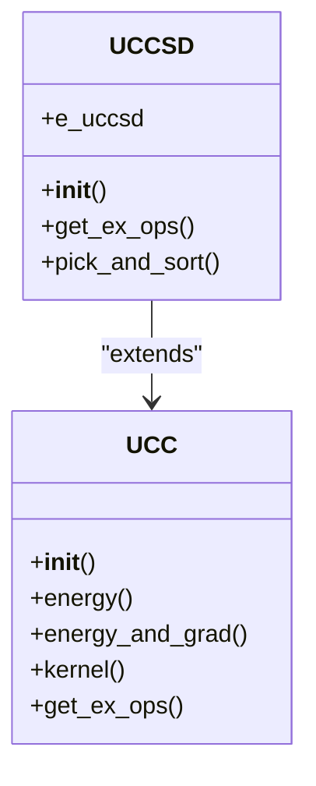
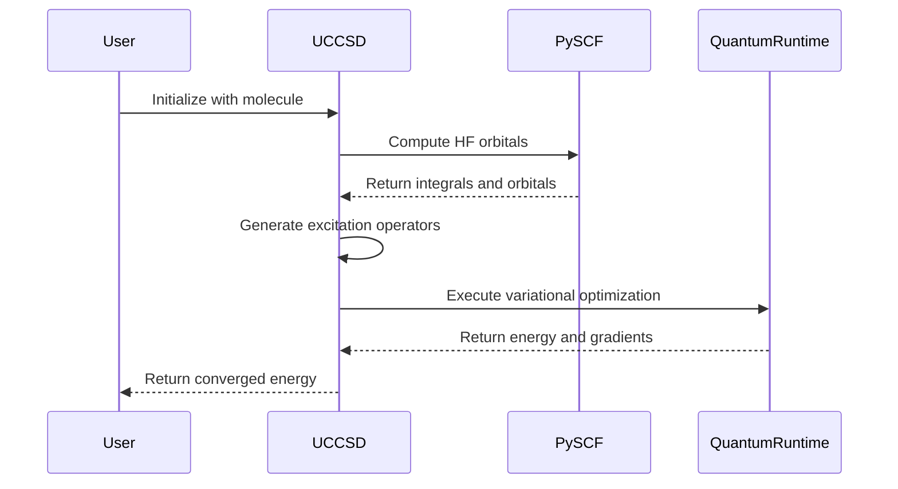

# UCCSD Algorithm

<cite>
**Referenced Files in This Document**   
- [uccsd.py](file://src/tyxonq/applications/chem/algorithms/uccsd.py)
- [ucc.py](file://src/tyxonq/applications/chem/algorithms/ucc.py)
- [cloud_uccsd_hea_demo.py](file://examples/cloud_uccsd_hea_demo.py)
</cite>

## Table of Contents
1. [Introduction](#introduction)
2. [Theoretical Foundation](#theoretical-foundation)
3. [Implementation Details](#implementation-details)
4. [Configuration Parameters](#configuration-parameters)
5. [Inheritance and Class Structure](#inheritance-and-class-structure)
6. [Runtime Options and Convergence](#runtime-options-and-convergence)
7. [Practical Examples](#practical-examples)
8. [Troubleshooting Guide](#troubleshooting-guide)
9. [Conclusion](#conclusion)

## Introduction
The Unitary Coupled Cluster with Single and Double excitations (UCCSD) algorithm is a quantum computational method used in quantum chemistry to approximate the exact wavefunction of molecular systems. It extends the classical Coupled Cluster theory into the quantum computing domain by constructing a parameterized quantum circuit based on excitation operators. This document provides a comprehensive overview of the UCCSD implementation within the TyxonQ framework, detailing its theoretical underpinnings, configuration options, and practical usage.

**Section sources**
- [uccsd.py](file://src/tyxonq/applications/chem/algorithms/uccsd.py#L17-L229)
- [ucc.py](file://src/tyxonq/applications/chem/algorithms/ucc.py#L51-L1086)

## Theoretical Foundation
The UCCSD algorithm approximates the exact molecular wavefunction using a unitary transformation of the Hartree-Fock reference state. The wavefunction is expressed as $|\psi\rangle = e^{T - T^\dagger}|\phi_{HF}\rangle$, where $T = T_1 + T_2$ represents the cluster operator composed of single ($T_1$) and double ($T_2$) excitation operators. Single excitations promote one electron from an occupied orbital to a virtual orbital, while double excitations involve two electrons. These excitation operators preserve particle number and are essential for capturing electron correlation effects beyond the mean-field approximation provided by Hartree-Fock theory.

The algorithm leverages the Jordan-Wigner transformation to map fermionic operators to qubit operators, enabling execution on quantum hardware. By truncating the cluster operator at the single and double excitation level, UCCSD achieves a favorable balance between computational complexity and chemical accuracy, making it suitable for near-term quantum devices.

**Section sources**
- [uccsd.py](file://src/tyxonq/applications/chem/algorithms/uccsd.py#L17-L229)
- [ucc.py](file://src/tyxonq/applications/chem/algorithms/ucc.py#L51-L1086)

## Implementation Details
The UCCSD implementation begins with molecular initialization via PySCF, which computes the Hartree-Fock orbitals and energy. The active space selection allows users to define a subset of molecular orbitals and electrons for more efficient computation, specified through the `active_space` parameter as a tuple of (number of electrons, number of spatial orbitals). Users can also manually select active orbitals using `active_orbital_indices`.

Amplitude initialization is performed using classical quantum chemistry methods such as MP2 (second-order Møller-Plesset perturbation theory) or CCSD (Coupled Cluster Singles and Doubles), which provide physically motivated initial guesses for the variational parameters. This significantly improves convergence compared to random initialization.

Two-body excitations are screened and sorted based on amplitude thresholds and energy ordering. Excitations with amplitudes below the threshold defined by `epsilon` are discarded when `pick_ex2=True`, reducing circuit depth. When `sort_ex2=True`, excitations are ordered by descending amplitude magnitude, prioritizing the most significant correlations in the ansatz construction.

**Section sources**
- [uccsd.py](file://src/tyxonq/applications/chem/algorithms/uccsd.py#L33-L143)
- [ucc.py](file://src/tyxonq/applications/chem/algorithms/ucc.py#L59-L365)

## Configuration Parameters
The UCCSD algorithm exposes several key configuration parameters:

- **init_method**: Specifies the method for initializing amplitudes. Options include "mp2" (default), "ccsd", "fe" (fermionic energy), and "zeros".
- **active_space**: Defines the active space approximation as a tuple of (electrons, orbitals).
- **mo_coeff**: Allows direct specification of molecular orbital coefficients, bypassing Hartree-Fock calculation.
- **pick_ex2**: Enables screening of two-body excitations based on amplitude threshold.
- **sort_ex2**: Controls sorting of two-body excitations by amplitude magnitude.
- **epsilon**: Sets the threshold for discarding small-amplitude excitations (default: 1e-12).
- **mode**: Determines particle symmetry handling ("fermion" or "qubit").
- **runtime**: Specifies execution environment ("device" or "numeric").

These parameters provide fine-grained control over the algorithm's behavior, allowing users to balance accuracy, efficiency, and resource requirements.

**Section sources**
- [uccsd.py](file://src/tyxonq/applications/chem/algorithms/uccsd.py#L33-L143)
- [ucc.py](file://src/tyxonq/applications/chem/algorithms/ucc.py#L59-L365)

## Inheritance and Class Structure
The UCCSD class inherits from the base UCC class, extending its functionality with specific implementations for single and double excitations. This inheritance relationship enables code reuse and maintains consistency across different coupled cluster variants.

**Diagram sources**
- [uccsd.py](file://src/tyxonq/applications/chem/algorithms/uccsd.py#L17-L229)
- [ucc.py](file://src/tyxonq/applications/chem/algorithms/ucc.py#L51-L1086)

The UCCSD class overrides the `get_ex_ops` method to implement UCCSD-specific excitation operator generation, incorporating screening and sorting logic through the `pick_and_sort` method. The base UCC class provides fundamental capabilities including energy evaluation, gradient computation, and optimization via the `kernel` method, which uses L-BFGS-B for parameter optimization.

**Section sources**
- [uccsd.py](file://src/tyxonq/applications/chem/algorithms/uccsd.py#L17-L229)
- [ucc.py](file://src/tyxonq/applications/chem/algorithms/ucc.py#L51-L1086)

## Runtime Options and Convergence
The UCCSD algorithm supports multiple runtime options through the `runtime` parameter. The "device" runtime executes circuits on quantum hardware or simulators, while the "numeric" runtime performs calculations using classical numerical methods. The choice affects convergence characteristics and noise resilience.

Convergence is monitored through optimization criteria in the L-BFGS-B algorithm, with default tolerances of 1e-9 for function tolerance (`ftol`) and 1e-6 for gradient tolerance (`gtol`). Maximum iterations are set to 200 for analytic paths and 100 for device-based executions. The algorithm validates against Full Configuration Interaction (FCI) and Hartree-Fock (HF) references when `run_fci=True`, providing accuracy benchmarks.

Energy evaluation is performed through the `energy` and `energy_and_grad` methods, which support both analytic (shots=0) and sampling-based (shots>0) approaches. The former provides exact expectation values, while the latter simulates realistic measurement conditions.

**Section sources**
- [ucc.py](file://src/tyxonq/applications/chem/algorithms/ucc.py#L415-L580)

## Practical Examples
The `cloud_uccsd_hea_demo.py` example demonstrates UCCSD usage with molecule construction, instantiation, and energy evaluation. A hydrogen molecule is constructed using PySCF's Mole object, then passed to the UCCSD class for calculation.

**Diagram sources**
- [cloud_uccsd_hea_demo.py](file://examples/cloud_uccsd_hea_demo.py#L1-L56)
- [uccsd.py](file://src/tyxonq/applications/chem/algorithms/uccsd.py#L17-L229)

The example compares local and cloud-based execution, where classical quantum chemistry calculations (HF, MP2, CCSD) can be offloaded to remote servers via the `classical_provider="tyxonq"` option. Energy evaluation is performed using the `kernel()` method, which optimizes parameters and returns the ground state energy.

**Section sources**
- [cloud_uccsd_hea_demo.py](file://examples/cloud_uccsd_hea_demo.py#L1-L56)
- [uccsd.py](file://src/tyxonq/applications/chem/algorithms/uccsd.py#L17-L229)

## Troubleshooting Guide
Common issues in UCCSD calculations include slow convergence and orbital symmetry breaking. Slow convergence may result from poor initial amplitude guesses; switching from "zeros" to "mp2" or "ccsd" initialization typically resolves this. Users should verify that the active space selection preserves essential orbital symmetries, as improper selection can lead to symmetry breaking.

When using amplitude screening (`pick_ex2=True`), ensure the `epsilon` threshold is not too aggressive, as this may remove physically important excitations. For systems with near-degenerate orbitals, consider using larger active spaces or alternative initialization methods like "fe".

Numerical instability can occur with very small amplitude values; the default `epsilon=1e-12` provides a reasonable balance between circuit simplification and numerical stability. Users experiencing convergence failures should examine the optimization result stored in `opt_res` for diagnostic information.

**Section sources**
- [uccsd.py](file://src/tyxonq/applications/chem/algorithms/uccsd.py#L17-L229)
- [ucc.py](file://src/tyxonq/applications/chem/algorithms/ucc.py#L51-L1086)

## Conclusion
The UCCSD algorithm provides a powerful framework for quantum computational chemistry, combining the accuracy of coupled cluster theory with the capabilities of quantum computing. Its implementation in TyxonQ offers extensive configurability through parameters like `init_method`, `active_space`, and excitation filtering options. The integration with PySCF enables seamless classical-quantum workflows, while support for cloud-based classical computations enhances scalability. By understanding the theoretical foundation, configuration options, and practical considerations outlined in this document, users can effectively apply UCCSD to study molecular systems and advance quantum chemistry research.

**Section sources**
- [uccsd.py](file://src/tyxonq/applications/chem/algorithms/uccsd.py#L17-L229)
- [ucc.py](file://src/tyxonq/applications/chem/algorithms/ucc.py#L51-L1086)
- [cloud_uccsd_hea_demo.py](file://examples/cloud_uccsd_hea_demo.py#L1-L56)