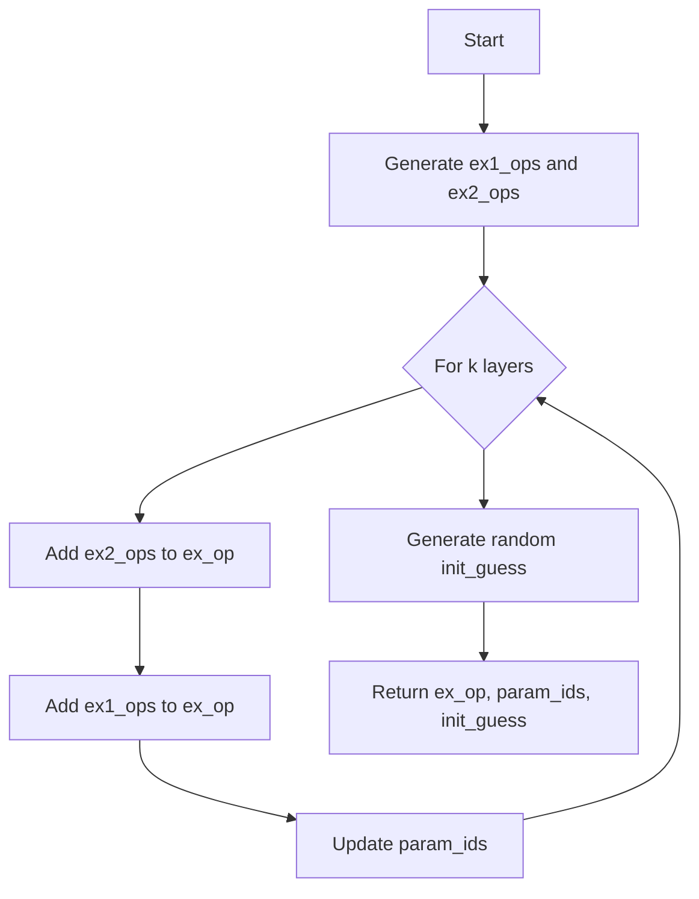
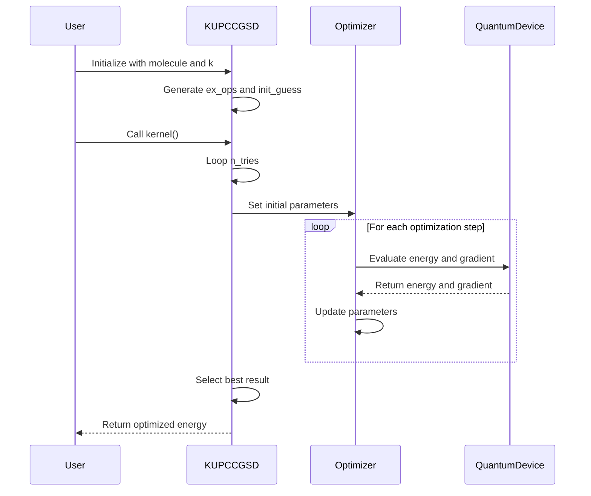

# k-UpCCGSD Algorithm

<cite>
**Referenced Files in This Document**   
- [kupccgsd.py](file://src/tyxonq/applications/chem/algorithms/kupccgsd.py)
- [ucc.py](file://src/tyxonq/applications/chem/algorithms/ucc.py)
- [uccsd.py](file://src/tyxonq/applications/chem/algorithms/uccsd.py)
- [puccd.py](file://src/tyxonq/applications/chem/algorithms/puccd.py)
- [molecule.py](file://src/tyxonq/applications/chem/molecule.py)
</cite>

## Table of Contents
1. [Introduction](#introduction)
2. [Theoretical Basis](#theoretical-basis)
3. [Implementation Details](#implementation-details)
4. [Configuration and Runtime Options](#configuration-and-runtime-options)
5. [Workflow and Practical Examples](#workflow-and-practical-examples)
6. [Comparison with UCCSD and PUCCD](#comparison-with-uccsd-and-puccd)
7. [Parameter Selection Guidance](#parameter-selection-guidance)
8. [Conclusion](#conclusion)

## Introduction

The k-UpCCGSD (k-Unitary Pair Coupled Cluster Generalized Singly and Doubly excited) algorithm is a quantum computational chemistry method designed to efficiently capture electron correlation effects in molecular systems. It extends traditional UCCSD approaches by incorporating generalized excitation operators that include non-iterative higher-order effects while maintaining manageable circuit depth. This document provides a comprehensive analysis of the k-UpCCGSD algorithm as implemented in the TyxonQ framework, detailing its theoretical foundations, implementation specifics, configuration options, and practical applications.

**Section sources**
- [kupccgsd.py](file://src/tyxonq/applications/chem/algorithms/kupccgsd.py#L1-L292)

## Theoretical Basis

The k-UpCCGSD algorithm is built upon the unitary coupled cluster (UCC) framework, which represents the wavefunction as |Ψ⟩ = e^(T - T†)|Φ₀⟩, where T is the cluster operator and |Φ₀⟩ is the reference state. The k-UpCCGSD approach specifically uses a truncated cluster operator with generalized excitation operators that go beyond traditional UCCSD by including non-iterative higher-order effects.

The algorithm employs generalized excitation operators where two-body excitations are restricted to paired ones, allowing for a more compact representation while still capturing essential correlation effects. The "k" parameter controls the number of layers in the ansatz, effectively determining the level of excitation inclusion. Each layer consists of paired two-body excitations followed by generalized one-body excitations, creating a structured ansatz that balances accuracy and circuit complexity.

The generalized nature of the excitations allows the algorithm to capture correlation effects that would typically require higher-order excitations in conventional UCC methods, providing a more efficient path to accurate energy calculations while maintaining noise resilience on quantum hardware.

**Section sources**
- [kupccgsd.py](file://src/tyxonq/applications/chem/algorithms/kupccgsd.py#L152-L285)

## Implementation Details

### Excitation Operator Generation

The k-UpCCGSD implementation generates excitation operators through three key methods: `get_ex_ops`, `get_ex1_ops`, and `get_ex2_ops`. The `get_ex1_ops` method creates generalized one-body excitation operators for both alpha and beta spin orbitals, while `get_ex2_ops` generates paired two-body excitation operators. These operators are combined in `get_ex_ops` with k repetitions, where each repetition consists of two-body excitations followed by one-body excitations.



**Diagram sources**
- [kupccgsd.py](file://src/tyxonq/applications/chem/algorithms/kupccgsd.py#L152-L202)

### Spin-Adapted Operators

The implementation handles spin-adapted operators by explicitly separating alpha and beta spin excitations. For one-body excitations, the algorithm generates operators for alpha-to-alpha and beta-to-beta transitions separately. For paired two-body excitations, it creates operators that simultaneously excite paired electrons, maintaining proper spin symmetry. This approach ensures that the resulting wavefunction preserves the correct spin quantum numbers while allowing for efficient parameterization.

### Ansatz Parameterization

The ansatz is efficiently parameterized by mapping multiple excitation operators to shared parameters when appropriate. The parameterization scheme ensures that each unique excitation pattern has a corresponding parameter, with the total number of parameters determined by the k value and the active space size. Initial parameter guesses are generated randomly, providing diverse starting points for the optimization process.

**Section sources**
- [kupccgsd.py](file://src/tyxonq/applications/chem/algorithms/kupccgsd.py#L204-L285)

## Configuration and Runtime Options

### Core Configuration Parameters

The k-UpCCGSD algorithm provides several configuration options for tailoring calculations to specific molecular systems:

- **k parameter**: Controls the number of layers in the ansatz, directly affecting both accuracy and computational cost
- **Active space specification**: Allows users to define the number of active electrons and orbitals for reduced computational complexity
- **Active orbital indices**: Enables selection of specific orbitals for the active space, providing flexibility in focusing on chemically relevant orbitals
- **Molecular coefficient initialization**: Supports custom molecular orbital coefficients for advanced initialization scenarios

### Runtime Selection

The algorithm supports multiple runtime options through the `runtime` parameter:
- **'device'**: Executes on quantum hardware or simulators
- **'numeric'**: Uses classical numerical simulation for testing and validation

Additional runtime options include:
- **n_tries**: Specifies the number of different initial points for VQE calculations, improving the likelihood of finding the global minimum
- **numeric_engine**: Selects the numerical backend for classical simulations
- **classical_provider**: Determines whether classical computations are performed locally or via cloud services

The implementation also supports orbital optimization through the integration with PySCF for Hartree-Fock calculations and provides options for running reference calculations (HF, MP2, CCSD, FCI) to benchmark results.

**Section sources**
- [kupccgsd.py](file://src/tyxonq/applications/chem/algorithms/kupccgsd.py#L20-L118)

## Workflow and Practical Examples

### Instantiation from Molecular Inputs

The k-UpCCGSD algorithm can be instantiated from various molecular input formats, including direct PySCF Mole objects, RHF objects, or through direct specification of molecular parameters (atom, basis, charge, spin). The following example demonstrates instantiation for a hydrogen molecule:

```python
from tyxonq.chem import KUPCCGSD
from tyxonq.chem.molecule import h2
kupccgsd = KUPCCGSD(h2, k=3)
```

### Energy Evaluation Workflow

The energy evaluation workflow follows a standard VQE pattern:
1. Initialize the k-UpCCGSD object with molecular parameters
2. Generate excitation operators and initial parameter guesses
3. Execute the VQE optimization using the `kernel` method
4. Retrieve the optimized energy through the `e_kupccgsd` property

The `kernel` method implements a multi-start optimization strategy, running the VQE calculation n_tries times with different initial parameter values and returning the lowest energy result. This approach helps mitigate the risk of converging to local minima in the parameter landscape.



**Diagram sources**
- [kupccgsd.py](file://src/tyxonq/applications/chem/algorithms/kupccgsd.py#L120-L150)
- [kupccgsd.py](file://src/tyxonq/applications/chem/algorithms/kupccgsd.py#L152-L202)

**Section sources**
- [kupccgsd.py](file://src/tyxonq/applications/chem/algorithms/kupccgsd.py#L120-L150)
- [molecule.py](file://src/tyxonq/applications/chem/molecule.py#L0-L310)

## Comparison with UCCSD and PUCCD

### Accuracy Comparison

k-UpCCGSD offers a balance between accuracy and computational complexity that positions it between traditional UCCSD and PUCCD methods. Compared to UCCSD, k-UpCCGSD captures additional correlation effects through its generalized excitation operators and multiple layers, often achieving accuracy closer to higher-order coupled cluster methods. Unlike PUCCD, which restricts excitations to paired operations only, k-UpCCGSD includes both paired two-body and generalized one-body excitations, providing a more complete description of electron correlation.

The k parameter allows for systematic improvement of accuracy, with higher k values approaching the accuracy of iterative methods while maintaining a fixed circuit depth. This makes k-UpCCGSD particularly suitable for systems where dynamic correlation effects are significant but full CCSD calculations are prohibitively expensive.

### Circuit Complexity

In terms of circuit complexity, k-UpCCGSD has a clear advantage over UCCSD for equivalent accuracy levels. While UCCSD requires a circuit depth that scales with the number of excitations, k-UpCCGSD maintains a fixed depth determined by the k parameter, with each layer having similar complexity. This results in shallower circuits that are more resilient to noise on current quantum hardware.

Compared to PUCCD, k-UpCCGSD typically has higher circuit complexity due to the inclusion of additional one-body excitations and multiple layers. However, this increased complexity is offset by the improved accuracy and faster convergence properties.

### Noise Resilience

k-UpCCGSD demonstrates superior noise resilience compared to both UCCSD and PUCCD. The fixed circuit depth and structured ansatz make it less susceptible to error accumulation during execution. The multi-start optimization strategy further enhances robustness by allowing the algorithm to identify solutions that are less sensitive to parameter noise.

The generalized excitation operators also contribute to noise resilience by providing multiple pathways to the solution, reducing the likelihood of getting trapped in noise-induced local minima. This makes k-UpCCGSD particularly well-suited for near-term quantum devices with limited coherence times and high error rates.

**Section sources**
- [kupccgsd.py](file://src/tyxonq/applications/chem/algorithms/kupccgsd.py#L1-L292)
- [uccsd.py](file://src/tyxonq/applications/chem/algorithms/uccsd.py#L0-L337)
- [puccd.py](file://src/tyxonq/applications/chem/algorithms/puccd.py#L0-L187)

## Parameter Selection Guidance

### Selecting Appropriate k Values

The selection of the k parameter is crucial for balancing accuracy and computational cost. For small molecular systems with minimal electron correlation, k=2 or k=3 typically provides sufficient accuracy while maintaining manageable circuit depth. For larger systems or those with significant static correlation, k values of 4-6 may be necessary to achieve chemical accuracy.

The optimal k value depends on both the molecular system and the basis set. Larger basis sets generally require higher k values to capture the additional correlation effects, while minimal basis sets may achieve convergence with lower k values. As a general guideline:
- Minimal basis sets (STO-3G): k=2-3
- Double-zeta basis sets (6-31G): k=3-4
- Triple-zeta basis sets (cc-pVTZ): k=4-6

### Active Space Considerations

When selecting active spaces, it is recommended to include all orbitals that participate in the chemical process of interest. For bond dissociation studies, this typically includes the bonding and antibonding orbitals involved in the reaction. The number of active electrons should correspond to the valence electrons participating in the process.

For systems with strong static correlation, larger active spaces may be necessary to capture the essential physics. However, the computational cost increases rapidly with active space size, so a balance must be struck between accuracy and feasibility.

### Optimization Strategy

The n_tries parameter should be set based on the complexity of the potential energy surface. For simple systems with well-behaved energy landscapes, n_tries=1 may be sufficient. For systems with multiple local minima or complex correlation effects, n_tries=5-10 is recommended to ensure convergence to the global minimum.

**Section sources**
- [kupccgsd.py](file://src/tyxonq/applications/chem/algorithms/kupccgsd.py#L20-L118)

## Conclusion

The k-UpCCGSD algorithm represents a significant advancement in quantum computational chemistry methods, offering a balanced approach to capturing electron correlation effects with controlled computational complexity. By combining generalized excitation operators with a layered ansatz structure, it achieves accuracy comparable to higher-order coupled cluster methods while maintaining circuit depths suitable for near-term quantum devices.

The implementation in TyxonQ provides a flexible and robust framework for quantum chemistry calculations, with comprehensive configuration options and integration with classical computational chemistry tools. The algorithm's noise resilience and systematic improvability through the k parameter make it particularly well-suited for practical applications on current and near-future quantum hardware.

Future developments may include adaptive k selection strategies, integration with orbital optimization techniques, and extensions to handle open-shell systems and excited states, further expanding the applicability of this promising quantum algorithm.