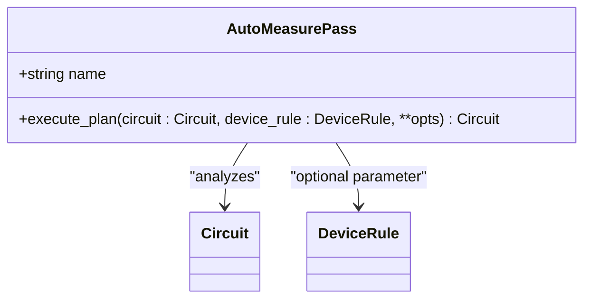
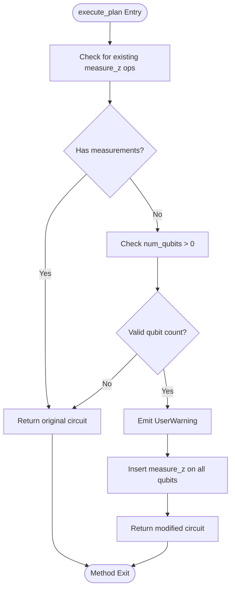
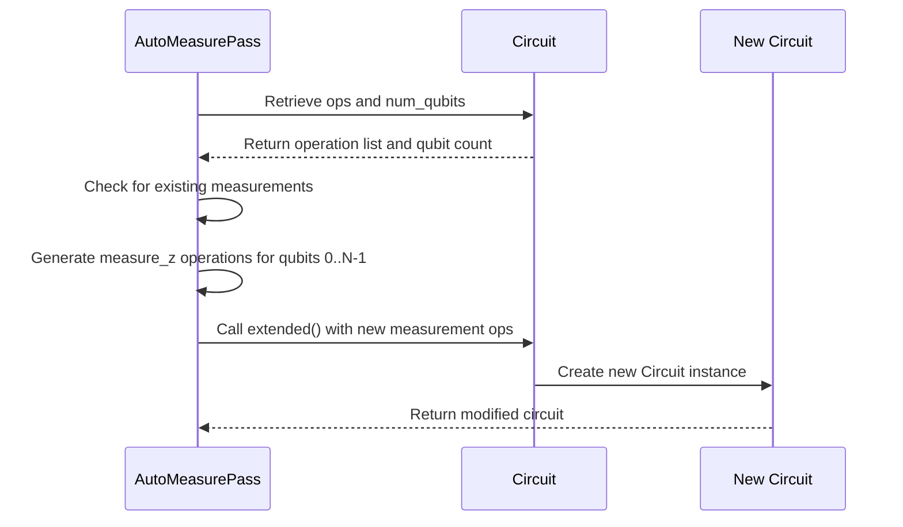
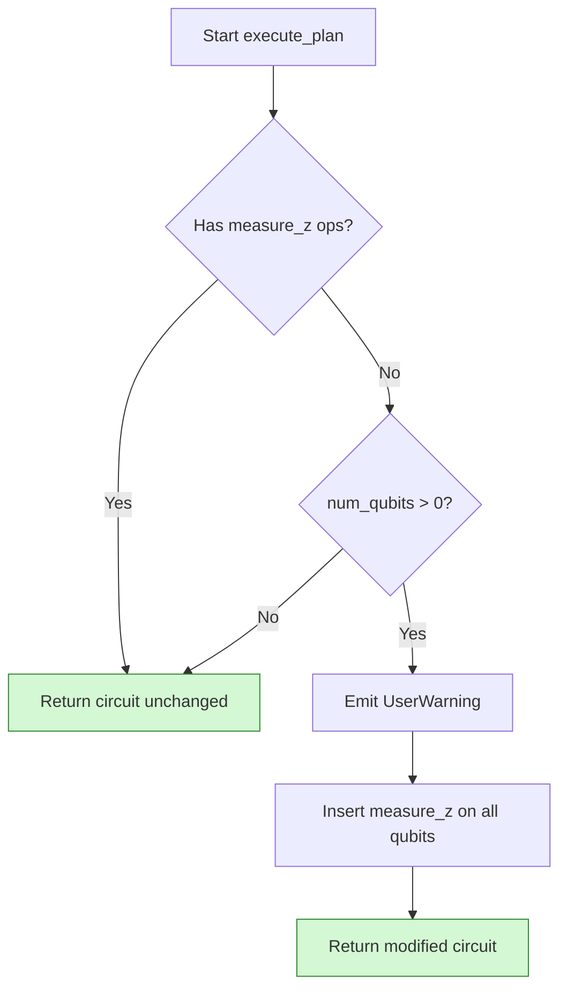

# Auto-Measurement Insertion

<cite>
**Referenced Files in This Document**   
- [auto_measure.py](file://src/tyxonq/compiler/stages/rewrite/auto_measure.py)
- [circuit.py](file://src/tyxonq/core/ir/circuit.py)
- [compile_plan.py](file://src/tyxonq/compiler/compile_engine/native/compile_plan.py)
</cite>

## Table of Contents
1. [Introduction](#introduction)
2. [AutoMeasurePass Class Overview](#automasurepass-class-overview)
3. [execute_plan Method Behavior](#execute_plan-method-behavior)
4. [Circuit Interaction and num_qubits Dependency](#circuit-interaction-and-num_qubits-dependency)
5. [No-Op Conditions and Warning Mechanism](#no-op-conditions-and-warning-mechanism)
6. [Prevention of Silent Failures](#prevention-of-silent-failures)
7. [Common Issues in Variational Circuits](#common-issues-in-variational-circuits)
8. [Troubleshooting Measurement Problems](#troubleshooting-measurement-problems)
9. [Conclusion](#conclusion)

## Introduction

The Auto-Measurement Insertion feature is a critical component in the Rewriting stage of the quantum circuit compilation pipeline. This feature ensures that quantum circuits which lack explicit measurement instructions are automatically augmented with Z-basis measurements on all qubits. The mechanism prevents silent execution failures and ensures consistent behavior across different backend targets. This document provides a comprehensive analysis of the `AutoMeasurePass` class and its `execute_plan` method, detailing the conditions under which automatic measurement insertion occurs, the warning mechanism for user notification, and strategies for troubleshooting related issues.

**Section sources**
- [auto_measure.py](file://src/tyxonq/compiler/stages/rewrite/auto_measure.py#L10-L34)

## AutoMeasurePass Class Overview

The `AutoMeasurePass` class implements the automatic measurement insertion functionality within the compiler's rewriting stage. This pass is designed to analyze quantum circuits and ensure they contain appropriate measurement operations before proceeding to subsequent compilation stages or execution on quantum hardware.

The class is registered with the name `"rewrite/auto_measure"` and operates as a standard compilation pass that can be integrated into the compilation pipeline. Its primary responsibility is to detect circuits without explicit measurement instructions and automatically append Z-measurements to all qubits, thereby ensuring that the circuit produces measurable outcomes.

**Diagram sources**
- [auto_measure.py](file://src/tyxonq/compiler/stages/rewrite/auto_measure.py#L10-L34)

**Section sources**
- [auto_measure.py](file://src/tyxonq/compiler/stages/rewrite/auto_measure.py#L10-L34)

## execute_plan Method Behavior

The `execute_plan` method is the core implementation of the auto-measurement insertion logic. It takes a quantum circuit as input and returns a potentially modified circuit with measurements inserted.

The method follows a specific decision process:
1. It first retrieves the operations from the input circuit using `getattr(circuit, "ops", [])`
2. It checks whether any Z-measurement operations already exist in the circuit
3. If measurements are present, the method returns the original circuit unchanged
4. If no measurements are found, it proceeds to insert Z-measurements on all qubits

The insertion process creates a sequence of `("measure_z", q)` operations for each qubit index from 0 to `num_qubits-1`, which are then appended to the circuit using the `extended` method.

**Diagram sources**
- [auto_measure.py](file://src/tyxonq/compiler/stages/rewrite/auto_measure.py#L22-L34)

**Section sources**
- [auto_measure.py](file://src/tyxonq/compiler/stages/rewrite/auto_measure.py#L22-L34)

## Circuit Interaction and num_qubits Dependency

The auto-measurement insertion process is directly dependent on the `num_qubits` attribute of the input circuit. The method uses `getattr(circuit, "num_qubits", 0)` to safely retrieve the number of qubits, defaulting to 0 if the attribute is not present.

The relationship between circuit size and measurement insertion is straightforward: for a circuit with N qubits, exactly N Z-measurements are inserted, one for each qubit indexed from 0 to N-1. This ensures comprehensive measurement coverage across all available qubits.

The insertion is performed using the `circuit.extended()` method, which creates a new circuit instance with the additional operations appended to the existing operation list. This approach maintains immutability of the original circuit while producing a modified version with the necessary measurements.

**Diagram sources**
- [auto_measure.py](file://src/tyxonq/compiler/stages/rewrite/auto_measure.py#L22-L34)
- [circuit.py](file://src/tyxonq/core/ir/circuit.py#L253-L256)

**Section sources**
- [auto_measure.py](file://src/tyxonq/compiler/stages/rewrite/auto_measure.py#L22-L34)
- [circuit.py](file://src/tyxonq/core/ir/circuit.py#L253-L256)

## No-Op Conditions and Warning Mechanism

The `AutoMeasurePass` implements specific conditions under which it becomes a no-operation (no-op), meaning it returns the input circuit unchanged without performing any modifications.

The pass becomes a no-op under two primary conditions:
1. When the circuit already contains one or more explicit `measure_z` operations
2. When the circuit has zero or invalid qubit count

When neither condition is met and auto-insertion occurs, the system emits a non-fatal warning using Python's `warnings.warn()` function. This warning serves as a notification to users that automatic measurement insertion has occurred, helping to prevent confusion about unexpected measurement operations in their circuits.

The warning message clearly states: "No explicit measurements found; auto-added Z measurements on all qubits during compilation." This informative message helps users understand the system's behavior and identify circuits that may need explicit measurement specification.

**Diagram sources**
- [auto_measure.py](file://src/tyxonq/compiler/stages/rewrite/auto_measure.py#L22-L34)

**Section sources**
- [auto_measure.py](file://src/tyxonq/compiler/stages/rewrite/auto_measure.py#L22-L34)

## Prevention of Silent Failures

The auto-measurement insertion feature plays a crucial role in preventing silent failures in quantum circuits that lack measurement instructions. Without this mechanism, circuits submitted for execution might complete without producing any measurable results, leading to ambiguous outcomes and debugging challenges.

By automatically inserting Z-measurements when none are present, the system ensures that all circuits produce observable outputs. This is particularly important in the context of quantum computing, where measurement is required to extract classical information from quantum states.

The feature integrates with the compilation pipeline through the `compile_plan.py` file, where the `AutoMeasurePass` is registered and can be included in compilation workflows. This integration ensures that the measurement check occurs at the appropriate stage of the compilation process, before circuits are passed to execution backends.

**Section sources**
- [auto_measure.py](file://src/tyxonq/compiler/stages/rewrite/auto_measure.py#L10-L34)
- [compile_plan.py](file://src/tyxonq/compiler/compile_engine/native/compile_plan.py#L34-L36)

## Common Issues in Variational Circuits

While the auto-measurement insertion feature provides robust protection against measurement-less circuits, it can introduce challenges in specific contexts such as variational quantum algorithms.

In variational circuits, unintended measurement addition can interfere with the parameterized structure of the circuit, potentially disrupting gradient calculations or optimization loops. Since the auto-insertion occurs on all qubits, it may add measurements at points in the circuit where they are not desired for the specific variational algorithm being implemented.

Developers working with variational circuits should be aware of this behavior and explicitly include measurement operations in their circuit designs to prevent automatic insertion. This practice ensures that measurements are placed at appropriate locations for the specific algorithm requirements, rather than being uniformly distributed across all qubits.

**Section sources**
- [auto_measure.py](file://src/tyxonq/compiler/stages/rewrite/auto_measure.py#L22-L34)

## Troubleshooting Measurement Problems

When debugging measurement-related execution problems, several strategies can be employed to understand and resolve issues related to the auto-measurement insertion feature.

First, developers should check for the presence of the warning message indicating automatic measurement insertion. This serves as an immediate indicator that the circuit lacked explicit measurements. To suppress this warning and gain explicit control over measurement placement, developers should add explicit `measure_z` operations to their circuits.

For circuits where measurement behavior is unexpected, examining the final circuit structure after compilation can reveal whether auto-insertion has occurred. Comparing the original circuit operations with the compiled circuit operations will show the additional measurement instructions.

Additionally, setting breakpoints or using logging to inspect the circuit state before and after the rewriting stage can help identify when and where measurements are being added. This approach is particularly useful for understanding the interaction between circuit structure and the auto-insertion logic.

**Section sources**
- [auto_measure.py](file://src/tyxonq/compiler/stages/rewrite/auto_measure.py#L22-L34)
- [circuit.py](file://src/tyxonq/core/ir/circuit.py#L253-L256)

## Conclusion

The Auto-Measurement Insertion feature provides essential protection against silent failures in quantum circuits by automatically adding Z-measurements when none are explicitly defined. The `AutoMeasurePass` class and its `execute_plan` method implement a robust mechanism that checks for existing measurements, inserts appropriate measurement operations based on qubit count, and notifies users through warning messages.

This feature ensures consistent behavior across different circuits and execution backends, while the no-op conditions prevent unnecessary modifications to circuits that already contain measurement instructions. Understanding this functionality is crucial for developers working with the quantum computing framework, particularly when designing variational algorithms or debugging measurement-related issues.

By following best practices such as explicitly defining measurement operations in circuit designs, developers can leverage the benefits of this feature while maintaining full control over their circuit's measurement structure.