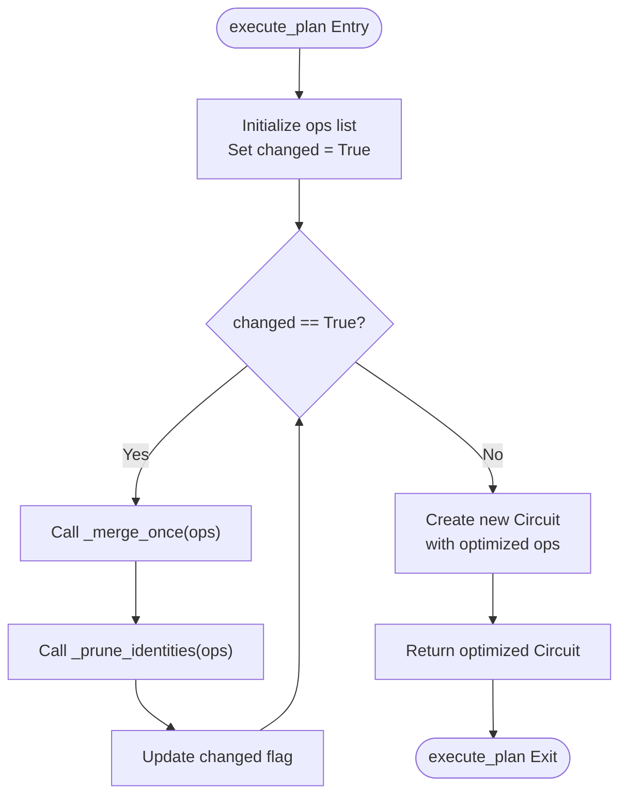
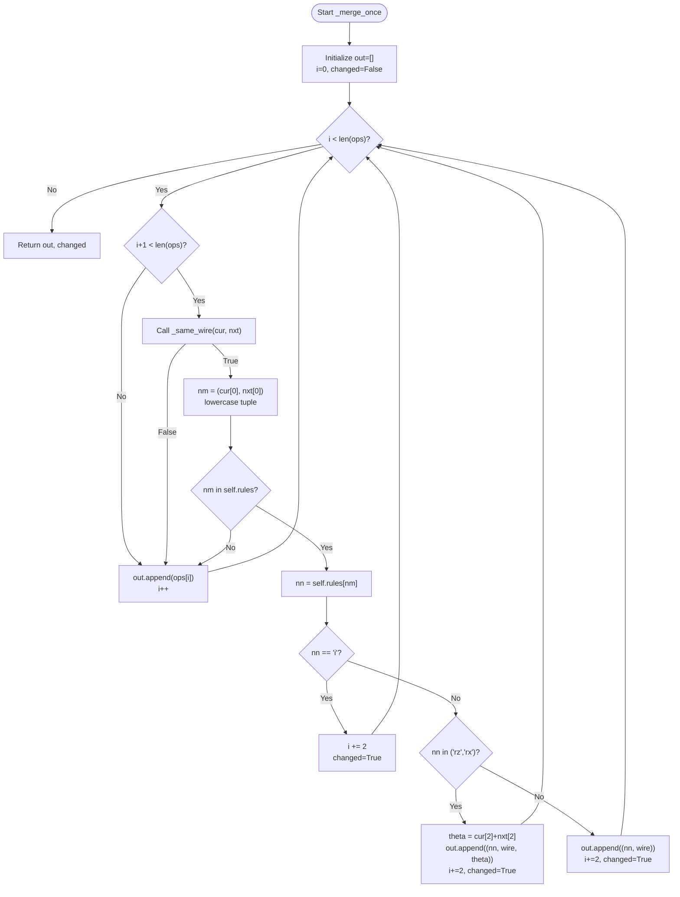

# Gate Merging and Pruning

<cite>
**Referenced Files in This Document**   
- [merge_prune.py](file://src/tyxonq/compiler/stages/rewrite/merge_prune.py)
</cite>

## Table of Contents
1. [Introduction](#introduction)
2. [MergePrunePass Class Overview](#mergeprunepass-class-overview)
3. [Execution Flow and Iterative Optimization](#execution-flow-and-iterative-optimization)
4. [DEFAULT_MERGE_RULES and Algebraic Identities](#default_merge_rules-and-algebraic-identities)
5. [_merge_once Method Implementation](#_merge_once-method-implementation)
6. [_prune_identities Method Implementation](#_prune_identities-method-implementation)
7. [Handling Parameterized Gates](#handling-parameterized-gates)
8. [Wire Matching and Gate Compatibility](#wire-matching-and-gate-compatibility)
9. [Customization Through Rules Parameter](#customization-through-rules-parameter)
10. [Common Issues and Troubleshooting](#common-issues-and-troubleshooting)

## Introduction
The Gate Merging and Pruning feature is a circuit optimization pass implemented within the rewriting stage of the compiler pipeline. This optimization applies algebraic identities to simplify quantum circuits by merging adjacent compatible gates and eliminating identity operations. The implementation focuses on lightweight, deterministic transformations that preserve circuit semantics while reducing gate count and depth. This document details the `MergePrunePass` class and its core methods, explaining how circuit simplification is achieved through systematic application of transformation rules.

## MergePrunePass Class Overview
The `MergePrunePass` class implements a circuit optimization pass that performs gate merging and identity pruning. It is designed as a lightweight variant inspired by legacy compilation approaches, focusing on simple but effective algebraic identities. The class maintains a rules dictionary that defines how pairs of adjacent gates should be transformed. During initialization, it inherits the `DEFAULT_MERGE_RULES` as a base set of transformation rules, which can be extended or overridden through the optional `rules` parameter. The primary interface is the `execute_plan` method, which processes a circuit through iterative merging and pruning passes until no further changes occur.

**Section sources**
- [merge_prune.py](file://src/tyxonq/compiler/stages/rewrite/merge_prune.py#L24-L33)

## Execution Flow and Iterative Optimization
The `execute_plan` method implements the core optimization loop that applies merging and pruning operations to a circuit until convergence. It begins by extracting the circuit's operations into a mutable list. The method then enters an iterative process where it alternately applies `_merge_once` and `_prune_identities` methods. The loop continues as long as changes are detected in the circuit structure. This iterative approach ensures that newly created gate sequences from merging operations are themselves subject to further optimization in subsequent iterations. The process terminates when a complete pass produces no changes, guaranteeing a locally optimal circuit with respect to the defined transformation rules.

**Diagram sources**
- [merge_prune.py](file://src/tyxonq/compiler/stages/rewrite/merge_prune.py#L35-L43)

**Section sources**
- [merge_prune.py](file://src/tyxonq/compiler/stages/rewrite/merge_prune.py#L35-L43)

## DEFAULT_MERGE_RULES and Algebraic Identities
The `DEFAULT_MERGE_RULES` dictionary defines the core transformation rules used by the gate merging process. These rules encode algebraic identities commonly found in quantum circuit optimization. For single-qubit gates, the rules include phase gate combinations such as S+S→Z and T+T→S. The most significant rules handle self-inverse operations where X+X→I, Y+Y→I, Z+Z→I, and H+H→I, allowing complete elimination of gate pairs. For parameterized rotation gates, the rules support additive combination of RZ+RZ→RZ and RX+RX→RX, where rotation angles are summed. The rules are case-insensitive and applied only to adjacent gates on the same qubit wire.

**Section sources**
- [merge_prune.py](file://src/tyxonq/compiler/stages/rewrite/merge_prune.py#L9-L22)

## _merge_once Method Implementation
The `_merge_once` method processes a list of operations to identify and merge adjacent gate pairs according to the defined rules. It iterates through the operation list with a sliding window of two consecutive gates. For each pair, it first verifies they act on the same qubit wire using the `_same_wire` helper method. When wire compatibility is confirmed, it checks if the gate pair exists in the rules dictionary. If a matching rule is found, the method applies the appropriate transformation: eliminating the pair when the result is "i" (identity), combining rotation angles for RX and RZ gates, or replacing with a single equivalent gate. The method returns both the transformed operation list and a boolean flag indicating whether any changes were made.

**Diagram sources**
- [merge_prune.py](file://src/tyxonq/compiler/stages/rewrite/merge_prune.py#L45-L73)

**Section sources**
- [merge_prune.py](file://src/tyxonq/compiler/stages/rewrite/merge_prune.py#L45-L73)

## _prune_identities Method Implementation
The `_prune_identities` method removes identity gates from the operation list after merging has been applied. It implements a simple list comprehension that filters out any operation tuple whose first element is "i" (representing an identity gate). The method checks that the operation is a valid tuple or list structure before examining its gate type. This filtering occurs after each merging pass, ensuring that any identity gates created by merging operations (such as X+X pairs) are immediately eliminated from the circuit. The method returns a new operation list with all identity gates removed, contributing to circuit depth reduction.

**Section sources**
- [merge_prune.py](file://src/tyxonq/compiler/stages/rewrite/merge_prune.py#L81-L82)

## Handling Parameterized Gates
The gate merging process handles parameterized rotation gates (RX, RY, RZ) through angle addition when consecutive rotations act on the same axis and qubit. When the `_merge_once` method encounters adjacent RZ or RX gates, it extracts their rotation angles (assumed to be at index 2 in the operation tuple), sums them, and creates a single gate with the combined angle. This additive combination preserves the overall unitary transformation while reducing gate count. The implementation assumes that rotation parameters are numeric values that can be safely converted to floats. For RY gates, the current rules map RY+RY→RX, which may represent a specific optimization or could be a potential area for review depending on the intended circuit semantics.

**Section sources**
- [merge_prune.py](file://src/tyxonq/compiler/stages/rewrite/merge_prune.py#L58-L62)

## Wire Matching and Gate Compatibility
Gate merging is constrained by qubit wire compatibility, enforced through the `_same_wire` helper method. This method determines whether two operations act on the same qubit by comparing their qubit indices (assumed to be at index 1 in the operation tuple). It includes type checking to ensure both operations are valid tuple or list structures before attempting index access. The method uses a try-except block to handle potential exceptions from invalid operation formats or missing indices, returning False in such cases. This wire matching logic prevents incorrect merging of gates that act on different qubits, even if they are adjacent in the operation sequence. Incomplete merging can occur when gates are separated by operations on other qubits or when wire indices cannot be properly extracted.

**Section sources**
- [merge_prune.py](file://src/tyxonq/compiler/stages/rewrite/merge_prune.py#L75-L79)

## Customization Through Rules Parameter
The `MergePrunePass` class supports customization of merging behavior through the optional `rules` parameter in its constructor. Users can provide a dictionary of additional or modified transformation rules that extend or override the default rules defined in `DEFAULT_MERGE_RULES`. The provided rules are shallow-copied from the default rules and then updated with the custom rules, allowing selective modification of specific gate combinations without affecting the entire rule set. This extensibility enables domain-specific optimizations or adaptation to hardware-specific gate sets. For example, users could add rules for merging custom gate types or modify the behavior of existing gate combinations to suit particular circuit patterns.

**Section sources**
- [merge_prune.py](file://src/tyxonq/compiler/stages/rewrite/merge_prune.py#L30-L33)

## Common Issues and Troubleshooting
Common issues with the gate merging and pruning process include incomplete optimization due to wire mismatches and unexpected gate elimination. Incomplete merging typically occurs when gates that could be combined are separated by operations on other qubits, breaking the adjacency requirement. Unexpected elimination may happen when identity gates are created but not properly pruned, or when the rules incorrectly map gate combinations. Troubleshooting should verify that operation tuples have the expected structure (gate name at index 0, qubit index at index 1, and parameters at subsequent indices). Users experiencing issues should check that custom rules use lowercase gate names and that parameterized gates have numeric parameters at the expected positions. The iterative nature of the optimization ensures thorough application of rules, but circuits with complex gate patterns may require multiple compilation passes to reach optimal simplification.

**Section sources**
- [merge_prune.py](file://src/tyxonq/compiler/stages/rewrite/merge_prune.py#L45-L73)
- [merge_prune.py](file://src/tyxonq/compiler/stages/rewrite/merge_prune.py#L81-L82)