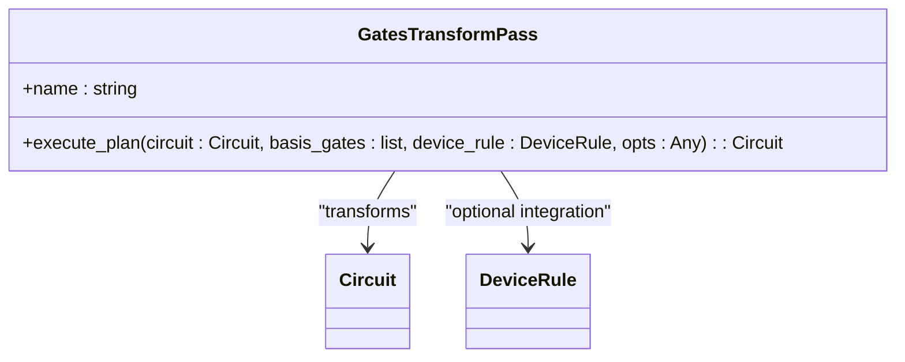
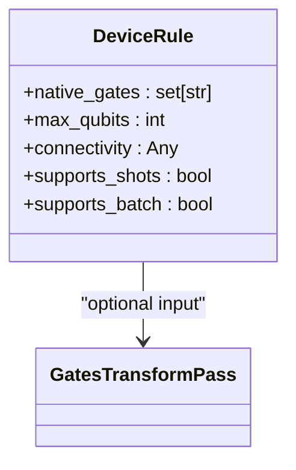

# Gate Transformation

<cite>
**Referenced Files in This Document**   
- [gates_transform.py](file://src/tyxonq/compiler/stages/rewrite/gates_transform.py)
- [base.py](file://src/tyxonq/devices/base.py)
</cite>

## Table of Contents
1. [Introduction](#introduction)
2. [Core Components](#core-components)
3. [Transformation Rules](#transformation-rules)
4. [Basis Gate Configuration](#basis-gate-configuration)
5. [Device Rule Integration](#device-rule-integration)
6. [Common Issues and Troubleshooting](#common-issues-and-troubleshooting)
7. [Conclusion](#conclusion)

## Introduction

The Gate Transformation feature is a critical component in the quantum circuit compilation pipeline, responsible for rewriting quantum gates into a preferred basis set that aligns with hardware constraints or optimization requirements. This process occurs during the Rewriting stage of compilation and ensures that quantum circuits are expressed in terms of gates natively supported by target devices. The transformation enables hardware compatibility, facilitates efficient execution, and standardizes circuit representations across different quantum computing platforms.

**Section sources**
- [gates_transform.py](file://src/tyxonq/compiler/stages/rewrite/gates_transform.py#L9-L49)

## Core Components

The primary component responsible for gate transformation is the `GatesTransformPass` class, which implements the `execute_plan` method to perform the actual rewriting of quantum gates. This pass operates on quantum circuits by iterating through their operations and applying transformation rules based on the specified basis gate set.

The `GatesTransformPass` class serves as a compiler pass that standardizes gate representations according to configurable basis gates. It preserves certain fundamental gates while transforming others into equivalent forms that match the target basis. The pass maintains circuit integrity by preserving metadata and instructions while modifying only the operational components.

**Diagram sources**
- [gates_transform.py](file://src/tyxonq/compiler/stages/rewrite/gates_transform.py#L9-L49)

**Section sources**
- [gates_transform.py](file://src/tyxonq/compiler/stages/rewrite/gates_transform.py#L9-L49)

## Transformation Rules

The `execute_plan` method implements a set of transformation rules that determine how quantum gates are rewritten based on the available basis gates. The default behavior follows minimal transformation logic that prioritizes preservation of native gates while converting unsupported gates into equivalent forms.

Key transformation rules include:
- X gate → RX(π) when RX is in the basis gates
- Y gate → RY(π) when RY is in the basis gates
- Preservation of fundamental gates: CX, CZ, H, RX, RY, RZ
- Transparent preservation of extended gates (RXX, RZZ, CY) when explicitly requested
- Default preservation of unsupported gates when no transformation rule applies

The transformation process iterates through each operation in the circuit, applies the appropriate rule based on gate type and basis gate availability, and constructs a new circuit with the transformed operations. This approach ensures that circuits are standardized while maintaining their quantum mechanical equivalence.

**Section sources**
- [gates_transform.py](file://src/tyxonq/compiler/stages/rewrite/gates_transform.py#L23-L49)

## Basis Gate Configuration

The gate transformation process is governed by the `basis_gates` parameter, which defines the target gate set for rewriting. When no explicit basis is provided, the system defaults to `['h', 'rx', 'rz', 'cx', 'cz']` as the preferred basis gate set. This default configuration represents a common universal gate set that supports efficient implementation on many quantum hardware platforms.

The basis gate configuration can be customized through compiler options, allowing users to specify alternative gate sets that better match their target hardware capabilities. The transformation logic dynamically adapts to the provided basis gates, applying transformations only when the target gates are available in the basis set.

When a gate cannot be transformed into the basis set (e.g., when RX is not available for X gate transformation), the original gate is preserved in the circuit. This fallback behavior ensures that circuits remain executable even when perfect basis alignment cannot be achieved.

**Section sources**
- [gates_transform.py](file://src/tyxonq/compiler/stages/rewrite/gates_transform.py#L9-L15)

## Device Rule Integration

The gate transformation process can optionally integrate with `DeviceRule` configurations, which provide declarative descriptions of device capabilities. The `DeviceRule` class defines hardware constraints such as native gates, maximum qubit count, connectivity limitations, and execution capabilities.

While the `execute_plan` method accepts a `device_rule` parameter, the current implementation primarily relies on the `basis_gates` parameter for transformation decisions. However, the integration framework allows for future enhancements where device-specific constraints could directly influence gate rewriting strategies.

The `DeviceRule` configuration complements the basis gate specification by providing additional context about hardware capabilities. This information could be used to optimize transformation decisions, such as prioritizing gate decompositions that align with native gate implementations or considering connectivity constraints during multi-qubit gate transformations.

**Diagram sources**
- [base.py](file://src/tyxonq/devices/base.py#L41-L52)

**Section sources**
- [base.py](file://src/tyxonq/devices/base.py#L41-L52)

## Common Issues and Troubleshooting

Several common issues may arise during gate transformation, primarily related to basis gate configuration and unexpected gate preservation. The most frequent issue occurs when users expect certain gates to be transformed but they remain unchanged in the output circuit. This typically happens when the target basis gates are not properly specified or when the transformation rules do not cover specific gate types.

To troubleshoot gate preservation issues:
1. Verify that the basis gates parameter includes the target transformation gates (e.g., 'rx' for X gate transformation)
2. Check that the compiler options are correctly passed to the transformation pass
3. Confirm that the circuit operations are in the expected format for processing
4. Validate that the gate names match the transformation rules (case-insensitive matching is used)

Another common issue involves incomplete basis sets that cannot represent all required quantum operations. When this occurs, the transformation pass preserves unsupported gates rather than failing, which may lead to circuits that cannot execute on the target hardware. Users should ensure their basis gate sets are universal or sufficient for their specific quantum algorithms.

**Section sources**
- [gates_transform.py](file://src/tyxonq/compiler/stages/rewrite/gates_transform.py#L23-L49)

## Conclusion

The Gate Transformation feature provides essential functionality for standardizing quantum circuits according to target hardware constraints. By implementing the `GatesTransformPass` class with its `execute_plan` method, the system enables flexible rewriting of quantum gates into configurable basis sets. The default basis `['h', 'rx', 'rz', 'cx', 'cz']` supports common quantum operations while allowing customization for specific hardware platforms.

The transformation rules prioritize preservation of native gates while providing minimal but effective conversions for basic gates like X and Y. Integration with device rule configurations offers potential for more sophisticated hardware-aware transformations in future implementations. Understanding the basis gate configuration and transformation behavior is crucial for ensuring successful compilation and execution of quantum circuits across diverse quantum computing platforms.