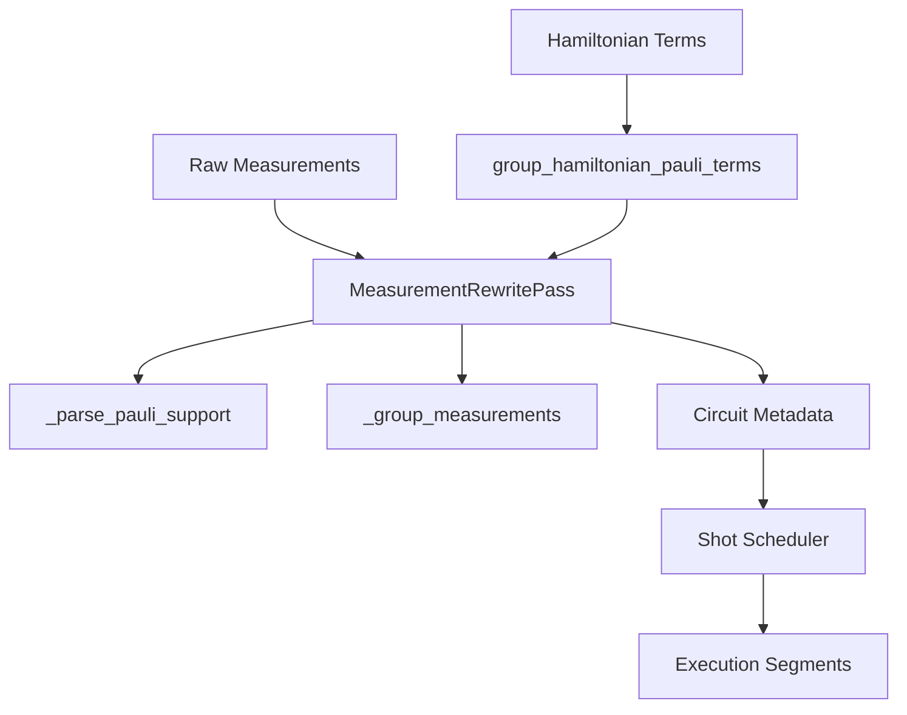
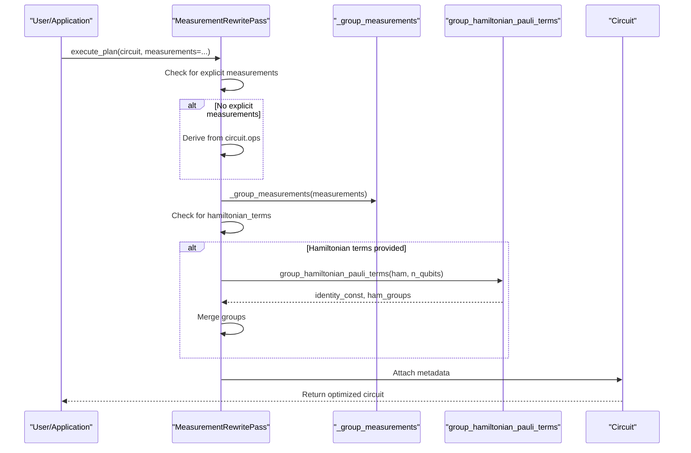
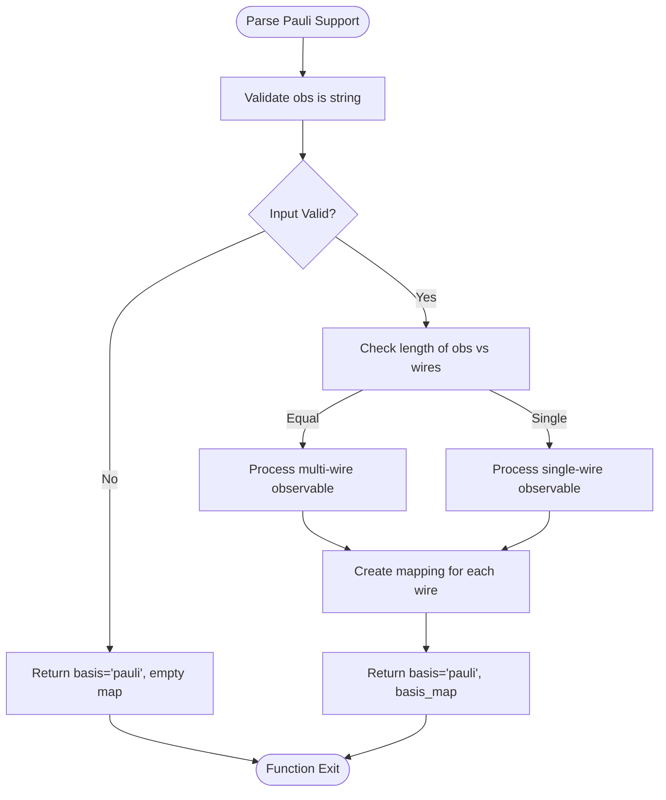
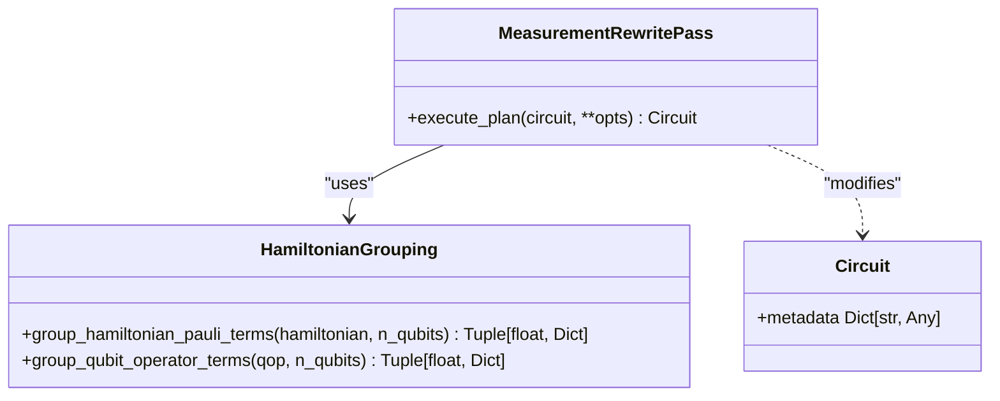
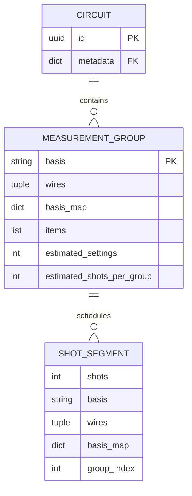

# Measurement Optimization

<cite>
**Referenced Files in This Document**   
- [measurement.py](file://src/tyxonq/compiler/stages/rewrite/measurement.py)
- [hamiltonian_grouping.py](file://src/tyxonq/libs/hamiltonian_encoding/hamiltonian_grouping.py)
- [hamiltonian_grouping.py](file://src/tyxonq/compiler/utils/hamiltonian_grouping.py)
- [shot_scheduler.py](file://src/tyxonq/compiler/stages/scheduling/shot_scheduler.py)
</cite>

## Table of Contents
1. [Introduction](#introduction)
2. [Core Components](#core-components)
3. [MeasurementRewritePass Class](#measurementrewritepass-class)
4. [execute_plan Method](#execute_plan-method)
5. [Helper Functions](#helper-functions)
6. [Integration with Hamiltonian Grouping](#integration-with-hamiltonian-grouping)
7. [Metadata Attachment](#metadata-attachment)
8. [Downstream Scheduling](#downstream-scheduling)
9. [Troubleshooting](#troubleshooting)
10. [Conclusion](#conclusion)

## Introduction

The Measurement Optimization feature within the Rewriting stage is a critical component of the TyxonQ compiler pipeline that enables efficient quantum circuit execution by grouping compatible measurement operations. This optimization reduces the total number of measurement settings required to evaluate Hamiltonian expectation values, thereby improving shot efficiency and reducing overall execution time. The system leverages a greedy, product-basis-safe grouping strategy that maintains linear complexity relative to the number of measurement items while preserving circuit semantics.

**Section sources**
- [measurement.py](file://src/tyxonq/compiler/stages/rewrite/measurement.py#L1-L28)

## Core Components

The measurement optimization system consists of several interconnected components that work together to transform raw measurement specifications into optimally grouped execution plans. The primary components include the MeasurementRewritePass class, helper functions for parsing and grouping measurements, integration with Hamiltonian term grouping utilities, and downstream scheduling capabilities. These components form a cohesive pipeline that begins with measurement specification and concludes with executable shot segments.

**Diagram sources**
- [measurement.py](file://src/tyxonq/compiler/stages/rewrite/measurement.py)
- [hamiltonian_grouping.py](file://src/tyxonq/libs/hamiltonian_encoding/hamiltonian_grouping.py)

**Section sources**
- [measurement.py](file://src/tyxonq/compiler/stages/rewrite/measurement.py#L1-L164)
- [hamiltonian_grouping.py](file://src/tyxonq/libs/hamiltonian_encoding/hamiltonian_grouping.py#L1-L66)

## MeasurementRewritePass Class

The MeasurementRewritePass class serves as the central orchestrator for measurement optimization within the rewriting stage. It implements a systematic approach to measurement grouping that offers several advantages over ad-hoc handling. The class stores explicit grouping metadata in the circuit's metadata dictionary, improving observability and enabling downstream scheduling optimizations. Its greedy, product-basis-safe grouping algorithm ensures safe shot reuse without altering circuit semantics while maintaining linear complexity in the number of measurement items. The design is extensible, allowing future enhancements to grouping policies without requiring changes to device code.

**Section sources**
- [measurement.py](file://src/tyxonq/compiler/stages/rewrite/measurement.py#L9-L28)

## execute_plan Method

The execute_plan method is the primary interface of the MeasurementRewritePass class, responsible for transforming measurement specifications into optimally grouped execution plans. The method follows a two-phase approach: first grouping arbitrary measurement items, then optionally grouping Hamiltonian-like inputs for Pauli-sum energy calculations. When no explicit measurements are provided, the method derives them from the circuit's operation list by identifying "measure_z" operations. The method then invokes the _group_measurements helper function to perform wire-based grouping based on compatible measurement bases. For Hamiltonian terms, it delegates to specialized grouping functions from the hamiltonian_grouping module, ensuring consistent treatment of quantum chemistry calculations.

**Diagram sources**
- [measurement.py](file://src/tyxonq/compiler/stages/rewrite/measurement.py#L29-L88)

**Section sources**
- [measurement.py](file://src/tyxonq/compiler/stages/rewrite/measurement.py#L29-L88)

## Helper Functions

### _group_measurements Function

The _group_measurements function implements a greedy strategy for grouping measurement operations based on non-overlapping wires and compatible measurement bases. The algorithm iterates through each measurement item and attempts to place it in an existing group if the wires do not conflict with the group's used wires or if overlapping wires share the same basis measurement. This product-basis-safe merging ensures that measurements within a group can be executed simultaneously without introducing measurement crosstalk. The function maintains a basis_map dictionary that tracks which Pauli operator (X, Y, Z) should be measured on each wire, enabling downstream circuit transformations.

**Section sources**
- [measurement.py](file://src/tyxonq/compiler/stages/rewrite/measurement.py#L124-L162)

### _parse_pauli_support Function

The _parse_pauli_support function is responsible for converting high-level observable specifications into per-wire basis mappings. It handles various input formats, including single-letter observables on single wires (e.g., 'Z' on wire 0) and multi-letter observables spanning multiple wires (e.g., 'ZX' on wires 0 and 1). The function normalizes the input and constructs a dictionary mapping wire indices to their corresponding Pauli operators. For invalid or unrecognized observables, it returns an empty mapping as a fallback, ensuring robustness in the face of malformed inputs.

**Diagram sources**
- [measurement.py](file://src/tyxonq/compiler/stages/rewrite/measurement.py#L89-L123)

**Section sources**
- [measurement.py](file://src/tyxonq/compiler/stages/rewrite/measurement.py#L89-L123)

## Integration with Hamiltonian Grouping

The measurement optimization system integrates seamlessly with the hamiltonian_grouping module to handle Pauli-term grouping for Hamiltonian expectation value calculations. When Hamiltonian terms are provided via the "hamiltonian_terms" parameter or a QubitOperator via "qubit_operator", the execute_plan method delegates to specialized grouping functions. The group_hamiltonian_pauli_terms function from the hamiltonian_grouping module groups Pauli-sum terms into product-basis measurement groups, returning both the grouped terms and any identity constant that contributes to the Hamiltonian's expectation value. This integration enables efficient evaluation of molecular Hamiltonians in quantum chemistry applications by minimizing the number of distinct measurement settings required.

**Diagram sources**
- [measurement.py](file://src/tyxonq/compiler/stages/rewrite/measurement.py#L52-L66)
- [hamiltonian_grouping.py](file://src/tyxonq/libs/hamiltonian_encoding/hamiltonian_grouping.py#L47-L65)

**Section sources**
- [measurement.py](file://src/tyxonq/compiler/stages/rewrite/measurement.py#L52-L66)
- [hamiltonian_grouping.py](file://src/tyxonq/libs/hamiltonian_encoding/hamiltonian_grouping.py#L47-L65)

## Metadata Attachment

After grouping measurements, the MeasurementRewritePass attaches critical metadata to the circuit for downstream processing. The primary metadata field is "measurement_groups", which contains a list of dictionaries describing each measurement group. Each group dictionary includes the items to be measured, the wires involved, the measurement basis, and a basis_map dictionary specifying which Pauli operator to measure on each wire. For Hamiltonian measurements, additional metadata is stored under "measurement_context", including the "identity_const" field that captures any constant contribution to the Hamiltonian's expectation value. This explicit metadata design improves observability and enables deterministic shot scheduling in subsequent compilation stages.

**Section sources**
- [measurement.py](file://src/tyxonq/compiler/stages/rewrite/measurement.py#L75-L88)

## Downstream Scheduling

The measurement grouping metadata produced by the MeasurementRewritePass directly enables efficient downstream scheduling through integration with the shot_scheduler. The shot scheduler reads the "measurement_groups" metadata and converts it into concrete execution segments, each with an allocated shot budget. This decoupling of grouping from scheduling allows for extensible cost models and deterministic shot allocation. The scheduler uses the "estimated_shots_per_group" heuristic from the grouping phase to proportionally distribute the total shot budget across groups, ensuring that more complex measurement groups receive appropriate shot allocation. This integration minimizes total measurement settings and maximizes settings reuse during circuit execution.

**Diagram sources**
- [measurement.py](file://src/tyxonq/compiler/stages/rewrite/measurement.py#L75-L88)
- [shot_scheduler.py](file://src/tyxonq/compiler/stages/scheduling/shot_scheduler.py#L52-L84)

**Section sources**
- [shot_scheduler.py](file://src/tyxonq/compiler/stages/scheduling/shot_scheduler.py#L52-L84)

## Troubleshooting

### Common Issues

**Incorrect Observable Parsing**: When observables are not properly formatted as strings containing valid Pauli operators (X, Y, Z), the _parse_pauli_support function returns an empty basis map, leading to ungrouped measurements. Ensure observables are specified as strings with the correct Pauli operator notation.

**Measurement Grouping Failures**: Conflicting basis measurements on the same wire prevent grouping. For example, attempting to group a Z-basis measurement with an X-basis measurement on the same wire will result in separate groups. Verify that compatible measurements are being grouped and consider the physical constraints of simultaneous multi-basis measurements.

**Missing Hamiltonian Terms**: When providing Hamiltonian terms for grouping, ensure the format matches the expected structure of [(coefficient, [(operator, qubit), ...]), ...]. Malformed input may be silently ignored, resulting in incomplete measurement groups.

### Troubleshooting Strategies

1. **Inspect Metadata**: After executing the MeasurementRewritePass, examine the circuit's metadata to verify that "measurement_groups" contains the expected number of groups and that basis mappings are correct.

2. **Check Group Composition**: Validate that measurement items are distributed appropriately across groups according to the greedy grouping algorithm. Use test cases with known optimal groupings to verify correctness.

3. **Verify Shot Distribution**: Confirm that the shot scheduler properly consumes the measurement grouping metadata and allocates shots according to the estimated_shots_per_group heuristic.

4. **Test with Simple Cases**: Start with basic measurement configurations before scaling to complex Hamiltonians to isolate grouping issues.

**Section sources**
- [test_measurement_rewrite_grouping.py](file://tests_core_module/test_measurement_rewrite_grouping.py#L1-L28)
- [test_shot_scheduler_integration.py](file://tests_core_module/test_shot_scheduler_integration.py#L1-L17)

## Conclusion

The Measurement Optimization feature in the Rewriting stage represents a sophisticated approach to improving quantum circuit execution efficiency through intelligent measurement grouping. By implementing a greedy, product-basis-safe grouping algorithm within the MeasurementRewritePass class, the system achieves linear complexity while preserving circuit semantics. The integration with Hamiltonian term grouping utilities enables efficient evaluation of quantum chemistry problems, while the explicit metadata design facilitates downstream scheduling optimizations. This architecture provides a solid foundation for future enhancements, such as variance-aware grouping policies and commuting-set optimization, without requiring changes to device code. The comprehensive troubleshooting guidance ensures reliable operation across diverse quantum computing applications.