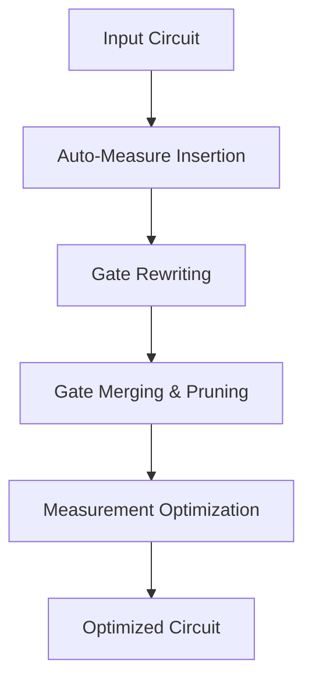
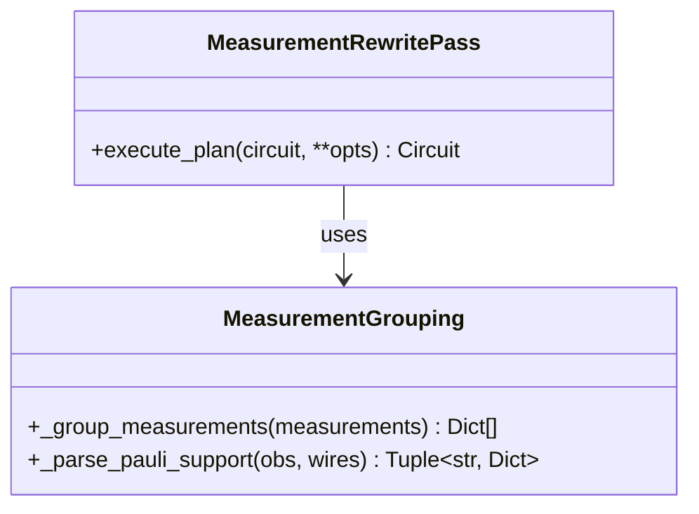
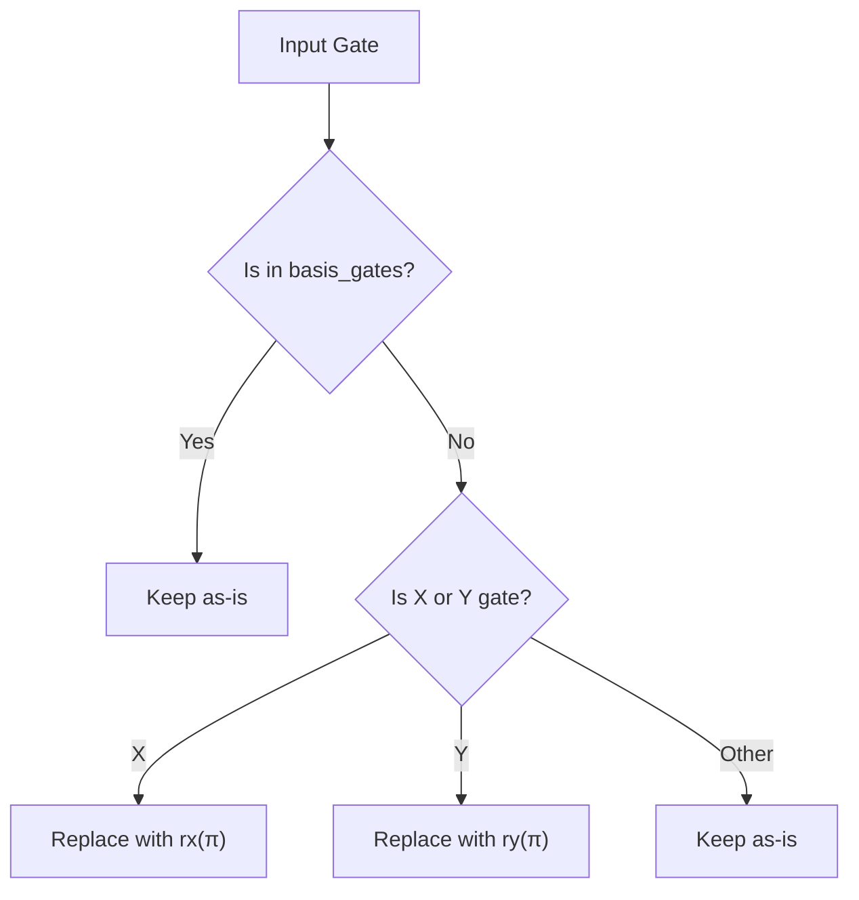
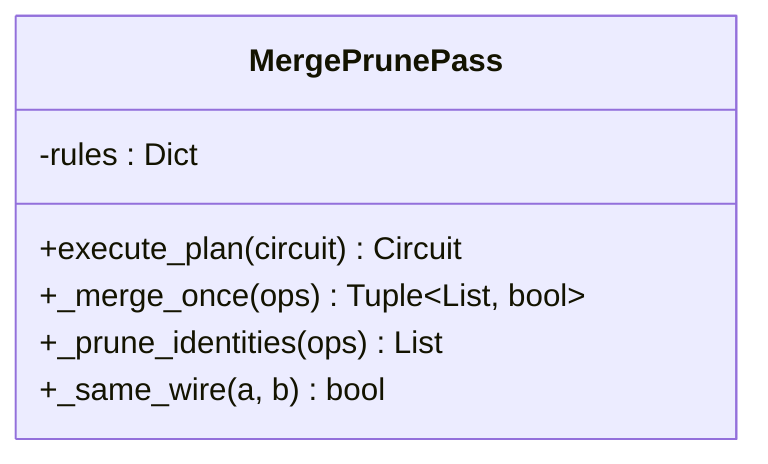

# Rewriting

<cite>
**Referenced Files in This Document**   
- [auto_measure.py](file://src/tyxonq/compiler/stages/rewrite/auto_measure.py)
- [gates_transform.py](file://src/tyxonq/compiler/stages/rewrite/gates_transform.py)
- [measurement.py](file://src/tyxonq/compiler/stages/rewrite/measurement.py)
- [merge_prune.py](file://src/tyxonq/compiler/stages/rewrite/merge_prune.py)
- [hamiltonian_grouping.py](file://src/tyxonq/libs/hamiltonian_encoding/hamiltonian_grouping.py)
</cite>

## Table of Contents
1. [Introduction](#introduction)
2. [Rewriting Stage Overview](#rewriting-stage-overview)
3. [Measurement Optimization and Grouping](#measurement-optimization-and-grouping)
4. [Gate Rewriting and Standardization](#gate-rewriting-and-standardization)
5. [Gate Merging and Pruning](#gate-merging-and-pruning)
6. [Auto-Measurement Insertion](#auto-measurement-insertion)
7. [Order of Operations in Rewriting](#order-of-operations-in-rewriting)
8. [Troubleshooting Common Issues](#troubleshooting-common-issues)
9. [Conclusion](#conclusion)

## Introduction
The Rewriting stage in the compiler pipeline is responsible for applying a series of transformation passes that optimize quantum circuits for improved efficiency, accuracy, and hardware compatibility. This document details the core transformation passes—measurement optimization, gate rewriting, auto-measurement insertion, and gate merging/pruning—and explains how they collectively enhance circuit performance. Special attention is given to the implementation and functionality of key modules: `measurement.py`, `gates_transform.py`, and `merge_prune.py`.

**Section sources**
- [measurement.py](file://src/tyxonq/compiler/stages/rewrite/measurement.py#L1-L88)
- [gates_transform.py](file://src/tyxonq/compiler/stages/rewrite/gates_transform.py#L1-L49)
- [merge_prune.py](file://src/tyxonq/compiler/stages/rewrite/merge_prune.py#L1-L82)
- [auto_measure.py](file://src/tyxonq/compiler/stages/rewrite/auto_measure.py#L1-L34)

## Rewriting Stage Overview
The rewriting phase applies a sequence of deterministic and semantically preserving transformations to the intermediate representation (IR) of a quantum circuit. These passes are designed to standardize gate sets, optimize measurement strategies, eliminate redundant operations, and ensure compatibility with target hardware constraints.

The rewriting stage consists of four primary passes:
- **Measurement Optimization**: Groups compatible measurements to reduce shot overhead.
- **Gate Rewriting**: Transforms gates into a standardized basis set.
- **Gate Merging/Pruning**: Combines adjacent gates and removes identities.
- **Auto-Measurement Insertion**: Ensures circuits have explicit measurement instructions.

These passes are executed in a specific order to maximize optimization benefits while preserving circuit semantics.

**Diagram sources**
- [auto_measure.py](file://src/tyxonq/compiler/stages/rewrite/auto_measure.py#L10-L34)
- [gates_transform.py](file://src/tyxonq/compiler/stages/rewrite/gates_transform.py#L9-L49)
- [merge_prune.py](file://src/tyxonq/compiler/stages/rewrite/merge_prune.py#L24-L82)
- [measurement.py](file://src/tyxonq/compiler/stages/rewrite/measurement.py#L9-L88)

## Measurement Optimization and Grouping
The `MeasurementRewritePass` in `measurement.py` handles the grouping and optimization of measurements, particularly for Hamiltonian expectation value calculations. It enables efficient shot reuse by grouping compatible measurement terms that can be evaluated under the same basis configuration.

The pass supports two input types:
- **Explicit measurement items** (e.g., Expectation observables)
- **Hamiltonian-like inputs** (Pauli sums or QubitOperator terms)

When processing Hamiltonian terms, the pass delegates to `group_hamiltonian_pauli_terms` or `group_qubit_operator_terms` from `hamiltonian_grouping.py`, which group terms by their measurement basis (e.g., all terms measurable in the XZYZ basis). This reduces the number of distinct measurement settings required.

The grouping strategy is greedy and product-basis-safe: measurements are grouped if their wire bases do not conflict. The resulting metadata includes:
- `basis_map`: Per-wire measurement basis
- `wires`: Affected qubits
- `estimated_settings`: Number of distinct measurement configurations
- `estimated_shots_per_group`: Heuristic shot allocation

This metadata is used in downstream scheduling to minimize total measurement overhead.

**Diagram sources**
- [measurement.py](file://src/tyxonq/compiler/stages/rewrite/measurement.py#L9-L88)
- [hamiltonian_grouping.py](file://src/tyxonq/libs/hamiltonian_encoding/hamiltonian_grouping.py#L1-L66)

**Section sources**
- [measurement.py](file://src/tyxonq/compiler/stages/rewrite/measurement.py#L9-L88)
- [hamiltonian_grouping.py](file://src/tyxonq/libs/hamiltonian_encoding/hamiltonian_grouping.py#L1-L66)

## Gate Rewriting and Standardization
The `GatesTransformPass` in `gates_transform.py` rewrites quantum gates into a standardized basis set, ensuring compatibility with hardware constraints. By default, the target basis is `["h", "rx", "rz", "cx", "cz"]`, but this can be overridden via the `basis_gates` option.

Key transformations include:
- `x` → `rx(π)` if `rx` is allowed
- `y` → `ry(π)` if `ry` is allowed
- Transparent preservation of `rxx`, `rzz`, `cy` if requested
- Direct pass-through for gates already in the basis set

This pass ensures that all circuits use a consistent gate representation, which simplifies subsequent optimization and hardware compilation steps. It avoids unnecessary decompositions when advanced gates (e.g., `rxx`) are supported by the target device.

**Diagram sources**
- [gates_transform.py](file://src/tyxonq/compiler/stages/rewrite/gates_transform.py#L9-L49)

**Section sources**
- [gates_transform.py](file://src/tyxonq/compiler/stages/rewrite/gates_transform.py#L9-L49)

## Gate Merging and Pruning
The `MergePrunePass` in `merge_prune.py` performs lightweight optimization by merging adjacent single-qubit gates and removing identity operations. It uses a set of predefined algebraic rules (e.g., `x` followed by `x` equals identity) to simplify circuits.

The pass operates iteratively:
1. **Merge adjacent gates** on the same qubit using `DEFAULT_MERGE_RULES`
2. **Prune identity gates** (e.g., `i`, or merged `x-x` pairs)
3. Repeat until no further changes occur

Supported merges include:
- Single-qubit rotations (`rz`, `rx`) with angle addition
- Clifford gate combinations (e.g., `s-s` → `z`)
- Identity elimination (e.g., `x-x` → `i`)

This pass reduces gate count and circuit depth, improving execution efficiency and reducing error accumulation.

**Diagram sources**
- [merge_prune.py](file://src/tyxonq/compiler/stages/rewrite/merge_prune.py#L24-L82)

**Section sources**
- [merge_prune.py](file://src/tyxonq/compiler/stages/rewrite/merge_prune.py#L24-L82)

## Auto-Measurement Insertion
The `AutoMeasurePass` in `auto_measure.py` ensures that all circuits have explicit measurement instructions. If no `measure_z` operations are present, it automatically appends Z-basis measurements on all qubits.

This behavior prevents silent failures in circuits that lack explicit measurements. A non-fatal warning is emitted to inform users of the automatic insertion, promoting awareness and explicit design.

The pass is a no-op if any measurement is already present, preserving user intent.

**Section sources**
- [auto_measure.py](file://src/tyxonq/compiler/stages/rewrite/auto_measure.py#L10-L34)

## Order of Operations in Rewriting
The rewriting passes are applied in a specific sequence to maximize optimization effectiveness:
1. **Auto-Measurement Insertion**: Ensures measurement completeness early.
2. **Gate Rewriting**: Standardizes gate representations before merging.
3. **Gate Merging/Pruning**: Operates on standardized gates for consistent results.
4. **Measurement Optimization**: Final pass that groups measurements based on stabilized circuit structure.

This order ensures that gate-level optimizations do not interfere with measurement semantics and that measurement grouping benefits from a simplified circuit.

## Troubleshooting Common Issues
### Incorrect Measurement Placement
- **Symptom**: Unexpected measurement results or grouping inefficiencies.
- **Cause**: Manual `measure_z` instructions conflicting with auto-insertion.
- **Solution**: Either remove all explicit measurements to allow auto-insertion or ensure all qubits are explicitly measured.

### Over-Zealous Gate Pruning
- **Symptom**: Circuit behavior changes after rewriting.
- **Cause**: Aggressive merging of non-commuting or context-sensitive gates.
- **Solution**: Review `DEFAULT_MERGE_RULES` and customize rules if needed. Ensure gate ordering respects quantum semantics.

### Basis Gate Compatibility
- **Symptom**: Gates not rewritten as expected.
- **Cause**: Target `basis_gates` does not include required primitives.
- **Solution**: Explicitly specify `basis_gates` in the compilation options.

## Conclusion
The Rewriting stage plays a critical role in optimizing quantum circuits for efficient execution. Through measurement grouping, gate standardization, and redundancy elimination, it enhances both performance and accuracy. The modular design of the rewriting passes allows for extensibility and adaptation to diverse hardware targets. Proper understanding of the pass order and troubleshooting strategies ensures reliable and effective circuit compilation.