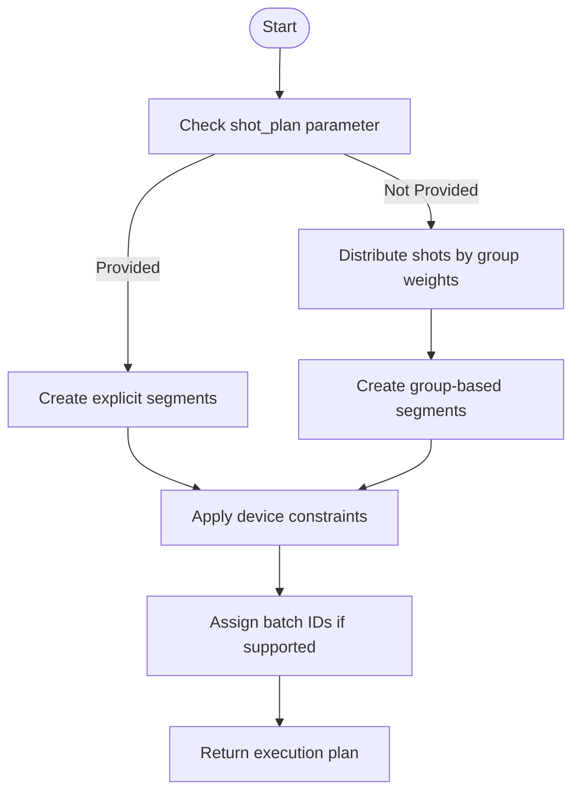
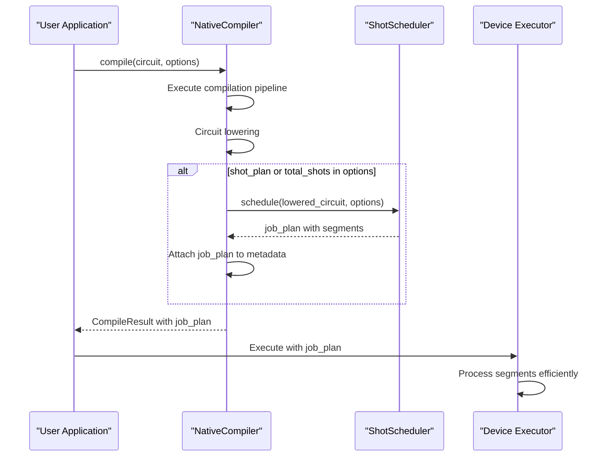
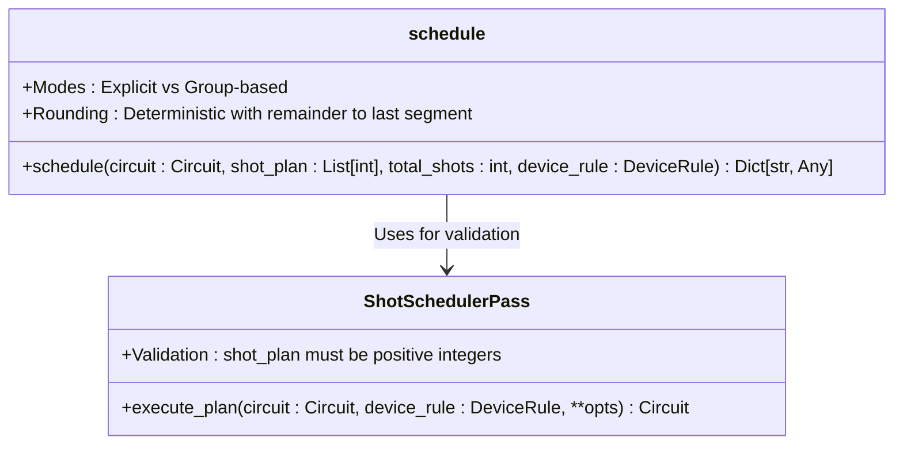
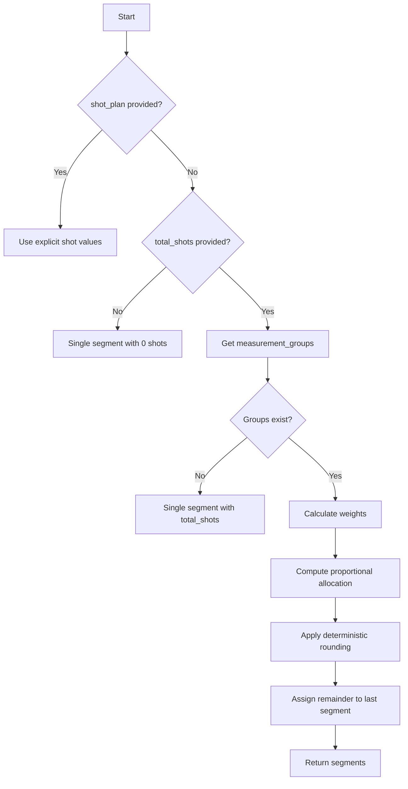
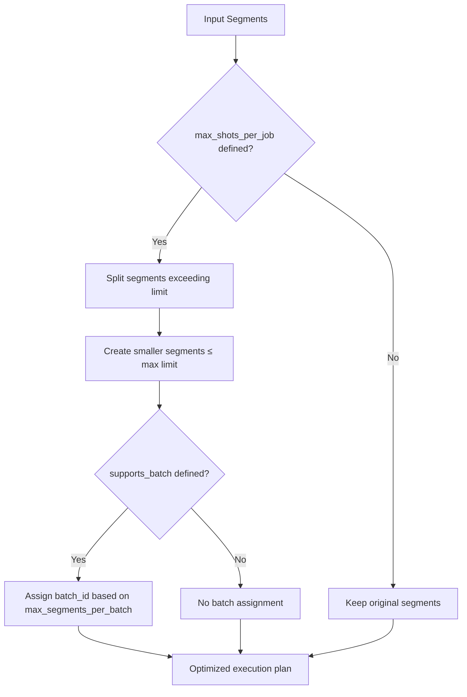

# Scheduling

<cite>
**Referenced Files in This Document**   
- [shot_scheduler.py](file://src/tyxonq/compiler/stages/scheduling/shot_scheduler.py)
- [native_compiler.py](file://src/tyxonq/compiler/compile_engine/native/native_compiler.py)
- [measurement.py](file://src/tyxonq/compiler/stages/rewrite/measurement.py)
- [hamiltonian_grouping.py](file://src/tyxonq/libs/hamiltonian_encoding/hamiltonian_grouping.py)
- [test_shot_scheduler_integration.py](file://tests_core_module/test_shot_scheduler_integration.py)
- [test_compiler_stages.py](file://tests_core_module/test_compiler_stages.py)
</cite>

## Table of Contents
1. [Introduction](#introduction)
2. [Shot Scheduler Architecture](#shot-scheduler-architecture)
3. [Integration with NativeCompiler](#integration-with-nativecompiler)
4. [Shot Allocation Strategies](#shot-allocation-strategies)
5. [Workflow Examples](#workflow-examples)
6. [Configuration Options](#configuration-options)
7. [Troubleshooting Guide](#troubleshooting-guide)

## Introduction

The Scheduling stage in the TyxonQ compiler pipeline is responsible for optimizing shot allocation across multiple measurement groups to create efficient execution plans. This stage bridges the gap between high-level measurement grouping metadata and concrete execution segments that can be consumed by device executors. The shot scheduler operates after circuit lowering in the compilation process, ensuring that measurement strategies are applied to fully transformed circuits.

The primary objective of the shot scheduler is to minimize total shots while maintaining measurement accuracy by intelligently distributing the shot budget based on measurement group characteristics. This optimization is critical for variational quantum algorithms like VQE and QAOA, where efficient resource utilization directly impacts algorithm performance and convergence.

**Section sources**
- [shot_scheduler.py](file://src/tyxonq/compiler/stages/scheduling/shot_scheduler.py#L1-L24)

## Shot Scheduler Architecture

The shot scheduler architecture is designed to decouple scheduling logic from device executors, providing a clean separation of concerns. The core component is the `schedule` function, which transforms measurement grouping metadata into a concrete execution plan consisting of segments.



**Diagram sources**
- [shot_scheduler.py](file://src/tyxonq/compiler/stages/scheduling/shot_scheduler.py#L43-L118)

Each segment in the execution plan carries essential measurement context including:
- `shots`: Number of shots allocated to this segment
- `basis`: Measurement basis for the segment
- `wires`: Quantum wires involved in measurements
- `basis_map`: Mapping of wire to measurement basis
- `group_index`: Index of the measurement group

This contextual information enables executors to reuse measurement settings and batch runs efficiently, reducing overhead from basis changes and readout operations.

**Section sources**
- [shot_scheduler.py](file://src/tyxonq/compiler/stages/scheduling/shot_scheduler.py#L25-L136)

## Integration with NativeCompiler

The shot scheduler integrates with the NativeCompiler after the circuit lowering phase, forming a critical part of the compilation pipeline. The integration occurs when the NativeCompiler processes shot-related options and invokes the scheduler to generate an execution plan.



**Diagram sources**
- [native_compiler.py](file://src/tyxonq/compiler/compile_engine/native/native_compiler.py#L15-L98)
- [shot_scheduler.py](file://src/tyxonq/compiler/stages/scheduling/shot_scheduler.py#L43-L118)

The integration follows a specific sequence:
1. The NativeCompiler first executes the compilation pipeline, including circuit lowering and measurement rewriting
2. After obtaining the lowered circuit, it checks for shot-related options (`shot_plan` or `total_shots`)
3. If shot options are present, it invokes the `schedule` function with the lowered circuit and device rules
4. The resulting job plan is attached to the compilation metadata for downstream consumption

This integration ensures that shot scheduling occurs at the appropriate stage in the pipeline, after all circuit transformations but before execution.

**Section sources**
- [native_compiler.py](file://src/tyxonq/compiler/compile_engine/native/native_compiler.py#L15-L98)

## Shot Allocation Strategies

The shot scheduler implements two primary allocation strategies to accommodate different user requirements and optimization goals.

### Explicit Shot Plan Mode

In explicit mode, users provide a predefined shot distribution through the `shot_plan` parameter. This mode offers complete control over shot allocation and is useful when users have specific requirements or have precomputed optimal distributions.



**Diagram sources**
- [shot_scheduler.py](file://src/tyxonq/compiler/stages/scheduling/shot_scheduler.py#L1-L136)

### Group-Based Allocation Mode

When `total_shots` is provided without an explicit plan, the scheduler uses group-based allocation. This strategy distributes shots proportionally based on the `estimated_shots_per_group` weights from measurement groups.

The allocation algorithm follows these steps:
1. Extract measurement groups from circuit metadata
2. Calculate weights as `max(1, g.get("estimated_shots_per_group", 1))`
3. Compute proportional shot allocation using `total_shots * (weight / sum_of_weights)`
4. Apply deterministic rounding, assigning the remainder to the last segment

The weight calculation is based on heuristics that consider both the number of measurement items and involved wires, ensuring that more complex measurement groups receive appropriate shot budgets.



**Diagram sources**
- [shot_scheduler.py](file://src/tyxonq/compiler/stages/scheduling/shot_scheduler.py#L52-L84)

**Section sources**
- [shot_scheduler.py](file://src/tyxonq/compiler/stages/scheduling/shot_scheduler.py#L52-L84)
- [measurement.py](file://src/tyxonq/compiler/stages/rewrite/measurement.py#L9-L88)

## Workflow Examples

### VQE Workflow with Shot Optimization

In Variational Quantum Eigensolver (VQE) workflows, the shot scheduler significantly improves resource utilization by optimizing measurement of Hamiltonian terms.

```python
# Example VQE workflow with shot scheduling
circuit = create_ansatz(parameters)
hamiltonian_terms = [("Z", [0]), ("X", [1]), ("ZZ", [0,1])]
measurement_pass = MeasurementRewritePass()
processed_circuit = measurement_pass.execute_plan(circuit, hamiltonian_terms=hamiltonian_terms)

# Two approaches:
# 1. Explicit control
job_plan = schedule(processed_circuit, shot_plan=[500, 300, 200])

# 2. Automatic optimization
job_plan = schedule(processed_circuit, total_shots=1000)
```

The scheduler groups commuting Pauli terms and allocates shots based on their contribution to energy estimation variance, ensuring accurate expectation value calculations while minimizing total shots.

### QAOA Workflow with Efficient Measurement

For Quantum Approximate Optimization Algorithm (QAOA), the shot scheduler optimizes the measurement of cost and mixer Hamiltonians across multiple layers.

The measurement grouping process first identifies compatible measurement bases, then the scheduler allocates shots based on the significance of each term in the Hamiltonian. This approach reduces the total number of circuit executions required for gradient estimation in parameterized circuits.

**Section sources**
- [shot_scheduler.py](file://src/tyxonq/compiler/stages/scheduling/shot_scheduler.py#L43-L118)
- [hamiltonian_grouping.py](file://src/tyxonq/libs/hamiltonian_encoding/hamiltonian_grouping.py#L47-L65)

## Configuration Options

The shot scheduler supports several configuration options to customize its behavior according to specific requirements and device capabilities.

### Core Parameters

- `shot_plan`: List of integers specifying exact shot counts for each measurement group
- `total_shots`: Total number of shots to distribute across measurement groups
- `device_rule`: Device-specific constraints and capabilities

### Device Constraint Handling

The scheduler respects device-specific limitations through the `device_rule` parameter:



**Diagram sources**
- [shot_scheduler.py](file://src/tyxonq/compiler/stages/scheduling/shot_scheduler.py#L86-L118)

Key device rules include:
- `max_shots_per_job`: Maximum shots allowed per execution job
- `supports_batch`: Whether the device supports batched execution
- `max_segments_per_batch`: Maximum number of segments per batch

These options enable the scheduler to adapt to different quantum hardware constraints, ensuring compatibility across various devices.

**Section sources**
- [shot_scheduler.py](file://src/tyxonq/compiler/stages/scheduling/shot_scheduler.py#L86-L118)

## Troubleshooting Guide

This section addresses common issues encountered when using the shot scheduler and provides guidance for resolution.

### Scheduling Failures

**Invalid shot_plan format**: The `ShotSchedulerPass` validates that `shot_plan` must be a list of positive integers. If invalid input is provided, a `ValueError` is raised.

```python
# Correct usage
schedule(circuit, shot_plan=[100, 200, 300])

# This will raise ValueError
schedule(circuit, shot_plan=[0, -1, 100])
```

**Missing measurement groups**: When no measurement groups are present in the circuit metadata, the scheduler allocates all shots to a single segment or zero shots if `total_shots` is not provided.

### Suboptimal Shot Distribution

**Uneven weight distribution**: If certain measurement groups receive disproportionately few shots, verify that the `estimated_shots_per_group` values are correctly calculated based on the number of items and wires.

**Device constraint violations**: Ensure that `max_shots_per_job` is properly configured in the `device_rule` to prevent job submission failures due to exceeding device limits.

### Integration Issues

**Missing metadata**: The scheduler depends on `measurement_groups` metadata produced by the measurement rewrite stage. Ensure that the rewrite stage has been executed before scheduling.

**Timing issues**: Verify that scheduling occurs after circuit lowering in the compilation pipeline, as the scheduler operates on the final circuit representation.

The comprehensive test suite, including `test_shot_scheduler_integration.py` and `test_compiler_stages.py`, provides validation for correct scheduler behavior and can be used as reference for troubleshooting.

**Section sources**
- [test_shot_scheduler_integration.py](file://tests_core_module/test_shot_scheduler_integration.py#L0-L17)
- [test_compiler_stages.py](file://tests_core_module/test_compiler_stages.py#0-L29)
- [shot_scheduler.py](file://src/tyxonq/compiler/stages/scheduling/shot_scheduler.py#L118-L133)