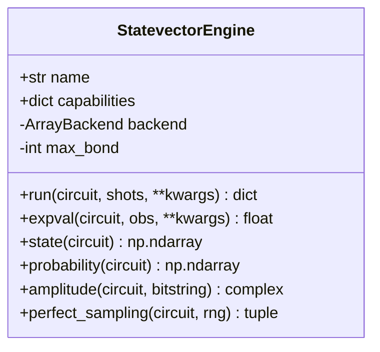
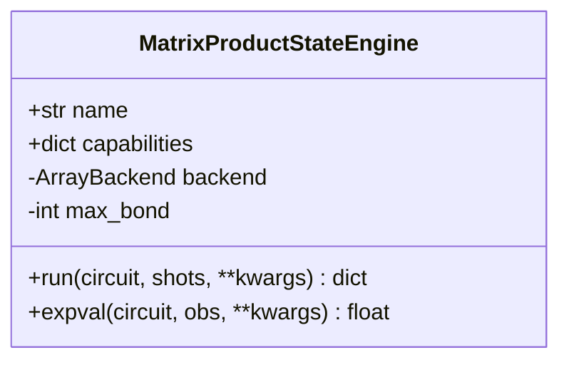
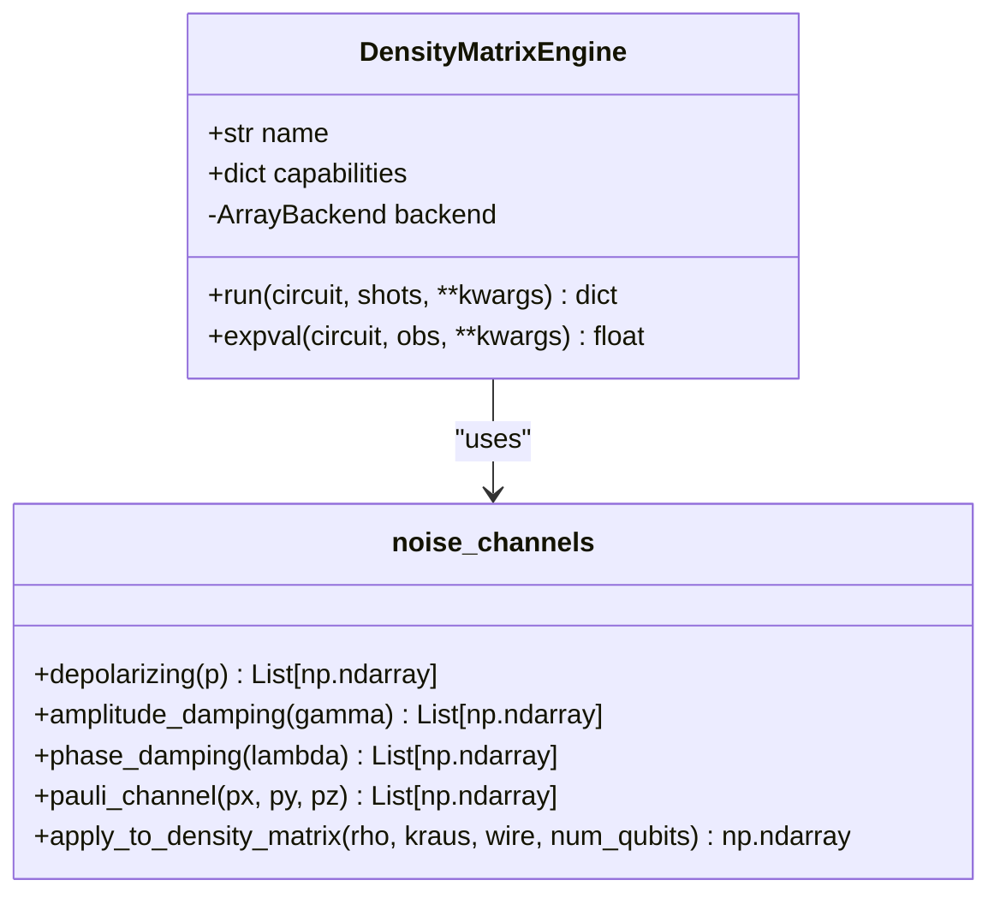

# Simulator Types

<cite>
**Referenced Files in This Document**   
- [devices.rst](file://docs-ng/source/next/user/devices.rst)
- [statevector/engine.py](file://src/tyxonq/devices/simulators/statevector/engine.py)
- [matrix_product_state/engine.py](file://src/tyxonq/devices/simulators/matrix_product_state/engine.py)
- [density_matrix/engine.py](file://src/tyxonq/devices/simulators/density_matrix/engine.py)
- [noise/channels.py](file://src/tyxonq/devices/simulators/noise/channels.py)
</cite>

## Table of Contents
1. [Introduction](#introduction)
2. [Statevector Simulator](#statevector-simulator)
3. [Matrix Product State (MPS) Simulator](#matrix-product-state-mps-simulator)
4. [Density Matrix Simulator](#density-matrix-simulator)
5. [Configuration Parameters and Usage](#configuration-parameters-and-usage)
6. [Performance Trade-offs and Common Issues](#performance-trade-offs-and-common-issues)

## Introduction
This document provides a detailed overview of the three core quantum simulators available in the TyxonQ framework: the Statevector, Matrix Product State (MPS), and Density Matrix simulators. Each simulator is designed for specific use cases, balancing accuracy, scalability, and noise modeling capabilities. The Statevector simulator offers exact simulation for small to medium circuits, the MPS simulator enables efficient simulation of large 1D entangled systems via tensor network compression, and the Density Matrix simulator supports full modeling of noisy quantum processes using mixed states and quantum channels.

**Section sources**
- [devices.rst](file://docs-ng/source/next/user/devices.rst#L1-L7)

## Statevector Simulator
The Statevector simulator is a full-state exact simulator that evolves a pure quantum state represented as a dense statevector of size $2^n$, where $n$ is the number of qubits. It is suitable for simulating small to medium-sized quantum circuits up to approximately 30 qubits, depending on available memory.

This simulator supports fundamental quantum gates such as H, RZ, RX, CX, and others, and computes expectation values via direct statevector evolution. It also supports shot-based sampling by computing probabilities from the squared amplitudes of the statevector and sampling according to this distribution.

An optional noise model can be applied via the `use_noise` flag, which attenuates Z-expectations based on depolarizing noise parameters. However, this is an approximate noise model and not a full quantum channel simulation.



**Diagram sources**
- [statevector/engine.py](file://src/tyxonq/devices/simulators/statevector/engine.py#L31-L261)

**Section sources**
- [statevector/engine.py](file://src/tyxonq/devices/simulators/statevector/engine.py#L1-L265)

## Matrix Product State (MPS) Simulator
The Matrix Product State (MPS) simulator represents the quantum state as a tensor network in matrix product form, enabling efficient simulation of large-scale quantum systems when entanglement is limited, particularly in 1D geometries.

Instead of storing the full $2^n$ statevector, the MPS simulator maintains a factorized representation where each qubit is associated with a tensor, and entanglement between qubits is captured via bond dimensions. This allows memory and computational complexity to scale with the maximum bond dimension $\chi$ rather than exponentially with the number of qubits.

A key configuration parameter is `max_bond`, which imposes a hard cap on the bond dimension during 2-qubit gate applications. When this limit is reached, singular value truncation is performed to maintain efficiency at the cost of some accuracy, making it ideal for simulating circuits with limited entanglement depth.

The simulator supports standard gates (H, RZ, RX, CX) and applies 2-qubit gates using SWAP routing to handle non-nearest-neighbor interactions. Measurement expectations are computed by reconstructing local reduced density matrices or converting the full MPS to a statevector when necessary.



**Diagram sources**
- [matrix_product_state/engine.py](file://src/tyxonq/devices/simulators/matrix_product_state/engine.py#L34-L209)

**Section sources**
- [matrix_product_state/engine.py](file://src/tyxonq/devices/simulators/matrix_product_state/engine.py#L1-L213)

## Density Matrix Simulator
The Density Matrix simulator models quantum systems using mixed states represented by a full density matrix $\rho$ of size $2^n \times 2^n$. This enables accurate simulation of noisy quantum processes through non-unitary evolution and quantum channels.

Due to its $O(4^n)$ memory and time complexity, this simulator is more computationally expensive than the statevector approach but is essential for studying decoherence, measurement errors, and general non-unitary dynamics.

The simulator natively supports quantum noise channels defined in `devices/simulators/noise/channels.py`, including depolarizing, amplitude damping, phase damping, and Pauli channels. These are implemented as Kraus operators and applied directly to the density matrix during gate execution via the `_apply_noise_if_any` method.

Measurement outcomes are derived from the diagonal elements of the density matrix, representing the probability distribution over computational basis states. Expectation values are computed directly from $\langle Z_q \rangle = \text{Tr}(\rho Z_q)$.



**Diagram sources**
- [density_matrix/engine.py](file://src/tyxonq/devices/simulators/density_matrix/engine.py#L31-L205)
- [noise/channels.py](file://src/tyxonq/devices/simulators/noise/channels.py#L1-L65)

**Section sources**
- [density_matrix/engine.py](file://src/tyxonq/devices/simulators/density_matrix/engine.py#L1-L209)
- [noise/channels.py](file://src/tyxonq/devices/simulators/noise/channels.py#L1-L65)

## Configuration Parameters and Usage
Each simulator can be selected via the `.device()` method by specifying the `simulator` parameter. The following usage pattern is supported:

```python
# Select Statevector simulator
device = backend.device(simulator='statevector')

# Select MPS simulator with bond dimension limit
device = backend.device(simulator='matrix_product_state', max_bond=32)

# Select Density Matrix simulator with noise model
device = backend.device(simulator='density_matrix')
```

### Key Configuration Parameters:
- **precision**: Controlled by the underlying numeric backend (NumPy, PyTorch, CuPyNumeric).
- **truncation thresholds**: In the MPS simulator, `max_bond` limits the bond dimension; truncation occurs via SVD with singular values below a threshold discarded.
- **noise models**: Configured via the `noise` keyword argument in `run()`, supporting types:
  - `"depolarizing"` with parameter `p`
  - `"amplitude_damping"` with `gamma`
  - `"phase_damping"` with `lambda`
  - `"pauli"` with `px`, `py`, `pz`
  - `"readout"` with calibration matrices per qubit

Noise is applied either as gate-level attenuation (Statevector) or as full Kraus channel application (Density Matrix).

**Section sources**
- [statevector/engine.py](file://src/tyxonq/devices/simulators/statevector/engine.py#L50-L261)
- [matrix_product_state/engine.py](file://src/tyxonq/devices/simulators/matrix_product_state/engine.py#L50-L209)
- [density_matrix/engine.py](file://src/tyxonq/devices/simulators/density_matrix/engine.py#L50-L205)
- [noise/channels.py](file://src/tyxonq/devices/simulators/noise/channels.py#L1-L65)

## Performance Trade-offs and Common Issues
| Simulator | Memory | Speed | Accuracy | Best Use Case |
|---------|--------|-------|----------|---------------|
| **Statevector** | $O(2^n)$ | Fast | Exact (noise approx.) | Small circuits (<30 qubits), exact state simulation |
| **MPS** | $O(\chi \cdot n)$ | Moderate | Approximate (truncation) | Large 1D circuits, low-entanglement dynamics |
| **Density Matrix** | $O(4^n)$ | Slow | Exact (with noise) | Noise characterization, non-unitary evolution |

### Common Issues:
- **Statevector memory explosion**: For $n > 30$, the $2^n$ memory requirement becomes prohibitive. Use MPS or sampling-based methods instead.
- **MPS entanglement limits**: High entanglement causes bond dimension growth; exceeding `max_bond` leads to truncation errors. Monitor bond dimensions in critical circuits.
- **Density Matrix scalability**: Limited to $n \leq 16$ on typical hardware due to $4^n$ scaling. Prefer statevector or MPS when noise modeling is not required.

All simulators support shot-based sampling and expectation value computation, with consistent APIs across backends.

**Section sources**
- [statevector/engine.py](file://src/tyxonq/devices/simulators/statevector/engine.py#L1-L265)
- [matrix_product_state/engine.py](file://src/tyxonq/devices/simulators/matrix_product_state/engine.py#L1-L213)
- [density_matrix/engine.py](file://src/tyxonq/devices/simulators/density_matrix/engine.py#L1-L209)