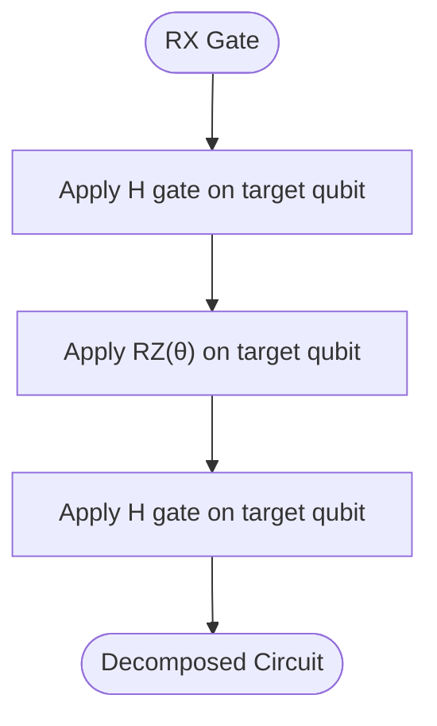
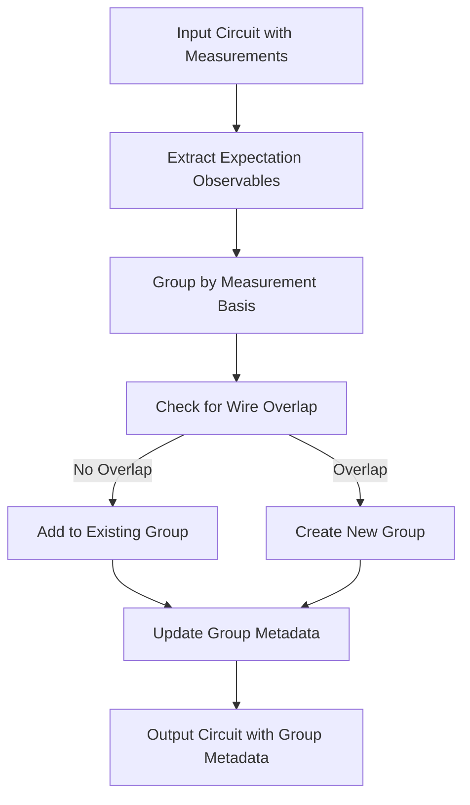
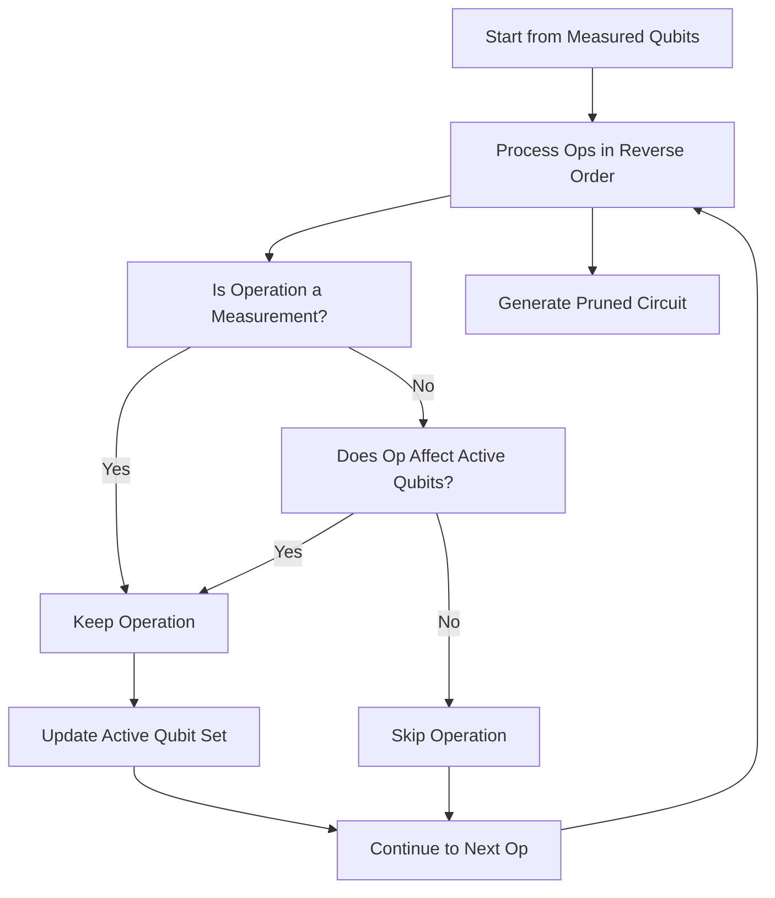
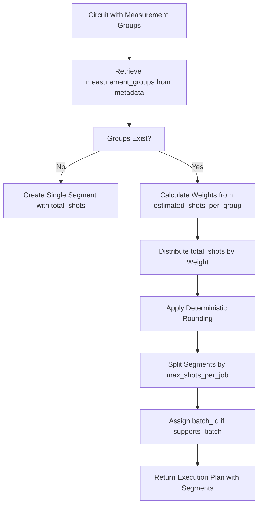
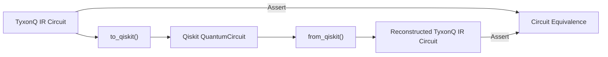

# Compiler Pipeline Testing

<cite>
**Referenced Files in This Document**   
- [test_compiler_simplify_lightcone.py](file://tests_core_module/test_compiler_simplify_lightcone.py)
- [test_measurement_rewrite_grouping.py](file://tests_core_module/test_measurement_rewrite_grouping.py)
- [lightcone.py](file://src/tyxonq/compiler/stages/simplify/lightcone.py)
- [measurement.py](file://src/tyxonq/compiler/stages/rewrite/measurement.py)
- [shot_scheduler.py](file://src/tyxonq/compiler/stages/scheduling/shot_scheduler.py)
- [dialect.py](file://src/tyxonq/compiler/compile_engine/qiskit/dialect.py)
- [test_qiskit_provider_roundtrip.py](file://tests_core_module/test_qiskit_provider_roundtrip.py)
- [rotations.py](file://src/tyxonq/compiler/stages/decompose/rotations.py)
</cite>

## Table of Contents
1. [Introduction](#introduction)
2. [Compilation Stages Overview](#compilation-stages-overview)
3. [Decomposition Testing](#decomposition-testing)
4. [Rewriting and Measurement Grouping](#rewriting-and-measurement-grouping)
5. [Simplification and Lightcone Optimization](#simplification-and-lightcone-optimization)
6. [Scheduling and Shot Allocation](#scheduling-and-shot-allocation)
7. [Qiskit Dialect Translation and Round-Trip Testing](#qiskit-dialect-translation-and-round-trip-testing)
8. [Assertion Patterns and Verification Strategies](#assertion-patterns-and-verification-strategies)
9. [Common Issues in Compiler Pipeline Testing](#common-issues-in-compiler-pipeline-testing)
10. [Best Practices for Testing Custom Compiler Passes](#best-practices-for-testing-custom-compiler-passes)
11. [Conclusion](#conclusion)

## Introduction
This document provides a comprehensive guide to testing the compiler pipeline in TyxonQ, focusing on circuit transformation and optimization stages. It details test strategies for decomposition, rewriting, simplification, and scheduling passes, with emphasis on lightcone optimization, measurement grouping, gate merging, and Qiskit dialect translation. The content is structured to support robust validation of compiler behavior, ensure circuit fidelity, and enable effective debugging of optimization edge cases.

## Compilation Stages Overview
The TyxonQ compiler pipeline consists of multiple sequential stages designed to transform high-level quantum circuits into optimized, executable forms. Each stage performs specific transformations:
- **Decomposition**: Breaks down complex gates into native gate sets
- **Rewriting**: Restructures circuit components for optimization
- **Simplification**: Removes redundant operations and applies lightcone pruning
- **Scheduling**: Allocates shots and prepares execution segments

These stages are orchestrated through a compilation plan that enables modular testing and validation.

**Section sources**
- [rotations.py](file://src/tyxonq/compiler/stages/decompose/rotations.py#L1-L70)
- [measurement.py](file://src/tyxonq/compiler/stages/rewrite/measurement.py#L1-L165)
- [lightcone.py](file://src/tyxonq/compiler/stages/simplify/lightcone.py#L1-L99)
- [shot_scheduler.py](file://src/tyxonq/compiler/stages/scheduling/shot_scheduler.py#L1-L137)

## Decomposition Testing
The decomposition stage converts parametric rotation gates into fundamental gate sets supported by target hardware. The `RotationsDecomposePass` implements standard identities to decompose RX, RY, RXX, RYY, and RZZ gates into sequences of H, RZ, and CX operations.

Test strategies focus on verifying correct gate expansion patterns:
- RX(θ) → H · RZ(θ) · H
- RY(θ) → S† · H · RZ(θ) · H · S
- RZZ(θ) → CX · RZ(θ) · CX

Assertions validate that input circuits with parametric rotations are correctly transformed into equivalent sequences using only native gates.

**Diagram sources**
- [rotations.py](file://src/tyxonq/compiler/stages/decompose/rotations.py#L1-L70)

**Section sources**
- [rotations.py](file://src/tyxonq/compiler/stages/decompose/rotations.py#L1-L70)

## Rewriting and Measurement Grouping
The rewriting stage handles measurement operations and groups compatible observables to enable efficient shot reuse. The `MeasurementRewritePass` processes Expectation measurements and groups them based on non-overlapping wire usage and consistent measurement bases.

Key test scenarios include:
- Grouping non-overlapping Pauli measurements (e.g., Z(0) and X(1))
- Separating entangled measurements (e.g., ZZ(0,1)) into distinct groups
- Preserving basis mapping and estimated shot requirements
- Handling Hamiltonian term grouping through Pauli sum decomposition

The test suite validates that measurement groups are correctly formed, metadata is properly attached to circuits, and downstream schedulers can access grouping information.

**Diagram sources**
- [measurement.py](file://src/tyxonq/compiler/stages/rewrite/measurement.py#L1-L165)
- [test_measurement_rewrite_grouping.py](file://tests_core_module/test_measurement_rewrite_grouping.py#L1-L32)

**Section sources**
- [measurement.py](file://src/tyxonq/compiler/stages/rewrite/measurement.py#L1-L165)
- [test_measurement_rewrite_grouping.py](file://tests_core_module/test_measurement_rewrite_grouping.py#L1-L32)

## Simplification and Lightcone Optimization
The simplification stage applies lightcone optimization to remove operations that do not influence measured qubits. The `LightconeSimplifyPass` performs backward slicing from measurement points to identify and retain only relevant operations.

Test cases validate:
- Pruning of operations on unmeasured qubits
- Preservation of operations affecting measured qubits through entanglement
- Correct handling of circuits without explicit measurements when `assume_measure_all` is enabled
- Identity preservation when all qubits are in the lightcone

The lightcone algorithm tracks active qubits backward through the circuit, maintaining dependency chains across entangling gates like CX and CZ.

**Diagram sources**
- [lightcone.py](file://src/tyxonq/compiler/stages/simplify/lightcone.py#L1-L99)
- [test_compiler_simplify_lightcone.py](file://tests_core_module/test_compiler_simplify_lightcone.py#L1-L35)

**Section sources**
- [lightcone.py](file://src/tyxonq/compiler/stages/simplify/lightcone.py#L1-L99)
- [test_compiler_simplify_lightcone.py](file://tests_core_module/test_compiler_simplify_lightcone.py#L1-L35)

## Scheduling and Shot Allocation
The scheduling stage converts measurement grouping metadata into executable shot segments. The `schedule` function in `shot_scheduler.py` distributes total shots across measurement groups based on estimated requirements.

Key behaviors tested:
- Distribution of total shots using `estimated_shots_per_group` as weights
- Deterministic rounding to preserve total shot count
- Respect for device constraints like `max_shots_per_job`
- Support for batched execution when `supports_batch` is enabled

The scheduler outputs a plan with segments containing shot counts, measurement bases, and wiring information, enabling efficient execution planning.

**Diagram sources**
- [shot_scheduler.py](file://src/tyxonq/compiler/stages/scheduling/shot_scheduler.py#L1-L137)

**Section sources**
- [shot_scheduler.py](file://src/tyxonq/compiler/stages/scheduling/shot_scheduler.py#L1-L137)

## Qiskit Dialect Translation and Round-Trip Testing
The Qiskit dialect translation layer enables interoperability between TyxonQ's IR and Qiskit's QuantumCircuit format. The `to_qiskit` and `from_qiskit` functions handle bidirectional conversion, supporting gates like H, RX, RZ, CX, and MEASURE_Z.

Round-trip fidelity testing ensures that:
- Circuit structure is preserved through translation
- Gate parameters are accurately converted
- Measurement operations are properly mapped
- No unsupported operations are introduced

The test suite verifies that circuits can be converted to Qiskit format and back without loss of essential information, maintaining equivalence in operational semantics.

**Diagram sources**
- [dialect.py](file://src/tyxonq/compiler/compile_engine/qiskit/dialect.py#L1-L247)
- [test_qiskit_provider_roundtrip.py](file://tests_core_module/test_qiskit_provider_roundtrip.py#L1-L23)

**Section sources**
- [dialect.py](file://src/tyxonq/compiler/compile_engine/qiskit/dialect.py#L1-L247)
- [test_qiskit_provider_roundtrip.py](file://tests_core_module/test_qiskit_provider_roundtrip.py#L1-L23)

## Assertion Patterns and Verification Strategies
Effective testing of the compiler pipeline relies on specific assertion patterns:

### Circuit Equivalence
Verify structural and semantic equivalence between input and output circuits:
- Check preservation of operations on measured qubits
- Confirm removal of irrelevant operations
- Validate gate decomposition patterns

### Gate Count Reduction
Assert optimization effectiveness:
- Verify reduction in total gate count after simplification
- Confirm proper merging of consecutive single-qubit rotations
- Check elimination of redundant identity operations

### Shot Scheduler Integration
Validate scheduling metadata:
- Assert presence of `measurement_groups` in circuit metadata
- Verify `estimated_settings` and `estimated_shots_per_group` values
- Confirm correct segment creation based on device constraints

### Transformation Fidelity
Ensure round-trip consistency:
- Test IR → Qiskit → IR equivalence
- Validate parameter preservation
- Check measurement mapping accuracy

**Section sources**
- [test_compiler_simplify_lightcone.py](file://tests_core_module/test_compiler_simplify_lightcone.py#L1-L35)
- [test_measurement_rewrite_grouping.py](file://tests_core_module/test_measurement_rewrite_grouping.py#L1-L32)
- [test_qiskit_provider_roundtrip.py](file://tests_core_module/test_qiskit_provider_roundtrip.py#L1-L23)

## Common Issues in Compiler Pipeline Testing
Several recurring issues require careful attention during testing:

### Incorrect Gate Decomposition
- Mismatched parameter handling in rotation decompositions
- Improper ordering of decomposition sequences
- Failure to handle edge cases like zero-angle rotations

### Optimization-Induced Circuit Invalidation
- Overzealous lightcone pruning removing necessary operations
- Incorrect dependency tracking across entangling gates
- Loss of measurement context in simplified circuits

### Backend-Specific Dialect Mismatches
- Unsupported gate types in target backend
- Parameter format incompatibilities (e.g., pi expressions)
- Measurement mapping errors between logical and physical qubits

### Metadata Propagation Failures
- Loss of measurement grouping information
- Missing shot estimation data
- Broken metadata chaining between compilation stages

**Section sources**
- [rotations.py](file://src/tyxonq/compiler/stages/decompose/rotations.py#L1-L70)
- [lightcone.py](file://src/tyxonq/compiler/stages/simplify/lightcone.py#L1-L99)
- [measurement.py](file://src/tyxonq/compiler/stages/rewrite/measurement.py#L1-L165)
- [dialect.py](file://src/tyxonq/compiler/compile_engine/qiskit/dialect.py#L1-L247)

## Best Practices for Testing Custom Compiler Passes
When developing and testing custom compiler passes, follow these guidelines:

### Isolation Testing
Test passes independently using `build_plan` with single-stage configurations to verify isolated behavior.

### Comprehensive Edge Case Coverage
Include test cases for:
- Empty circuits
- Single-qubit operations
- Maximum qubit configurations
- Boundary parameter values

### Metadata Validation
Ensure passes properly handle and propagate metadata, especially measurement grouping and shot estimation data.

### Device Rule Integration
Test with various `device_rule` configurations to validate constraint handling and backend-specific behavior.

### Round-Trip Verification
Implement bidirectional testing for translation passes to ensure fidelity and prevent information loss.

### Performance Monitoring
Track execution time and memory usage to identify scalability issues in transformation algorithms.

**Section sources**
- [rotations.py](file://src/tyxonq/compiler/stages/decompose/rotations.py#L1-L70)
- [lightcone.py](file://src/tyxonq/compiler/stages/simplify/lightcone.py#L1-L99)
- [measurement.py](file://src/tyxonq/compiler/stages/rewrite/measurement.py#L1-L165)
- [shot_scheduler.py](file://src/tyxonq/compiler/stages/scheduling/shot_scheduler.py#L1-L137)

## Conclusion
Effective testing of the TyxonQ compiler pipeline requires a systematic approach to validating each transformation stage. By focusing on decomposition accuracy, rewriting correctness, simplification effectiveness, and scheduling fidelity, developers can ensure robust circuit optimization. The integration of Qiskit dialect translation and round-trip testing further enhances interoperability and verification capabilities. Adhering to best practices in assertion patterns and edge case coverage enables reliable development of custom compiler passes and maintains high-quality transformations throughout the compilation process.