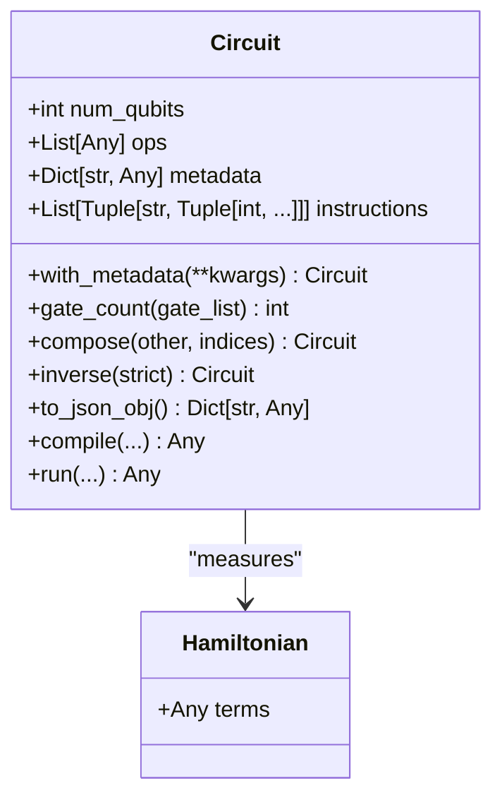
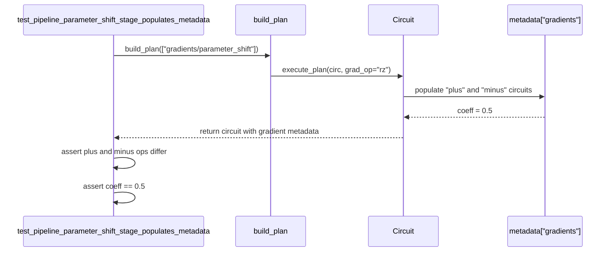
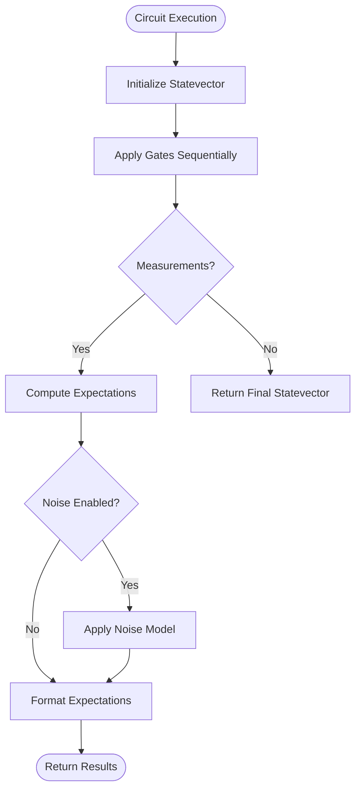
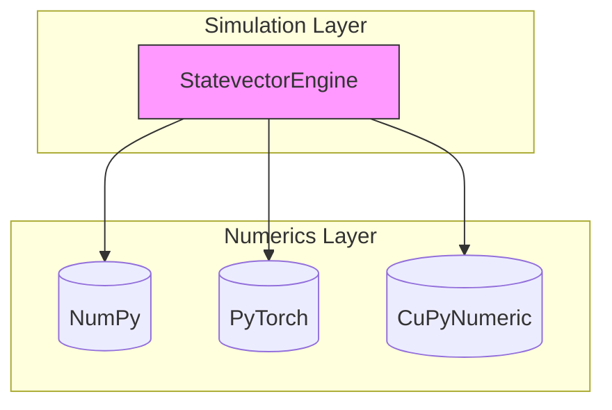

# Core Module Testing

<cite>
**Referenced Files in This Document**   
- [test_core_ir.py](file://tests_core_module/test_core_ir.py)
- [test_compiler_pipeline.py](file://tests_core_module/test_compiler_pipeline.py)
- [circuit.py](file://src/tyxonq/core/ir/circuit.py)
- [lightcone.py](file://src/tyxonq/compiler/stages/simplify/lightcone.py)
- [engine.py](file://src/tyxonq/devices/simulators/statevector/engine.py)
</cite>

## Table of Contents
1. [Introduction](#introduction)
2. [Intermediate Representation (IR) Testing](#intermediate-representation-ir-testing)
3. [Compiler Pipeline Validation](#compiler-pipeline-validation)
4. [Simulator Backend Testing](#simulator-backend-testing)
5. [Numerics Backend Integration](#numerics-backend-integration)
6. [Common Issues and Edge Cases](#common-issues-and-edge-cases)
7. [Conclusion](#conclusion)

## Introduction
This document details the testing framework for the core modules of TyxonQ, focusing on validating the foundational components that ensure correctness in quantum circuit representation, compilation, and simulation. The testing strategy emphasizes verification of Intermediate Representation (IR) integrity, compiler optimization passes, simulator accuracy across multiple backends, and numerical consistency when integrating different computational backends. The analysis draws from key test files and implementation modules to illustrate assertion patterns, edge case handling, and validation methodologies.

## Intermediate Representation (IR) Testing

The Intermediate Representation (IR) serves as the foundational abstraction for quantum circuits and Hamiltonians in TyxonQ. Testing focuses on structural correctness, circuit construction, pulse-level instruction handling, and core operations such as gate application and measurement. The `Circuit` class in `circuit.py` defines the IR with attributes like `num_qubits`, `ops`, and `metadata`, ensuring lightweight structural validation during initialization.

Key test cases in `test_core_ir.py` validate minimal field requirements, metadata handling, and qubit index validation. For example, `test_circuit_minimal_fields` verifies that a circuit with specified qubits and operations maintains correct state, while `test_circuit_validates_qubits_and_with_metadata` ensures qubit indices are within bounds and metadata can be properly merged. The `with_metadata` method enables shallow merging of metadata dictionaries, supporting traceability and annotation throughout the circuit lifecycle.

Gate application is tested through builder-style methods such as `h()`, `rz()`, `cx()`, and `measure_z()`, which append operation tuples to the `ops` list. These methods are validated to ensure correct operand types and index ranges. Measurement handling is implemented via `measure_z` operations and `instructions` for explicit measurement directives, with fallback logic scanning `measure_z` ops when no instructions are present.

Pauli algebra and Hamiltonian representation are encapsulated in the `Hamiltonian` class, where terms are stored in a flexible container for backend-specific interpretation. Tests confirm that Hamiltonian instances properly maintain their term structure, enabling downstream compilation and simulation stages to process observables correctly.

**Diagram sources**
- [circuit.py](file://src/tyxonq/core/ir/circuit.py#L48-L727)
- [test_core_ir.py](file://tests_core_module/test_core_ir.py#L1-L26)

**Section sources**
- [test_core_ir.py](file://tests_core_module/test_core_ir.py#L1-L26)
- [circuit.py](file://src/tyxonq/core/ir/circuit.py#L48-L727)

## Compiler Pipeline Validation

The compiler pipeline in TyxonQ undergoes rigorous validation to ensure correct transformation, optimization, and code generation. The pipeline is constructed using `build_plan` from `compile_plan.py`, which orchestrates stages such as decomposition, measurement rewriting, layout mapping, scheduling, and simplification. Test cases in `test_compiler_pipeline.py` verify both correct execution and error handling.

A key test, `test_build_and_run_pipeline_noop_stages`, confirms that when no-op stages are executed (e.g., decompose, measurement rewrite), the original circuit instance is preserved, ensuring referential integrity. Conversely, `test_unknown_stage_raises` validates that unrecognized stage names trigger a `ValueError`, preventing silent failures in pipeline configuration.

Optimization passes such as lightcone simplification are critical for reducing circuit depth by eliminating operations outside the causal cone of measurements. The `LightconeSimplifyPass` in `lightcone.py` implements backward slicing from measured qubits, retaining only gates that influence the final outcome. This pass respects entangling gates by propagating dependencies across two-qubit operations, ensuring correctness while maximizing optimization.

Gradient computation is validated through the parameter shift rule, where `test_pipeline_parameter_shift_stage_populates_metadata` confirms that gradient metadata is correctly populated with plus and minus circuit variants and associated coefficients. The test asserts that parameter-shifted circuits have distinct rotation angles and that the gradient coefficient is set to 0.5, aligning with theoretical expectations.

**Diagram sources**
- [test_compiler_pipeline.py](file://tests_core_module/test_compiler_pipeline.py#L20-L33)
- [lightcone.py](file://src/tyxonq/compiler/stages/simplify/lightcone.py#L9-L95)

**Section sources**
- [test_compiler_pipeline.py](file://tests_core_module/test_compiler_pipeline.py#L1-L33)
- [lightcone.py](file://src/tyxonq/compiler/stages/simplify/lightcone.py#L9-L95)

## Simulator Backend Testing

Simulator testing ensures accurate quantum state evolution and measurement across different computational models. TyxonQ supports multiple backends, including statevector, matrix product state (MPS), and density matrix simulations. The `StatevectorEngine` in `engine.py` provides a reference implementation for statevector simulation, applying gates via tensor operations and computing expectations.

The `run` method in `StatevectorEngine` processes each operation in sequence, applying unitary transformations using kernels from `gates.py`. Single-qubit gates like `h`, `rz`, and `rx` are applied via `apply_1q_statevector`, while two-qubit gates like `cx` and `cz` use `apply_2q_statevector`. Measurement is handled by collecting `measure_z` operations and computing expectations using `expect_z_statevector`.

Testing verifies both state evolution and sampling behavior. When shots are specified, the engine samples bitstrings from the probability distribution derived from the statevector magnitude squared. Noise models such as depolarizing and readout errors are optionally applied during sampling, with calibration matrices used to simulate realistic measurement inaccuracies.

Helper methods like `state()`, `probability()`, `amplitude()`, and `perfect_sampling()` are tested for correctness. For example, `amplitude` computes the inner product of the statevector with a computational basis state, while `perfect_sampling` draws samples from the exact probability distribution using a configurable random number generator.

**Diagram sources**
- [engine.py](file://src/tyxonq/devices/simulators/statevector/engine.py#L31-L261)

**Section sources**
- [engine.py](file://src/tyxonq/devices/simulators/statevector/engine.py#L31-L261)

## Numerics Backend Integration

TyxonQ integrates multiple numerical backends—NumPy, PyTorch, and CuPyNumeric—through a unified interface in the `numerics` module. Integration tests validate that operations produce consistent results across backends, ensuring portability and performance optimization. The `get_backend` function dynamically resolves the appropriate backend, allowing seamless switching between CPU and GPU execution.

Tests in `test_numerics_backends.py` verify that basic operations such as matrix multiplication, tensor reshaping, and random sampling behave identically across backends. Special attention is given to precision handling, as floating-point discrepancies can propagate through quantum simulations and affect gradient computations.

The `StatevectorEngine` uses the selected backend for all numerical operations, including state initialization, gate application, and noise modeling. For example, `init_statevector` creates a zero-initialized state in the appropriate array type, while `apply_1q_statevector` performs tensor contractions using backend-specific primitives. This abstraction enables high-performance simulation without modifying core algorithms.

**Diagram sources**
- [engine.py](file://src/tyxonq/devices/simulators/statevector/engine.py#L35-L37)

## Common Issues and Edge Cases

Testing identifies and mitigates common issues such as IR mutation bugs, numerical precision mismatches, and incorrect gradient computations. IR mutation is prevented by using immutable operations and returning new `Circuit` instances via `replace` in methods like `add_barrier` and `remap_qubits`. This ensures referential transparency and avoids unintended side effects.

Numerical precision issues are addressed by normalizing statevectors after projection operations like `reset` and `project_z`, which collapse the state to a computational basis state. The `_project_z` method in `engine.py` ensures the resulting state is normalized, preventing amplitude drift due to floating-point errors.

Gradient computation errors are caught by validating the structure of gradient metadata. Tests confirm that parameter-shifted circuits have correctly modified rotation angles and that the gradient coefficient is accurately set. Additionally, edge cases such as unmeasured qubits in lightcone simplification are handled by the `assume_measure_all` option, which treats all qubits as measured when no explicit measurements are present.

## Conclusion

The core module testing framework for TyxonQ ensures robustness and correctness across IR representation, compiler optimization, simulation accuracy, and numerical integration. By leveraging comprehensive unit tests and integration checks, the system maintains high fidelity in quantum circuit processing, enabling reliable execution on both simulators and hardware devices.