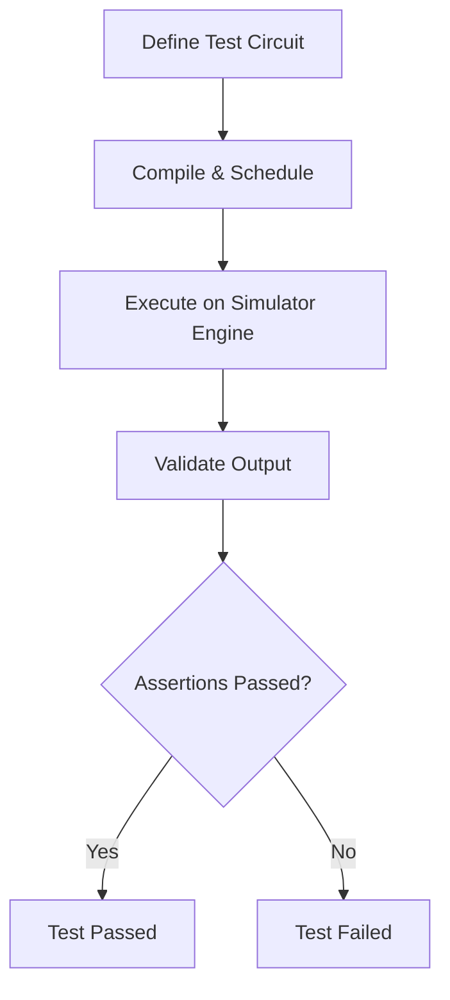
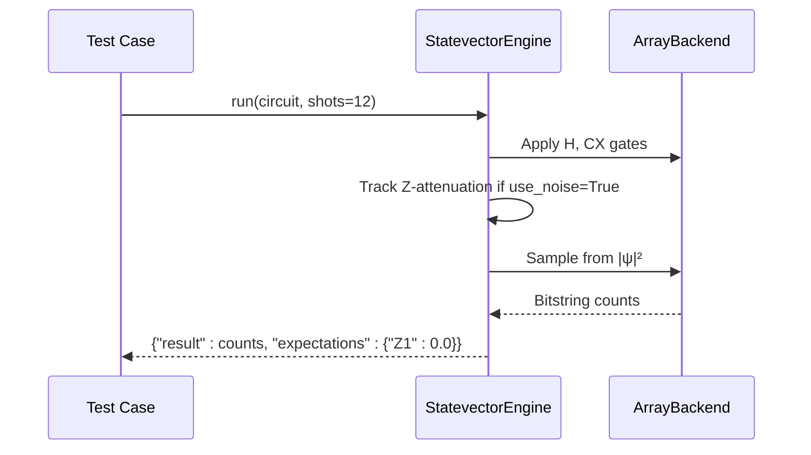
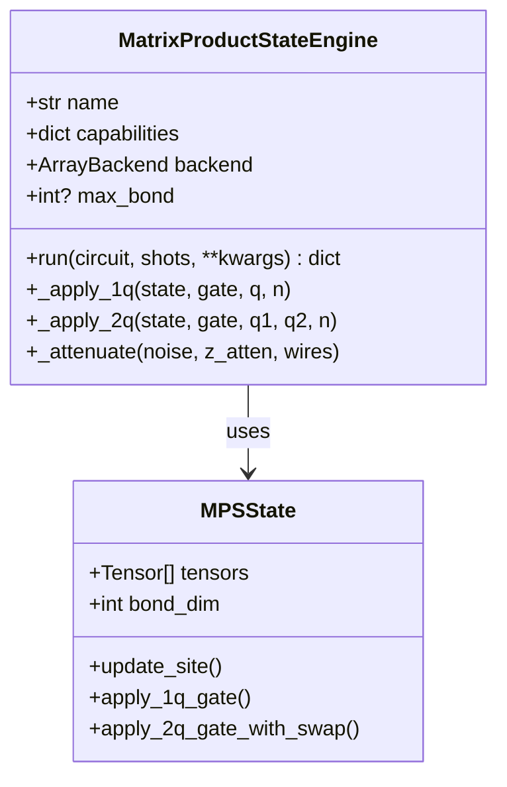
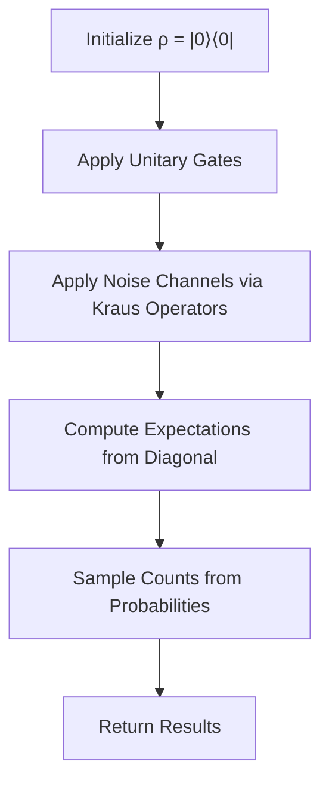
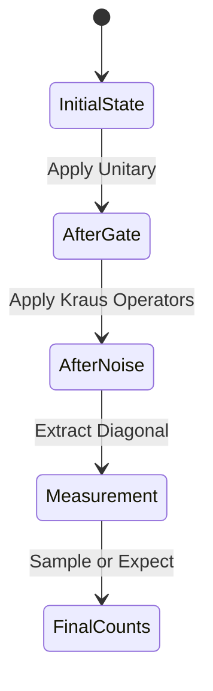
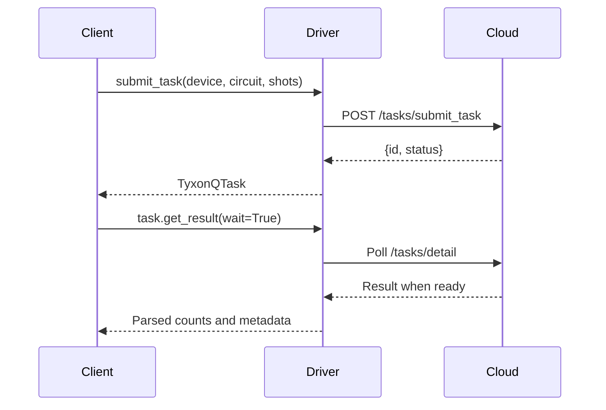

# Devices and Simulators Testing

<cite>
**Referenced Files in This Document**   
- [test_devices_simulators_noise_channels.py](file://tests_core_module/test_devices_simulators_noise_channels.py)
- [test_matrix_protuct_state_e2e.py](file://tests_core_module/test_matrix_protuct_state_e2e.py)
- [test_statevector_simulator_e2e.py](file://tests_core_module/test_statevector_simulator_e2e.py)
- [statevector/engine.py](file://src/tyxonq/devices/simulators/statevector/engine.py)
- [matrix_product_state/engine.py](file://src/tyxonq/devices/simulators/matrix_product_state/engine.py)
- [density_matrix/engine.py](file://src/tyxonq/devices/simulators/density_matrix/engine.py)
- [noise/channels.py](file://src/tyxonq/devices/simulators/noise/channels.py)
- [ibm/driver.py](file://src/tyxonq/devices/hardware/ibm/driver.py)
- [tyxonq/driver.py](file://src/tyxonq/devices/hardware/tyxonq/driver.py)
</cite>

## Table of Contents
1. [Introduction](#introduction)
2. [Test Methodologies for Simulator Backends](#test-methodologies-for-simulator-backends)
3. [Statevector Simulator Testing](#statevector-simulator-testing)
4. [Matrix Product State (MPS) Simulator Testing](#matrix-product-state-mps-simulator-testing)
5. [Density Matrix Simulator Testing](#density-matrix-simulator-testing)
6. [Noise Channel Integration Verification](#noise-channel-integration-verification)
7. [Session Management and Device Abstraction](#session-management-and-device-abstraction)
8. [Common Issues and Troubleshooting](#common-issues-and-troubleshooting)
9. [Testing Custom Hardware Drivers and Hybrid Configurations](#testing-custom-hardware-drivers-and-hybrid-configurations)
10. [Conclusion](#conclusion)

## Introduction
This document provides a comprehensive guide to testing the unified device abstraction layer and simulator backends in TyxonQ. It focuses on validating core quantum simulation engines—statevector, matrix product state (MPS), and density matrix—across end-to-end execution fidelity, gate application accuracy, noise channel integration, and session lifecycle management. The testing framework ensures consistency across simulators and hardware drivers, enabling reliable quantum circuit execution and measurement. Special emphasis is placed on compressed MPS simulations, noise model validation, and error budget analysis using key test files such as `test_devices_simulators_noise_channels.py`, `test_matrix_protuct_state_e2e.py`, and `test_statevector_simulator_e2e.py`.

## Test Methodologies for Simulator Backends

TyxonQ employs rigorous test methodologies to validate simulator backends, ensuring accurate quantum state evolution, correct expectation value computation, and robust handling of noise and measurement operations. Each simulator backend is tested through end-to-end execution workflows that include circuit compilation, scheduling, and result extraction via the unified device job plan interface.

The primary testing strategy involves constructing minimal quantum circuits (e.g., Bell state preparation) and asserting expected outcomes such as zero expectation values for Z-basis measurements on entangled qubits. These tests are parameterized across different shot counts and backend configurations to verify statistical consistency and numerical stability.

**Diagram sources**
- [test_statevector_simulator_e2e.py](file://tests_core_module/test_statevector_simulator_e2e.py#L0-L16)
- [test_matrix_protuct_state_e2e.py](file://tests_core_module/test_matrix_protuct_state_e2e.py#L0-L17)

**Section sources**
- [test_statevector_simulator_e2e.py](file://tests_core_module/test_statevector_simulator_e2e.py#L0-L16)
- [test_matrix_protuct_state_e2e.py](file://tests_core_module/test_matrix_protuct_state_e2e.py#L0-L17)

## Statevector Simulator Testing

The statevector simulator in TyxonQ represents quantum states as dense complex vectors of size \(2^n\), supporting exact simulation of pure states. Testing focuses on gate fidelity, measurement accuracy, and optional noise attenuation models.

End-to-end tests use the `StatevectorEngine` to execute circuits with known analytical outcomes. For example, a Bell state circuit (`H` on qubit 0 followed by `CX(0,1)`) should yield an expectation value of zero for \(Z_1\), which is verified in `test_statevector_simulator_e2e.py`. The test also confirms correct shot-based sampling and metadata reporting.

Noise integration is tested via a simplified attenuation model where depolarizing noise reduces Z-expectations by a factor dependent on the noise parameter \(p\). This approximate noise model allows rapid validation of noise-aware execution paths without full density matrix simulation.

**Diagram sources**
- [statevector/engine.py](file://src/tyxonq/devices/simulators/statevector/engine.py#L0-L264)
- [test_statevector_simulator_e2e.py](file://tests_core_module/test_statevector_simulator_e2e.py#L0-L16)

**Section sources**
- [statevector/engine.py](file://src/tyxonq/devices/simulators/statevector/engine.py#L0-L264)
- [test_statevector_simulator_e2e.py](file://tests_core_module/test_statevector_simulator_e2e.py#L0-L16)

## Matrix Product State (MPS) Simulator Testing

The MPS simulator enables efficient simulation of weakly entangled quantum systems by representing the state as a tensor network with bounded bond dimension. Tests in `test_matrix_protuct_state_e2e.py` validate end-to-end execution fidelity, including gate application, measurement, and sampling.

The `MatrixProductStateEngine` applies single- and two-qubit gates via local tensor updates, using SWAP routing when necessary. End-to-end tests confirm that the engine correctly computes expectation values and generates statistically valid samples from reconstructed state probabilities.

Compressed MPS testing verifies bond dimension truncation via the `max_bond` parameter. Tests ensure that state compression does not introduce unphysical results and that expectation values remain within acceptable error bounds under truncation.

**Diagram sources**
- [matrix_product_state/engine.py](file://src/tyxonq/devices/simulators/matrix_product_state/engine.py#L0-L212)
- [test_matrix_protuct_state_e2e.py](file://tests_core_module/test_matrix_protuct_state_e2e.py#L0-L17)

**Section sources**
- [matrix_product_state/engine.py](file://src/tyxonq/devices/simulators/matrix_product_state/engine.py#L0-L212)
- [test_matrix_protuct_state_e2e.py](file://tests_core_module/test_matrix_protuct_state_e2e.py#L0-L17)

## Density Matrix Simulator Testing

The density matrix simulator provides exact simulation of mixed quantum states using a \(2^n \times 2^n\) Hermitian matrix. It is the most resource-intensive simulator but essential for rigorous noise modeling.

Tests validate native Kraus operator-based noise channel application through the `apply_to_density_matrix` function. The engine supports depolarizing, amplitude damping, phase damping, and Pauli channels, with per-gate noise injection during circuit execution.

The `DensityMatrixEngine`'s `run` method applies quantum gates via unitary transformations and interleaves noise channels when enabled. Measurement outcomes are derived from the diagonal of the density matrix, enabling both expectation value computation and shot-based sampling.

**Diagram sources**
- [density_matrix/engine.py](file://src/tyxonq/devices/simulators/density_matrix/engine.py#L0-L208)
- [noise/channels.py](file://src/tyxonq/devices/simulators/noise/channels.py#L0-L64)

**Section sources**
- [density_matrix/engine.py](file://src/tyxonq/devices/simulators/density_matrix/engine.py#L0-L208)
- [noise/channels.py](file://src/tyxonq/devices/simulators/noise/channels.py#L0-L64)

## Noise Channel Integration Verification

Noise channel integration is validated in `test_devices_simulators_noise_channels.py`, which tests fundamental properties of quantum channels such as trace preservation, population relaxation, and coherence damping.

The depolarizing channel test confirms that the output state remains trace-one, ensuring physical validity. The amplitude damping test verifies that excited state population decays toward the ground state. The phase damping test checks that off-diagonal coherences are suppressed as expected.

Each noise channel is implemented as a set of Kraus operators, and their application to the density matrix is handled by `apply_to_density_matrix` using tensor network contraction via `einsum`.

**Diagram sources**
- [noise/channels.py](file://src/tyxonq/devices/simulators/noise/channels.py#L0-L64)
- [test_devices_simulators_noise_channels.py](file://tests_core_module/test_devices_simulators_noise_channels.py#L0-L48)

**Section sources**
- [noise/channels.py](file://src/tyxonq/devices/simulators/noise/channels.py#L0-L64)
- [test_devices_simulators_noise_channels.py](file://tests_core_module/test_devices_simulators_noise_channels.py#L0-L48)

## Session Management and Device Abstraction

TyxonQ's unified device abstraction layer enables consistent interaction with both simulators and hardware backends through session management. The `device_job_plan` function orchestrates execution across all device types, ensuring uniform output structure.

Hardware drivers for IBM and TyxonQ cloud devices implement standardized interfaces including `list_devices`, `submit_task`, and `get_task_details`. These functions abstract away provider-specific APIs and return normalized results.

Session lifecycle testing verifies proper handling of task submission, asynchronous result polling, and error recovery. The `TyxonQTask` class encapsulates task state and provides a `get_result(wait=True)` interface compatible with blocking and non-blocking execution modes.

**Diagram sources**
- [tyxonq/driver.py](file://src/tyxonq/devices/hardware/tyxonq/driver.py#L0-L192)
- [ibm/driver.py](file://src/tyxonq/devices/hardware/ibm/driver.py#L0-L39)

**Section sources**
- [tyxonq/driver.py](file://src/tyxonq/devices/hardware/tyxonq/driver.py#L0-L192)
- [ibm/driver.py](file://src/tyxonq/devices/hardware/ibm/driver.py#L0-L39)

## Common Issues and Troubleshooting

Common issues in simulator testing include state leakage, incorrect noise application, and session lifecycle bugs.

- **Simulator State Leakage**: Occurs when internal state is not properly reset between runs. Mitigated by initializing fresh state objects in `run`.
- **Incorrect Noise Application**: Caused by improper Kraus operator ordering or missing wire indexing. Verified through unit tests on single-qubit channels.
- **Session Lifecycle Bugs**: Include premature task completion or timeout handling errors. Addressed by robust polling logic and timeout safeguards in `get_result`.

Error budget analysis involves comparing simulator outputs against analytical results and quantifying deviations due to numerical precision, noise modeling approximations, or truncation effects.

## Testing Custom Hardware Drivers and Hybrid Configurations

Custom hardware drivers must implement the core interface: `list_devices`, `submit_task`, and `get_task_details`. Drivers should normalize cloud API responses into TyxonQ's unified result format.

Hybrid simulator configurations—such as combining statevector simulation with external noise models—are tested by injecting calibrated noise parameters and validating output fidelity. The pluggable `ArrayBackend` system allows testing across numpy, pytorch, and cupynumeric backends to ensure numerical consistency.

## Conclusion

TyxonQ's testing framework for devices and simulators ensures high-fidelity quantum execution across diverse backends. By validating statevector, MPS, and density matrix simulators with rigorous end-to-end tests, and by verifying noise channel integration and session management, the framework provides a robust foundation for quantum algorithm development. The unified device abstraction layer enables seamless switching between simulators and hardware, while comprehensive test coverage minimizes the risk of runtime errors in production environments.