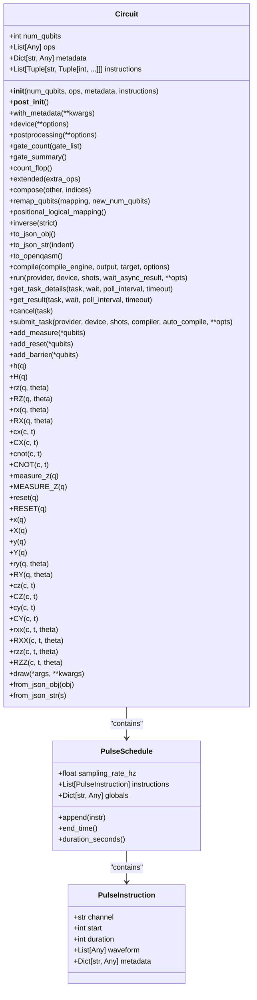
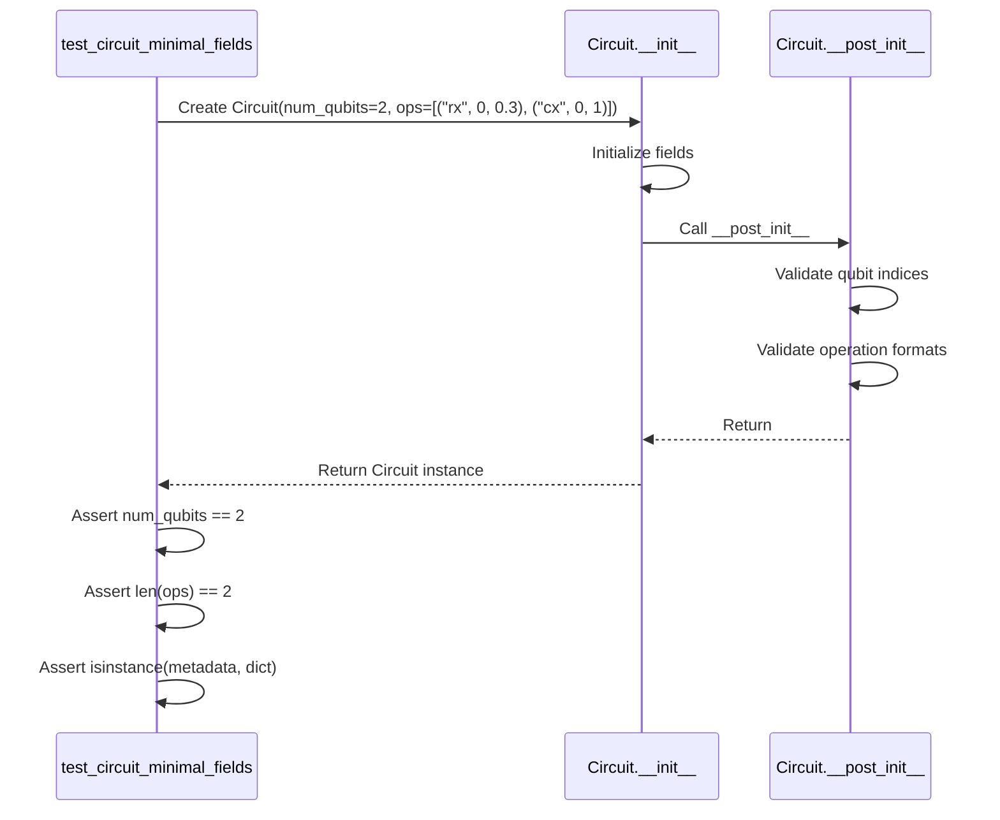
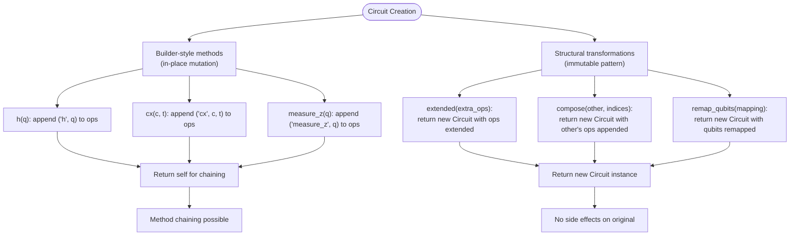
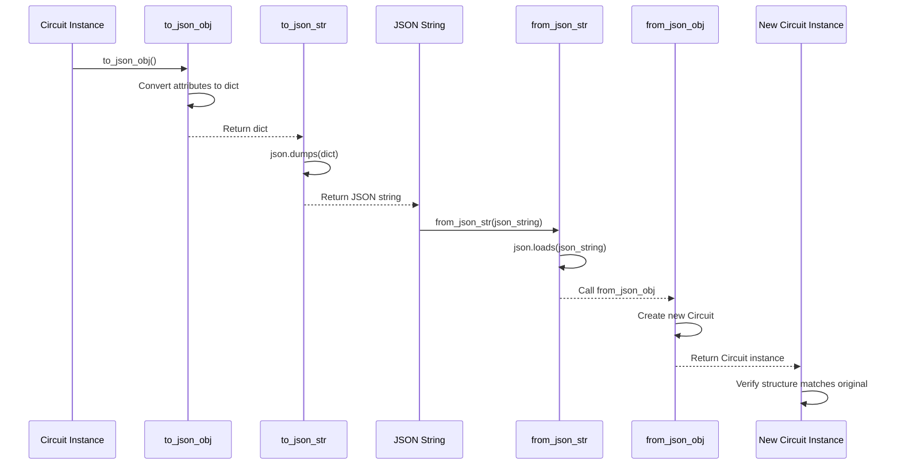
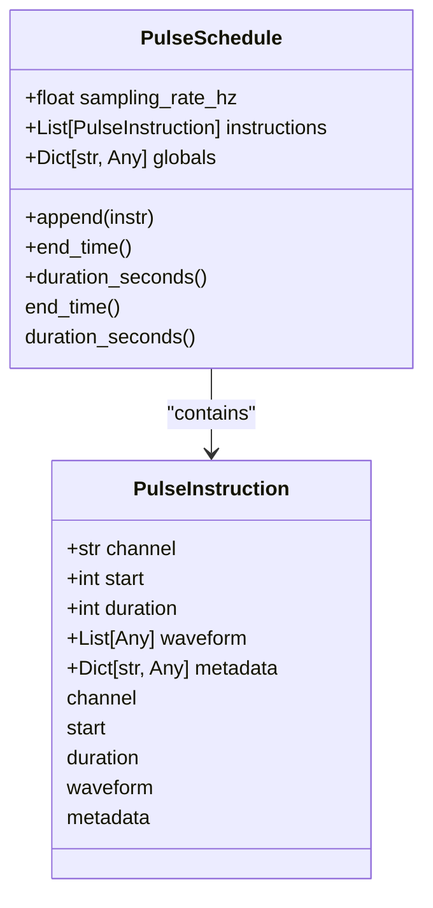
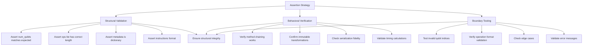

# Intermediate Representation Testing

<cite>
**Referenced Files in This Document**   
- [circuit.py](file://src/tyxonq/core/ir/circuit.py)
- [pulse.py](file://src/tyxonq/core/ir/pulse.py)
- [test_core_ir.py](file://tests_core_module/test_core_ir.py)
- [test_pulse_ir.py](file://tests_core_module/test_pulse_ir.py)
</cite>

## Table of Contents
1. [Introduction](#introduction)
2. [Core IR Structure and Immutability](#core-ir-structure-and-immutability)
3. [Circuit Construction Testing](#circuit-construction-testing)
4. [IR Mutation and Editing Patterns](#ir-mutation-and-editing-patterns)
5. [Instruction Serialization and Metadata](#instruction-serialization-and-metadata)
6. [Pulse-Level IR Components](#pulse-level-ir-components)
7. [Assertion Strategies](#assertion-strategies)
8. [Common Issues and Debugging](#common-issues-and-debugging)
9. [Extending IR Tests](#extending-ir-tests)
10. [Conclusion](#conclusion)

## Introduction

This document provides comprehensive guidance on testing the Intermediate Representation (IR) system in TyxonQ, focusing on structural integrity and behavioral correctness. The IR system serves as the foundational abstraction layer that enables quantum circuit representation, transformation, and execution across various backends. Testing this system requires careful validation of both circuit-level and pulse-level representations, ensuring that operations maintain correctness through construction, mutation, and serialization processes. The document covers test methodologies for the core IR components, with emphasis on dataclass-based immutability patterns, editing workflows, and integration between pulse-level components and circuit objects.

**Section sources**
- [circuit.py](file://src/tyxonq/core/ir/circuit.py#L48-L727)
- [pulse.py](file://src/tyxonq/core/ir/pulse.py#L31-L63)

## Core IR Structure and Immutability

The TyxonQ IR system is built on Python dataclasses, providing a structured yet flexible representation of quantum circuits and pulse schedules. The `Circuit` and `PulseSchedule` classes serve as the primary data containers, with immutability enforced through careful design patterns rather than strict immutability constraints.

The `Circuit` class represents quantum circuits with essential attributes including `num_qubits`, `ops` (operations), `metadata`, and `instructions`. Operations are stored as tuples containing the operation name followed by parameters, with qubit indices validated during initialization and post-initialization checks. The dataclass design enables structural validation while maintaining flexibility for backend-specific interpretations of operation descriptors.

**Diagram sources**
- [circuit.py](file://src/tyxonq/core/ir/circuit.py#L48-L727)
- [pulse.py](file://src/tyxonq/core/ir/pulse.py#L31-L63)

The `PulseSchedule` class represents timed pulse instructions with a sampling rate, serving as the container for low-level quantum control operations. Each `PulseInstruction` contains details about the hardware channel, timing, waveform data, and metadata. This hierarchical structure enables precise control over quantum hardware while maintaining a clean separation between circuit-level abstractions and pulse-level implementations.

**Section sources**
- [circuit.py](file://src/tyxonq/core/ir/circuit.py#L48-L727)
- [pulse.py](file://src/tyxonq/core/ir/pulse.py#L31-L63)

## Circuit Construction Testing

Testing circuit construction focuses on validating the structural integrity of the IR during initialization and basic operations. The test suite verifies that circuits are properly instantiated with correct qubit counts, operation lists, and metadata, while enforcing validation rules for qubit indices and operation formats.

The `test_circuit_minimal_fields` function in `test_core_ir.py` demonstrates the fundamental construction test pattern, verifying that a circuit can be created with the minimum required fields and that these fields maintain their expected values. This test confirms that the `num_qubits` attribute is correctly set, the `ops` list contains the expected number of operations, and the `metadata` dictionary is properly initialized as an empty dictionary when not provided.

**Diagram sources**
- [test_core_ir.py](file://tests_core_module/test_core_ir.py#L3-L10)
- [circuit.py](file://src/tyxonq/core/ir/circuit.py#L64-L128)

Additional construction tests verify the validation logic by attempting to create circuits with invalid qubit indices, ensuring that appropriate `ValueError` exceptions are raised. This boundary testing confirms that the IR system maintains data integrity by preventing the creation of circuits with operations that reference non-existent qubits.

**Section sources**
- [test_core_ir.py](file://tests_core_module/test_core_ir.py#L3-L18)
- [circuit.py](file://src/tyxonq/core/ir/circuit.py#L142-L169)

## IR Mutation and Editing Patterns

The IR system employs a hybrid mutation pattern that combines in-place modifications for builder-style operations with immutable transformations for structural changes. This approach balances usability with data integrity, allowing for efficient circuit construction while preserving the ability to create modified copies without side effects.

Builder-style methods like `h()`, `cx()`, and `measure_z()` modify the circuit in-place by appending operations to the `ops` list, returning the circuit instance to enable method chaining. These methods are designed for interactive circuit construction and provide a fluent interface for building quantum circuits step by step.

In contrast, structural transformations like `extended()`, `compose()`, and `remap_qubits()` follow an immutable pattern, returning new circuit instances with the requested modifications while leaving the original circuit unchanged. This approach prevents unintended side effects when circuits are shared between different parts of the system.

**Diagram sources**
- [circuit.py](file://src/tyxonq/core/ir/circuit.py#L576-L612)
- [circuit.py](file://src/tyxonq/core/ir/circuit.py#L253-L296)

The `with_metadata()` method exemplifies the immutable pattern, creating a new circuit instance with merged metadata while preserving the original circuit's metadata unchanged. This approach ensures that metadata modifications do not inadvertently affect other references to the same circuit.

**Section sources**
- [circuit.py](file://src/tyxonq/core/ir/circuit.py#L171-L175)
- [circuit.py](file://src/tyxonq/core/ir/circuit.py#L253-L296)

## Instruction Serialization and Metadata

The IR system provides robust serialization capabilities through JSON encoding and decoding methods, enabling persistent storage and transmission of circuit representations. The `to_json_obj()` and `to_json_str()` methods convert circuits to JSON-compatible dictionaries and strings, respectively, while `from_json_obj()` and `from_json_str()` reconstruct circuits from serialized data.

These serialization methods preserve all essential circuit information, including qubit count, operations, metadata, and instructions. The JSON representation uses a straightforward structure that maps directly to the circuit's attributes, ensuring fidelity during serialization and deserialization cycles.

**Diagram sources**
- [circuit.py](file://src/tyxonq/core/ir/circuit.py#L345-L354)
- [circuit.py](file://src/tyxonq/core/ir/circuit.py#L713-L723)

Metadata preservation is a critical aspect of IR testing, ensuring that arbitrary data attached to circuits survives serialization, transformation, and execution processes. The metadata dictionary serves as a flexible container for application-specific information, experimental parameters, or debugging data that should accompany the circuit throughout its lifecycle.

**Section sources**
- [circuit.py](file://src/tyxonq/core/ir/circuit.py#L345-L354)
- [circuit.py](file://src/tyxonq/core/ir/circuit.py#L713-L723)

## Pulse-Level IR Components

The pulse-level IR components provide a low-level representation of quantum control operations, enabling precise timing and waveform specification for quantum hardware. The `PulseSchedule` class serves as the container for pulse instructions, with each `PulseInstruction` specifying a hardware channel, timing parameters, waveform data, and metadata.

Testing pulse-level components focuses on validating the structural integrity of pulse schedules and the correctness of timing calculations. The `test_pulse_schedule_basic_append_and_timing` function verifies that instructions are properly appended to the schedule and that timing calculations are accurate.

**Diagram sources**
- [pulse.py](file://src/tyxonq/core/ir/pulse.py#L31-L63)
- [test_pulse_ir.py](file://tests_core_module/test_pulse_ir.py#L15-L27)

The `end_time()` method calculates the schedule's end time as the maximum of `start + duration` across all instructions, while `duration_seconds()` converts this to seconds using the sampling rate. These methods are essential for ensuring that pulse schedules do not have timing conflicts and that their total duration is correctly calculated.

**Section sources**
- [pulse.py](file://src/tyxonq/core/ir/pulse.py#L49-L58)
- [test_pulse_ir.py](file://tests_core_module/test_pulse_ir.py#L15-L27)

## Assertion Strategies

Effective testing of the IR system requires comprehensive assertion strategies that validate both structural and behavioral correctness. The test suite employs a combination of direct attribute checks, structural validation, and behavior verification to ensure the IR maintains integrity throughout its lifecycle.

For circuit construction, tests verify the basic attributes of created circuits, including qubit count, operation count, and metadata initialization. These assertions confirm that circuits are properly instantiated with the expected values and that default values are correctly applied when not explicitly provided.

**Diagram sources**
- [test_core_ir.py](file://tests_core_module/test_core_ir.py#L3-L18)
- [test_pulse_ir.py](file://tests_core_module/test_pulse_ir.py#L15-L27)

Behavioral verification focuses on the correctness of circuit transformations and operations. Tests confirm that methods like `extended()`, `compose()`, and `remap_qubits()` produce the expected results without modifying the original circuit. Serialization tests verify that circuits can be converted to JSON and reconstructed without data loss.

Boundary testing ensures that the IR system properly handles edge cases and invalid inputs. This includes testing with invalid qubit indices, malformed operations, and edge cases in timing calculations. These tests verify that appropriate exceptions are raised with meaningful error messages, preventing the creation of invalid circuits.

**Section sources**
- [test_core_ir.py](file://tests_core_module/test_core_ir.py#L3-L26)
- [test_pulse_ir.py](file://tests_core_module/test_pulse_ir.py#L15-L27)

## Common Issues and Debugging

Several common issues arise when working with the IR system, particularly related to mutation side effects, pulse-circuit synchronization, and visualization fidelity. Understanding these issues and their debugging strategies is essential for maintaining the reliability of quantum circuit development.

Incorrect IR mutation side effects can occur when developers misunderstand the hybrid mutation pattern, expecting all operations to be immutable or assuming that builder-style methods create new instances. This can lead to unintended modifications of shared circuit references. The key to avoiding this issue is understanding which methods modify the circuit in-place and which return new instances.

Pulse-circuit synchronization bugs may arise when the timing or qubit mapping between circuit-level operations and pulse-level instructions becomes inconsistent. These issues are particularly challenging to debug as they may not produce immediate errors but can lead to incorrect quantum operations being executed on hardware.

Visualization fidelity issues can occur when the rendered circuit representation does not accurately reflect the underlying IR structure. This may be due to differences in how various backends interpret the IR or limitations in the visualization tools. Ensuring visualization fidelity requires careful validation of the rendering process and comparison with the raw IR data.

Debugging these issues typically involves:
1. Verifying the expected mutation pattern for each method
2. Checking qubit mappings and timing calculations
3. Comparing serialized representations before and after transformations
4. Using logging and debugging tools to trace the execution flow
5. Validating results against known good outputs

**Section sources**
- [circuit.py](file://src/tyxonq/core/ir/circuit.py#L48-L727)
- [pulse.py](file://src/tyxonq/core/ir/pulse.py#L31-L63)

## Extending IR Tests

Extending the IR test suite for custom operations and transformation pipelines requires understanding the existing test patterns and adapting them to new functionality. The modular design of the IR system allows for straightforward extension while maintaining consistency with existing testing methodologies.

To test custom operations, create test cases that follow the same pattern as existing operation tests, verifying proper initialization, validation, and integration with the circuit structure. For custom transformation pipelines, develop tests that validate the input-output behavior, edge cases, and error handling of the pipeline.

When debugging IR transformation pipelines, use a systematic approach:
1. Isolate the transformation step causing issues
2. Verify input data integrity
3. Check intermediate results
4. Validate output against expected results
5. Use logging to trace data flow through the pipeline

The test suite can be extended by adding new test files in the appropriate directory, following the naming convention `test_<component>.py`. Each test file should focus on a specific aspect of the IR system, with clear, descriptive test function names that indicate the functionality being tested.

**Section sources**
- [test_core_ir.py](file://tests_core_module/test_core_ir.py#L3-L26)
- [test_pulse_ir.py](file://tests_core_module/test_pulse_ir.py#L15-L27)

## Conclusion

The Intermediate Representation system in TyxonQ provides a robust foundation for quantum circuit representation and manipulation. Through comprehensive testing of circuit construction, mutation patterns, serialization, and pulse-level components, developers can ensure the structural integrity and behavioral correctness of quantum circuits throughout their lifecycle. By following the testing methodologies and assertion strategies outlined in this document, teams can effectively validate IR functionality, debug common issues, and extend the test suite for custom operations and transformation pipelines. The combination of dataclass-based design, hybrid mutation patterns, and comprehensive validation ensures that the IR system maintains reliability and correctness across diverse quantum computing applications.