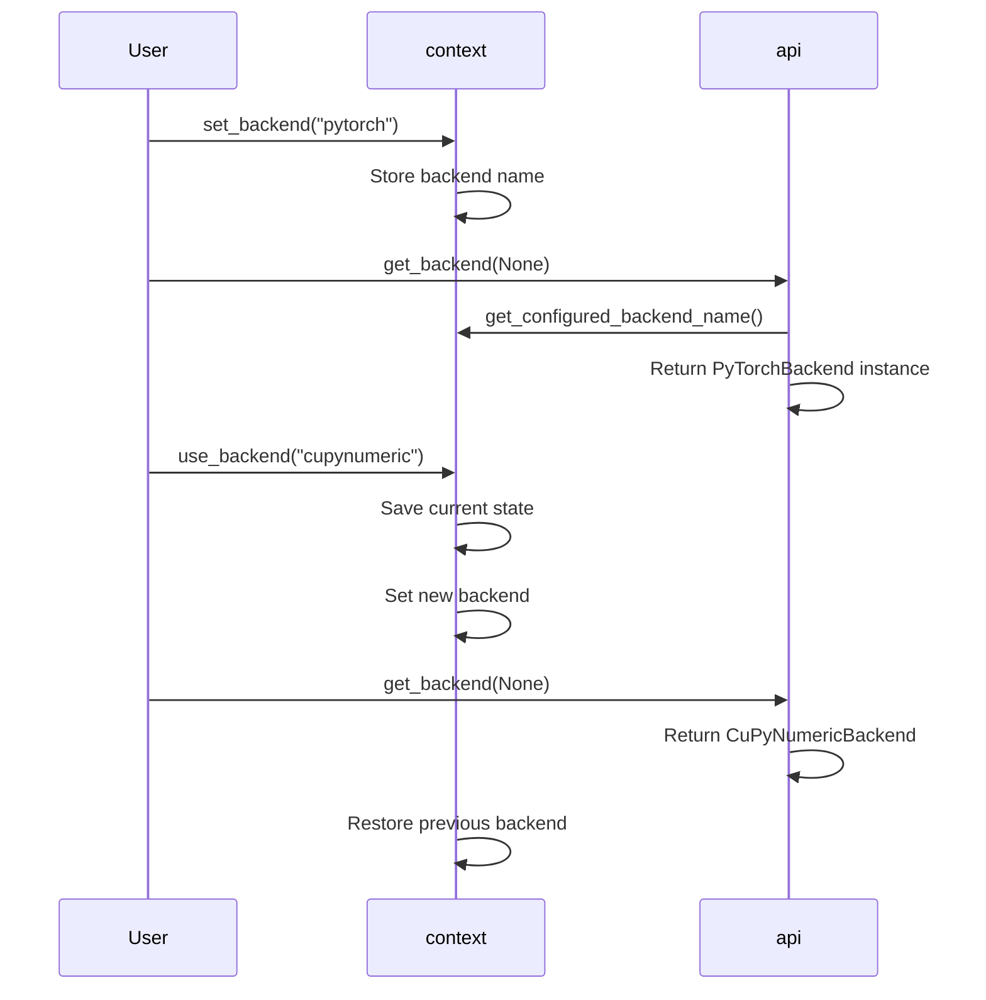

# Numerics Backend Testing

<cite>
**Referenced Files in This Document**   
- [ArrayBackend](file://src/tyxonq/numerics/api.py)
- [vectorize_or_fallback](file://src/tyxonq/numerics/api.py)
- [get_backend](file://src/tyxonq/numerics/api.py)
- [set_backend](file://src/tyxonq/numerics/context.py)
- [use_backend](file://src/tyxonq/numerics/context.py)
- [safe_for_vectorization](file://src/tyxonq/numerics/vectorization_checks.py)
- [warn_as_error](file://src/tyxonq/numerics/vectorization_checks.py)
- [NumpyBackend](file://src/tyxonq/numerics/backends/numpy_backend.py)
- [PyTorchBackend](file://src/tyxonq/numerics/backends/pytorch_backend.py)
- [CuPyNumericBackend](file://src/tyxonq/numerics/backends/cupynumeric_backend.py)
- [test_numerics_api.py](file://tests_core_module/test_numerics_api.py)
- [test_numerics_backends.py](file://tests_core_module/test_numerics_backends.py)
- [test_numerics_checks.py](file://tests_core_module/test_numerics_checks.py)
- [test_numerics_global_backend.py](file://tests_core_module/test_numerics_global_backend.py)
</cite>

## Table of Contents
1. [Introduction](#introduction)
2. [ArrayBackend Protocol Compliance](#arraybackend-protocol-compliance)
3. [Global Backend Switching and Context Management](#global-backend-switching-and-context-management)
4. [Vectorization and Safety Checks](#vectorization-and-safety-checks)
5. [Cross-Backend Equivalence Testing](#cross-backend-equivalence-testing)
6. [Numeric Kernel Testing for Quantum Operations](#numeric-kernel-testing-for-quantum-operations)
7. [Common Issues and Debugging Strategies](#common-issues-and-debugging-strategies)
8. [Best Practices for Testing Custom Extensions](#best-practices-for-testing-custom-extensions)
9. [Conclusion](#conclusion)

## Introduction
This document provides a comprehensive guide to testing the unified numerics backend interface in TyxonQ, which supports NumPy, PyTorch, and CuPyNumeric backends through a common `ArrayBackend` protocol. The focus is on validating backend compliance, ensuring consistent behavior across tensor operations, gradient propagation, memory layout, and vectorization. It covers test strategies implemented in key test files such as `test_numerics_api.py`, `test_numerics_backends.py`, `test_numerics_checks.py`, and `test_numerics_global_backend.py`. The goal is to ensure robust interoperability, numerical consistency, and reliable autodiff support across all supported backends.

## ArrayBackend Protocol Compliance

The core of TyxonQ's numerics system is the `ArrayBackend` protocol defined in `api.py`, which establishes a unified interface for array/tensor operations across different computational backends. Each backend—NumPy, PyTorch, and CuPyNumeric—implements this protocol to provide consistent functionality including array creation, mathematical operations, linear algebra, random number generation, and optional autodiff support.

Key required methods include:
- `array`, `asarray`, `to_numpy` for data conversion
- `matmul`, `einsum` for tensor algebra
- `reshape`, `moveaxis`, `sum`, `mean` for array manipulation
- `exp`, `sin`, `cos`, `sqrt` for elementary functions
- `svd` for linear algebra decomposition
- `rng`, `normal` for random sampling
- `requires_grad`, `detach` for autodiff integration

Optional features like `vmap` enable vectorization, while `jit` and `value_and_grad` provide performance and gradient computation capabilities.

Backend-specific implementations ensure compatibility:
- **NumPyBackend**: Uses NumPy's native functions with finite-difference fallback for gradients.
- **PyTorchBackend**: Leverages PyTorch tensors with full autograd support and optional `torch.compile` JIT.
- **CuPyNumericBackend**: Wraps CuPyNumeric operations with host-side fallbacks for unsupported operations like SVD.

Testing ensures that all backends adhere strictly to the protocol signature and behavioral expectations.

**Section sources**
- [ArrayBackend](file://src/tyxonq/numerics/api.py#L18-L101)
- [NumpyBackend](file://src/tyxonq/numerics/backends/numpy_backend.py#L10-L165)
- [PyTorchBackend](file://src/tyxonq/numerics/backends/pytorch_backend.py#L15-L259)
- [CuPyNumericBackend](file://src/tyxonq/numerics/backends/cupynumeric_backend.py#L15-L255)

## Global Backend Switching and Context Management

TyxonQ supports dynamic global backend configuration via `set_backend`, `get_backend`, and `use_backend` functions. This allows users to switch between backends at runtime, either by name or by passing an explicit backend instance.



**Diagram sources**
- [set_backend](file://src/tyxonq/numerics/context.py#L17-L29)
- [get_backend](file://src/tyxonq/numerics/api.py#L159-L191)
- [use_backend](file://src/tyxonq/numerics/context.py#L41-L49)

The `test_numerics_global_backend.py` suite validates:
- Setting a backend by name affects subsequent `get_backend(None)` calls
- The `use_backend` context manager correctly restores the previous backend after exiting
- Backend instances are properly resolved from names or passed directly

This mechanism enables seamless integration into workflows requiring backend flexibility without modifying function signatures.

**Section sources**
- [test_numerics_global_backend.py](file://tests_core_module/test_numerics_global_backend.py#L1-L22)

## Vectorization and Safety Checks

Vectorization is managed through the `vectorize_or_fallback` function, which wraps user functions with backend-specific or generic vectorization logic based on policy (`auto`, `force`, `off`). If the backend provides a `vmap` method (e.g., PyTorch), it is used; otherwise, a generic element-wise loop is applied.

Safety checks are implemented in `vectorization_checks.py` to prevent unsafe vectorization:
- `safe_for_vectorization` inspects function execution for warnings indicating potential aliasing or in-place mutations
- `warn_as_error` context temporarily converts specific warnings (e.g., "AliasWarning") into exceptions for detection

```mermaid
flowchart TD
Start([Function Call]) --> PolicyCheck{"Policy = 'off'?"}
PolicyCheck --> |Yes| ReturnOriginal[Return Original Function]
PolicyCheck --> |No| HasVMap{"Backend has vmap?"}
HasVMap --> |Yes| TryVectorized[Try vmap(fn)(*args)]
HasVMap --> |No| IsIterable{"First arg iterable?"}
IsIterable --> |Yes| ElementWise[Apply fn element-wise]
IsIterable --> |No| RunEager[Run eagerly]
TryVectorized --> |Success| ReturnResult
TryVectorized --> |Fail| RunEager
RunEager --> FinalResult([Return Result])
ElementWise --> FinalResult
ReturnOriginal --> FinalResult
```

**Diagram sources**
- [vectorize_or_fallback](file://src/tyxonq/numerics/api.py#L104-L156)
- [safe_for_vectorization](file://src/tyxonq/numerics/vectorization_checks.py#L10-L30)
- [warn_as_error](file://src/tyxonq/numerics/vectorization_checks.py#L33-L55)

Tests in `test_numerics_checks.py` verify:
- Functions emitting alias warnings are flagged as unsafe
- The `warn_as_error` context correctly captures and raises on matched warnings
- Safe functions pass vectorization checks

These mechanisms ensure reliable and predictable vectorized execution across backends.

**Section sources**
- [test_numerics_checks.py](file://tests_core_module/test_numerics_checks.py#L1-L24)

## Cross-Backend Equivalence Testing

The `test_numerics_api.py` and `test_numerics_backends.py` files implement cross-backend equivalence tests to ensure consistent numerical results and API behavior.

Key test strategies include:
- **Backend Factory Validation**: `test_factory_returns_numpy_backend_and_basic_ops` verifies that `get_backend("numpy")` returns a functional backend capable of matrix multiplication, Einstein summation, random sampling, and detachment.
- **Conditional Backend Tests**: `test_factory_returns_pytorch_backend` and `test_factory_returns_cunumeric_backend` use `pytest.mark.skipif` to run only when dependencies (`torch`, `cupynumeric`) are available.
- **Precision Tolerance Handling**: Comparisons use appropriate tolerances to account for floating-point differences across backends.
- **API Uniformity**: All backends expose the same method signatures and return compatible types (e.g., `to_numpy` ensures NumPy-compatible outputs).

Example from `test_numerics_api.py`:
- A mock `NumpyBackend` is used to test `vectorize_or_fallback` under different policies
- Functions like `add_one` and `square` are wrapped and tested for correct vectorized behavior

This ensures that user code behaves consistently regardless of the active backend.

**Section sources**
- [test_numerics_api.py](file://tests_core_module/test_numerics_api.py#L1-L60)
- [test_numerics_backends.py](file://tests_core_module/test_numerics_backends.py#L1-L39)

## Numeric Kernel Testing for Quantum Operations

While direct quantum kernel tests are outside the scope of these files, the numerics backend forms the foundation for quantum operation kernels in TyxonQ. The tested backends support:
- Complex arithmetic required for quantum state representation
- Efficient tensor contractions via `einsum` for gate applications
- Gradient computation via `value_and_grad` for variational algorithms
- Memory-efficient array operations for large Hilbert spaces

Each backend's `value_and_grad` implementation is critical:
- **NumPy**: Finite-difference fallback
- **PyTorch**: Native autograd with fallback to finite differences
- **CuPyNumeric**: Host-side finite-difference using NumPy

Testing ensures these gradient methods produce numerically consistent results across backends, enabling reliable VQE, QAOA, and other gradient-based workflows.

**Section sources**
- [NumpyBackend.value_and_grad](file://src/tyxonq/numerics/backends/numpy_backend.py#L138-L165)
- [PyTorchBackend.value_and_grad](file://src/tyxonq/numerics/backends/pytorch_backend.py#L210-L259)
- [CuPyNumericBackend.value_and_grad](file://src/tyxonq/numerics/backends/cupynumeric_backend.py#L210-L255)

## Common Issues and Debugging Strategies

### Gradient Tracking Failures
- **Cause**: Missing `requires_grad=True` or improper tensor wrapping
- **Debug**: Use `detach` and `to_numpy` to inspect intermediate values
- **Fix**: Ensure input tensors are properly marked for autodiff in PyTorch backend

### Backend-Specific Numerical Instability
- **Cause**: Differences in floating-point precision or algorithm implementation
- **Debug**: Compare results across backends using tolerance-aware assertions
- **Fix**: Normalize dtypes (e.g., use `float64`) and validate SVD or matrix inversion stability

### Memory Footprint Bloat
- **Cause**: Inefficient vectorization or lack of memory reuse
- **Debug**: Monitor memory usage during `vmap` or large `einsum` operations
- **Fix**: Use `policy="off"` for unsafe functions; prefer in-place operations where safe

### Vectorization Safety
- **Cause**: Functions with internal state or side effects
- **Debug**: Use `safe_for_vectorization` to detect aliasing warnings
- **Fix**: Refactor to pure functions or disable vectorization via policy

These issues are proactively tested using warning injection and fallback mechanisms.

**Section sources**
- [safe_for_vectorization](file://src/tyxonq/numerics/vectorization_checks.py#L10-L30)
- [vectorize_or_fallback](file://src/tyxonq/numerics/api.py#L104-L156)

## Best Practices for Testing Custom Extensions

When developing custom numeric extensions or new backends:
1. **Implement Full ArrayBackend Protocol**: Ensure all required methods are implemented with correct signatures.
2. **Test Against Base Cases**: Use existing test suites as templates for equivalence testing.
3. **Validate Gradient Consistency**: Compare analytic gradients with finite-difference baselines.
4. **Check Vectorization Safety**: Use `safe_for_vectorization` to assess function purity.
5. **Support Global Backend Switching**: Ensure compatibility with `set_backend` and `use_backend`.
6. **Handle Optional Features Gracefully**: Provide safe fallbacks for `vmap`, `jit`, and `value_and_grad`.
7. **Use Conditional Imports**: Wrap optional dependencies in try-except blocks to maintain importability.
8. **Test Memory Layout**: Verify `to_numpy` produces consistent memory ordering across backends.

Following these practices ensures seamless integration into TyxonQ's unified numerics framework.

## Conclusion
TyxonQ's numerics backend testing framework ensures robust, consistent, and interoperable array computation across NumPy, PyTorch, and CuPyNumeric. Through protocol compliance, global backend management, vectorization safety checks, and cross-backend equivalence testing, the system provides a reliable foundation for quantum computing workflows. The test suite validates core functionality, gradient propagation, and memory behavior, while supporting flexible extension for custom backends. By adhering to best practices in testing and debugging, developers can ensure high-quality numeric implementations that integrate smoothly into the broader quantum software stack.