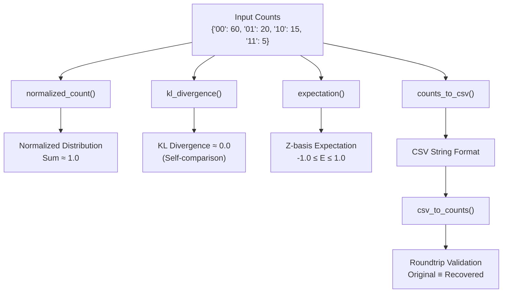
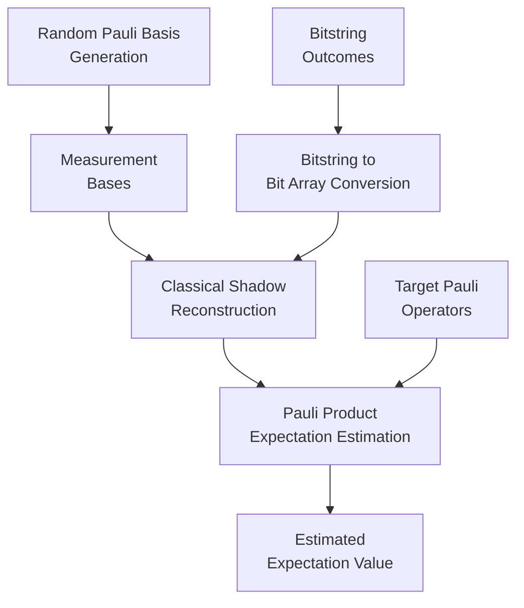
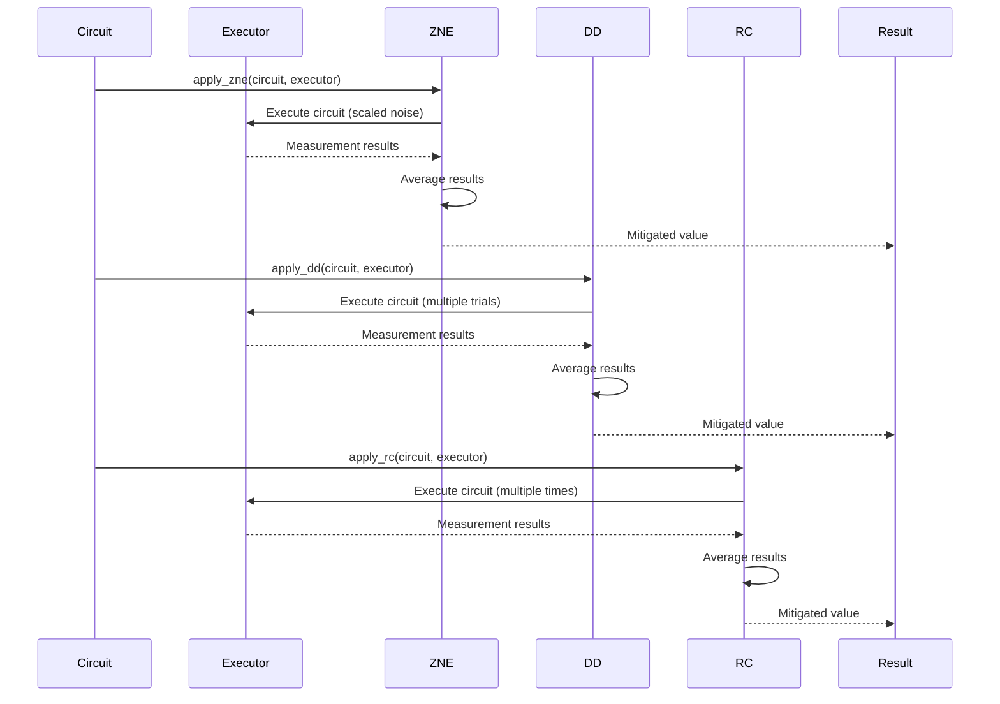
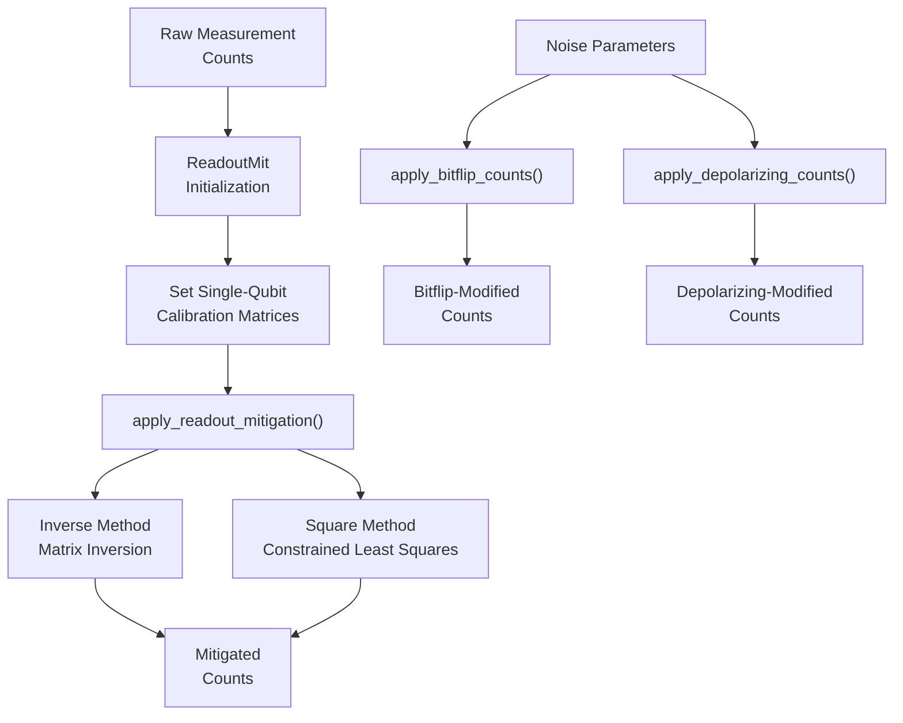
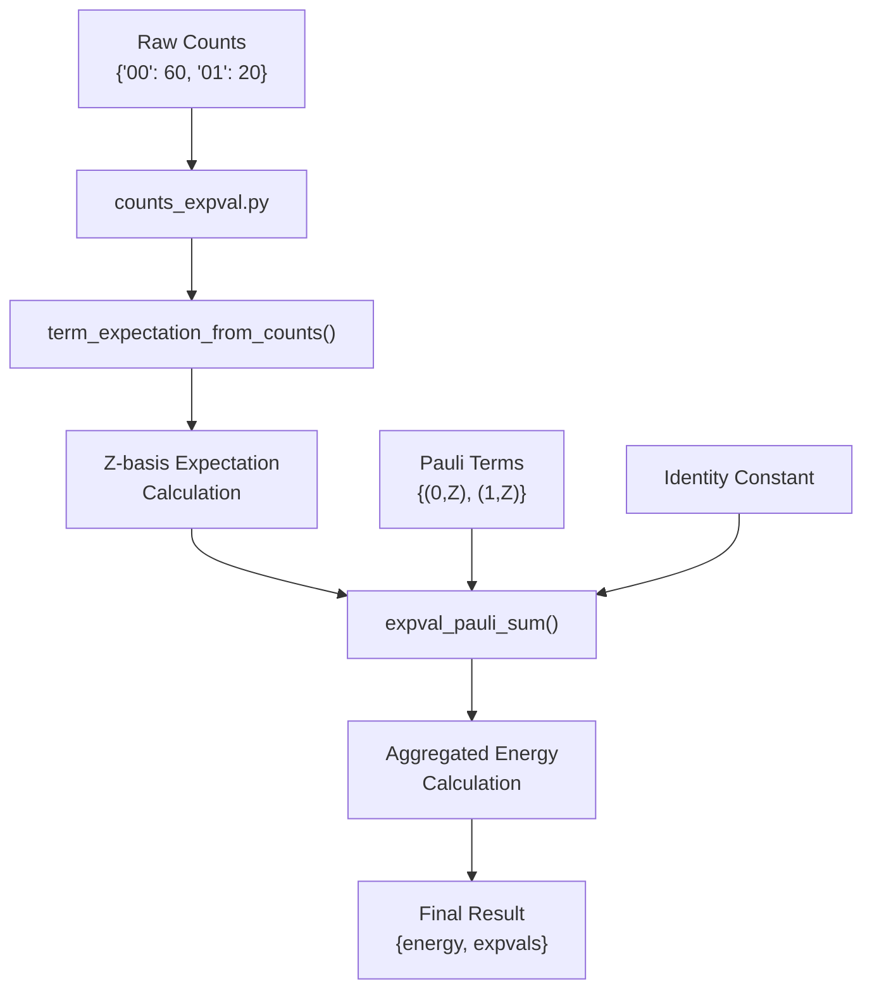

# Postprocessing Testing

<cite>
**Referenced Files in This Document**   
- [test_postprocessing_metrics_io.py](file://tests_core_module/test_postprocessing_metrics_io.py)
- [metrics.py](file://src/tyxonq/postprocessing/metrics.py)
- [io.py](file://src/tyxonq/postprocessing/io.py)
- [classical_shadows.py](file://src/tyxonq/postprocessing/classical_shadows.py)
- [error_mitigation.py](file://src/tyxonq/postprocessing/error_mitigation.py)
- [readout.py](file://src/tyxonq/postprocessing/readout.py)
- [counts_expval.py](file://src/tyxonq/postprocessing/counts_expval.py)
- [noise_analysis.py](file://src/tyxonq/postprocessing/noise_analysis.py)
- [postprocessing.rst](file://docs-ng/source/next/user/postprocessing.rst)
</cite>

## Table of Contents
1. [Introduction](#introduction)
2. [Core Metrics and IO Validation](#core-metrics-and-io-validation)
3. [Classical Shadow Reconstruction Testing](#classical-shadow-reconstruction-testing)
4. [Quantum Error Mitigation Workflows](#quantum-error-mitigation-workflows)
5. [Readout Correction and Noise Adapter Testing](#readout-correction-and-noise-adapter-testing)
6. [End-to-End Postprocessing Pipeline Verification](#end-to-end-postprocessing-pipeline-verification)
7. [Common Issues and Debugging Guidelines](#common-issues-and-debugging-guidelines)
8. [Testing Custom Postprocessing Methods](#testing-custom-postprocessing-methods)

## Introduction
This document provides comprehensive testing methodologies for TyxonQ's result processing pipeline with counts-first semantics. It covers validation of metrics computation, classical shadows, error mitigation techniques, and quantum expectation value calculation. The testing framework ensures robustness in postprocessing workflows including readout correction, noise adapters, and statistical fidelity assertions. Special emphasis is placed on verifying the integrity of quantum expectation value calculations from shot counts and validating noise model calibration.

## Core Metrics and IO Validation

The core metrics and IO functionality in TyxonQ's postprocessing module provides essential utilities for quantum measurement analysis. The validation focuses on ensuring accurate computation of normalized counts, Kullback-Leibler divergence, and expectation values, along with reliable CSV serialization/deserialization of measurement results.



**Diagram sources**
- [metrics.py](file://src/tyxonq/postprocessing/metrics.py#L15-L45)
- [io.py](file://src/tyxonq/postprocessing/io.py#L15-L30)

**Section sources**
- [test_postprocessing_metrics_io.py](file://tests_core_module/test_postprocessing_metrics_io.py#L1-L18)
- [metrics.py](file://src/tyxonq/postprocessing/metrics.py#L15-L60)
- [io.py](file://src/tyxonq/postprocessing/io.py#L15-L45)

## Classical Shadow Reconstruction Testing

Classical shadow reconstruction in TyxonQ enables efficient estimation of quantum observables from randomized measurements. The testing methodology validates the core components of shadow tomography, including random Pauli basis generation, Z-expectation estimation, and Pauli product expectation calculation.



The validation includes:
- Testing random Pauli basis generation with specified seed for reproducibility
- Verifying Z-expectation estimation from bitstring counts with proper sign convention
- End-to-end validation of Pauli product expectation estimation using classical shadows
- Ensuring proper handling of little-endian bitstring encoding where the rightmost bit corresponds to qubit 0

**Diagram sources**
- [classical_shadows.py](file://src/tyxonq/postprocessing/classical_shadows.py#L15-L25)
- [test_postprocessing_shadows.py](file://tests_core_module/test_postprocessing_shadows.py#L15-L30)

**Section sources**
- [classical_shadows.py](file://src/tyxonq/postprocessing/classical_shadows.py#L15-L110)
- [test_postprocessing_shadows.py](file://tests_core_module/test_postprocessing_shadows.py#L15-L36)

## Quantum Error Mitigation Workflows

TyxonQ implements a comprehensive quantum error mitigation (QEM) framework with multiple techniques including Zero-Noise Extrapolation (ZNE), Dynamical Decoupling (DD), and Readout Correction (RC). The testing methodology validates the end-to-end workflow of these mitigation techniques.



The validation includes:
- Testing ZNE with multiple noise scaling factors and averaging
- Validating DD with different pulse sequences and trial counts
- Verifying RC with proper circuit replication and result averaging
- Ensuring correct handling of both numeric and count-based results

**Diagram sources**
- [error_mitigation.py](file://src/tyxonq/postprocessing/error_mitigation.py#L15-L75)
- [test_postprocessing_qem.py](file://tests_core_module/test_postprocessing_qem.py#L15-L50)

**Section sources**
- [error_mitigation.py](file://src/tyxonq/postprocessing/error_mitigation.py#L15-L80)
- [test_postprocessing_qem.py](file://tests_core_module/test_postprocessing_qem.py#L15-L54)

## Readout Correction and Noise Adapter Testing

Readout error mitigation is a critical component of TyxonQ's postprocessing pipeline. The testing methodology validates both the readout correction implementation and noise adapter functionality for simulating various noise channels on classical counts.



The validation includes:
- Testing readout mitigation with inverse method using matrix inversion
- Validating square method with constrained least squares optimization
- Ensuring proper handling of per-qubit calibration matrices
- Testing noise adapters for bitflip and depolarizing channels
- Verifying conservation of total shot count after noise application

**Diagram sources**
- [readout.py](file://src/tyxonq/postprocessing/readout.py#L15-L45)
- [noise_analysis.py](file://src/tyxonq/postprocessing/noise_analysis.py#L15-L45)
- [test_postprocessing_readout_adapter.py](file://tests_core_module/test_postprocessing_readout_adapter.py#L15-L25)
- [test_postprocessing_noise_adapters.py](file://tests_core_module/test_postprocessing_noise_adapters.py#L15-L25)

**Section sources**
- [readout.py](file://src/tyxonq/postprocessing/readout.py#L15-L140)
- [noise_analysis.py](file://src/tyxonq/postprocessing/noise_analysis.py#L15-L105)
- [test_postprocessing_readout_adapter.py](file://tests_core_module/test_postprocessing_readout_adapter.py#L15-L27)
- [test_postprocessing_noise_adapters.py](file://tests_core_module/test_postprocessing_noise_adapters.py#L15-L21)

## End-to-End Postprocessing Pipeline Verification

The end-to-end validation of TyxonQ's postprocessing pipeline ensures the correct integration of all components, from raw measurement counts to final expectation value calculation. This includes verification of the counts-first semantics and proper handling of quantum observables.



The verification includes:
- Testing expectation value calculation from shot counts using counts-first semantics
- Validating Pauli term aggregation with proper coefficient handling
- Ensuring correct bitstring indexing and sign convention
- Testing both count-based and analytic expectation value computation paths
- Verifying proper error handling for edge cases like zero shots

**Diagram sources**
- [counts_expval.py](file://src/tyxonq/postprocessing/counts_expval.py#L15-L45)
- [metrics.py](file://src/tyxonq/postprocessing/metrics.py#L15-L45)

**Section sources**
- [counts_expval.py](file://src/tyxonq/postprocessing/counts_expval.py#L15-L110)
- [test_postprocessing_metrics_io.py](file://tests_core_module/test_postprocessing_metrics_io.py#L15-L18)

## Common Issues and Debugging Guidelines

This section addresses common issues encountered in postprocessing testing and provides debugging guidelines for statistical anomalies in measurement results.

### Biased Expectation Value Estimation
- **Cause**: Improper bitstring indexing or sign convention
- **Solution**: Verify that rightmost bit corresponds to qubit 0 and Z-basis measurements use correct sign mapping (0→+1, 1→-1)
- **Validation**: Test with known states like |0⟩ and |1⟩ to ensure expectation values are +1.0 and -1.0 respectively

### Shadow Tomography Convergence Failures
- **Cause**: Insufficient measurement shots or poor basis selection
- **Solution**: Increase shot count and ensure balanced distribution of measurement bases
- **Validation**: Monitor estimation variance and ensure it decreases with increasing shots

### Adapter Configuration Mismatches
- **Cause**: Incorrect calibration matrix dimensions or missing qubit calibrations
- **Solution**: Validate that all qubits have corresponding 2x2 calibration matrices
- **Validation**: Test with complete calibration data and verify error handling for missing configurations

### Statistical Anomalies
- **Cause**: Numerical instability in matrix operations or rounding errors
- **Solution**: Implement proper numerical stabilization techniques like clipping and normalization
- **Validation**: Test edge cases with extreme probability distributions and verify result stability

**Section sources**
- [readout.py](file://src/tyxonq/postprocessing/readout.py#L100-L140)
- [noise_analysis.py](file://src/tyxonq/postprocessing/noise_analysis.py#L70-L105)
- [counts_expval.py](file://src/tyxonq/postprocessing/counts_expval.py#L90-L110)

## Testing Custom Postprocessing Methods

When developing custom postprocessing methods in TyxonQ, follow these guidelines to ensure compatibility and correctness:

1. **Adhere to Counts-First Semantics**: Design methods to accept and return bitstring counts dictionaries
2. **Maintain Interface Consistency**: Follow the same parameter conventions as existing methods
3. **Implement Proper Error Handling**: Use try-catch blocks to prevent failures from propagating
4. **Validate Input/Output**: Check data types and ranges for all inputs and outputs
5. **Test Roundtrip Operations**: Ensure serialization/deserialization maintains data integrity
6. **Verify Numerical Stability**: Test with edge cases and validate numerical precision

Example test structure for custom methods:
```python
def test_custom_postprocessing_method():
    # Test with known input
    counts = {"00": 50, "11": 50}
    result = custom_method(counts, **parameters)
    
    # Validate output structure and values
    assert isinstance(result, dict)
    assert sum(result.values()) == sum(counts.values())
    
    # Test edge cases
    assert custom_method({}) == {}
    assert custom_method({"0": 100}) == expected_edge_result
```

**Section sources**
- [postprocessing.rst](file://docs-ng/source/next/user/postprocessing.rst#L1-L3)
- [__init__.py](file://src/tyxonq/postprocessing/__init__.py#L30-L70)